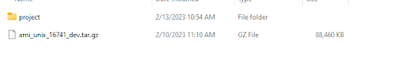
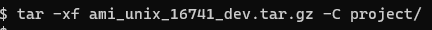
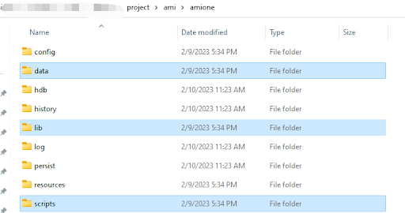
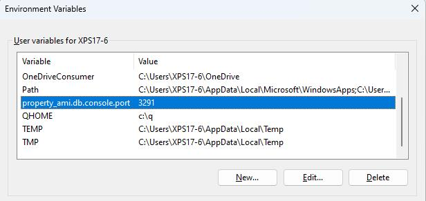

# Advanced Setup

## Overview

This page contains details for advanced configuration and setup for AMI layouts. For many of these, you will need to configure a `local.properties` file, the information for which can be found on our configuration pages. 

When we refer to adding or changing properties, unless otherwise specified, these will need to be added to your `local.properties` file. You will need to create or locate this in your AMI root directory at `ami/amione/config`, otherwise AMI will use the default properties configured in `defaults.properties`. 

For more information, please see the [configuration](../configuration_guide/index.md) guide.    

## Advanced Java Configurations

### Running AMI on Java 18

By default, AMI expects Java 1.7 or 1.8. For Java 18, should you encounter any Java exceptions, you will need to change the `start.sh` script located in the root directory of the AMI installation in `ami/amione/scripts`. 

Add these lines to your `start.sh`:

``` sh
	  -XX:+PrintGCDetails \
	  -Xloggc:log/gc.log --add-opens java.base/java.lang=ALL-UNNAMED --add-opens java.base/java.util=ALL-UNNAMED --add-opens java.base/java.text=ALL-UNNAMED --add-opens java.base/sun.net=ALL-UNNAMED --add-opens java.management/sun.management=ALL-UNNAMED --add-opens java.base/sun.security.action=ALL-UNNAMED --add-opens java.desktop/com.sun.imageio.plugins.png=ALL-UNNAMED\
	   ${JAVA_OPTIONS}\ 
	   $* -classpath $CP $APPCLASS >> log/stdout.log 2> log/stderr.log &
```

### Using Java G1GC Garbage Collector

By default, AMI uses the CMS Garbage Collector to minimize latency and pause times. If your application requires scalability and efficient memory management, you may opt to use G1GC instead. To change to G1GC, navigate to the root directory where AMI is installed, `ami/amione/scripts`.
Open the `start.sh` script, then find and remove the following properties:

``` sh
    -XX:+UseConcMarkSweepGC
    -XX:+PrintGCTimeStamps
```

Then add this property:

``` sh
    -XX:+UseG1GC 
```

## Upgrading AMI Using .tar.gz (Unix & Linux)

For Unix installations, AMI files may be given to you in .tar.gz format. Download this file and navigate to the directory of the AMI installation you wish to upgrade.



Then extract the files into the directory hosting the `ami` folder to overwrite it. For Linux machines, you can use the following command in terminal to do so:

``` sh
tar -xf ami_unix_<YOUR_UPGRADE_VERSION>.tar.gz -C <YOUR_TARGET_DIRECTORY>
```

[//]:#

!!!Note 
    This command is **not reversible** and **will** overwrite your existing `ami` folder. You may want to backup your 3forge AMI project before proceeding in case you need to rollback. 
    
This overwriting process includes the overwrite of the following files (subject to change):  

-   amione/lib  
-   amione/data  
-   amione/scripts  



#### Additional Notes:

1.  To avoid modifying the `start.sh` script in `/scripts`, rename or save it elsewhere, then copy it back into the directory

2.  The following properties files will be updated: `build.properties`, `defaults.properties`, `root.properties`, `speedlogger.properties`, `AMI_One.vmoptions`

3.  You can use `tar -tvf` in terminal to preview the contents of a zip.  

## Upgrading AMI Using .sh File (Unix & Linux)

Run the installer and select the option to update the existing installation.

## Instructions for SSL/TLS

We recommend that you secure your AMI applications, especially if they contain sensitive information. To secure applications via SSL/TLS, you will need to set up a keystore and truststore for your certificates. To generate certificates, use Java's keytool which will be supplied in the AMI installation or your any other Java installation on your machine. Locate where the keytool is (`/PATH_TO_YOUR_JDK_DIRECTORY/bin`) and add it to your `PATH` variable.

Then, follow the [instructions](https://docs.oracle.com/cd/E19798-01/821-1841/6nmq2cpjq/index.html) on generating certificates using keytool by Oracle. For more information on keytool, please see the Oracle documentation ([Java 7](https://docs.oracle.com/javase/7/docs/technotes/tools/windows/keytool.html), [Java 8](https://docs.oracle.com/javase/8/docs/technotes/tools/windows/keytool.html)). 

### Server Example: 

To generate a server certificate `3forge_server.cer` to give to clients:

``` sh
keytool -genkeypair -alias 3forge_server -keyalg RSA -keystore server.jks -validity 365 -keysize 2048

keytool -exportcert -alias 3forge_server -file 3forge_server.cer -keystore server.jks
```

You will be prompted to enter the password for your keystore. Configure your options accordingly.

### Client Example:

To import the server certificate into the keystore file and generate a key for the user (to be verified by the server):

``` sh
keytool -genkeypair -alias 3forge_client -keystore client.jks -keypass client_password -storepass client_password 

keytool -importcert -alias 3forge_server -file 3forge_server.cer -keystore client.jks -keypass client_password -storepass client_password -noprompt
```

!!!Note 
    You will need to export the client certificate and import it into the `server.jks`. You should also make sure that in the case of multiple clients, each client has a unique `client.jks` file.


### Server Configuration

Ensure that your server keystore is in the correct directory. Then add the following properties to your `local.properties`:

```
ami.port.keystore.file=/path/to/server.jks
ami.port.keystore.password=server_password
```

To configure the client, copy the `client.jks` file to the client and instead of calling the function `AmiClient::start(host, port, loginId, options)` call:

``` java
AmiClient client = new AmiClient();
...
client.start(host, port, loginId, options, new File("/path/to/client.jks"), "client_password");
```

## Configuring Web, Relay and Center Ports
 
The AMI core [architecture](../architecture/index.md) consists of the web, center, and relay. By default, AMI assigns each component ports to listen to, however you may wish to change these in `local.properties`. 

The default port values for each component are listed below.

### Console Port

`f1.console.port`
:   
    **Default value**: `3285` (listens)  

    -   The admin console port all components listen to. 
    -   This port can be used to retrieve advanced technical information about your AMI runtime and is necessary for each center to run.
    -   Please contact us at <support@3forge.com> if you need to use this port to debug your AMI instances.

### AMI Center

`ami.center.port` 
:   
    **Default value**: `3270` (listens)  

    -   Sets the port of the primary instance of AMI center for more connections from other AMI Web and Relay instance.  
    -   Also sets the connecting port of relay & web components to this center if configured and launched together.

`ami.db.console.port` 
: 
    **Default Value**: `3290` (listens)  

    -   The port for connecting via telnet command line interface.

`ami.db.jdbc.port` 
: 
    **Default Value**: `3280` (listens)  

    -   The port for connecting to AMI via the AMI JDBC driver.

### AMI Relay

`ami.port` 
: 
    **Default Value**: `3289` (listens)  

    -   Sets the port that applications connect to on the Relay's host machine. See [AMI Realtime Messages](../reference/ami_realtime_messages.md) for the messages format AMI expects.

`ami.center.port` 
:   
    **Default Value**: `3270` (connects)

`ami.center.host` 
:   
    **E.g.** localhost  

    -   For relay components running separately from the center-- to be configured with `ami.center.host`.

Note: the relay can connect to multiple centers, with a comma-delimited list entry e.g.: `ami.centers=center1=host.running.center1:3270,center2=host.running.center2:3270,center3=host.running.center3:3270`.

### AMI Web

`http.port`
:   
    **Default Value**: `33332` (listens)  

    -   Sets the port that web browsers use to connect to AMI Web.

`https.port`
:   
    **Default Value**: `33333` (disabled, listens)  

    -   Sets the port that web browsers use to connect securely to AMI Web.

`https.keystore.file` 
:   
    The path to the key store file generated using java's keytool that will be used for secure web connections. 

`ami.center.port` 
:   
    **Default Value**: `3270` (connects)

`ami.center.host` 
:    
    **E.g.** localhost  

    -   For web components running separately from the center, to be configured with `ami.center.host`.

### Web Manager

`ami.webmanager.port` 
:   
    **Default Value**: `3271` (disabled, listens)  

    -   Optional location for where to access webmanager, used for remotely loading files.

### Web Balancer

`ami.webbalancer.http.port` 
:   
    **Default Value**: `33330` (listens)  

    -   Optional, the http port to listen for insecure connections on. If not specified, http is not available.

## Configure AMI Properties from Environment Variables (Windows)

AMI properties can also be configured using system variables if you do not wish to use the `local.properties` file. 
Navigate to 'System Properties -> Environment Variables' and for each AMI property you would normally configure in `local.properties`, create a new variable following this syntax: `property_<AMI Property Name>=<value>`.

!!!Note
    This is **case sensitive**, so please ensure that your environment variables match the same syntax of the properties specified in the [configuration](../configuration_guide/index.md) guide.

  

This will overwrite the existing property defined in `local.properties` and apply globally to all AMI instances running on the current machine.

## Configuring Multiple Instances on a Single Machine

Multiple instances of AMI can be run on the same machine. Each instance should have its own directory separate to the others, e.g; an `ami_project_1` and `ami_project_2` directory with an installation in each.

Each additional instance must be configured to use different server ports -- two processes **cannot** have conflicting server ports. Below is a list of the server ports that need to be configured in the `local.properties` file of each AMI directory:

-   You must **always** replace the following default port with a new, unique port (or use -1 to disable the console):
```
f1.console.port=3285
```
-   If running the **center**, you must replace the following default ports with new, unique ports:
```
ami.center.port=3270
ami.db.jdbc.port=3280
ami.db.console.port=3290
```
-   If running the **relay**, you must replace the following default port with a new, unique port:
```
ami.port=3289
```
-   If running the **web with secure https socket**, you must replace the following default port with new, unique ports:
```
https.port=33332
```
-   If running the **web with non-secure http socket**, you must replace the following default port with new, unique ports:
```
http.port=33332
```

-   You will also need to define a unique cookie identifier for each session that is hosted on the machine:
```
ami.session.cookiename=cookiename
```

## Running Components Independently 

By default, AMI launches the center, relay, and web, but can be configured so that only one or a combination of components is run. If you only require specific components, you will need to configure a `local.properties` file accordingly. 


!!! Note
    In the examples, we have used the default ports but you are welcome to assign your own, just ensure there are no port conflicts.


### Default 

Run the `center`, `relay`, and `web`:

```
ami.components=relay,center,web
ami.center.port=3270
ami.center.host=localhost
```

### Center 

Run only the `center`:

```
ami.components=center
ami.center.port=3270
ami.db.jdbc.port=3280
ami.port=3289
ami.db.console.port=3290
f1.console.port=3285
```

### Relay

Run only the `relay`:
```
ami.components=relay
ami.center.port=3270 
ami.center.host=hostname.running.center
```

### Web

Run only the `web`: 

```
ami.components=web
f1.console.port=3285
http.port=33332
```

### Center and Web

Run the `center` and `web`:
```
ami.components=center,web
f1.console.port=3285
ami.center.port=3270
ami.center.host=localhost
http.port=33332
```

### Center and Relay

Run the `center` and `relay`:
```
ami.components=center,relay
ami.center.port=3270
ami.center.host=localhost
```

### Web and Relay

Run the `web` and `relay`:
```
ami.components=web,relay
ami.center.port=3270
ami.center.host=hostname.running.center
```

### Relay and Multiple Centers

Run the `relay` connected to **multiple** centers:
```
ami.components=relay
ami.centers=center1=hostname.running.center1:3270,center2=hostname.running.center2:3270,center3=hostname.running.center3:3270...<host:ami.center.port>

# If connecting to only one center, you can use the following: 
ami.center.port=3270
ami.center.host=localhost
```

### Web and Multiple Centers

Run the `web` connected to **multiple** centers:
```
ami.components=web
f1.console.port=3285
http.port=33332
ami.centers=center1=hostname.running.center1:3270,center2=hostname.running.center2:3270,center3=hostname.running.center3:3270...<host:ami.center.port>

# If connecting to only one center, you can use the following: 
ami.center.port=3270
ami.center.host=localhost
```

#### Additional Notes:    

-   Port 3270 is the default port that the center listens on and that the web/relay connect to.  
-   The web server never connects to the relay directly, both are connected via the center.
-   The center starts up the primary server port (listener) that multiple clients, either relay or web, can connect to.  
-   The primary center will be the first center in the delimited list denoted by `ami.centers`.


## Running AMI with Docker

AMI can be easily configured for use with docker using the following recommended folder configuration:

| **Folder** | **Contents**                              |
|------------|-------------------------------------------|
| ./ami      | Unix installation of ami (ami/amione/...) |
| ./docker   | Dockerfile provided below                 |
| ./scripts  | start.sh script provided below            |

Sample Dockerfile

```
FROM ubuntu:20.04

RUN apt-get update
RUN apt-get install -y default-jre

COPY ami ami
COPY scripts scripts

EXPOSE 3289
EXPOSE 3290
EXPOSE 33332

CMD ["bash", "./scripts/start.sh"]
```

Sample `start.sh`

```
#!/bin/bash

SCRIPTDIR=$(dirname "$0")

mkdir -p $SCRIPTDIR/../ami/amione/resources/

echo 'Starting AMI...'
AMI_EXECUTABLE=$SCRIPTDIR/../ami/amione/scripts/start.sh
sed -i -e 's/\r$//' $AMI_EXECUTABLE
sed -i -e 's/-XX:+PrintGCTimeStamps//g' $AMI_EXECUTABLE
chmod +x $AMI_EXECUTABLE
$AMI_EXECUTABLE > exec.out

echo 'Checking for errors during launch...'
if grep -q error exec.out; then
    echo 'An Error Has Occured While Starting AMI, Dumping Error...'
    error_log=$(grep -o "[^ ]*/log/" exec.out)
    echo ''
    more $error_log/stderr.log
    echo ''
    rm exec.out
    echo 'Terminating Docker Start Script'
    exit 1
else
    rm exec.out
    echo 'AMI Successfully launched'
fi

echo 'Completed Start Script'

tail -f /dev/null
```

To build the image:

```bash
docker build -t ami -f ./docker/Dockerfile . 
```

To run the image (the use of detached mode is optional):

```bash
docker run -d -p 33332:33332 ami
```