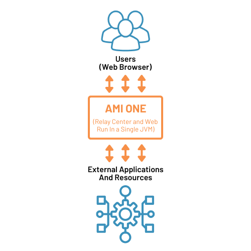
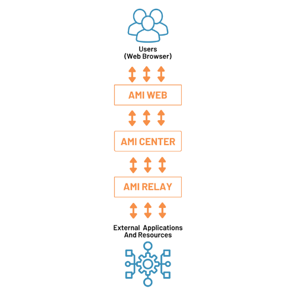
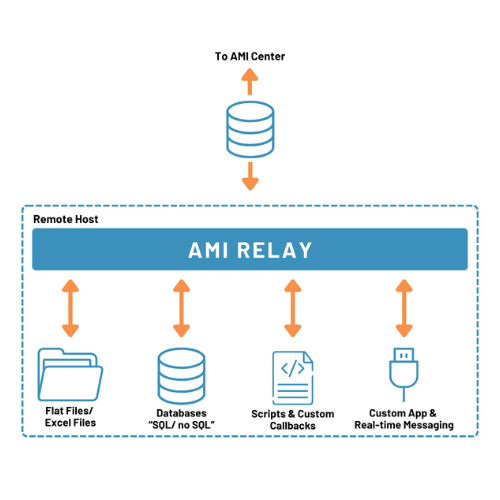
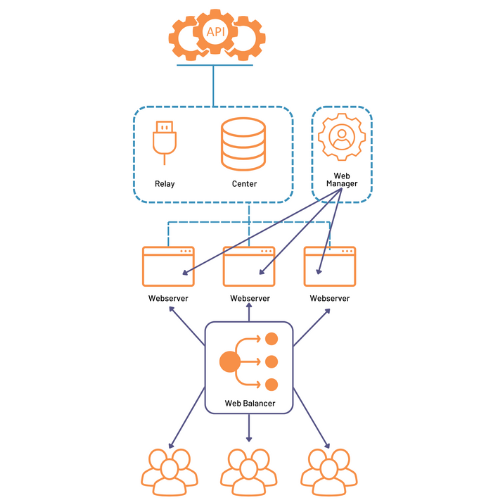
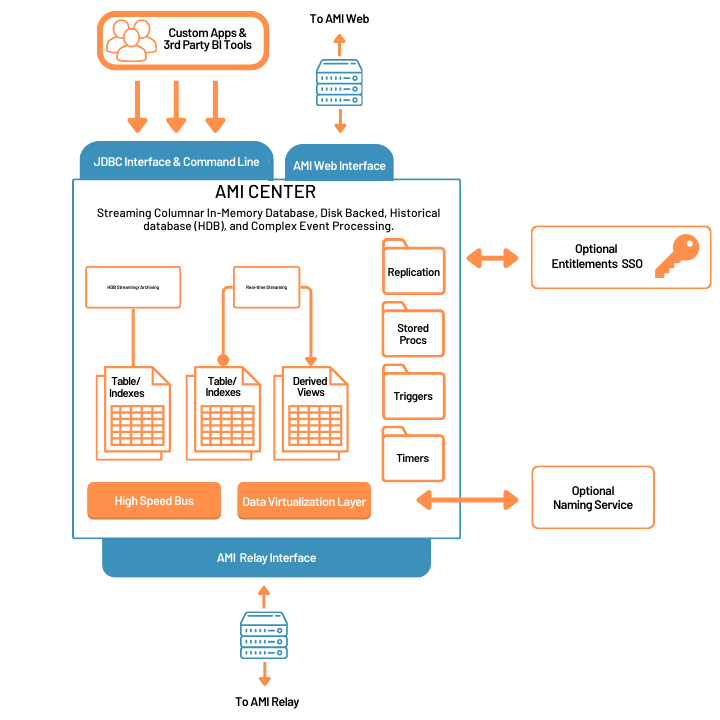
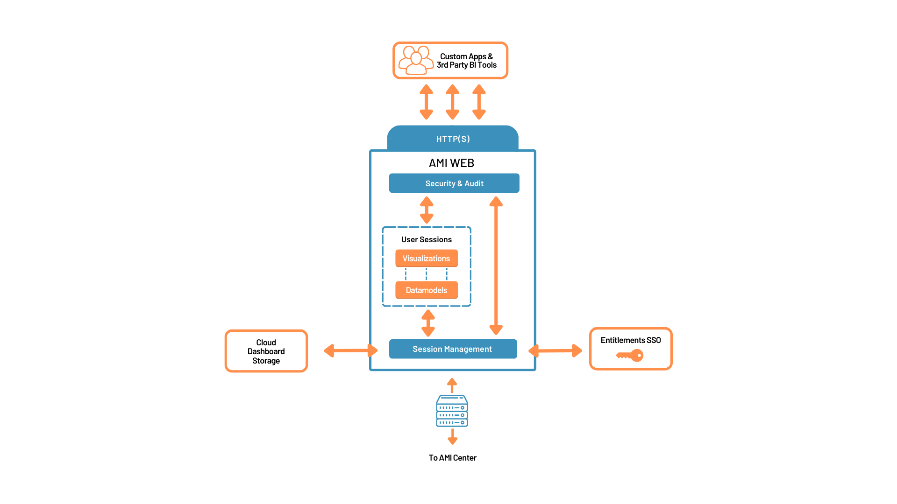
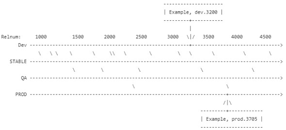

# AMI Architecture

The AMI architecture is designed for easy installation with the ability to easily scale as needed. For getting started with lower capacity needs, AMI can be installed and run as a single process. For additional capacity, AMI supports vertical scaling such that the interaction with front end and backend applications can be broken out into separate processes. Beyond that, even more capacity can be achieved through horizontally scaling additional AMI processes.

## External Interfaces

There are 8 key categories of external interfaces supported by AMI:

-   **GUI** - Fully featured dashboards can be built to provide user access to all the various components and data made available to AMI. AMI utilizes the standard web browser (http[s]) for constructing and using dashboards as well as most of the administration and configuration.
-   **Queries** - You can attach to any number of datasources to AMI and query them at runtime - either by a user action or by some electronic/automated event. This feature is core to the "leave the data where it is" concept.  For example, you could attach to a database such that users could click on an account to query for its details.
-   **Real-time Streaming** - Applications can connect to AMI's real-time interface and stream messages directly into AMI. These can include sending new records or updating or deleting existing records. This can be used to push information onto dashboards in real-time and/or to evaluate events with AMI's event processing system.
-   **Callbacks** - Applications can register call backs with AMI. These callbacks can be executed by the user or automatically triggered by AMI's event processing system.
-   **JDBC (Java Database Connectivity)** - AMI can be accessed via JDBC just like accessing other traditional databases. JDBC can be used to query and/or update the internal state of AMI. In combination with AMI's data virtualization layer, this can also be used to query multiple datasources using a common JDBC connection.
-   **Command Line** - The command line interface allows users and/or applications to connect directly into AMI's backend and run commands.
-   **Trace Level Exhaust** - All mutations to AMI's internal state are made available through the trace level exhaust. This is used for persisting data and auditing changes.
-   **Enterprise I/O** - Most enterprises have existing operations environments consisting of single sign on services, Entitlements/User Permissions and Naming services. AMI has interfaces at key touch points throughout for providing adapters into the existing infrastructure.


## Single Process

AMI will scale as the processing needs scale. For use cases where all processing can be done through a single instance, only a single AMI One process is necessary.  This process contains all the components and interfaces discussed above.  The architecture is quite simple:



Note: AMI One simply bundles all the functionality of the AMI Relay, AMI Center and AMI Web in a single process (the Relay, Center and Web are discussed later in this document).

### Vertical Scaling

AMI can be vertically scaled across 3 processes each providing a purpose:



1. AMI Relay -The relay process(es) directly interact with your "backend" processes and information. More specifically a relay can:

-   Receive real-time streaming data from local applications
-   Connect to databases and other datasources to issue and process on-demand queries, procedures, etc.
-   Access the local file system for investigating log files, excel files and data files.
-   Interact with the local shell environment to run scripts and other executables.

2. AMI Center - This is the centralized process that manages communication and data processing/movement between the various AMI Web and AMI Relay processes. It also contains an in-memory database and event processing / scheduling modules.

3. AMI Web - This process runs a webserver responsible for managing dashboards and entitlements and rendering visualizations.

## Vertical & Horizontal Scaling

For additional capacity or global usage, AMI also supports horizontal scaling:



Any number of relays can be connected to an AMI Center allowing for increased connectivity to outside applications and resources.

Any number of web servers can be connected to an AMI center allowing for an increased number of users and regions.

## AMI Relay Diagram



Any number of Relays can be connected to an AMI Center. Each Relay can be connected to any number or combination of files, databases, secure shells (SSH), scripts and custom applications.

Features for AMI Relay:

-   **Real-time** - Data from custom applications and messaging buses can be streamed directly into the Relay in real-time. The data is cleaned and validated by the relay and fed into the Center where it is then processed.
-   **Invocation** - The Center can issue commands to the Relay.  The Relay will execute the commands on the local operating system.
-   **Application Callbacks** - The Center can issue callbacks to the Relay.  The callback will then be sent to the specified application or dropped onto the appropriate messaging bus
-   **On-Demand Query** - The Center can issue queries to the Relay.  The Relay will then send that query to the appropriate database and return the response to the Center for processing.
-   **Data Uploading** - The Center can issue bulk data uploads to the Relay. The Relay will then send the data to upload into the appropriate database and return the result of the upload to the center for further processing.

## AMI Center Diagram



Any number of Relays and web servers can be connected to an AMI Center.  The AMI Center is where real-time data processing, connection management and data virtualization are done. It houses the in-memory database which can be accessed through the command line interface and JDBC interface.

About the in-memory database:

-   **Tables** - Tables are used to store data internally; they use a columnar structure for higher capacity and query performance. Tables may be configured for persistence - meaning that data inserted will be available upon restart.
-   **Stored Procedures** - Stored Procedures in the in-memory database are similar to stored procedures in a database or procedures in a procedural language. Stored procedures can be used to execute pre-defined queries to return tables.
-   **Triggers** - Triggers can be attached to tables enabling custom logic to be executed on key events such as inserting, updating or deleting data.
-   **Timers** - Timers can be configured to execute custom logic on given days, times or intervals.
-   **Derived Views** - Derived views can be used to calculate and store real-time derivations of underlying tables such as an aggregation, union or join.

About real-time sending and receiving data streams:

-   **Sending Data into AMI from JDBC connection** - Java applications can connect to AMI using the AMI JDBC driver. The driver supports the full suite of functionality within the AMI database including inserting, updating and deleting records.
-   **Sending Data into AMI from the front end** - AMI dashboards can include forms and other hooks for uploading data into the AMI database.
-   **Sending Data into AMI from the real-time streaming API** - Applications can connect to AMI relays through the real-time API.  Then records can be streamed into AMI at high rates exceeding 100,000 messages per second.
-   **Real Time Triggers** - As data is streamed into AMI (through any of the above methods) triggers can be fired to look for interesting events, etc.
-   **Real Time Derived Views** - Derived views can be attached to tables allowing for real-time aggregation, unions, joins, etc.  The result is additional tables that can be used just like normal tables.
-   **Querying real-time views from JDBC** - Java applications can connect to AMI using the AMI JDBC driver. Using various SQL query methods, the applications can query for snapshots.
-   **Displaying real-time data in the dashboard** -  AMI dashboards can connect directly into the AMI database to show real-time tables that reflect exactly what's in the AMI database tables.  Additionally, other visualizations such as charts and heatmaps can access the database for more advanced views of the data.

About the data virtualization layer:

-   **What is a datasource** - A datasource is a resource location (ex: URL, username password) that's defined within AMI. The datasource can have queries or ad hoc procedures "executed" on them and in turn return sets of tables.  There are dozens of types of datasource adapters including traditional databases, files and even adapters for executing jobs. Many datasource adapters also support uploading data from AMI back into the resource.
-   **Querying data from datasources via dashboards** - Dashboards can easily be configured to automatically query datasources driven by user events like clicking on a row.
-   **Querying data from datasources via JDBC** - After an application connects to AMI via the JDBC adapter, the application can direct queries to underlying datasources. This means that connecting to a single JDBC connection can enable access to a variety of datasources.
-   **Copying data from datasources into AMI's database** - AMI can query and copy data from datasources into its in-memory database - either on a period or triggered by a specific event.
-   **Naming Service Plugin** - The naming service plugin can be used to allow datasources to be identified by logical (instead of physical) addresses and then use runtime look-ups into an existing naming service for a physical address.
-   **Data blending & Enrichment** - AMI can concurrently (or serial) query multiple datasources and combine the results into a single result.
-   **Uploading data back to datasources** - AMI can also "upload" data back into datasources.  This can![](../resources/legacy_mediawiki/lude data originating from other sources - effectively copying data from one datasource into another datasource.

## AMI Web Diagram



Any number of web servers can be connected to an AMI Center. The webserver is responsible for interacting with web browsers and providing the end user experience.

**Session Management**

First, the webserver is responsible for asking users to enter a username and password which is then forwarded to a single sign on/entitlements server for authentication.  Assuming the user is authenticated, they are granted access to existing dashboards.  For users with dashboard-building privileges, they will also be enabled to edit and create new dashboards which they can then share with other users.

**User Sessions**

Each logged in user will be assigned a unique user session loaded with a dashboard, user-specific parameters and current state about what that user is seeing and permissioned to see and do. The dashboards contain a datamodel responsible for interacting with the AMI Center as well as the visualizations that user sees.

## Default File Structure

Below is the standard file structure for a new install of ami after it has been run once.

```
    ami
    ├───README_AMIONE.txt
    ├───uninstall.exe
    │
    ├───.install4j
    │   └───...
    │
    ├───jre  - - - - - - - - - - - - - - - - - - Location of the Java JRE used by AMI
    │   └───...
    │
    └───amione
        ├───.amionemain.prc  - - - - - - - - - - Used by stop.sh to shutdown AMI
        ├───.console_history.txt
        ├───.f1proc.txt
        ├───AMI_One.exe
        ├───AMI_One.vmoptions  - - - - - - - - - Virtual machine options
        ├───error.log  - - - - - - - - - - - - - Major error log
        ├───output.log - - - - - - - - - - - - - Startup log
        │
        ├───config - - - - - - - - - - - - - - - Directory for storing properties, we recommend adding a local.properties file here, see the "AMI Configuration Guide" for more details
        │   ├───root.properties  - - - - - - - - References load order of other properties files
        │   ├───defaults.properties  - - - - - - Default properties
        │   ├───build.properties - - - - - - - - Build version properties
        │   └───speedlogger.properties - - - - - Logging properties
        │
        ├───data - - - - - - - - - - - - - - - - Stores developer/admin created files, such as routing tables.
        │   ├───access.txt - - - - - - - - - - - Access file (will be overwritten if new installation is on top of old)
        │   ├───managed_schema.amisql  - - - - - Schema file for AMIDB
        │   ├───relay.routes - - - - - - - - - - List of relay route names
        │   │
        │   ├───autosave - - - - - - - - - - - - Directory for autosaves by user
        │   │   ├───demo.cnt - - - - - - - - - - Current autosave number
        │   │   ├───demo.cur - - - - - - - - - - Recent autosaves
        │   │   ├───demo.old - - - - - - - - - - Older autosaves
        │   │   └───...
        │   │
        │   ├───cloud  - - - - - - - - - - - - - Directory for layouts saved in the cloud
        │   │   ├───my_layout.ami
        │   │   └───...
        │   │
        │   ├───fonts  - - - - - - - - - - - - - Directory for fonts
        │   │   ├───Arial.ttf
        │   │   └───...
        │   │
        │   ├───idfountain - - - - - - - - - - - Directory for managing autoincrementing ids
        │   │   └───...
        │   │
        │   ├───styles - - - - - - - - - - - - - Directory for readonly styles
        │   │   ├───HALLOWEEN.amistyle.json
        │   │   └───...
        │   │
        │   └───users  - - - - - - - - - - - - - Directory for user preferences
        │           demo.ami_settings
        │
        ├───history
        │   └───ami_console.history  - - - - - - AMI command line history
        │
        ├───lib  - - - - - - - - - - - - - - - - Directory for java libraries, including libraries for AMI web
        │   └───...
        │
        ├───log  - - - - - - - - - - - - - - - - Files with numbered extensions e.g. 0001 are logs from past runs of ami; files without numbered extensions are the most recent logs
        │   ├───AmiMessages.log  - - - - - - - - Log of all messages received by AMI
        │   ├───AmiMessages.log.0001
        │   ├───AmiOne.amilog  - - - - - - - - - Log of internal messages within AMI
        │   ├───AmiOne.amilog.0001
        │   ├───AmiOne.log - - - - - - - - - - - AMI console log
        │   └───AmiOne.log.0001
        │
        ├───persist  - - - - - - - - - - - - - - Directory for AMI Generated files used for recovery (on restart).
        │   ├───amikey.aes - - - - - - - - - - - Encryption key for user passwords, see "Encrypting passwords in access.txt" for more details
        │   ├───__CENTER.dat - - - - - - - - - - Info on multiple centers
        │   ├───__DATASOURCE.dat - - - - - - - - Info on datasources
        │   └───__REPLICATION.dat  - - - - - - - Info on replication centers
        │
        ├───resources  - - - - - - - - - - - - - Directory for storing resources (ex images) to be used by the webserver
        │
        └───scripts  - - - - - - - - - - - - - - UNIX/DOS scripts for starting/stopping AMI
            ├───start.sh
            ├───stop.sh
            ├───restart.sh
            ├───tools.sh
            ├───start.bat
            ├───stop.bat
            ├───restart.bat
            └───tools.bat
```

## Version Management

### File Naming

The AMI software is downloaded from our 3forge.com portal and installed locally. The binary downloads are named with the following syntax where relnum is an incrementing release number and branch indicates the level of testing and maturity:

- Windows: `ami_windows-x64_[relnum]_[branch].exe`

- Mac: `ami_macos_[relnum]_[branch].dmg`

- Unix: `ami_unix_[relnum]_[branch].sh`

- Other (Tar gz): `ami_unix_[relnum]_[branch].tar.gz`

Example: `ami_unix_12103_stable.sh` indicates that it's a release for the unix operating system with a release number of 12103 in the stable branch.

**Note**: the relnum + branch is considered the version e.g. `12103.stable`

### Branches

| Name   | Stability                                                  | Release Cycle | When to Use                                                                           |
|--------|------------------------------------------------------------|---------------|---------------------------------------------------------------------------------------|
| dev    | Minimal testing by developers prior to submitting a change | Hourly        | To explore the latest features, testing, etc.                                         |
| stable | Reasonable testing by the QA and development team          | Weekly        | Early access to features, non-mission-critical use cases (ex: information dashboards) |
| qa     | Extensive internal and external testing                    | Quarterly     | Highly reliable, critical use cases                                                   |
| prod   | Critically tested over several months of production use    | Biannual      | Extreme reliability, mission critical, cannot fail ![](../resources/legacy_mediawiki/cases                          |

### Relnum

Release numbers are always increasing, regardless of branch

### Sample Release Management Flow



### Release Notes

Release notes are delivered approximately once per quarter and covers all features graduating from dev to stable. There is no specific release date but instead they are released in sync with the delivery of note-worthy items.

### Backwards Compatibility

We work to ensure that newer versions of AMI can load dashboards from older versions. However, older versions of AMI will very likely not be able to load dashboards built on new versions.

### Bug Fixes

When a bug is detected in a certain branch, it is first fixed in that branch and then "patched" into other branches, assuming the bug exists in that branch as well. For example, if a bug is found in stable, it likely exists in dev. The bug would first be fixed in dev, then just that bug fix would be patched to stable. We would then test for the bug in qa. If fixed in qa, we would promote, and so on for production.

### Fast Track Releases

Occasionally, customer requested features are fast tracked to a particular branch. In that case, the feature will be added to dev first and then patched into stable. We occasionally allow for promotion to qa, with features deemed non-destabilizing. They are never pushed to prod in order to avoid any chance of error.