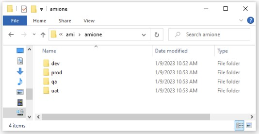
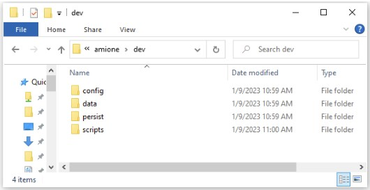
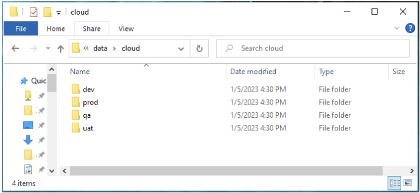
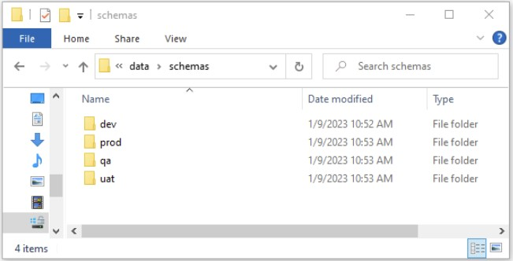
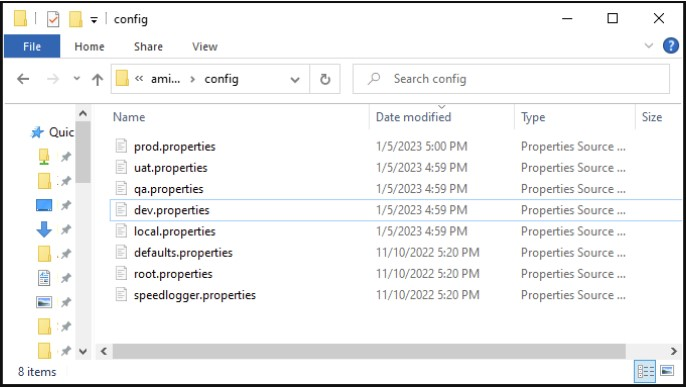
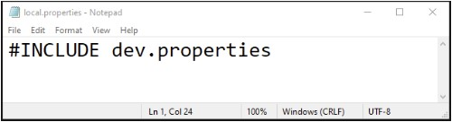
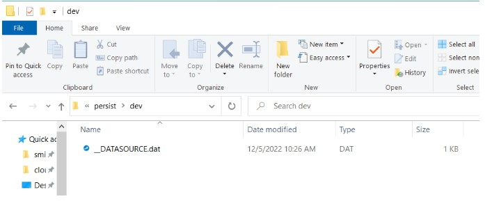
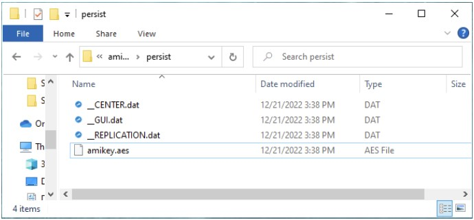

# Multiple Environments

## Introduction

3forge AMI refines the software development life cycle and improves on developers ability to write high impact code. It allows you to make rapid changes and see iterative improvements which need to be maintained overtime. This document provides a general template to manage and ensure that the development of dashboards is properly maintained for multiple environments.

The following components of 3forge AMI will need to be managed: AMI Layouts, the AMI DB Schemas, AMI Config Properties, AMI Datasources, Aeskey, Scripts, AMI Libraries. There are also additional sections in this document which may be useful such as Source Control, and AMI Database persist data files.

## Environments

We recommend that development teams create multiple environments as necessary when working with AMI. Here's a recommendation, modify as necessary.

**DEV** - This environment is for day to day rapid changes.

**QA** - This environment is for promoting DEV changes for testing.

**UAT** - This environment should be set up with testing data but production volumes, it is for pre-production testing.

**PROD** - This is your production environment.

For each environment you should configure a custom properties file.

Note: You may want to set up a failover production environment to provide a backup server if a production change is not performing as expected.

### Alternative Folder Structure

*Note: You may to set up the environment folders at the top level, in this document we set up the environment folders at section to show developers how to manage important files.*

At the root level make as many environment folders as you need.



Inside each environment folder, you should create the following subfolders that need to be managed and any additional ones you need. The below is an example.



## Layouts

One of the key files you need to maintain are the dashboard layouts. These layouts are json files that define how a layout is constructed in the 3forge AMI frontend.

For the purposes of managing multiple environments we will only be using the cloud layouts.

There are three main ways 3forge AMI supports saving files: a local user file, an absolute file, and as a file in your local cloud directory. Local files are where 3forge AMI developers can make and test changes that are only visible to them. Absolute layouts can be saved anywhere on the server's file system. Cloud layouts are shared layouts available to users who have access to them.

### How to Manage Layout Files for Multiple Environments

By default cloud layouts are stored in your data/cloud directory. We recommend making a cloud directory for each environment and configuring your AMI instance to use the cloud directory for that environment.

### Example: Cloud directory structure



Controlled by the property:

```
ami.cloud.dir=path/to/cloud
```

## AMI Database Schemas

The AMI Database (AMIDB) is a core component of 3forge AMI, it allows you store and cache data for aggregations and analytics. The files that define the schema of AMIDB are amisql files.

There are two types of schema files, one is managed by 3forge AMI which allows the addition of new tables, procedures, triggers, and timers while AMI is running. The other schema files are preconfigured and any tables, procedures, triggers and timers defined in these files cannot be modified.

By default 3forge AMI only starts with the managed schema file located in `data/managed_schema.amisql`

### Schema Structure

We recommend creating a folder structure like below for managing your schema files across deployments. You should place your managed schemas and config schemas in these folders.



### Properties

```
ami.db.schema.config.files=path/to/configSchema.amisql,path/to/configSchema2...
ami.db.managed.file=path/to/managed_schema.amisql
```

Note: When defining config files, use a comma delimited format without spaces.

## Configuration Properties

Configuration properties are located in your config directory. Each install contains the following default property files, these files should NOT be modified:

```
root.properties - contains the default included property files
defaults.properties - contains the default properties
speedlogger.properties - contains the default logging properties
```

By default 3forge AMI developers should create a local.properties file and place custom properties in it. To configure properties for each environment, they can make separate property files for each environment.

To use those property files they can use the `#INCLUDE` directive to include that property file.

### Example: Properties Files



Note: Using folders is a good way to organize properties by environment



Controlled by the property:

```
#INCLUDE path/to/env.properties
```

## Datasources.dat and amikey.aes

The `__DATASOURCE.dat` file contains datasource connection properties that 3forge AMI is connected to. Datasource connection details may differ in each environment. That is why datasources are accessed through its name and are pointers to the datasource configuration which contains details such as datasource connection url.

### Example \_\_DATASOURCE.dat file

For example, if the dashboard is connected to a Mysql and a Kdb database, the file will contain two entries containing the connection details.

To make sure 3forge AMI connects to the intended datasources depending on the environment we recommend creating a folder for each environment and place the `__DATASOURCE.dat` file in them. Lastly we need to edit the environment specific property file to indicate the location of it.

Based on the screenshot below, the property for the dev environment would be:

```
# //Inside dev.properties
ami.db.persist.dir.system.table.__DATASOURCE=persist/dev
```

For prod it would be:

```
# //Inside prod.properties
ami.db.persist.dir.system.table.__DATASOURCE=persist/prod
```



### Amikey.aes

It is very important you manage your amikey.aes properly. This key is used for encrypting the connection details for your 3forge AMI datasources. It is recommended you have different amikey.aes keys for each environment. By default the key is located in your persist directory.

This key can be configured through the property:

`ami.aes.key.file=path/to/amikey.aes`



Controlled by the properties:

```
ami.db.persist.dir.system.table.__DATASOURCE=path/to/datasourcesfolder
ami.aes.key.file=path/to/amikey.aes
```

## Scripts

The scripts folder contains the startup scripts for 3forge AMI. We recommend managing your start script in source control if you change or customize the start script. Some examples of why you may modify the start script: change the amount of memory 3forge AMI reserves and change the Java Garbage collector.

## Libraries (Optional)

3forge provides many plugins for connecting to datasources and interfacing with other technologies. By default these libraries get stored in the lib directory. It may be a good practice to enable revision control on the 3forge AMI lib directory especially for production environments if it is necessary to conduct a rollback.

## Source Control for Layouts

3forge provides a source control plugin for AMI layouts. This is set up on the AMI server. We recommend each 3forge AMI Developer to create a separate branch with the developer's userid as the branch name. They should pull from the main branch and merge into the main branch when submitting change

## Persist Data

3forge stores the AMI Database data files by default in the persist folder. This can be configured through the property: 

```
ami.db.persist.dir=path/to/your/persist
```

You do not want to check this into version control as these files can be very large.

