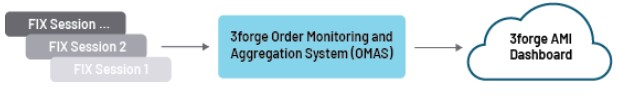
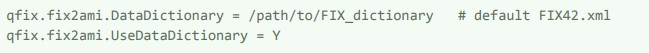
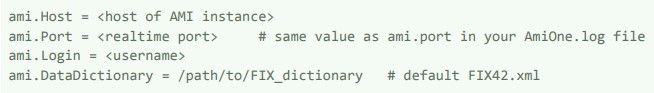
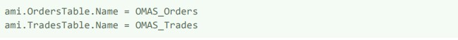
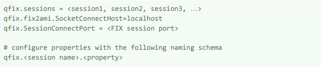
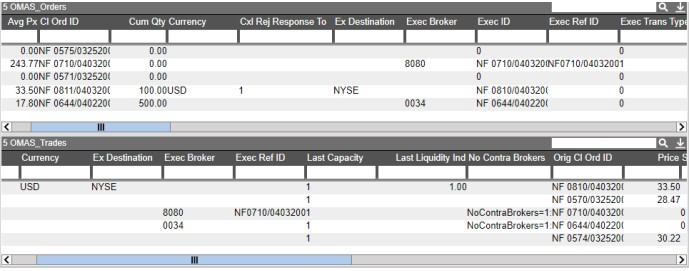

# OMAS

## Overview

The OMAS architecture allows realtime streaming of FIX messages into AMI for easy visualization and analystics.

## Installation

1. Download the `fix2ami.<version>.<type>.tar.gz` file from your 3forge account and extract.

1. Configure properties in the `config/fix2ami` folder

	1. `root.properties` - FIX session properties
	
		
	
	1. `db.properties` - AMI DB properties
	
		-   host, port, login values can be obtained from your local AMI settings
		
		
		
		-   Optionally, configure AMI table names for OMAS using the same property
		
		

1. Run the `startFix2Ami.sh` script located in the scripts folder and connect to the FIX sessions. To connect multiple sessions, add session names to the sessions variable and configure properties for each session

	
	
	Now, FIX messages will be processed to AMI and you can begin creating visualizations in the AMI dashboard:
	
	

1. To stop, run the stopFix2Ami.sh script

**Notes**:

-   If you change AMI table names for OMAS in the db.properties file later, the old tables will still be defined in AMI DB.

-   Fix2Ami sequence numbers are stored in the data/fix2ami folder.
