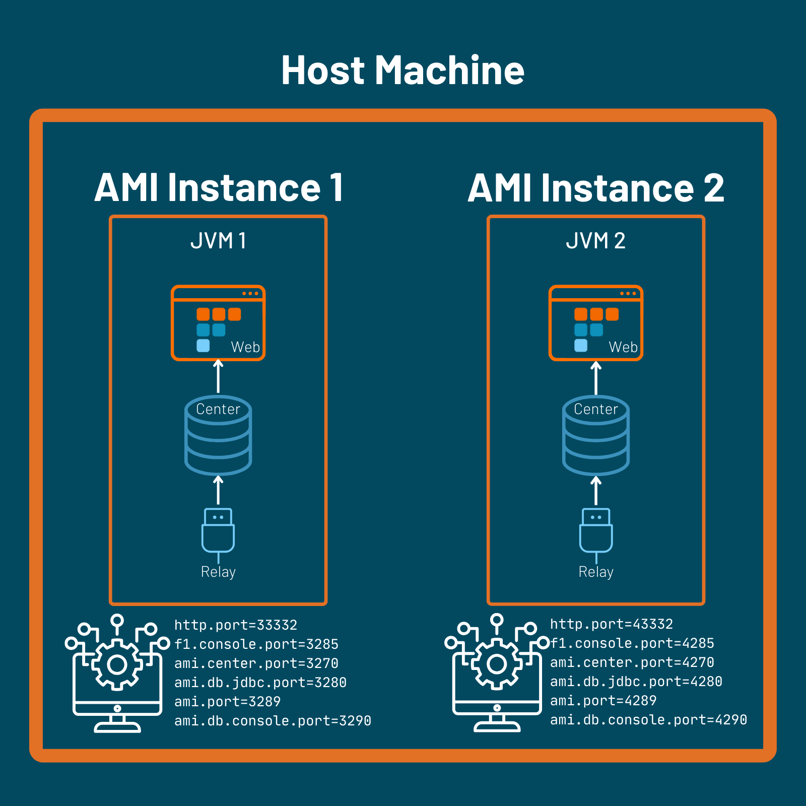
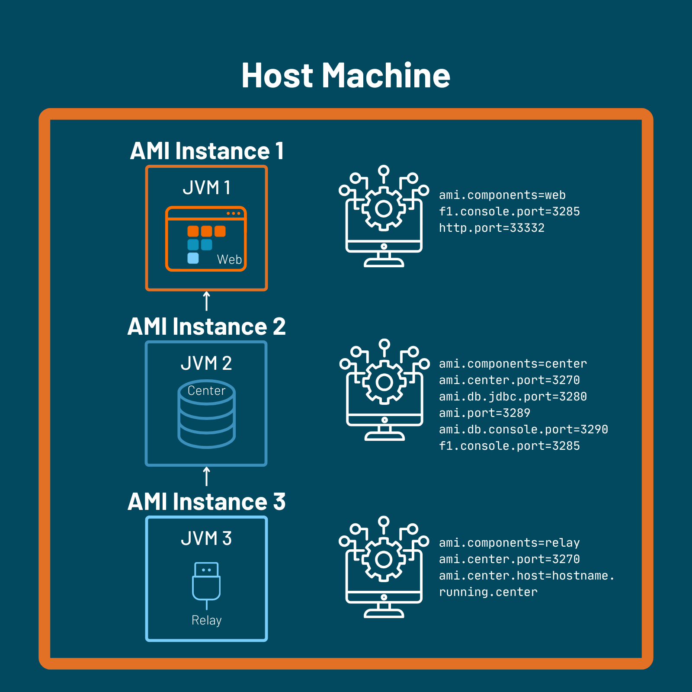
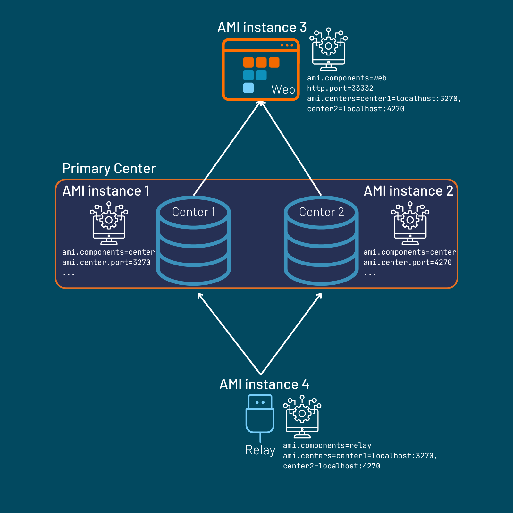
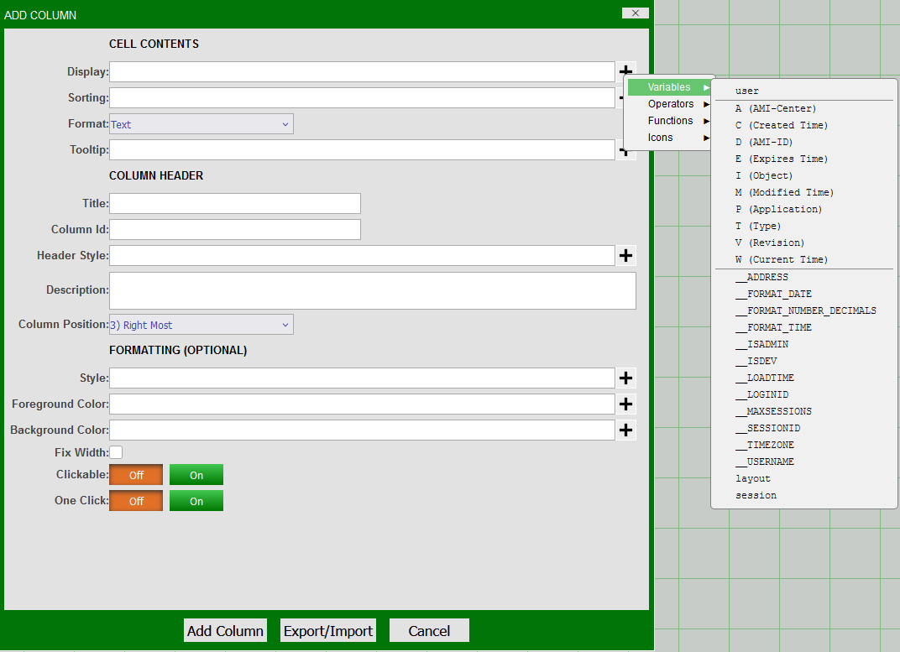
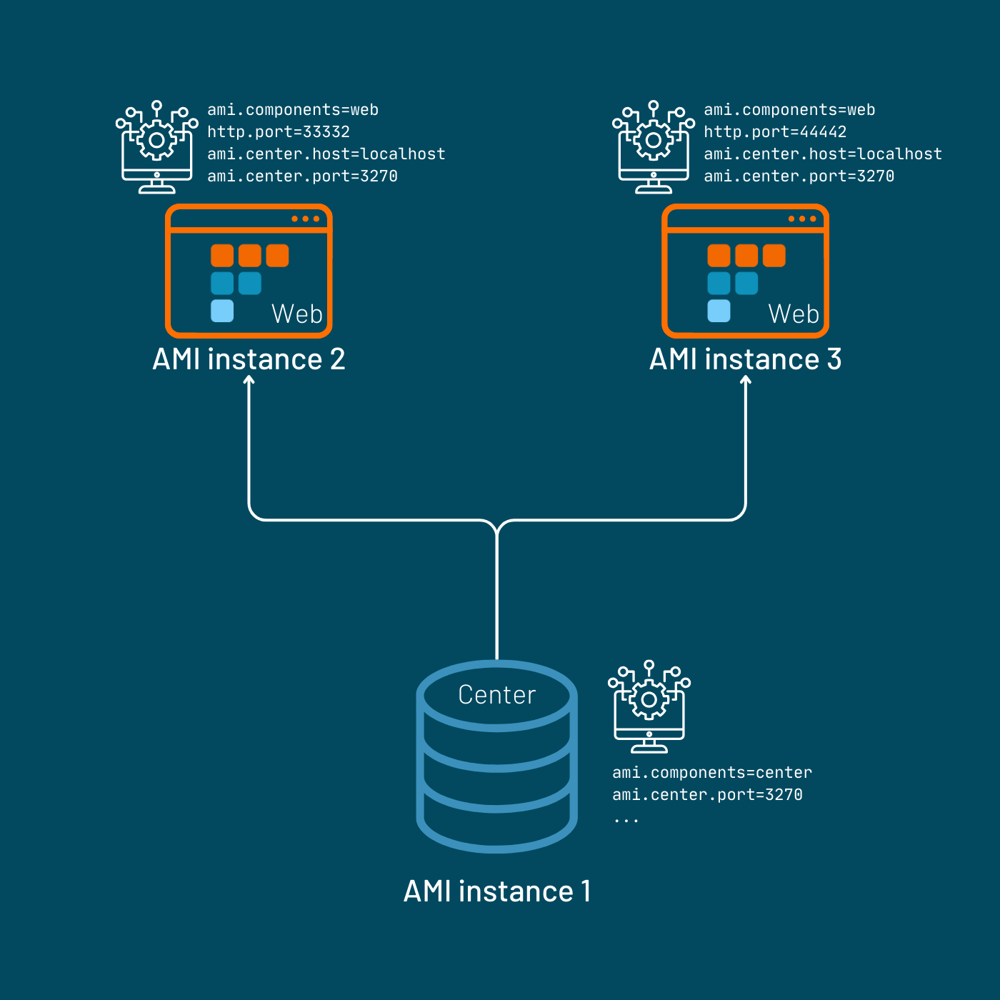
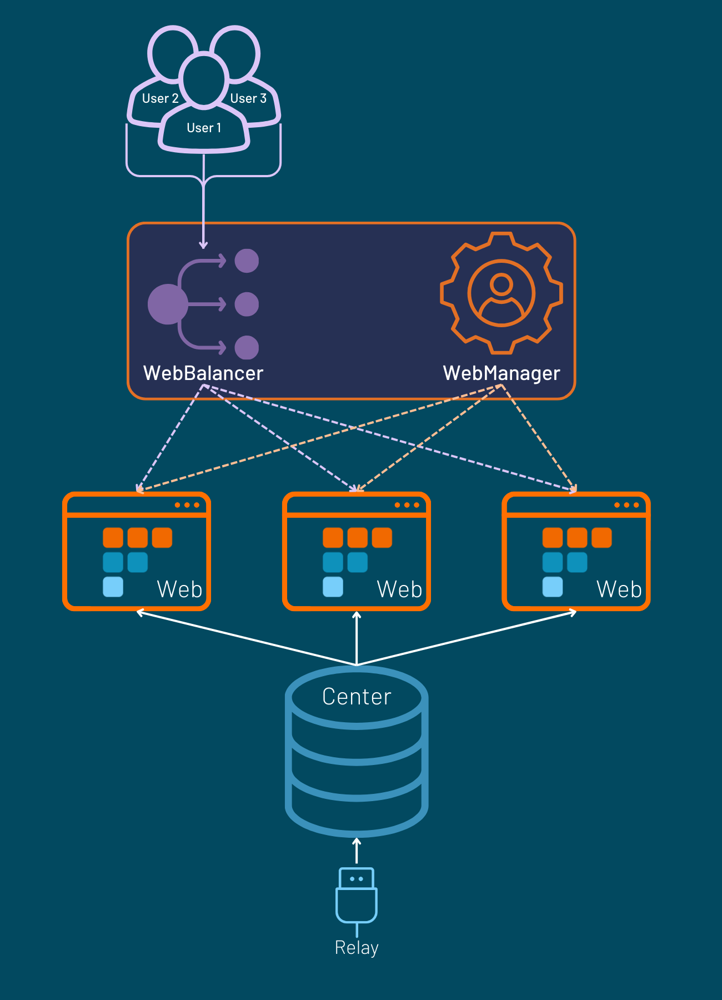
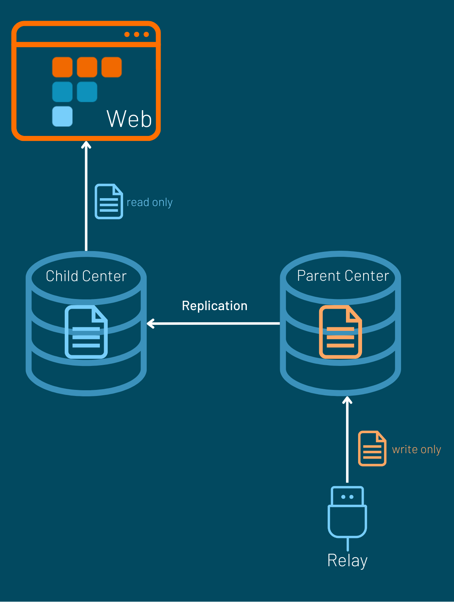
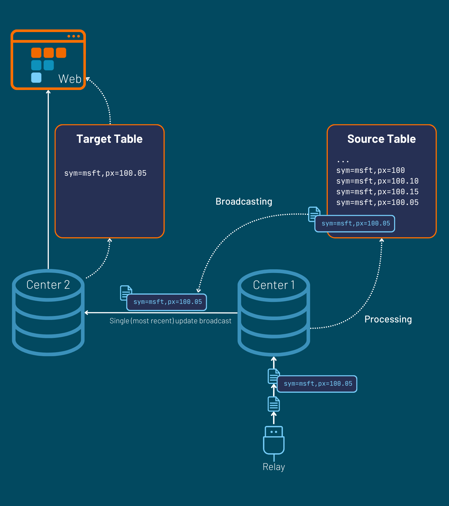
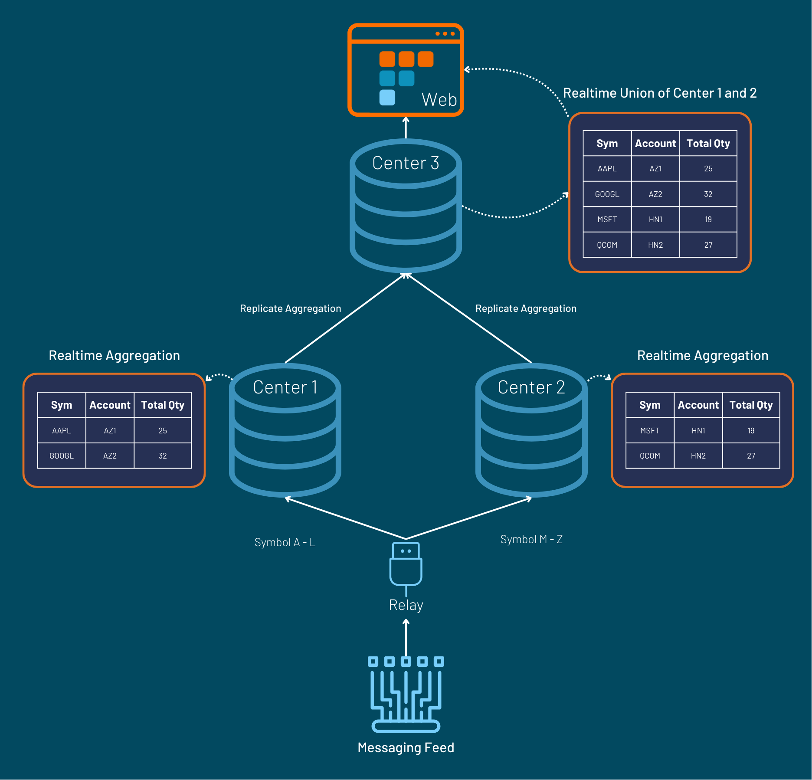

# Scaling

AMI is a modular product consisting of three components: the center, web, and relay. 

AMI systems can be scaled up by running individual components independently and/or alongside each other for improved performance and abstraction.

## Overview 

AMI's architecture allows for easy horizontal and vertical scaling depending on your business needs. At a simplified level, AMI's components can be thought of as the following:

- The GUI component (web)
- The processing and storage unit (center)
- The data transfer and communication component (relay)

The AMI One application contains and runs all three components by default. The user can configure their AMI instance(s) such that one or a combination of each components is running. 

Examples of this could be:

- A single web dashboard connected to multiple centers. 
- Multiple relays connected to different data streams routed into a single center.
- Multiple centers communicating with other centers locally or externally via multiple relays. 

## Set Up Multiple AMI One Applications

Multiple AMI One instances can be run on the same host machine. Refer to [this section](advanced_setup.md/#configuring-multiple-instances-on-a-single-machine) for configuration details. 

 

!!! Warning
    Each AMI instance must have unique ports with **no port conflicts**. When configuring new instances of AMI, you will need to manually assign new port values. 

AMI Default Ports: 

```
http.port=33332
f1.console.port=3285
ami.center.port=3270
ami.db.jdbc.port=3280
ami.port=3289
ami.db.console.port=3290
```

We would suggest changing the prefix for consistency and ease of port management. For example:

```
http.port=43332
f1.console.port=4285
ami.center.port=4270
ami.db.jdbc.port=4280
ami.port=4289
ami.db.console.port=4290
```

## Running Individual AMI Components

To run each component individually, you will need to configure multiple instances of AMI such that only the intended component is included. 

 

You will need to alter the `local.properties` file of each installation by changing the property `ami.components`. This file will be located in the `amione/config` folder of each AMI instance's directory. 

A full guide on the list of properties to configure for each component can be found [here](advanced_setup.md/#running-components-independently). 

The examples below utilize the same configuration guide.

### Connecting Relay and Web to Multiple Centers

Centers can be horizontally scaled to distribute computational load or build in redundancy. Ensure that each center is [configured](./advanced_setup.md/#relay-and-multiple-centers) with its own unique respective ports.



In this structure, the web can access tables from both centers. Tables with the same schemas across centers are unioned in the web as **one** table. 

To determine which center an individual row of data has originated from, you will need the [reserved column](../center/realtime_tables.md/#reserved-columns) "A." 

This can be easily added from the realtime table panel settings by going to the settings cog and selecting "A" from *Add Column->Variables*.



!!! Note
    Not all reserved columns are populated by default. Please check the list of reserved columns and alter the schemas of your center tables accordingly if they are required.

By default, a relay will send the same data to all connected centers. To implement conditional routing logic, see the [guide](../configuration_guide/relay.md/#relayroutes-file) for configuring the `relay.routes` file. 

### Connecting Multiple Webs to a Center

Systems with resource-heavy datamodels can rapidly become memory-intensive as multiple users interact with them. AMI supports using multiple web instances that connect to the same center to reduce overhead. Each web session will have access to the same center schemas without compromising memory usage across multiple users. 

In this case, each web instance's `local.properties` must be configured to have the shared center:

```
ami.components=web
ami.center.host=host.address
ami.center.port=3270
``` 

 

Use in conjunction with the WebBalancer (see [below](#load-balancing-between-multiple-webs-using-webbalancer)) for streamlined user traffic management.

## Use Cases

Listed below are a sample of use cases implementing scaling with AMI. 

For support and guidance on scaling up AMI for your enterprise purposes, please contact us at <support@3forge.com>.

### Load Balancing with WebBalancer

For systems with multiple AMI web instances, use AMI's WebBalancer to automatically distribute user traffic across multiple web instances. This ensures resiliency by routing users to a different web instance in case one goes down. 

The WebBalancer is an optional component of AMI. In order to use the WebBalancer, you will need to do the following:

1. Set up a [`webbalancer.routes`](../configuration_guide/webbalancer_webmanager.md/#webbalancerroutes-file) file with the routing logic.
2. Set up an AMI instance and configure the components property to: `ami.components=webbalancer`.

To see a full guide on configuring WebBalancer, please refer to [this](./webbalancer_webmanager.md) page.

#### Serving layouts/preferences from WebManager: A centralized file server. 

Each web instance stores its own dashboards and other user-related settings such as preferences by default. This information is **not** typically shared among other different web instances/sessions. The WebManager acts as a central hub storing information on different users' settings so they can be used even if the user's web session is rerouted. 

Use WebBalancer and WebManager together to allow users to access their settings and files across your system's different web instances. 

Like WebBalancer, WebManager is an optional AMI component and is set up similarly:

1. Set up an AMI instance and configure the components property to: `ami.components=webmanager`.
2. In each AMI Web instance, include the WebManager host and port in their respective `local.properties` files:
    - `ami.webmanager.host`
    - `ami.webmanager.port`

Refer to the [same](./webbalancer_webmanager.md/#webmanager-user-guide) WebBalancer/WebManager page for more information on setup.

#### Putting it all together



### Parent-Child Setup with Replication for Faster Reads 

3forge applies a database-level lock for realtime tables and a table-level lock for HDB tables during write operations. Writing to tables is done in batches allowing for uninterrupted reads for most cases, however generally the HDB is faster to read from in high-volume and low-latency use cases. 

Using [center replication](./center_replication.md), users can set up a parent-child architecture with AMI centers with a source center that processes only writes, and a replicated center that serves only reads. This type of access enables extremely efficient read speeds and be scaled across multiple centers.



### Manage Throttling with Replication 

[Replication](center_replication.md) is also used to control throttling. 

A typical AMI setup often includes a high-volume relay connected to a center; the center then uses this data to populate a realtime table. Each time the center receives new data, it undergoes some computational processing.

The center's table can be configured to broadcast data at a slower rate to some target table on another center. This can reduce computational overhead by allowing users to reduce the frequency of data retrieval as necessary. This table can then be used for visualizations and other intensive calculations. 

Broadcast rate in a realtime table can be configured with the [`RefreshPeriodMs`](../center/realtime_tables.md/#overview) option. In this setup, only the most recent update retrieved in the refresh period is broadcast to the target center. 



### Sharding and MapReduce

Sharding and MapReduce can be achieved in 3forge with just a few steps. 

The relay should be configured to send messages to multiple centers based on the sharding key defined in [relay.routes](../configuration_guide/relay.md/#relayroutes-file) file. 

Each center can then perform their aggregations locally and replicates the results to a downstream center, reflecting a global aggregated view. 



### Archiving directly to HDB

Data can streamed directly into HDB as opposed to [archiving from realtime to hdb](../center/historical_tables.md/#archiving-realtime-tables-into-hdb). The relay needs to be configured to [route](../configuration_guide/relay.md/#relayroutes-file) messages both into realtime and hdb tables.