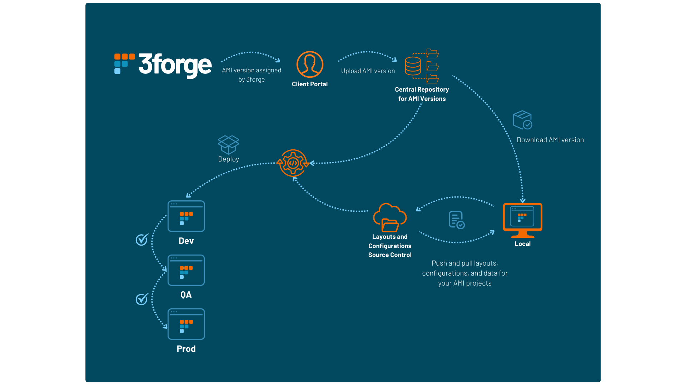
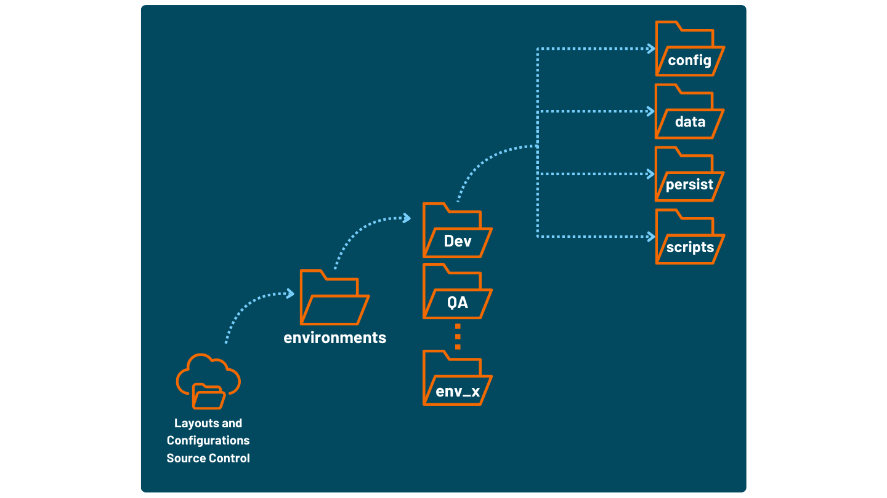

# Source and Version Control Guidelines 

This document contains guidelines and best practices that we recommend for setting up source control for different versions of AMI, especially if using AMI in client-facing applications. 

!!!Note 
    This document is intended as a **guide only** -- your individual needs and implementations may differ, so please adjust accordingly. 

    Alternatively, please reach out to us at <support@3forge.com> for tailored advice and recommendations. 

## Overview 

AMI layouts are modular by design, enabling easy access and development for multiple users on the same dashboard. We generally recommend for most enterprises that you have the following:

-   A development environment (dev).
-   A QA/UAT environment for testing user functionality, especially client-facing.
-   A production environment (prod). 

It is typically best practice to have all of these environments, but depending on your use case, you may find dev and prod sufficient. We generally do not recommend having any less than both prod and dev to avoid potential dependency issues during upgrades, especially for live production settings. 


## Recommended Setup 

We suggest a source control pipeline similar to this: 



### Key Structural Components 

1.   A hosted or centralized repository with a backlog of AMI versions your enterprise has used. 
2.   A separate repository for your users' AMI layouts, components, and configuration files (see the [configuration guide](../configuration_guide/index.md) for more information). 
3.   A locally built dashboard instance that is tested before being deployed (dev -> QA -> prod). 

### Important Files for Source Control

We would suggest a source control file format similar to this: 

 

Files that you should maintain in source control include but are not limited to: 

1.   Your layout files, stored in `ami/amione/data`. These files will either be: 
    -   local (`data/users`) 
    -   cloud (`data/cloud`) (recommended)
    -   absolute (stored anywhere you specify on your device) 

    You will need to keep relative dependencies between parent/child layouts consistent (i.e *cloud -> cloud, local -> local*, etc.) 

1.  Data files like database schemas, datasource connections (.dat files in `ami/amione/persist`) 
2.  Configuration files for each environment (`local.properties` in `ami/amione/config`) 
3.  Any .jar files for custom plugins
4.  Any scripts stored in `ami/amione/scripts` including `start.sh` 

## Upgrading AMI

AMI versions, upgrades, and plugins will be assigned to you by members of our team where they can be downloaded from the 3forge portal. 

For Windows users, you can simply re-run the installation wizard and dependencies will be updated accordingly. For Linux users, please follow the steps below. 

### Download .tar.gz Files 

1.  From the 3forge portal, navigate to "Files" and download the latest version of AMI assigned to you. 
2.  Upload and push this to your AMI version control repository, e.g Github, Perforce, etc.

### Upgrade AMI (Local User) 

1.  Ensure your layout and datasource files are saved and pushed to your data repository. **If you do not do this, your data will be overwritten and lost**.
2.  Pull the relevant AMI version from your AMI source control repository.
3.  In the directory of the AMI installation you wish to upgrade, extract the .tar.gz file. You can do this in terminal by running this command: 
``` sh
tar -xf ami_unix_<YOUR_UPGRADE_VERSION>.tar.gz -C <YOUR_TARGET_DIRECTORY>
```
4.  This will overwrite and upgrade AMI. The following files will be overwritten:
    -   `amione/lib` 
    -   `amione/data` 
    -   `amione/scripts` 

### Build and Deploy 

1.  Using your source control manager, pull and download all your layouts (data), datasources, plugins, and scripts. 

    !!!Note
        Remember to keep your `out.jar` file in `ami/amione/lib` updated with the appropriate plugins.  

2.  Run your build script. You can streamline the whole process by including the above steps in `build.sh`. For help, please contact us. 
