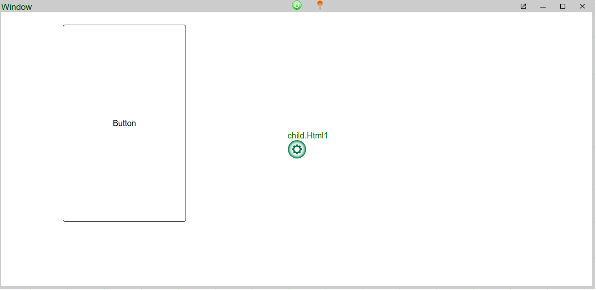

# Source Control (Deprecated)

## Overview 

For git-based or hosted projects, 3forge provides support for source and version control from within AMI via the git adapter. Dashboards can be uploaded and managed via git granting greater flexibility to teams that require it. 

By default, this is not shipped, so please contact us at support@3forge.com to have the adapter assigned to your account for download and use. 

## Requirements 

-	A git repository (and login)
-	3forge git adapter

## Setup 

1.	Initialize a git repository from wherever you are hosting your git-based code (e.g Github)
2.	From your 3forge account download and unzip the git adapter, then copy its contents into the root directory of your AMI installation at `ami/amione/lib`.
3.	Inside `local.properties`, add the following property: 

	```
	ami.scm.plugins=com.f1.ami.plugins.git.AmiGitScmPlugin
	```

4.	Start/Restart AMI and verify that you can now see 'Git' as a type in Source Control settings at *Account -> My Source Control Settings*.  
5.	Please follow either the **HTTPS Connection guide** or **SSH Connection guide** below depending on your repository's security configuration.  

### Option 1: HTTPS Connection


1. In AMI, open the Source Control Settings:  

	1. Select *Account -> My Source Control Settings -> Type -> Git*.
	2. Then, fill in the following fields:  

		-	URL  
		-	Client  
		-	Username  
		-	Password (Personal Access Token)  
		-	Project Path  

		Please refer to the clone information from your respective git provider to fill in the fields if unsure. 

	3. To specify a branch, go to *Advanced -> Branch* and enter the branch name -- unless specified, the default branch the adapter will use is the **master** branch. 
	4. For more information on each field, see [Settings](#settings) below.  

2. Click *Submit* to clone and connect to the repository.

### Option 2: SSH Connection


1. Generate a SSH key pair file in your SSHKey directory. Please follow your git repository's guide on creating a key pair -- **The default key name id_rsa is no longer supported. Please use ed25519**. 

1. Upload the public key data to your git-based framework. Please refer to your provider's setup instructions.
1. In AMI, open the Source Control Settings:  
	1. Select *Account -> My Source Control Settings -> Type -> Git*.
	2. Then, fill in the following fields:  

		-	URL  
		-	Client  
		-	Username  
		-	Password (Personal Access Token)  
		-	Project Path  

		Please refer to the clone information from your respective git provider to fill in the fields if unsure. 

	3. To specify a branch, go to *Advanced -> Branch* and enter the branch name -- unless specified, the default branch the adapter will use is the **master** branch. 
	4. For more information on each field, see [Settings](#settings) below.  

1. Click *Submit* to clone and connect to the repository.

### Adding & Committing Layouts


| Status | Tracked                                                           | Modified                                                                       | Changed                                                                                              |
|--------|-------------------------------------------------------------------|--------------------------------------------------------------------------------|------------------------------------------------------------------------------------------------------|
|        | All changes to the layout have been **tracked** in the repository | Changes to the layout have been tracked **locally**, but not in the repository | The layout has been **added** to the commit stage and is ready to be **committed** to the repository |

1. From AMI, select *Dashboard -> Included Layouts*.
1. Right click on the layout and select *Source Control -> Mark For Add*.  

	1. To revert this, right click and select *Source Control -> Revert*.
	1. If the Source Control option is grayed out, ensure that your layout is saved within the git directory.  

1. Right click and select *Source Control -> Commit*.  
	1. Enter your commit messages in the 'Comment' field and press *Commit* to commit the layout. Doing so will commit and push changes to the connected repository.

### Settings

| Property      | Description                                                                                                            |
|---------------|------------------------------------------------------------------------------------------------------------------------|
| URL           | HTTPS / SSH URL to the git repository.                                                                                 |
| Client        | Client name, e.g. *John Smith* |
| Username      | Username generated by *Repos -> Files -> Clone -> Generate Git Credentials*.                                             |
| Password      | Please use the personal access token generated from Github.                                                            |
| Save Password | Method used to store the password (personal access token).                                                             |
| Project Path  | Directory to store and modify the git repository.                                                                      |

### Advanced Settings


| Property           | Description                                                 |
|--------------------|-------------------------------------------------------------|
| Branch             | Name of the branch to connect to. Default is **master**     |
| Remote             | URL to remote git repository.                               |
| SSHKey             | Absolute path to the directory where the key pair is stored |
| SSHKey Pass        | Passphrase for the private key                              |
| Additional Options |                                                             |

## Reference

### Key Features

**Source Control Management (SCM) Integration & Tooling** 
: 
	Integration with GIT and Perforce. Conveniently check-in/out, diff history within the AMI web-based dashboard builder.

	
**Enterprise Deployment Strategy** 
: 

	AMI files can be treated like any other resources that are managed through deployment strategies, such as uDeploy, TeamCity, etc.
	
**Dashboard Tracking, Versioning, Branching** 
: 

	Use source control to label versions of a dashboard, compare versions, and manage branching. 

**Multi-file Linker** 
: 

	Dashboards can be logically separated into individual components for independent management/version control.

**Abstraction** 
: 

	Functionality can be marked virtual and overridden in another file, allowing for dashboard designers to abstract out functionality for custom implementation.

**Refactoring** 
: 

	Components can safely be renamed and/or moved between files. The tool automatically updates and moves dependencies as necessary with naming conflict resolution.

**Dashboard File Stabilization** 
: 

	Changes to a dashboard result in minimum/localized changes to the underlying file. Components can be set to defaults to avoid noisy/unintended changes.

**Reusable Components** 
: 

	Scripts, datamodels, widgets and entire dashboards can be written once and then reused across dashboards.

**Dashboard Extension** 
: 

	Extend existing dashboards for regional/business line specific usage without needing to maintain multiple near duplicate dashboards.

### Full Backwards Compatibility

**File** 
: 
	
	Loads existing dashboards and automatically converts to the new format. 
	!!!Note 
		Files are still json with the same general structure, just less clutter/redundancy.

**Usage** 
: 

	Users & dashboard developers can continue to develop/maintain dashboards without change. Changes are purely additive, existing functionality has not been changed nor removed.

**Split Dashboards** 
: 

	Split existing dashboards into separate files for better SCM management.

**Combine Dashboards** 
: 

	Utilize multiple existing dashboards to create a single super-dashboard.

### Key Concepts

#### Dashboards vs. Layout

Generally in AMI, the terms 'Dashboard' and 'Layout' can be used interchangeably. With SCM, a dashboard can be an amalgamation of multiple layout files. Note the following: 

-   Layout: an individual .ami file which contains a set of source definitions such as Panels, Datamodels, Relationships, AMIScript, etc. 
-   Dashboard (Root Layout): the .ami file that is directly opened (ex: *File -> Absolute File - Open*) is considered a Dashboard, or more specifically the *Root Layout*


#### Loading/Saving Dashboards in SCM

There are three methods for saving layouts: 

-	Absolute File
-	My Layouts
-	Cloud

Generally, we recommend saving your layouts to either "My Layouts" or "Cloud" which are located in your AMI installation directory. "Absolute File" allows you to store your AMI layouts anywhere on your host machine, and not just within the AMI folders.

If you wish to use SCM to manage a layout file, it should be located under the SCM base path (*Account -> Source Control Settings -> Project Path*). 

To move a layout from "My Layouts" into SCM, open the file in AMI (*File -> My Layouts -> Open*) and then save it as an aboslute file (*File -> Save As -> Absolute File*) in the directory the SCM is pointing to.


#### Included Layouts

To access multiple layouts and their data in your dashboard, you can "include" additional .ami layout files in your current layout. This will turn the current working layout into a dashboard, or "root layout." This will establish a parent-child relationship from the root layout to the included layouts.

To add new layouts, click on *Dashboard -> Included Layouts*

1.	To add an existing file: 
: 
	- Right click on the project -> *Add Child Link from ->* 
	- Select from your local, cloud, or absolute file layouts.
	- Give the file an alias with which the root layout will use when calling data from the child layout.

2.	To add a new file: 
: 
	- Right click on the project -> *Add Child Link From -> New File* -> 
	- Enter the name of the new, blank file to create.

We suggest using relative pathways where possible for portability. 

!!!Note
	Relative paths must be consistent -- a cloud stored parent can only have a relative path to a cloud stored child layout.

It is possible to establish nested layout relationships such that a child layout can have a grandchild layout etc. Panels and other data are called with dotconcatenation, e.g: `child.grandchild.datamodel`.


Panels and datamodels defined in the child layout can be accessed within the parent. A child layout's datamodels will be visible within the Data Modeler but **not** its panels -- you can still call these panels, but they're done via linkage when creating new panels in the parent layout.


#### Linking Child Panels 

To use a panel from the child layout, create a new window in the current/parent layout, select the green cog and press *Link To Panel*. 


You can then view the selected child panel with the alias specified when you included the layout. 



To remove the panel, select the cog again to unlink it. 

!!!Note
	If you have write permissions enabled in the parent layout for the child layout, any deletions you make of child layout objects within the parent layout will **delete the corresponding information in the child layout**. Use unlink if you want to keep underlying panels.


#### Refactoring

To move a panel (and its dependent objects) from one file to another, click on the panels green button -> *Move to Different Layout* -> select the layout to move the panel to.

#### Using Source Control

-   Open the project Browser, *Dashboard -> Included Layouts*, right click *Add Child Link From* and choose the appropriate action.
-   To see most recent changes, right click the layout and click *Diff against loaded*.

### Advanced Concepts

#### Scoping 
: 
	Parent layouts have access to the resources of child layouts, but child layouts do not have visibility to parent objects.

#### Custom AMIScript Methods and Variable Scoping 
: 
	Duplicate methods can exist across parent and child layouts. 

	Child methods are scoped within the child layout. 
	: 
		i.e, the method `onButton()` in child1 would not be called in child2, but could be called by the parent as `child1.onButton()`.  


	If undefined in the parent layout, the method from the child with the highest priority will be called. 
	: 
		See *Dashboard -> Included Layouts* -> right click file -> Move Up (Higher Priority) or Move Down (Lower Priority).


## FROM THE OLD MULTIPLE LAYOUTS PAGE:

Another approach is to import the JSON that represents a part of a layout. Below is a guide for importing a datamodel.

1. Create a **/myConfigs** (can be any name you want) directory local to your AMI installation and put the configuration files (usually in the format of JSON) in it  

	The example below has the configuration file named CountryTemplate.json. You can have multiple configuration files  
	
	  

1. Read, Parse the config files and import the data model and panel to the AMI session  

	Also additionally, you can configure data model's **WHERE** variable.  
	
	The amiScript below show how to achieve these where each visualization panel has exactly one underlying data model:  

	``` amiscript
	filesystem fs=session.getFileSystem();
	String Panelconfig = fs.readFile("myConfigs/testPanelConfig.json");
	String DMconfig = fs.readFile("myConfigs/testDMConfig.json");
	map Panelparsed = parseJson(Panelconfig);
	map DMparsed = parseJson(DMconfig);
	datamodel dm=session.importDatamodel(DMparsed);
	map m = Panelparsed.jsonPath("portletConfigs.0.portletConfig.dm.0"); //get the id from the data model that we imported
	m.put("dmadn", dm.getId()); //put the id above into the panel's configuration
	dm.process(new map("WHERE", "Code=\"ABW\"")); // configure WHERE variable
	session.importWindow("newWindow1", Panelparsed); //import the window
	```