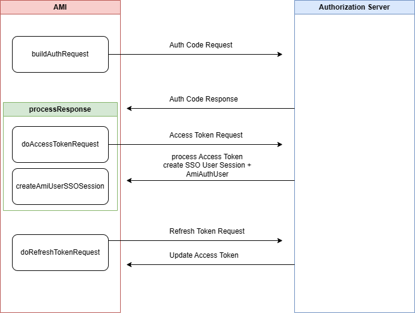

# OAuth 

AMI supports OAuth integration for easy user credential management.

## Overview 

3forge supports a variety of authentication methods for AMI including OAuth for easy access control to your layouts. To use, you will need the 3forge OAuth plugin and the details of your OAuth credentials manager, for example: Okta. 

!!! Note 
    3forge supports Okta integration directly. To configure AMI to use Okta credentials, please navigate [here](#oauth-for-okta).

### Setup

You will need to ensure your identity provider has OAuth 2.0 Authentication enabled, then do the following:

1. Find your identity provider URL.
2. Register a new Web App (AMI) with the identity provider and provide a sign-in URL. This will be used to configure the property `oauth.redirect.uri`.
    - We recommend also providing a logout redirect URL, however this is optional.
3. Add the properties listed below to your `local.properties` for minimal configuration. 

### Minimal Configuration

These are the minimum required properties to enable OAuth for AMI. For detailed information on each property and additional properties, see the [properties](#properties) section below. 

``` 
# Set the SSO plugin to be OAuth 2.0 
sso.plugin.class=com.f1.ami.web.AmiWebOAuthPluginImpl

# Provide the url to your OAuth 2.0 identity provider
oauth.server.domain=<https://oauthprovider.com>

# Provide the sign-in redirect url that you configured for the app with your identity provider 
oauth.redirect.uri=<http://localhost:33332/oauthRedirectUrl>

# Provide the endpoints for authorization, token, refresh, and logout token
oauth.authorization.endpoint=/authorizeEndpoint
oauth.token.endpoint=/tokenEndpoint
oauth.refresh.token.endpoint=/refreshTokenEndpoint
oauth.logout.endpoint=/logoutEndpoint

# Properties related to refresh tokens, redirect uri and scope are optional, by default are set to null
oauth.refresh.redirect.uri=/refreshRedirectUri
oauth.refresh.scope=/refreshScope
oauth.refresh.client.id=/refreshClientId
oauth.refresh.client.secret=/refreshClientSecret
oauth.refresh.grant.type=refreshGrantType

# Provide the client id and secret that will be used for the OAuth authentication
oauth.client.id=clientid
oauth.client.secret=secret

# Replace this with the default scope that is used for Web Based Applications in your firm
oauth.scope=openid profile email offline_access

# Replace this with unique identifier that identifies the user
oauth.username.field=email

# Recommended to replace this with an attribute that identifies the group a user belongs to
oauth.ami.isdev.field=email
oauth.ami.isdev.values=`<comma_delimited_list_of_emails>`{=html}

# Logout Page AMI will display when logged out
web.logged.out.url=/loggedout.htm

# This is enabled for development, disable this after OAuth has been setup
oauth.debug=true
```

## Properties

### Required


```
sso.plugin.class
```
: 
    **Default**: N/A 

    - Class that implements an AmiWebSSOPlugin. 
    - Use `com.f1.ami.web.AmiWebOAuthPluginImpl`.

```
oauth.server.domain
```
: 
    **Default**: N/A 

    - Domain of the OAuth server account (https://someoauthprovider.com).

```
web.logged.out.url
```
: 
    **Default**: N/A 

    - AMI logout page (to be suffixed at the end of your AMI Web address).
    - E.g: `/loggedout.htm`.

```
oauth.redirect.uri
```
: 
    **Default**: N/A 

    - 3forge AMI Url for OAuth server to redirect after login.
    - E.g: `http://localhost:33332/oauthRedirectUrl/`.
    - Remember to configure this with your OAuth provider.

```
oauth.client.id
```
: 
    **Default**: N/A

    - Client ID.

```
oauth.client.secret
```
: 
    **Default**: N/A

    - Client secret.

```
oauth.authorization.endpoint
```
: 
    **Default**: `/oauth2/default/v1/authorize`

    - Authorization endpoint.

```
oauth.logout.endpoint
```
: 
    **Default**: `/oauth2/default/v1/logout` 

    - Logout endpoint. 

```
oauth.token.endpoint
```
: 
    **Default**: `/oauth2/default/v1/token`

    - Token endpoint.

```
oauth.scope
```
: 
    **Default**: N.A 
    
    - Space delimited scopes indicating the types of resources AMI will be requesting from the resource server. 
    - Use your email.

```
oauth.username.field
```
: 
    **Default**: N/A

    - User email.


### Optional  

```
oauth.refresh.token.endpoint
```
: 
    **Default**: `/oauth2/default/v1/token` 

    - The endpoint to get the refresh token. 

```
oauth.refresh.grant.type
``` 
: 
    **Default**: `refresh_token` 

    - The refresh grant type for obtaining a new access token. 

```
oauth.refresh.redirect.uri
```
: 
    **Default**: `null` 

    - The refresh redirect uri.

```
oauth.refresh.scope
```
: 
    **Default**: `null` 

    - The refresh scope.

```
oauth.refresh.client.id
```
: 
    **Default**: `oauth.client.id` 

    - The client ID after refresh.

```
oauth.refresh.client.secret
```
: 
    **Default**: `oauth.client.secret`
    
    - The client secret after refresh.

```
oauth.ami.isdev.field
```
: 
    **Default**: N/A 

    - The field from that the identity response uses to identity an AMI dev user. 
    - Email recommended. 

```
oauth.ami.isdev.values
```
: 
    - Comma delimited list of AMI devs corresponding to the field. 
    - E.g, the list of emails of AMI devs. 
    - If the value of the `isdev` field matches any of the values, the user gets AMI dev privileges. 

```
oauth.ami.roles.enabled 
```
    **Default**: N/A 

    - Comma-delimited list of OAuth roles that users can have and are enabled for AMI. 
    - E.g: `user, guest, admin`.

```
auth.ami.roles.field
``` 
    **Default**: N/A 

    - Comma-delimited list of OAuth configurable roles that users can have.
    - E.g: `user, guest, admin`; 


```
oauth.ami.default.role.field
```
    **Default**: N/A 

    - The default role a user has if none has been assigned. 

```
oauth.ami.role
```
: 

    **Default**: N/A 

    - List of users with the given role.


```
oauth.access.token.expires.in
```
: 
    **Default**: N/A 

    - Key that contains the time the access token expires in.
    - If not set, the token will note expire. 

```
oauth.code.challenge.method
```
: 
    **Default**: `S256` 
    
    - Code challenge method. 

```
oauth.digest.algo
```
: 
    **Default**: `SHA-256` 

    - Java hashing algorithm.

```
oauth.session.check.period.seconds
```
: 
    **Default**: `60` 

    - Seconds to check refresh token expiration.

```
ami.web.index.html.file
```
: 
    **Default**: N/A 

    - The 3forge AMI endpoint that triggers the build auth request.

```
oauth.debug 
```
: 
    **Default**: `false` 

    - For detailed logging. 

```
oauth.validate.certs
```
: 
    **Default**: `true` 

    - Set to false to disable certificate validation for SSL.

```
oauth.dynamic.redirect
```
: 
    **Default**: `false` 

    - Set to true to enable access to AMI via both IP address and domain URL. 
    - Requires **both** URLs to be registered in your OAuth provider's setting. 


## OAuth for Okta

The Okta plugin is a specific version of the [OAuth Plugin](./oauth.md), see below for the list of properties required: 

```
sso.plugin.class
```
: 
    **Default**: N/A

    - Class that implements an AmiWebSSOPlugin. For Okta, use `com.f1.amioktaauth.AmiOktaOauthPlugin`.

```
oauth.client.id
```
: 
    **Default**: N/A 
    - Client ID of the application registered to authenticate via Okta.

```
oauth.client.secret
```
: 
    **Default**: N/A 

    - Client secret of the application registered to authenticate via Okta.

```
oauth.redirect.uri
```
: 
    **Default**: `http://localhost:33332/oktaAuthFinished/` 

    - The uri Okta will use to redirect the user once authentication is complete. 
    - Defaults to the URL of the AMI Web instance. 
        - This uri must match with the one configured in Okta account. 
    
```
oauth.server.domain
```
: 
    **Default**: N/A 

    - The domain of the Okta account (*<https://something.okta.com\>*).

```
oauth.scope
```
: 
    **Default**: N/A 

    - Space delimited scopes indicating the types of resources AMI will be requesting from the resource server. 
    - Use your OpenID email. 


```
web.logged.out.url
```
: 
    **Default**: `/` 

    - URL to redirect to when logged out, default is `/`, which directs to login page. 
    - We recommend setting this to a specific page address (e.g: `/loggedout.htm`) for a logged out page instead which is useful for OAuth. 

```
oauth.logout.redirect.uri
```
: 
    **Default**: N/A 

    - The uri Okta will redirect to when a user logs out.
    - Can only be used if `oauth.single.logout.enabled` is set to `true`, otherwise no behavior occurs. 
    - See the [Okta documentation](https://help.okta.com/en-us/content/topics/apps/apps_single_logout.htm) for more information.

```
oauth.single.logout.enabled
``` 
: 
    **Default**: `false` 

    - Whether SLO should be enabled. 
    - Can be used with `oauth.logout.redirect.uri` to redirect users to a specific page. 


```
oauth.authorization.endpoint
```
: 
    **Default**: `/oauth2/default/v1/authorize` 

    - Okta authorization endpoint. 

```
oauth.logout.endpoint
```
    **Default**: `/oauth2/default/v1/logout`

    - Okta logout endpoint. 

```
oauth.token.endpoint
```
: 
    **Default**: `/oauth2/default/v1/token` 

    - Okta token endpoint. 


```
oauth.code.challenge.method
```
: 
    **Default**: `S256` 

    - Okta code challenge method. 


```
oauth.oauth.digest.algo
```
: 
    **Default**: `SHA-256` 

    - Java hashing algorithm used to verify the code challenge. 

```
oauth.username.field
```
: 
    **Default**: `email`
    - The field from Okta identity response to use as the AMI username. 

```
oauth.ami.isadmin.field
``` 
: 
    **Default**: N/A

    - The field from Okta identity response use to identity an AMI admin user (Recommended). 

```
oauth.ami.isadmin.values
```
: 
    **Default**: N/A 

    - Comma delimited list of AMI admins. 
    - If the value of the `isadmin` field matches any of the values, the user gets AMI admin privileges. Otherwise the user will be in user mode. 

```
oauth.ami.isdev.field
```
: 
    **Default**: N/A 

    - The field from Okta identity response use to identity an AMI dev user (Recommended). 

```
oauth.ami.isdev.values
```
: 
    - Comma delimited list of AMI devs. 
    - If the value of the `isdev` field matches any of the values, the user gets AMI dev privileges. 

```
oauth.debug
```
: 
    **Default**: `false` 
    
    - For detailed logging.

```
oauth.session.check.period.seconds
```
: 
    **Default**: `60` 
    
    - Controls polling frequency for a refresh token and also the frequency of the reaper thread to check on the SSO session.


## Custom OAuth Plugin

The AMI OAuth plugin handles authorization code and access token requests that are needed for authenticating to AMI. 

By extending the 3forge AMI OAuth plugin, you can create your own Ami OAuth Plugin if you have custom requirements for access control or entitlements.

There are three main methods in the 3forge AMI OAuth Plugin: `buildAuthRequest`, `processResponse`, and `createAmiUserSSOSession`.

### Main Components

`#!java buildAuthRequest()` 
: 
- Responsible for creating the URL for the Authorization Code request.

`#!java processResponse()` 
: 
- Responsible for processing the response from the Authorization Code request, then building an Access Token request. 
- Once it obtains an access token, it needs to return an `#!java AmiAuthUser`.

`#!java createAmiUserSSOSession()` 
: 
- Responsible for creating the `AmiAuthUser` and `OAuthSSO` Session. 
- The AmiAuthUser can be used to set user session variables or restrict access to layouts. 
- The OAuth Session is accessible in AMIScript by `#!amiscript session.getSsoSession()`.


### Protocol Diagram





### Example Java Code

``` java
package com.company.3forge;


import java.util.Map;
import com.f1.ami.web.auth.AmiAuthUser;
import com.f1.container.ContainerTools;
import com.f1.http.HttpRequestResponse;
import com.f1.http.HttpSession;
import com.f1.suite.web.HttpRequestAction;
import com.f1.utils.PropertyController;


public class AmiWebOAuthPluginSample extends AmiWebOAuthPluginImpl {
    @Override
    public void init(ContainerTools tools, PropertyController props) {
        // This is where you can initialize any properties.
        super.init(tools, props);
        String sample = props.getRequired("oauth.sample.property");
        String sample2 = props.getOptional("oauth.sample2.property", "defaultValue");
    }
    @Override
    public String getPluginId() {
        return "SampleOAuthPlugin";
    }
    @Override
    public String buildAuthRequest(HttpRequestResponse req) throws Exception {
        HttpSession session = req.getSession(true);
        String requestUri = req.getRequestUri(); // This will be your ami.web.index.html.file
        Map<String, String> header = req.getHeader();
        Map<String, String> cookies = req.getCookies();
        Map<String, String> params = req.getParams();


        // This is how you can add a cookie to the response
        String optionalDomain = null;
        long optionalExpires = 0;
        req.putCookie("myCookie", "secretCode", optionalDomain, optionalExpires, null);


        // This is how you add a header to the response
        req.putResponseHeader("myHeader", "value");


        // This will build an Authorization Code Request
        String redirectUrlForLogin = super.buildAuthRequest(req);
        return redirectUrlForLogin;
    }
    @Override
    public String getExpectedResponsePath() {
        // This returns the login redirect url that is provided to your identity manager, it is used in the buildAuthRequest
        return super.getExpectedResponsePath();
    }
    @Override
    public AmiAuthUser processResponse(HttpRequestAction req) throws Exception {
        HttpRequestResponse authorizeResponse = req.getRequest();


        // 1| Create access token request
        Map<String, Object> accessTokenResult = doAccessTokenRequest(authorizeResponse);
        if (accessTokenResult == null)
            return null;
        AmiAuthUser user = createAmiUserSSOSession(authorizeResponse, accessTokenResult);


        // You may add your own properties to the AmiAuthUser via the auth attributes
        Map<String, Object> authAttributes = user.getAuthAttributes();


        // The below is the OAuth session which can be accessed via AMIScript through session.getSsoSession() which returns a SsoSession object
        AmiWebOAuthSsoSession oauthSession = (AmiWebOAuthSsoSession) authAttributes.get(AmiAuthUser.PROPERTY_SSO_SESSION);
        Map<String, Object> oauthSessionProperties = oauthSession.getProperties();
        return user;
    }
    @Override
    protected Map<String, Object> doAccessTokenRequest(HttpRequestResponse request) {
        // TODO Auto-generated method stub
        // If you need to change how the access token request operates
        return super.doAccessTokenRequest(request);
    }
    @Override
    protected Map<String, Object> doRefreshTokenRequest(AmiWebOAuthSsoSession ssoSession) {
        // TODO Auto-generated method stub
        // If you need to change how the refresh token request operates
        return super.doRefreshTokenRequest(ssoSession);
    }


}
```

### Example Configuration

```
sso.plugin.class=com.company.3forge.AmiWebOAuthPluginSample

\# Include the same properties specified in Minimal Configuration (top of the doc)

\# ...

\# Enabling debug for development to help with diagnosing

oauth.debug=true
```

