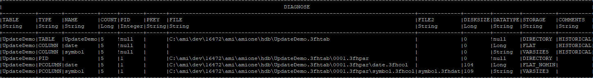
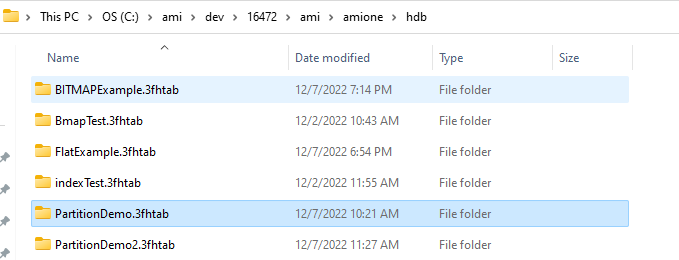

# Historical Tables

## Overview

The Center has 2 types of tables:

1. Realtime tables (which can be in-memory or on-disk)
1. Historical tables

Historical tables are columnar on-disk tables with support for partitioning. 

They are designed for storing large volumes of data at high speed with fast retrieval, all while using the same SQL syntax as realtime tables. 

There are three key concepts underpinning historical tables:

1. **Partitioning** 
: 
	- Data in historical tables is split by partition, then by column. For example, if using "date" as partition: 
		- Each date column will have a separate folder.
		- Each column will have a separate file within that folder. 
	- It is important to select an appropriate partition column to divide data evenly for partition. 

2. **Optimizing**
: 
	- When data is added to a partition, it is stored to optimize fast writes.
	- AMI can then optimize the data for fast reads. 
	- It is important to select appropriate partition columns so the data doesn't need to switch back & forth regularly.

3. **Data types**
: 
	- There are several data types that can be used to reduce file size when data is in write-mode.
	- Selection of types for each column is an important consideration.
	- See the [data type](#data-types) section for more information.

## What is Partitioning? 

Partitioning is used to organize data for performance for large datasets. Consider a traditional table without partitions: as the number or rows increases, the performance (time to insert, update, query and alter) will decline. 

Partitioning provides an elegant solution by breaking up rows into separate isolated "virtual tables" called partitions. 

Once data is broken into partitions, the row count of one partition will not affect the performance of other partitions. 

### Partitioning in AMI

In order to dictate how rows are organized into partitions, the AMI Historical Table introduces a special column type: `#!amiscript PARTITION`. 

The value in the `#!amiscript PARTITION` column(s) determines which partition a given row will be assigned to. In other words, all rows for a given partition will have the same value in the `#!amiscript PARTITION` column(s). 
 
A common data partitioning key is date. For example, a table with a column titled "date" will result in the following partitions:


When inserting row(s) whose date match(es) the existing partition key(s), the query engine will automatically navigate to the corresponding partition according to the supplied partition key and append the rows accordingly:  


Adding another day of data acts as generating another partition key entry. This will then automatically create a new partition without affecting existing days' data. For example, inserting two new rows into the table where "Date" == 20250103:


### Creating a Historical Table

Creating a historical table in AMI is similar to creating a realtime table and uses the syntax, but with the following two additions:

1. `#!amiscript USE PersistEngine="HISTORICAL"`
	- This persists the data to disk
	- By default this will be in `amione/hdb` 
2. `#!amiscript PARTITION` 
	- Use this term to specify which columns to partition the rows by

For example: 

``` amiscript
CREATE PUBLIC TABLE PartitionDemo(date LONG PARTITION, symbol STRING, qty INTEGER, comments STRING) use PersistEngine="HISTORICAL"; 
```
### Structure of AMIHDB

AMIHDB files are located in the `hdb` directory of AMI which by default is set to `amione/hdb`. To change the directory, add the following to your `local.properties` configuration file:

```
ami.hdb.root.dir=path/to/directory
```

Within the `hdb` directory, each AMIHD table has its own directory and is structured such that each partition has its own subdirectory. Each column and index has its own file(s) per partition directory.


For a table `<amiroot>/hdb/Table_Name.3fhtab/Partition_Id.dfhpar/<Files within a partition>`:

- `Table_Name`: The name of the table  

- `Partition_Id`: An auto-incrementing id (starting at 0001) 

- Files within a partition: 

	- `KEY.3fhkey` 
		- This stores the (plaintext) key for this partition  
	- `ColumnName.3fhcol` 
		- Stores data for the column in the specified [data type](#data-types)
	- `IndexName.3fhidx` 
		- Stores index data (if provided)


- Use `ami.hdb.root.dir` property to override location of hdb root  
- Use `ami.hdb.filehandles.max` property to control how many files can be open at a time, per table

This paradigm is designed for fast bulk `#!amiscript INSERT`s, fast random `#!amiscript SELECT`s and fast `#!amiscript DELETE`s of entire partitions. `#!amiscript UPDATE`s, and sparse `#!amiscript DELETE`s are possible but will operate slower.   

## Using Partitions

`#!amiscript PARTITION` is a special type of column that needs to be specified by the user in the `#!amiscript CREATE TABLE` statement. 

A partition column aggregates the rows with the same value into a single partition. For example, if the user defines a "Date" column as a `#!amiscript LONG PARTITION`, then all the rows with the same date value will go into the same partition (essentially stored in the same file path). 

One can add more `PARTITION` columns to the table as needed. For example the user can declare two `PARTITION` columns: `#!amiscript Date LONG` and `#!amiscript Region STRING`. In this case, the rows with the same "Date" and the same "Region" name will go into the same partition and get stored in the same file path.

!!! Warning

	It is strongly recommended to have at least one Partition column, otherwise all data for the entire table will be stored in a single partition.

!!! Note

	All partition columns must be declared up front, prior to the insertion of the data and is immutable. Immutability means that: 
	
	1. Once the column has been declared as a partition column, it cannot be altered afterwards.  
	1. Vice versa if the column has been initially declared as a non-partition column, you cannot convert it into the partition column afterwards.  
	1. The data in the `#!amiscript PARTITION` column **cannot** be updated/deleted. 

### Example

To illustrate how the data records are split across different partitions based on a `PARTITION` column, the following table `#!amiscript PartitionDemo(date LONG PARTITION, symbol STRING, qty INTEGER, comments STRING)` is constructed. The `PARTITION` keyword is how to declare a column as a partition. 

Rows with the same column value will be placed into the same directory if a particular column is declared to be `PARTITION`. See [Data Types](#data-types) for details of different storage types.  

``` amiscript
create public table PartitionDemo(date LONG PARTITION, symbol STRING, qty INTEGER, comments STRING) use PersistEngine="HISTORICAL";
```

If there exists a partition storage type in the table, like the example shown below where date is a `#!amiscript LONG PARTITION` column, then the rows with the same partition value will be placed into the same AMI History Partition, uniquely identified by a Partition Index(PID). For example, consider these three data records:

``` amiscript
insert into PartitionDemo values(20161120,"IBM",30,"very good products");
insert into PartitionDemo values(20161122,"MSFT",60,"Nice shopping experience");
insert into PartitionDemo values(20161122,"MSFT",60,"Very positive customer feedback");
```

Since "date" is declared as a `#!amiscript LONG PARTITION` column, the rows with the same "date" value will get clustered into one partition. 

In the case above, The first row will be placed in a partition according to its partition key: "20161120." The second and third row share the same partition key of "20161122" and will be placed into the same partition which will be different to the first. 

Running the command "Diagnose table" in AMIDB shell tool, we can see detailed information about the AMI History Table:  

``` amiscript
Diagnose table PartitionDemo;
```


See that there are two "AMI History Partitions" created, each uniquely identified by the Partition index. In the table diagnosis diagram above, there is the first "AMI History Partition", uniquely identified by PID=1, and second; uniquely identified by PID=2.

Note that all the rows are currently in append mode, meaning the rows can still be modified. Once the data is committed, the rows become read-only (AKA historical).

  
  
Once committed (let's say we have just restarted the AMI), in the comments section, the `IN_APPEND_MODE` and `NOT_OPTIMIZED` keywords will disappear.


 
Now let's insert some more rows into the table and check the table status again.  

``` amiscript
insert into PartitionDemo values("20161120","AAPL",40,"big blockbuster");
insert into PartitionDemo values("20161124","IBM",100,"extremely user-friendly");
insert into PartitionDemo values("20161124","MSFT",50,"enjoyable experience");
Diagnose table PartitionDemo;
```


Although the first row in the second insertion has exactly the same date value "20161120" as the value in the AMI History Partition 1, AMIHDB will create a separate partition to store these rows (in this case stored in AMI History Partition 3, uniquely identified by PID=3).

Now if you commit the data (either by restarting AMI or calling Optimization procedure), the data will be written to disk and become historical. AMIHDB will check if the rows you want to commit contain the same partition value in the historical partitions and collapse them into one partition accordingly.


After the second commit, since partition 3 and partition 1 have the same partition value of "20161120", we can see that they collapse into one partition, (AKA partition 3 has been merged into partition 1 and thereby increasing the COUNT by 1). Every time we commit the partition, in the "COMMENTS" field, they will appear as "HISTORICAL", meaning that all the data has been properly written to disk and become read-only.  

### Summary

To summarize:

1. Each AMI History Partition is uniquely identified by one AMI History Partition Index, also known as PID.  
1. Historical data and data to be committed will live in separate AMI History Partitions.

If the historical table contains a PARTITION column:

1. Rows with different PARTITION values will be placed into different AMI History Partitions.  
1. Before the commit, the new rows with the same PARTITION value as the historical rows will be placed in a separate AMI History Partition.  
1. Once we commit the data, AMI History Partitions with the same PARTITION value will collapse into one single AMI History Partition.  
  
If the historical table does not contain a PARTITION column:

1. All historical rows will live in one AMI History Partition and all rows to be committed will live in another AMI History Partition. In other words, there can be at most 2 AMI History Partitions.  


## Optimization

As a historical database, it is important to have a mode for fast insert-on-demand data. In AMIHDB, when a new partition is created it will have a status of *IN_APPEND_MODE/NOT_OPTIMIZED*. Then, after that table is optimized, the partition will become optimized for data compression and query times.

There are two ways to force optimize partitions:

1. By calling `#!amiscript CALL __OPTIMIZE_HISTORICAL_TABLE("Your_Historical_Table_Name")`
1. By restarting AMI Center

By default, an AMI historical table will automatically start optimization upon restart. You can change this behaviour with the `MinOptimizePct` option. MinOptimizePct should be a numeric value from 0 to 1, which describes at which optimization threshold value the optimization should start. As an example:

```amiscript
CREATE PUBLIC TABLE Your_Hitorical_Table_Name(TradeDate STRING PARTITION, Symbol String) USE PersistEngine="HISTORICAL" MinOptimizePct="0.25";
```

The table created above will not start optimization until the optimization results in at least 25% reduction of data.

You can use the `#!amiscript DIAGNOSE TABLE <Your_Hitorical_Table_Name>` command to view the optimized status of each partition:  

Before commit:


After commit:


## Data Types

The AMI historical database has different data storage types designed for data of various natures and characteristics, such as length, cardinality and partition keys. While continuously inserting, the nature of the data in the table is unpredictable so a more flexible but less efficient strategy is used for storage. Therefore, after the partition is completed, it is important to optimize the storage strategy to adapt to the existing data to improve query performance and minimize disk storage.

AMIHDB supports the same data types as the AMI realtime database:
`BYTE,SHORT,INT,LONG,FLOAT,DOUBLE,CHAR,UTC,UTCN,UUID,COMPLEX,BINARY,STRING,BIGINT,BIGDEC`

Each data type has several storage types each suited to optimize storage/retrieval depending on the cardinality and/or length of data. In AMIHDB, there are four storage types:  
`FLAT, BITMAP, VARSIZE, PARTITION`

!!! note

	Different partitions can have different storage types for the same column.

### VARSIZE

VARSIZE is the storage engine for variable-length data types:
`STRING, BINARY, BIGINT, BIGDEC`

There are three varieties of VARSIZE:
`VARSIZE3,VARSIZE4,VARSIZE5 (default is VARSIZE5)`

The number at the end indicates the number of bytes of the address pointer. For example, VARSIZE3 indicates that the pointer has an address size of 3 Bytes, meaning that it can address up to approximately 16 Megabytes of data (256\*256\*256).  
Here are is the amount of total data that a column can hold depending on the type:  

| VARSIZE() | Size |
|-----------|------|
| `VARSIZE3`  | 16MB |
| `VARSIZE4`  | 4GB  |
| `VARSIZE5`  | 1TB  |

!!! note

	If data exceeds the size of a column type, AMIHDB will **automatically** reconfigure and extend the `VARSIZE` type (though this will be an expensive operation though). AMIHDB will default to `VARSIZE5`, if not explicitly specified in the `CREATE TABLE` schema.

The way AMIHDB stores a variable-length value is to keep an address pointer to point to the offset position relative to the first string to store each individual new string. As the diagram below shows, each time we are adding a new string, we are appending it to the end of the preceding string in the string file. In the example below, each number in the string file block indicates the number of bytes each string occupies. The first address pointer points to the first string of 17 Bytes long and since there is no preceding string, the offset value the pointer stores is 0. When we try to add the second string of length 23 Bytes long, we use the second address pointer, which points to the offset distance relative to the first string, which is 17, to point to the second string, so on and so forth.


As the diagram below shows, AMIHDB needs 2 files to store the String VARSIZE column. One file (`<column_name>.3fhcol`) is the array of offset values for each address pointer and the other file (`<column_name>.3fhdat`) stores the actual string payload.


#### Example

Let's create a historical table which contains VARSIZE storage types  

``` amiscript
CREATE PUBLIC table VARSExample(AllNames String, ShortNames String VARSIZE3, MediumNames String VARSIZE4, LongNames String VARSIZE5) USE PersistEngine="HISTORICAL";
Insert into VARSExample values("All the names","abc","abcdef","abcdefghijklmnopqrstuvwxyz");
```

If we diagnose the table, we can see detailed information for each of the string columns.  

``` amiscript
Diagnose table VARSExample;
```


We can see that the AMIHDB by default assigns the string variable to `VARSIZE5`. So if you are not declaring a column as `ColumnName String VARSIZE`, AMIHDB will assume the worst case scenario by allocating the maximum memory to the string column (AKA `VARSIZE5`).  

### FLAT

FLAT is the storage type for data with a known fixed length. Data types that use FLAT are:
`BYTE,SHORT,INT,LONG,FLOAT,DOUBLE,CHAR,UTC,UTCN,UUID,COMPLEX,BOOLEAN`

There are three varieties of FLAT:
`FLAT, FLAT_NONULL, FLAT_NOMIN (default is FLAT)`

-	FLAT stores all values and null but uses an extra byte.
-   FLAT_NONULL can store all values except null.
-   FLAT_NOMIN can store all values except min value and null.
-   Note, that if an entry is inserted that does not fit in the column type (for example, inserting null into a FLAT_NONULL column) AMIHDB will automatically reconfigure and extend the type so the entry will fit. AMIHDB will default to FLAT if not explicitly specified in the CREATE TABLE schema.

Here is an example of storage cost per row for INTEGER, which is 4 bytes:

-	`INTEGER FLAT`: 5 bytes in total, which consists of 4 bytes of data + 1 byte for NULL flag.
-   `INTEGER FLAT_NONULL`: 4 bytes in total (since there is no NULL flag to store)
-   `INTEGER FLAT_NOMIN`: 4 bytes of data in total (the minimum value of that data type is reserved as a placeholder for null hence its not available)

#### Example

First let's create a historical table with the different FLAT types and insert some rows into it. If we diagnose the table, we can see that once again, the AMIHDB is assuming the worst case scenario for the Integer column(FLAT) if you don't declare the storage type for this column.  

``` amiscript
CREATE PUBLIC table FlatExample(id int, id2 int FLAT,id3 int FLAT_NOMIN, id4 int FLAT_NONULL) USE PersistEngine="HISTORICAL";
Insert into FlatExample values(1,23,NULL,-2147483648);
Diagnose table FlatExample;
```


### BITMAP

A BITMAP is ideal if the cardinality of the data is relatively low (aka the same values are recurring a lot in the table). The **ONLY** datatype that supports BITMAP is ***STRING**''.  

There are 2 options for bitmap:  
`BITMAP1, BITMAP2 (BITMAP2 is the default)`

The number indicates how many bytes are used to identify unique values. For example, a BITMAP1 stores 255 unique values (and NULL) while a BITMAP2 stores 65,535 unique values (and NULL). If the row has more than 65,535 unique entries, then a VARSIZE storage must be used instead.  

#### Example

First let's create a historical table with a String BITMAP column and insert some rows into it.  

``` amiscript
CREATE PUBLIC table BITMAPExample(symbol1 String BITMAP1,symbol2 String BITMAP2) USE PersistEngine="HISTORICAL";
Insert into BITMAPExample values("IBM","AAPL"),("MSFT","TSLA"),("MSFT","FaceBook");
Diagnose table BITMAPExample;
```


### Choosing Data Types

There are some general rules of thumb for choosing your optimal storage type for each column based on the nature of your data. The detailed guidelines for a string variable and an integer variable are given as below. These are explained further in the section "Optimization of existing data".AMIHDB will dynamically adjust the storage type for you to make sure your existing data follows the best practices and assigns the optimal storage type to each of the columns.  

#### Strings

Below is a general comparison of different VARSIZE options when declaring a string column.

|         Type        |                                            Storage Method                                           | Address pointer size |                         Max File Size                         |                    Advantage                    |                                Disadvantage                                |                                Usage Scenario                               |
|---------------------|-----------------------------------------------------------------------------------------------------|----------------------|---------------------------------------------------------------|-------------------------------------------------|----------------------------------------------------------------------------|-----------------------------------------------------------------------------|
| String VARSIZE3     | Each address pointer has 3 bytes of storage, resulting in max file size of 16777216 Bytes           | 3 Bytes = 24 Bits    | Maximum file size = 2^24 Bytes = 16777216 Bytes = 16MB        | Takes up least amount of storage                | Cannot store strings over 16MB total size                                  | To store strings not too long in total size                                 |
| String VARSIZE4     | Each address pointer has 4 bytes of storage, resulting in max file size of 4096 MegaBytes           | 4 Bytes = 32 Bits    | Maximum file size = 2^32 Bytes = 4294967296 Bytes = 4096MB    | Takes up medium amount of storage               | Cannot store strings over 4096MB total size. There is some memory overhead | To store strings whose total size does not exceed 4096MB                    |
| String VARSIZE5 (default)     | Each address pointer has 5 bytes of storage, resulting in max file size of 1024 GigaBytes           | 5 Bytes = 40 Bits    | Maximum file size = 2^40 Bytes = 1099511600000 Bytes = 1024GB | Can store a huge amount of strings up to 1024GB | Takes up most amount of storage and therefore a lot of memory overhead     | To store strings that can be astronomically long in size(up tp 1TB in size) |
| String BITMAP1      | If the number of unique strings is between 1-255                                                    | NOT relevant         | NOT relevant                                                  | Very memory efficient and fastest retrieval     | NAN                                                                        | For example we only have 10 unique strings out of a large number of rows    |
| String BITMAP2      | If the number of unique strings is between 255-65,535                                               | NOT relevant         | NOT relevant                                                  | Very memory efficient and fastest retrieval     | NAN                                                                        | For example we have 10,000 unique values in the column                      |

#### Integers

The similar principles can also be applied to BYTE, SHORT, LONG and BOOLEAN columns that have fixed size.  

| Type                 | Storage                                                                         | Advantage                                          | Disadvantage                                                                                    |
|----------------------|---------------------------------------------------------------------------------|----------------------------------------------------|-------------------------------------------------------------------------------------------------|
| Integer FLAT (default)         | Can store NULL+MINVALUE                                                         | Big memory space. Can store both NULL and MINVALUE | Can be memory inefficient if the actual data set does not actually need this much memory space. |
| Integer FLAT_NOMIN   | Can store NULL                                                                  | Can store NULL flag                                | Cannot store MINVALUE                                                                           |
| Integer FLAT_NONULL  | Can store MINVALUE                                                              | Can store MINVALUE                                 | Cannot store NULL flag                                                                          |

## Clauses

As well as INSERT and SELECT clauses, there are several other clauses supported for AMI Historical Tables not found in many other historical databases.

### ALTER

Oftentimes, we might want to change the schema of our historical database if the nature of the data changes from a particular point onwards. For example, we may want to add a new column to the original table schema because the new data has an extra column.

For historical tables, each partition is a self-contained set of data. This means that altering a schema does not impact the way existing partitions are saved on disk. Instead, AMIHDB will map the "old" partitions using the "old" schema to the current schema definition at query time. This applies for `ADD`, `DROP` and `MODIFY` of columns. This section will go through an example to demonstrate what happens when a column is added.


!!! note

	PARTITION columns cannot be altered after a table is created

-   Let's create a historical table called `AddColDemo`, with `(date LONG, symbol STRING)` as the original schema.  

	``` amiscript
	CREATE PUBLIC TABLE AddColDemo(date LONG, symbol STRING) USE PersistEngine="HISTORICAL";
	INSERT INTO AddColDemo values(20221209,"IBM"),(20221208,"MSFT");
	CALL __OPTIMIZE_HISTORICAL_TABLE("AddColDemo");
	```

-   Let's say a few days later, we have a new column "qty int" from our new data. So we need to add this column to our existing table schema.  

	``` amiscript
	ALTER TABLE AddColDemo ADD qty INT;
	DIAGNOSE TABLE AddColDemo;
	```

-   When we diagnose the table, we will see that it does not create a new file directory for "qty int" immediately after we alter the schema  

	

	 
  

-   Let's now try inserting some rows into the altered table. We can see after we alter the schema, AMIHDB does not create a new file directory in the original partition. Instead, it will create a brand new partition and create a new file directory for `qty INT` there. When AMIHDB goes to the original partition and does not find the file that stores "qty int", it will just assign the **NULL flag** to these entries.  

	``` amiscript
	INSERT INTO AddColDemo VALUES(20221212,"IBM",40),(20221228,"MSFT",50);
	DIAGNOSE TABLE AddColDemo;
	```

	
  
	
  
	

### DELETE/UPDATE

There are times when we want to modify specific data records using the "where" clause, either with `#!amiscript DELETE` or `#!amiscript UPDATE`. In this section, we are going to demonstrate how to update and delete rows using `#!amiscript UPDATE ... WHERE` and `#!amiscript DELETE ... WHERE` clauses.  

#### UPDATE Clause

First let's create a table `#!amiscript UpdateDemo(date LONG, symbol STRING)` and insert some data records into it. We optimize the table and perhaps a few days later we decide to change the symbol name from *TSLA* to *TSLANew*.

``` amiscript
CREATE PUBLIC TABLE UpdateDemo(date LONG, symbol STRING) USE PersistEngine="HISTORICAL";
INSERT INTO UpdateDemo VALUES(20221209,"AAPL"),(20221208,"TSLA"),(20221212,"TSLA"),(20221215,"MSFT"),(20221228,"TSLA");
CALL __OPTIMIZE_HISTORICAL_TABLE("UpdateDemo");
DIAGNOSE TABLE UpdateDemo;
```



``` amiscript
UPDATE UpdateDemo SET symbol = symbol+"test" WHERE symbol=="TSLA";
SELECT * from UpdateDemo;
DIAGNOSE TABLE UpdateDemo;
```


  
We can see that after performing an update on the rows where `#!amiscript sym=="TSLA"`, this process automatically un-optimizes the AMI History partition columns from which the values are being modified. The AMI History partition columns that don't participate in the `#!amiscript UPDATE ... WHERE` clause will remain intact (AKA the optimization status will not change).

!!! note

	Values in a `PARTITION` column CANNOT be updated

If we create the same table except that we declare the `#!amiscript symbol` to be a `#!amiscript String PARTITION` column, we cannot update the values in the `#!amiscript symbol` column. If we do so, it will throw us an exception:


#### DELETE Clause

Let's stick with the same example above and create a table `#!amiscript DeleteDemo(date LONG, symbol STRING)` and insert some data records into it.  

``` amiscript
CREATE PUBLIC TABLE DeleteDemo(date LONG, symbol STRING) USE PersistEngine="HISTORICAL";
INSERT INTO DeleteDemo VALUES(20221209,"AAPL"),(20221208,"TSLA"),(20221212,"TSLA"),(20221215,"MSFT"),(20221228,"TSLA");
CALL __OPTIMIZE_HISTORICAL_TABLE("DeleteDemo");
DIAGNOSE TABLE DeleteDemo;
```

If later, we decide to delete all the row records where symbol is equal to "TSLA". We can use the `#!amiscript DELETE FROM ... WHERE` clause to achieve this.

``` amiscript
DELETE FROM DeleteDemo WHERE symbol=="TSLA";
SELECT * FROM DeleteDemo;
DIAGNOSE TABLE DeleteDemo;
```


We can see that because the modification of the data takes place at a row level, which means all AMI History Partition Columns are participating in the `#!amiscript DELETE FROM ... WHERE` clause. As a result, all AMI History Partition Columns in that partition will get affected and get un-optimized.

#### Summary

To summarize, updating or deleting certain row records in the historical table causes the table to un-optimize. The AMI History Partition Columns that participate in the updating/deleting clause will get un-optimized. Below is an illustrative diagram that shows what happens with the optimization status before and after the clause is applied.

Let's say we have a table `#!amiscript transaction(date LONG PARTITION, symbol STRING, qty INTEGER, comments STRING)`,and this table is fully optimized. We use the green tick to mark each individual AMI History Partition Column as Optimized and red cross as un-optimized.


Now, let's say we want to update the symbol and set the symbol to "Deprecated" for partition 1 and partition 5. We can do this:  

``` amiscript
UPDATE transaction SET symbol = "Deprecated" WHERE date==2019 OR date==2023;
```

Since only the ***symbol*** AMI History Partition Column from Partition 1 and Partition 5 are participating in the clause, they will get un-optimized, marked as red cross.


Next, we will delete some rows from the table:  

``` amiscript
DELETE FROM transaction WHERE date==2021;
```


Since the `#!amiscript DELETE FROM` clause performs a row-wise deletion, all the AMI History partition columns in Partition 3 are participating in the clause. They will be marked as un-optimized.

### CREATE INDEX

We can create indexes on the historical table to enhance query performance. For AMIHDB, the only type of index supported is `#!amiscript SORT`, which creates a b-tree to sort the data. The example below shows how to create an index on a specific column.

First let's create a historical table indexTest and create an index on the "date" column. We can see as we insert more data into the table, the index is kept **in memory** but the columns are stored **on disk**.  

``` amiscript
CREATE PUBLIC TABLE indexTest(name string, date long, qty int) USE PersistEngine="HISTORICAL";
INSERT INTO indexTest VALUES("AAPL",20221023,20),("AAPL",20221011,30),("TSLA",20221030,40),("MSFT",20220930,24),("MSFT",20220925,120);
CREATE INDEX i on indexTest(date);
DIAGNOSE TABLE indexTest;
```


  
After we do the optimization and commit the partition, the AMIHDB then builds the index and writes it to disk.  

``` amiscript
CALL __OPTIMIZE_HISTORICAL_TABLE("indexTest");
DIAGNOSE TABLE indexTest;
```


## Advanced

This section will go more in-depth into how AMI historical database optimizes itself for more efficient data storage, how the table schema can be altered, how the index can be created as well as how to perform update/delete operations.

### Optimization Examples

New partitions are, by default, optimized for flexible insertion of data. After all data has been added for a partition, the partition can be "Optimized" which will reorganize the partition data to improve read performance and minimize disk storage. Additionally, the table's schema can provide "hints" on how to optimize columns ahead of time, avoiding the cost of optimization later.

The AMIHDB dynamically adjusts the storage type according to how much space your existing data needs for each of your data columns. One could specify the schema of the table at the very beginning, for example we have a column manually specified as `quantity Integer FLAT_NONULL`. Later on while we are inserting data, if we suddenly need to insert a NULL flag to the table, although the schema says `FLAT_NONULL`, the AMIHDB is smart enough to alter the schema to `FLAT_NOMIN` so that we can store the NULL flag in the table. There are other optimization examples that will elaborate how optimization works in various scenarios.  

#### FLAT Optimization Example

First let's create a historical table with an integer id column.  

``` amiscript
CREATE PUBLIC TABLE test(id int) USE PersistEngine="HISTORICAL";
Insert into test values(1),(2),(3);
```

-   By default, because we did not specify a storage type before we optimized the table, AMIHDB will assume the worst case scenario for data storage and assign `FLAT` to the integer column. If we diagnose the table, we will see that their id storage type is `FLAT`.

	

-   Next, let's optimize the table and `#!amiscript DIAGNOSE TABLE` again to see how the storage type for the id column will change. We optimize the historical table by calling the `#!amiscript __OPTIMIZE_HISTORICAL_TABLE(TableName)` stored procedure. We see the storage type for the id column has changed to `FLAT_NOMIN` since AMIHDB scans and confirms that a minimum value to store does not exist.  

	``` amiscript
	CALL __OPTIMIZE_HISTORICAL_TABLE("test");
	DIAGNOSE TABLE test;
	```

	
  

-   Then let's truncate the table and try inserting the minimum value. Let's see how the storage type changes accordingly. Since the minimum value -2147483648 exists, which is the most negative value Java can store, the storage type will change to `FLAT_NONULL` to adapt to the data size in the table.

	``` amiscript
	TRUNCATE TABLE test;
	INSERT INTO test VALUES(1),(-2147483648);
	CALL __OPTIMIZE_HISTORICAL_TABLE("test");
	DIAGNOSE TABLE test;
	```

	
  

-   Finally, let's truncate the table again and try inserting the `NULL` value. Since a `NULL` value exists, the storage type is optimized to `FLAT_NOMIN`.  

	``` amiscript
	TRUNCATE TABLE test;
	INSERT INTO test VALUES(1),(NULL);
	CALL __OPTIMIZE_HISTORICAL_TABLE("test");
	DIAGNOSE TABLE test;
	```

	
  

#### VARSIZE Optimization Example

-   First let's create a testing table with a string column. Before optimization, once again the AMIHDB will assume the greatest storage type requirement by assigning `VARSIZE5` to the string variable  

	``` amiscript
	CREATE PUBLIC TABLE varTest(name STRING) USE PersistEngine="HISTORICAL";
	INSERT INTO varTest VALUES("test1"),("test2"),("test3");
	DIAGNOSE TABLE varTest;
	```

	
  

-   Now, let's optimize the table. We can see that the storage type for the string variable name has been changed to `VARSIZE3` because the database realizes that `VARSIZE3` is sufficient to store all the strings test1, test2, test3  

	``` amiscript
	CALL __OPTIMIZE_HISTORICAL_TABLE("varTest");
	DIAGNOSE TABLE varTest;
	```

	
  

-   Next, let's insert some more strings into the table and optimize it to see how the storage

type will change. As we insert 1 million rows into the table and do the optimization, we can see that the storage type has been changed from `VARSIZE3` to `VARSIZE4`.  

	``` amiscript
	for (int i =0;i<1000000;i++) {INSERT INTO varTest VALUES("test"+rand());}
	DIAGNOSE TABLE varTest;
	```

	
  

#### BITMAP Optimization Example

-   Let's create a table with a string column and insert 10,000 rows into the table. Before we do the optimization, we can see the storage type for the string is `VARSIZE5`

	``` amiscript
	CREATE PUBLIC TABLE BmapTest(name string) USE PersistEngine="HISTORICAL";
	For (int i =0;i<10000;i++) {INSERT INTO BmapTest VALUES("test"+rand(10));}
	DIAGNOSE TABLE BmapTest;
	```

	
  

-   After the optimization, the AMIHDB realizes that there are only 10 unique values in the table for the string and adjusts the storage type to `BITMAP1` accordingly.

	``` amiscript
	CALL __OPTIMIZE_HISTORICAL_TABLE("BmapTest");
	DIAGNOSE TABLE BmapTest;
	```

	

#### PARTITION Optimization Example

-   Now let's create a historical table with one column as a string partition and another column as an integer. We can see that the rows with the same value are placed into the same partition. All rows with the string value equal to `test1` are placed into one partition and all rows with the string value equal to `test2` are placed into the other partition.  

	``` amiscript
	CREATE PUBLIC TABLE PTest(name string partition, qty int) USE PersistEngine="HISTORICAL";
	INSERT INTO PTest VALUES("test1",20),("test1",30),("test1",40),("test2",20),("test2",120);
	DIAGNOSE TABLE PTest;
	```
 
	
  

-   If we do the optimization on the table, all the rows that we inserted will get optimized and be in **read-only** mode. This is confirmed by the lack of `IN_APPEND_MODE` and `NOT_OPTIMIZED` in the comments section. This means that all data records are properly written to disk and marked as `HISTORICAL`. The optimization automatically happens after the session has been closed, which results in all data writing to disk.  

	``` amiscript
	CALL __OPTIMIZE_HISTORICAL_TABLE("PTest");
	DIAGNOSE TABLE PTest;
	```

	 
  

-   If the user wants to insert more data into the historical database afterwards in a new session (here calling optimization procedure is equivalent to starting a new session). We can see from diagnosing the table that, instead of appending the new data records into the historical partition columns, we create brand new partitions for them.  

	``` amiscript
	INSERT INTO PTest VALUES("test1",60),("test2",35),("test2",25),("test2",10);
	DIAGNOSE TABLE PTest;
	```

	 
  

-   Now if we call the optimization procedure against the historical table, the AMIHDB will look to see if there are partitions with the same partition keys that can be merged with the historical partitions and will do so if there are. Here we can see the new partition with the partition key of `test1` and `test2` get merged with the historical partitions with the same keys.  

	``` amiscript
	CALL __OPTIMIZE_HISTORICAL_TABLE("PTest");
	DIAGNOSE TABLE PTest;
	```

	 

### File Directory

-   Back to the very first example where we explained how data gets partitioned across different columns, we used the table `#!amiscript PartitionDemo(date LONG PARTITION, symbol STRING, qty INTEGER, comments STRING)`.  

	In this section, from a file directory perspective, we will take a closer look at how data in each column is stored across different files.  
	
	``` amiscript
	CREATE PUBLIC TABLE PartitionDemo(date LONG PARTITION, symbol STRING, qty INTEGER, comments STRING) USE PersistEngine="HISTORICAL";
	```

  
-	In the table ***PartitionDemo***,we have these rows:

	 

	And we have 3 Partitions, each uniquely identified by a PID.

	 
  

-   If we go to `/ami/amione/hdb` directory, we will see all the folders, named as `Your_Historical_Table_Name.3fhtab`, where all the rows from the table are stored.  

	 
  

-   If we go to the folder that corresponds to our `PartitionDemo` historical table, we will see all the partition folders that store the rows for each partition  

	 
  

-   Next if we go to one of the partition folders, `0001.3fhpar`, we can see different binary data files that store the actual values from each column in the corresponding partition.  

	 

### Archiving Realtime Tables Into HDB

HDB can be used for data archival. The example below demonstrates reading data from a realtime table and archiving them into HDB in batches.

Assuming we have the following realtime and the historical table: 

	``` amiscript
	create public table RealtimeOrders(tradeDate string, symbol string, price double, quantity int);
	create public table HistoricalOrders(tradeDate string PARTITION, symbol string, price double, quantity int) use PersistEngine="HISTORICAL";
	```
1. Create a procedure with the batch size as the argument that reads from the realtime table and apply batch inserts to the historical table: 

	``` amiscript
	CREATE PROCEDURE ARCHIVE_ORDERS OFTYPE AMISCRIPT USE script="
    int rowCount=select count(*) from RealtimeOrders;
    for(int n=0;n<rowCount;n+=batchSize){
        INSERT INTO HistoricalOrders SELECT * FROM RealtimeOrders LIMIT n, batchSize;
    };truncate table RealtimeOrders;" arguments="int batchSize";
	```
	 
2.   Create a timer that calls the procedure regularly to do the archival job 

	``` amiscript
	create timer archival_timer oftype amiscript on "10000" use script="call ARCHIVE_ORDERS(10);"
	``` 
## Restrictions

See the table below for a list of features found in Realtime Tables and their restrictions for historical tables

<table>
<thead>
<tr class="header">
<th><p>Features</p></th>
<th><p>Supported on HDB?</p></th>
<th><p>Example</p></th>
</tr>
</thead>
<tbody>
<tr class="odd">
<td><p>Triggers</p></td>
<td><p>Not supported**</p></td>
<td><p>**Can be referenced inside triggers on Realtime tables.</p></td>
</tr>
<tr class="even">
<td><p>Timers</p></td>
<td><p>Not Supported</p></td>
<td></td>
</tr>
<tr class="odd">
<td><p>Procedures</p></td>
<td><p>Supported</p></td>
<td><pre class="amiscript"><code> CREATE PROCEDURE ARCHIVE_ORDERS OFTYPE AMISCRIPT USE script=&quot;{
    int rowCount=select count(*) from RealtimeOrders;
    for(int n=0;n&lt;rowCount;n+=batchSize){
        INSERT INTO HistoricalOrders SELECT * FROM ORDERS LIMIT n, batchSize;
    }
};&quot; arguments=&quot;int batchSize&quot;; </code></pre></td>
</tr>
<tr class="even">
<td><p>Indexes</p></td>
<td><p>ONLY <strong>SORT</strong> is supported over an individual column</p></td>
<td><pre class="amiscript"><code>  CREATE INDEX OrderIdLookupIndex ON HistoricalOrders (OrderId SORT);</code></pre></td>
</tr>
<tr class="odd">
<td><p>Table joins</p></td>
<td><p>Not Supported, instead use temp table</p></td>
<td><pre class="amiscript"><code> CREATE TABLE temp_a AS SELECT * FROM HDB_a;
CREATE TABLE temp_b AS SELECT * FROM HDB_b;
SELECT * FROM temp_a,temp_b WHERE temp_a.id==temp_b.id;</code></pre></td>
</tr>
<tr class="even">
<td><p>Nested Queries</p></td>
<td><p>Not Supported</p></td>
<td><pre class="amiscript"><code> SELECT * FROM hdb1 WHERE date IN (SELECT date FROM hdb2); //NOT supported, will throw UnsupportedOperationException</code></pre></td>
</tr>
</tbody>
</table>

Additionally, PARTITION columns cannot be altered. A PARTITION column is the core of how the rows are partitioned across different partition file directories and therefore must be declared upfront upon creating the schema of the historical table. Once a PARTITION column has been declared, there is no way to alter it by any means. Similarly, a non-PARTITION column cannot be altered to a PARTITION column afterwards because mutating PARTITION columns requires us to change the whole structure of the file system and therefore is very expensive. Thus, the users are strongly advised to plan wisely on how they intend to partition their database.