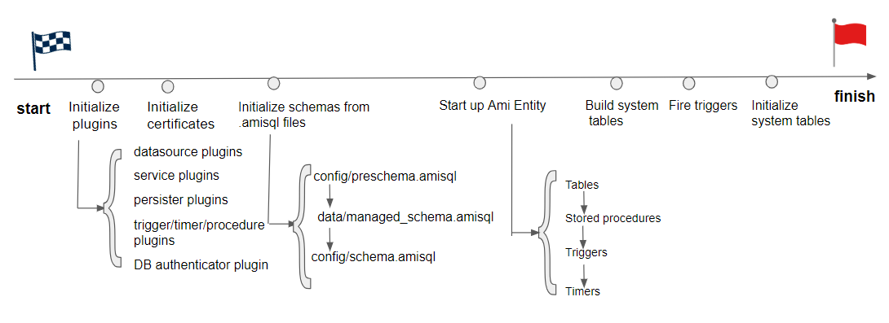

# What is the Center?

## Overview

The Center is AMI's realtime database. It is designed with the following principles in mind:

-   **High Speed** - 100k+ inserts per second, with 1 billion+ rows
-   **Fully SQL Compliant** - Using SQL syntax including triggers, timers, procedures, etc.
-   **Persistence** - Tables can be configured for both in-memory and on-disk storage
-   **Realtime Streaming** - Chaining streams of updates into aggregations and other projections
-   **Source Synchronizing** - Synchronizing in-memory tables based on external datasources
-   **Extendable** - Create custom triggers, procedures, etc.

The Center can be accessed in two ways:

1. Opening the Web in a browser and navigating to **Dashboard** > **AMIDB Shell Tool**

1. Creating a Telnet connection to the `ami.db.console.port` port (default `3290`)

The Center can then be interacted with using a MySQL-like syntax. This section of the documentation will explain the different objects that can be used in the Center. For an overview of the syntax, see the [AMIScript: SQL](../reference/ami_sql.md) docs.

## Advanced

### Startup Process

The following diagram describes the process when AMI Center starts up in chronological order.

Note 1: During Initialize schemas from `.amisql` files , this is when your custom methods/tables/triggers/timers are being initialized from your `ami.db.schema.config.files` and `ami.db.schema.managed.file`

Note 2: During Start up AMI Entity, the child diagram describes the order in which different AMI Entities start up. Because timers get initialized after the triggers, the timer's onStartupScript will not cause triggers to fire. If you want onStartupScript to be picked up by the trigger at startup, you should use stored procedure's onStartupScript instead.

