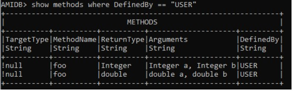
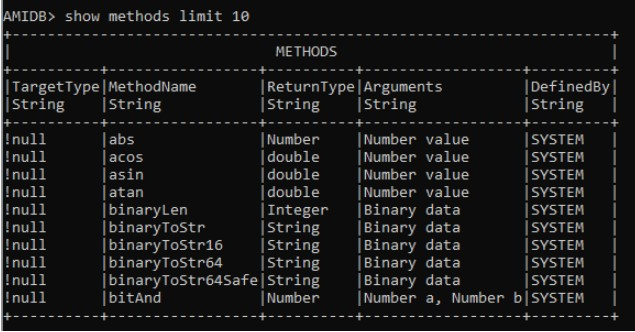

# Methods

AMIDB methods can be used anywhere within the console, and on top of other functionalities like triggers, procedures and timers. They are a useful way to reuse code and make projects easier to maintain.

## CREATE METHOD

To create a custom method, the syntax is as follows:

```amiscript
CREATE METHOD return_type method_name (data_type arg1, data_type arg2) {
	//code goes here;
	return result;
};
```

For example, to create a simple method (called foo) to return the sum of two numbers (of Integer type):

```amiscript
CREATE METHOD int foo (int a, int b) { return a + b; };
```

This method can now be called/used inside of timers/procedures/triggers. E.g. for a procedure

```amiscript
CREATE PROCEDURE myProcedure OFTYPE AMISCRIPT USE arguments="int a, int b" script="
int i = foo(a,b);
INSERT INTO table_name VALUES (i);";
```


### Method Overloading

Like in Java, method overloading is supported by AMI, which allows for methods with the same name but different parameters to be created.

For example, if we currently have `#!amiscript int foo(int a, int b)`, which returns the sum of two Integers, we can overload the method to return the sum of two doubles as well, with:

```amiscript
CREATE METHOD double foo (double a, double b) { return a + b; };
```

AMI will auto-resolve the method to use based on the parameters used in the method call.



## DROP METHOD

To drop our newly created method foo:

```amiscript
DROP METHOD foo(int a, int b);
```


## SHOW METHODS

To view all available methods, use:

```amiscript
show methods;
```



!!! Note 

	Custom methods declared in AMI Web **cannot** be called within AMIDB. They are separate. 