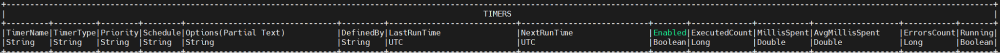

# Procedures

Procedures are custom pieces of AMIScript for consistently manipulating tables. They are a useful way to reuse code and make projects easier to maintain.

## CREATE PROCEDURE

This command allows you to create stored procedures that can be called via amiscript to execute a sequence of statements and return a value. Arguments can be supplied when calling the stored procedure (see [CALL PROCEDURE](#call)):

```amiscript
CREATE PROCEDURE [IF NOT EXISTS] procedure_name OFTYPE AMISCRIPT USE
arguments="type name, type name ... "
script="AmiScript to run when proc is called"
[logging="set the logging level when the procedure gets called"]
[onStartupScript="AmiScript to run When the procedure is created"]
```

- `procedure_name` - name of the procedure to be created, each procedure's name must be unique within the database

Logging options:

1. `off` (default): no logging.
1. `on`: logs the time when the timer is called and when it completes.
1. `verbose`: equivalent of using show_plan=ON in AMIDB. Logs the time that a timer starts and finishes and also each query step.

#### Example

In this example lets assume we have a table MyTable(id int,price double). We will make a simple procedure that inserts a row into that table and deletes any other rows with an equal or lesser price. (See [CALL PROCEDURE](#call) clause for example of calling this procedure)

```
CREATE PROCEDURE MyProcedure OFTYPE AMISCRIPT USE
arguments="int _id,double _price"
script="DELETE FROM MyTable WHERE price<_price;
INSERT INTO MyTable(id,price) VALUES(_id,_price)"
```

## CALL

This command allows you to execute stored procedures, typically declared using the `#!amiscript CREATE PROCEDURE` clause.  When calling procedures you must supply the appropriate arguments expected for the declared procedure.

```amiscript
CALL proc_name ([arg1 [,arg2 ...]])
```

#### Example

In this example we will call the procedure declared in the `#!amiscript CREATE PROCEDURE` clause.

```amiscript
CALL MyProcedure(17,45.2);
```

## DROP PROCEDURE

```amiscript
DROP PROCEDURE [IF EXISTS] proc_name[,proc_name...]
```

#### Example

This example will drop the procedure MyProcedure from the database 

```amiscript
DROP PROCEDURE MyProcedure
```


## String Templating

String templating can be complex with procedures, this section will go through an example of how to use string templating. First let us create a simple table and add 4 values to it:

```amiscript
CREATE PUBLIC TABLE A (ID String, Price Double);

INSERT INTO A VALUES ("I001",100),("I002",200),("I003",300),("I004",400);
```

Running this select query:

```amiscript
SELECT * FROM A;
```

Gives us the following table:

```
| ID String | Price Double |
|-----------|--------------|
| I001      | 100          |
| I002      | 200          |
| I003      | 300          |
| I004      | 400          |
```

Now let's create a string and assign A to it:

```amiscript
String T = "A";
```

Try running the following script:

```amiscript
SELECT * FROM ${T};
```


This produces an error as **string_template=off**.

Let's set **string_template=on**. Note we find string_template under the **setlocal** command:


To set this to 'on' run the following:

```amiscript
setlocal string_template=on;
```

Try running the following script again:

```amiscript
SELECT * FROM ${T};
```


This will now output table A.

Let's roll back and set **string_template=off**. This time we will create the following PROCEDURE:

```amiscript
CREATE PROCEDURE testProc OFTYPE AMISCRIPT USE arguments="String T" script="Int n = 2; Table t = SELECT * FROM ${T} LIMIT n; SELECT * FROM t;";
```

and then call the procedure as such:

```amiscript
CALL testProc(T);
```


## List of System Procedures

This section will cover most of the procedures included in AMI by default, however the following procedures are covered in the [Center Replication](../architecture/center_replication.md#replication-procedures) page:

1. `#!amiscript __ADD_CENTER`

2. `#!amiscript __REMOVE_CENTER`

3. `#!amiscript __ADD_REPLICATION`

4. `#!amiscript __REMOVE_REPLICATION`

### __ADD_DATASOURCE

``` amiscript
__ADD_DATASOURCE(String name, String adapter_type, String url, String username, String password, String options, String relayId, String permittedOverrides)
```

- `options`: Refers to values under the Advanced section. Must be a comma-delimited list e.g. `DISABLE_BIGDEC=true,URL_OVERRIDE=jdbc:mysql://serverUrl:1234/databaseName`
- `relayId`: Refers to "Relay to Run on" under the Configuration section.
- `permittedOverrides`: Refers to the checkboxes under the Security section. Must be a comma delimited list. The available values are URL, USERNAME, PASSWORD, OPTIONS, RELAY e.g. to tick the URL and USERNAME checkboxes use `URL,USERNAME`.
- `url`: Refers to the URL that the datasource is hosted. 

    - To connect to another AMI datasource, you will need to use the configured port corresponding to that instance's `ami.db.jdbc.port` property (by default this is 3280). 
    - E.g: `#!amiscript CALL __ADD_DATASOURCE("ami_datasource", "AMIDB", "some.host:1780", "demo", "demo123", null,null,null);`


#### Supported Adapter Types

| Name             | Alias (to be used in the procedure call) |
|------------------|------------------------------------------|
| AMI datasource   | `__AMI`                                  |
| Sybase IQ JDBC   | `SYBASE_IQ`                              |
| Shell Command    | `SHELL`                                  |
| AMIDB            | `AMIDB`                                  |
| MySQL JDBC       | `MYSQL`                                  |
| KDB              | `KDB`                                    |
| SSH Command      | `SSH`                                    |
| Redis            | `Redis`                                  |
| Fred             | `FRED`                                   |
| SQLServer JDBC   | `SQLSERVER`                              |
| Oracle JDBC      | `ORACLE`                                 |
| Sybase JDBC      | `SYBASE`                                 |
| RestAPI          | `RESTAPI`                                |
| Postgres JDBC    | `POSTGRES`                               |
| Flat File Reader | `FLAT_FILE`                              |
| Generic JDBC     | `GENERIC_JDBC`                           |
| IMB DB2          | `IMBDB2`                                 |
| SQLITE JDBC      | `SQLITE`                                 |
| OneTick          | `ONETICK`                                |
| Quandl           | `QUANDL`                                 |

### __REMOVE_DATASOURCE

```amiscript
__REMOVE_DATASOURCE(String DSName)
```

This procedure removes the specified datasource. Use `show datasources` to see a list of available datasources.

### __RESET_TIMER_STATS

```amiscript
__RESET_TIMER_STATS(String timerName, Boolean executedStats, Boolean errorStats)
```

This procedure clears NextRunTime. Optionally clears ExecutedCount, MillisSpent, and AvgMillisSpent if ExecutedStats is set to true, and optionally clears ErrorCounts if ErrorStats is set to true. Use `show timers` to see a list of available timers.


### __RESET_TRIGGER_STATS

```amiscript
__RESET_TRIGGER_STATS(String triggerName)
```

This procedure will reset ExecutedCount, MillisSpent, AvgMillisSpent, ErrorsCount, ReturnedFalseCount for a particular trigger. Use `show triggers` to see information for all triggers.



### __SCHEDULE_TIMER

```amiscript
__SCHEDULE_TIMER(String timerName, Long delayMillis)
```

This procedure schedules the timer to run after the specified number of milliseconds passes. For instance, call `__SCHEDULE_TIMER("mytimer", 5000)` means mytimer will start running after 5000 milliseconds, or 5 seconds.

### __SHOW_TIMER_ERROR

```amiscript
__SHOW_TIMER_ERROR(String timerName)
```

This procedure shows you the last error the specified timer encountered in a table format.

### __SHOW_TRIGGER_ERROR

```amiscript
__SHOW_TRIGGER_ERROR(String triggerName)
```

This procedure shows you the last error the specified trigger encountered in a table format.

