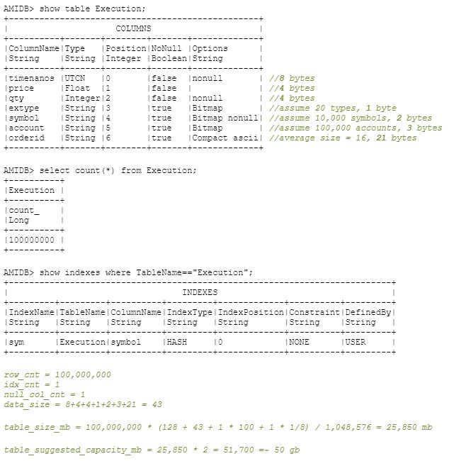
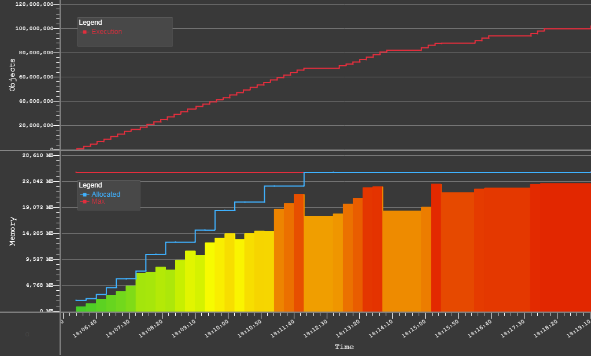
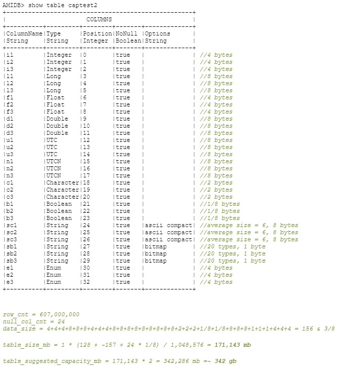
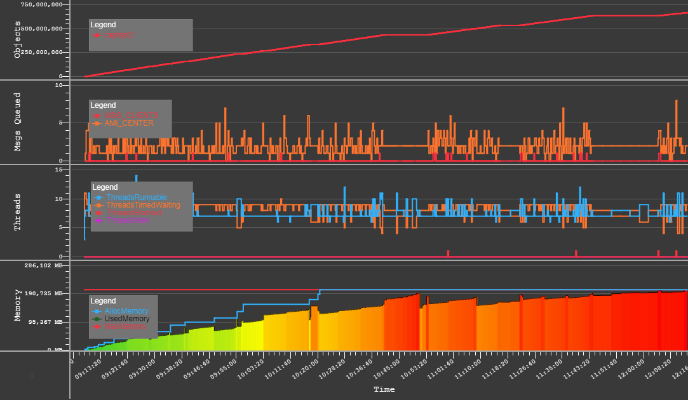

# Realtime Tables

Realtime Tables are fully SQL compliant tables that can be stored in-memory or on-disk. They are optimized for fast speed while being fully SQL compliant.

!!! note

	In all code below `[STATEMENT]` means the statement is optional, `|` means the value can be one or another.

## CREATE PUBLIC TABLE

### Overview

This command is used to create a new, empty (no rows) public table with a specified set of columns (names, types, no-null restriction). 

```amiscript
CREATE PUBLIC TABLE [IF NOT EXISTS] tblname (col1 column_type [, col2 column_type ...])
[USE  [PersistEngine="[FAST|TEXT|custom]"]]
[PersistOptions="custom_options"]
[Broadcast="[true|false]"]
[RefreshPeriodMs="duration_millis"]
[OnUndefColumn="REJECT|IGNORE|ADD"]
[InitialCapacity="number_of_rows_min_1"]
```

- `tblname`: String name of the table to create

- `colN`: String name of Nth column to create

Items contained in square brackets indicate optional supplied parameters. The following `#!amiscript USE` options can be used:

- `#!amiscript PersistEngine`
- `#!amiscript Broadcast`
- `#!amiscript RefreshPeriodMs`
- `#!amiscript OnUndefColumn`
- `#!amiscript InitialCapacity`

#### Example

```amiscript
CREATE PUBLIC TABLE countries (country String NoNull, language String, GDP Double) USE PersistEngine="TEXT" Broadcast="false" InitialCapacity="100"
```
### Use Options 

#### Persist Engine

The persist engine is responsible for persisting data into the center so once the session is closed, the data is written to disk and can be accessed again on restart. By default, this is saved to `amione/persist`.

The persist engine takes the following inputs (`#!amiscript USE PersistEngine="..."`):

-   `#!amiscript "FAST"`: The table will be persisted to disk using a fast, binary protocol. Additional options include:
	-   `#!amiscript "persist_dir" = "/path/to/directory/for/storing/file"` - this is the directory where the `.fast binary` file will be saved/loaded from.

	-   `#!amiscript "persist_compact_percent" = ".95"` - a number between 0 and 1 which says how much of the file should contain updates & deletes before it's compacted. Because the FAST table uses a journaling strategy, updates and deletes will get appended and can create large files. Setting a value of .95 would indicate that if the file becomes 95% updates and deletes then the file should be rebuilt.

-   `#!amiscript "TEXT"`: The table will be persisted to disk using a slow, but easy to read text file.
	-   `#!amiscript "persist_dir" = "/path/to/directory/for/storing/file"` - this is the directory where the `.txt` text file will be saved/loaded from.

-   `#!amiscript "HISTORICAL"`: The table will be persisted as a [historical table](./historical_tables.md) using a disk-based historical engine. Optimized for storing large volumes of data and querying on demand. 

-   `#!amiscript "Custom"`: A custom user-designed persist engine will be used (see [Custom Java Plugins](../custom_java_plugins/center_objects.md)). 
	- Note that `#!amiscript PersistOptions="..."` is available to pass options to the custom plugin. 

#### Broadcast

-   `#!amiscript Broadcast="true"`: Front end visualizations & external listeners will be notified as data is updated in the table.

#### Refresh Period 

-   `#!amiscript RefreshPeriodMs="*duration_millis*"`: The period that the table will conflate and broadcast changes to front end at. For example: 

	- if a cells' value changes 10 times in one second and the refresh period is 500ms, then only ~2 updates will be broadcast out (the other 8 will be conflated).

#### Undefined Column 

-   `#!amiscript OnUndefColumn`: Behaviour when a realtime Object record contains an undefined column: 

    -   `#!amiscript "REJECT"`: The record will be rejected.  This is the default.
    -   `#!amiscript "IGNORE"`: The  record will be inserted, but the undefined values will be ignored.
    -   `#!amiscript "ADD"`:  The table will automatically have the column added.

#### Initial Capacity 

-   `#!amiscript InitialCapacity="number_of_rows"`: The number of rows to allocate memory for when the table is created. Must be at least 1. 

	- The default initial capacity is 1,000 rows.

If another public table already exists with the `#!amiscript tblname`, the create table will fail. At least one column must be specified, and each column must have a unique name. Columns with the nonull constraint cannot hold a null value. Updates and inserts in violation of the rule will fail.


## CREATE PUBLIC TABLE AS

### Overview

This command is used to create a new table which has the same schema definition as the result set of a `#!amiscript SELECT` clause.  If another table already exists with the `#!amiscript tblname`, the create table will fail.

All rows from the `#!amiscript SELECT`'s result set will be inserted into the table. For valid `#!amiscript USE` options, see [`#!amiscript CREATE PUBLIC TABLE`](#create-public-table) Options.

```amiscript
CREATE PUBLIC TABLE [IF NOT EXISTS] tblname [(col1 column_type [, col2 column_type ...])] [USE ... ] AS select_clause

CREATE PUBLIC TABLE [IF NOT EXISTS] tblname [(col1 column_type [, col2 column_type ...])] [USE ... ] AS analyze_clause

CREATE PUBLIC TABLE [IF NOT EXISTS] tblname [(col1 column_type [, col2 column_type ...])] [USE ... ] AS prepare_clause

CREATE PUBLIC TABLE [IF NOT EXISTS] tblname [USE ... ]  [, tblname [USE ... ] ...] AS execute_clause
```

- `tblname`: String name of the table to create

### Example

```amiscript
CREATE PUBLIC TABLE names USE PersistEngine="FAST" AS SELECT first_name, last_name FROM employees
```

## ALTER PUBLIC TABLE

### Overview

This command alters the schema (column names and types) of an existing table.  You can add columns (`#!amiscript ADD`), rename columns (`#!amiscript RENAME ... TO`), delete columns (`#!amiscript DROP`), and change the type of columns (`#!amiscript MODIFY`).

```amiscript
ALTER PUBLIC TABLE tblname alter_public_col_expr [, alter_public_col_expr ...]
```

- `tblname`: String name of the table to alter

- `alter_public_col_expr`: An expression with the following syntax:

	```amiscript
	MODIFY colname AS newname column_type
	|ADD newname column_type [BEFORE beforecol]
	|DROP colname
	|RENAME colname TO newname
	```
	
	- `colname`: String name of the column to alter
	
	- `newname`: String name of the column to create
	
	- `beforecol`: String name of the existing column to add the new column before

Note, when multiple alterations are supplied, they are evaluated left to right. When changing types, a best effort cast will be applied. When adding columns, the new cells will default to null. The column will be added to the end (right-most) of the table.

#### Example

```amiscript
ALTER PUBLIC TABLE AccountHoldings ADD UserId long, RENAME AccountId TO Account_Id, DROP UserInfo

ALTER PUBLIC TABLE AccountHoldings MODIFY UserId AS UserId INT

ALTER PUBLIC TABLE AccountHoldings RENAME UserId TO UserIds, ADD UserId STRING AS
```

## RENAME PUBLIC TABLE

#### Overview

This command renames an existing table. If another table already exists with the `#!amiscript newname`, the existing table will be implicitly dropped and replaced with the renamed table.

```amiscript
RENAME PUBLIC TABLE tblname TO newname
```

- `tblname`: String name of the table to rename

- `newname`: String name of the new name for the table

#### Example

```amiscript
RENAME PUBLIC TABLE AccountHoldings TO Accounts
```

## DROP PUBLIC TABLE

#### Overview

This command drops an existing table, along with its schema and all rows. You can specify multiple tables, separated by commas.

```amiscript
DROP PUBLIC TABLE [IF EXISTS] tblname [, tblname ...]
```

#### Example

```amiscript
DROP PUBLIC TABLE Accounts
```

## Column Types

The following types are supported for columns in public tables.

Note on Nulls: If the NONULL attribute is included, the column does not support null values, and inserts/updates of null will fail.

Note on NOBROADCAST: Columns with broadcast disabled will not be included in updates sent to front end visualizations & external listeners. This is a more granular version of the Broadcast option at the table level.

- `#!amiscript BYTE [NONULL] [NOBROADCAST]` 8-bit signed number (see [java.lang.Byte](https://docs.oracle.com/javase/8/docs/api/java/lang/Byte.html) for details on range). If NONULL is omitted then an extra 1-bit per row is used (precisely, 64-bits per each 64 rows).

- `#!amiscript SHORT [NONULL] [NOBROADCAST]` 16-bit signed number (see [java.lang.Short](https://docs.oracle.com/javase/8/docs/api/java/lang/Short.html) for details on range). If NONULL is omitted then an extra 1-bit per row is used (precisely, 64-bits per each 64 rows).

- `#!amiscript INT [NONULL] [NOBROADCAST]` 32-bit signed number (see [java.lang.Integer](https://docs.oracle.com/javase/8/docs/api/java/lang/Integer.html) for details on range). If NONULL is omitted then an extra 1-bit per row is used (precisely, 64-bits per each 64 rows).

- `#!amiscript LONG [NONULL] [NOBROADCAST]` 64-bit signed number (see [java.lang.Long](https://docs.oracle.com/javase/8/docs/api/java/lang/Long.html) for details on range). If NONULL is omitted then an extra 1-bit per row is used (precisely, 64-bits per each 64 rows).

- `#!amiscript DOUBLE [NONULL] [NOBROADCAST]` 64-bit signed float (see [java.lang.Double](https://docs.oracle.com/javase/8/docs/api/java/lang/Double.html) for details on range). If NONULL is omitted then an extra 1-bit per row is used (precisely, 64-bits per each 64 rows).

- `#!amiscript FLOAT [NONULL] [NOBROADCAST]` 32-bit signed float (see [java.lang.Float](https://docs.oracle.com/javase/8/docs/api/java/lang/Float.html) for details on range). If NONULL is omitted then an extra 1-bit per row is used (precisely, 64-bits per each 64 rows).

- `#!amiscript UTC [NONULL] [NOBROADCAST]` 64-bit unix epoc timestamp in milliseconds. If NONULL is omitted then an extra 1-bit per row is used (precisely, 64-bits per each 64 rows).

- `#!amiscript UTCN [NONULL] [NOBROADCAST]` 64-bit unix epoc timestamp in nanoseconds. If NONULL is omitted then an extra 1-bit per row is used (precisely, 64-bits per each 64 rows).

- `#!amiscript CHAR [NONULL] [NOBROADCAST]` 16-bit unicode character (see [java.lang.Character](https://docs.oracle.com/javase/8/docs/api/java/lang/Character.html) for details on range). If NONULL is omitted then an extra 1-bit per row is used (precisely, 64-bits per each 64 rows).

- `#!amiscript BOOLEAN [NONULL] [NOBROADCAST]` 1-bit signed Boolean (see [java.lang.Boolean](https://docs.oracle.com/javase/8/docs/api/java/lang/Boolean.html) for details on range).

- `#!amiscript STRING [NONULL] [NOBROADCAST]` variable length string. Each cell is backed by a java.lang.String instance

- `#!amiscript STRING COMPACT [NONULL] [NOBROADCAST]` 4-byte index into a continuous char array for all values in the column. Values are limited to 32,766 characters in length. Max total chars per column (include 2 byte EOL) is 2^31.

- `#!amiscript STRING COMPACT ASCII [NONULL] [NOBROADCAST]` 4-byte index into a continuous byte array for all values in the column. Extended ascii not supported. Values are limited to 126 chars. Max total chars per column (include 1 byte EOL) is 2^31

- `#!amiscript ENUM [NONULL] [NOBROADCAST]` 32-bit index into map of global Strings (map is shared across all public tables)

- `#!amiscript STRING BITMAP [NONULL] [NOBROADCAST]` 8-bit, 16-bit, or 32-bit address into an underlying map of strings (local to the column). The addressing depends on the number of unique values encountered in the column: 0 - 255 unique entries is 8-bit, 256 - 65,535 unique entries is 16-bit, otherwise 32-bit addressing is used. Note that as new unique values are added, the addressing will automatically escalate as needed. Note that entries from the underlying map are never removed, even as cells are updated deleted.

- `#!amiscript BINARY [NONULL] [NOBROADCAST]`  variable length byte array, useful for storing images and other media.

- `#!amiscript STRING ONDISK [NONULL] [CACHE=nnnMB][NOBROADCAST]`  Same as a String, but only a 64-bit pointer is kept in memory, which resolves to a Block on disk, meaning that strings of any length will take up the same 64-bits in memory. The optional CACHE directive specifies the maximum RAM to use for caching the most recently used values, supported units are KB,MB,GB and TB (if no unit is specified, then in bytes),  example to cache 2 gigabytes: *STRING ONDISK* *CACHE=2GB.* Cache-misses will result in reading from disk which can slow down query performance.

- `#!amiscript BINARY ONDISK [NONULL] [CACHE=nnnMB][NOBROADCAST]`  Same as a Binary, but only a 64-bit pointer is kept in memory, which resolves to a Block on disk, meaning that binaries of any length will take up the same 64-bits in memory. The optional CACHE directive specifies the maximum RAM to use for caching the most recently used values, supported units are KB,MB,GB and TB (if no unit is specified, then in bytes), example to cache \~100 megs: *BINARY ONDISK* *CACHE=100000000.* Cache-misses will result in reading from disk which can slow down query performance.

- `#!amiscript BIGDECIMAL [NONULL] [NOBROADCAST]` Unbounded(variable length) signed decimal (see [java.math.BigDecimal](https://docs.oracle.com/javase/8/docs/api/java/math/BigDecimal.html) for details on range).

- `#!amiscript BIGINTEGER [NONULL] [NOBROADCAST]` Unbounded(variable length) signed number (see [java.lang.BigInteger](https://docs.oracle.com/javase/8/docs/api/java/math/BigInteger.html)) for details on range).

- `#!amiscript COMPLEX [NONULL] [NOBROADCAST]` A 128-bit Complex number, composed of 64-bit signed real and 64-bit signed imaginary parts.

- `#!amiscript UUID [NONULL] [NOBROADCAST]` a 128-bit Universally Unique Identifier.

#### Choosing the Best Column Type for String

Simple rules: For data that never repeats and is queried often `STRING` is the best. For columns with data that does not repeat but is not queried often `STRING COMPACT` (or `STRING COMPACT ASCII` for non-extended ascii data) offer a lower memory footprint. For repeating data, generally `STRING BITMAP` is best. Below is a table outlining the advantages/disadvantages of each.

| Type                                                                                              | Storage Method                                                                                                                                                                                                                                | Advantage                                                                   | Disadvantage                                                                                                                                                                                  | Usage Scenario                                                                                                                                                                                                               |
|---------------------------------------------------------------------------------------------------|-----------------------------------------------------------------------------------------------------------------------------------------------------------------------------------------------------------------------------------------------|-----------------------------------------------------------------------------|-----------------------------------------------------------------------------------------------------------------------------------------------------------------------------------------------|------------------------------------------------------------------------------------------------------------------------------------------------------------------------------------------------------------------------------|
| `STRING`               | Each cell is stored as a java.lang.String object.                                                                                                                                                                                             | Fastest Retrieval                                                           | High Memory Usage. Internally, each entry is stored as a java object.                                                                                                                         | For columns that have very high cardinality and accessed often or participate in indexes. Another use would be when the total data in the column (adding up the lengths of all cells in the column) exceeds 2 billion chars. |
| `STRING COMPACT`       | Each cell contains a 32-bit address into a continuous char array.15-bits are used to store string length. Each cell has a unique address.                                                                                                     | Low Memory/Object usage. A single large continuous array                    | Slower Retrieval, as cell values are used a temporary string object may be constructed. Frequent deletes or updates that change the cell content lengths may result in array-data compaction. | For columns that have high cardinality and whose cells are either beyond 126 chars or have extended ascii. But is not accessed frequently (ex, as part of a where clause). For example *comment* columns                     |
| `STRING COMPACT ASCII` | Each cell contains a 32-bit address into a continuous byte array. 7-bits are used to store string length. Each cell has a unique address                                                                                                      | 1/2 the memory of a STRING COMPACT.                                         | Slower Retrieval, as cell values are used a temporary string object may be constructed. Frequent deletes or updates that change the cell content lengths may result in array-data compaction. | Same as STRING COMPACT, except limited to shorter strings that are basic asci (not extended asci)                                                                                                                            |
| `STRING BITMAP`        | Each cell contains a 8,16 or 32-bit address into a map of unique java.lang.String Objects local to the column.  Multiple cells containing the same value will share an address.                                                               | Most Compact.                                                               | Only used for repeating data (lower cardinality). Retrieval is slightly slower than a simple STRING column, but much faster than COMPACT type columns.                                        | Any scenario where columns have lower cardinality and fewer than approximately 32,000 unique values.                                                                                                                         |
| `ENUM`                 | Each cell contains a 32-bit address into a map of unique java.lang.String Objects, global to the entire database.  Multiple cells containing the same value will share an address, even if those cells are on different columns of type ENUM. | Compact.  Note: this is generally for legacy, BITMAP is generally preferred | Must be used only on columns with low cardinality. Note this is mostly for legacy support and STRING BITMAP is preferred.                                                                     | When several columns all use a similar set of values (ex: BUY,SELL, SHORT) then all columns can be set to use ENUM.                                                                                                          |
| `STRING ONDISK`        | Each cell contains a 64-bit address into a random-access file. And only the most recent values read/wrote are cached in memory                                                                                                                | Fixed memory size regardless of string length.                              | Slower read times for un-cached Strings                                                                                                                                                       | For large text documents or those that do not need to be searched on                                                                                                                                                         |

## Reserved Columns

If any of the following columns are declared they will be automatically populated by the AMI engine. Columns A, D, T, and W will be populated even if they are not declared. Note that when creating the table, the column type MUST match the type specified below, otherwise table creation will fail. Note all times are since unix epoc in milliseconds.

| Name |  Type  |     Label     |     Mutable    |                                                                                                                           Description                                                                                                                          |
|----|------|-------------|--------------|--------------------------------------------------------------------------------------------------------------------------------------------------------------------------------------------------------------------------------------------------------------|
| `#!amiscript A`    | `#!amiscript String` | AMI-Center    |                | Stores the name of the AMI Center.                                                                                                                                                                                                                             |
| `#!amiscript C`    | `#!amiscript Long`   | Created Time  |                | Time that the record was inserted into the table                                                                                                                                                                                                               |
| `#!amiscript D`    | `#!amiscript Long`   | AMI-ID        |                | An auto-generated incrementing unique id for the row. Unique across all tables.                                                                                                                                                                                |
| `#!amiscript E`    | `#!amiscript Long`   | Expires Time  | INSERT, UPDATE | Time when the row should be automatically deleted.   * Negative Number - Offset from now. Ex:  -4000 remove four seconds from now   * Zero or Null - don't automatically delete   * Positive number - time since epoc to. Ex: 2510712000000L remove 07/24/2049 |
| `#!amiscript I`*   | `#!amiscript Object` | UniqueID      | INSERT         | The Id(I) value supplied from the real-time streaming on the Object (O) message                                                                                                                                                                                |
| `#!amiscript M`    | `#!amiscript Long`   | Modified Time |                | Most recent time that the record was updated (initially the time the row was inserted)                                                                                                                                                                         |
| `#!amiscript P`    | `#!amiscript String` | Application   | INSERT         | The Login Id (I) value supplied from the realtime messaging api on the Login (L) message                                                                                                                                                                       |
| `#!amiscript V`    | `#!amiscript Int`    | Revision      |                | The number of times the record has been updated (initially zero)                                                                                                                                                                                               |
| `#!amiscript T`    | `#!amiscript String` | Table Name    |                | The name of the table, all cells will contain the same value (this is for backwards compatibility)                                                                                                                                                             |
| `#!amiscript W`    | `#!amiscript Long`   | Current Time  |                | Stores the current Unix timestamp.                                                                                                                                                                                                                             |

* `I` (and `P`) column behavior can be thought of as a convenient way of supporting the "upsert" concept:

-   If the `I` column is defined (but not the `P` column) AMI treats `I` as a (pseudo) primary key. An attempt to insert a row with the same non-null `I` value as an existing row will result in an update to the existing row instead of an insert. This is different from a standard PRIMARY key in that two rows can exist in a table with the same key if the key is null. Please see `#!amiscript CREATE INDEX ... USE CONSTRAINT="PRIMARY"` [here](./indexes.md) for standard primary keys.

If both the `P` and `I` columns are defined, AMI treats the `P + I` combination as a (pseudo) primary key. An attempt to insert a row with the same non-null `P` and `I` values as an existing row will result in an update to the existing row instead of an insert. This is different from a standard PRIMARY key in that two rows can exist in a table with the same key if the key contains a null value. Please see `#!amiscript CREATE INDEX ... USE CONSTRAINT="PRIMARY"` [here](./indexes.md) for standard primary keys.

## Capacity Planning

### Overview

Below is the formula to use for calculating the amount of memory to expect public tables to consume, based on the types of data being stored. For total capacity planning of the AMI in memory database, one should run this on each table and aggregate the results.

```
table_size_mb = row_cnt * (128 + data_size + idx_cnt * 100 + null_col_cnt * 1/8 ) / 1,048,576

table_suggested_capacity_mb= total_size_mb * 2
```

Where each variable is:


|  Variable  |  Definition  |
|-----------------------------|--------------------------------------------------------------|
| `table_size_mb`               | the total number meg you can expect the table to require     |
| `table_suggested_capacity_mb` | 3Forge Recommendation for hardware capacity planning         |
| `row_cnt`                     | number of rows                                               |
| `idx_cnt`                     | number of indexes on the table, composite indexes are larger |
| `null_col_cnt`                | number of non-string columns that allow null                 |
| `data_size`                   | sum(column_type_sizes)  See column types below               |

Where data size is defined below:

| Column Type                              | Data Size (bytes)          |
|------------------------------------------|----------------------------|
| `UTC`,`UTCN`,`Double`,`Long`                     | 8                          |
| `Int`,`Float`                                | 4                          |
| `Char`,`Short`                              | 2                          |
| `Byte`                                     | 1                          |
| `Boolean`                                  | 1/8                        |
| `Enum` (legacy)                            | 4                          |
| `String BITMAP1`    | 1                          |
| `String BITMAP2` | 2                          |
| `String BITMAP3`   | 3                          |
| `String COMPACT`                           | String Size * 2 + 6 bytes  |
| `String COMPACT ASCII`                     | String Size * 1 + 5 bytes  |
| `String`                                   | String Size * 2 + 64 bytes |
| `Binary`                                   | Length in Bytes + 56 bytes |
| `String ONDISK`                            | 8                          |
| `Binary ONDISK`                            | 8                          |
| `BIGDECIMAL`                               | 68+size of number in bytes |
| `BIGINTEGER`                               | 64+size of number in bytes |
| `COMPLEX`                                  | 68                         |
| `UUID`                                     | 64                         |

### Examples

#### Example 1: Small Table

```
100,000,000 Executions = ~25 GB RAM USED = Suggested ~50GB of RAM be reserved.
```

Below, we walk through the math given the below table, assuming 10 million executions and 1 index on symbol:



Below is the actual experienced capacity for 100,000,000 executions being sent into an AMI instance:



#### Example 2: Large Table

Test of 20,000,000,000 (20 billion) cells using 33 columns x 607,000,000 rows = **~171 GB RAM** Used = Suggested **~ 342 GB RAM** be reserved.





## List of System Tables

#### __COLUMN

| Variables                                                                                   | Description                                       |
|---------------------------------------------------------------------------------------------|---------------------------------------------------|
| `TableName`     | Name of all the tables                            |
| `ColumnName`    | Name of columns within each table                 |
| `ColumnFormula` | Formula associated with column                    |
| `DataType`      | Data type of column (String, Enum, Integer, etc.) |
| `NoNull`        | If column is Nullable                             |
| `Position`      | Position of column within the associated table    |
| `DefinedBy`     | Which user defined (USER, AMI, SYSTEM)            |

#### __COMMAND

| Variables                                                                                | Description                                                                                                                                                                    |
|------------------------------------------------------------------------------------------|--------------------------------------------------------------------------------------------------------------------------------------------------------------------------------|
| `CI `        | Connection ID of the connection that this command was registered using                                                                                                         |
| `RI `        | Relay ID that this command was registered using                                                                                                                                |
| `ID `        | Purpose of the command (Cancel order command), not guaranteed unique                                                                                                                                  |
| `AR `        | Input arguments for form fields. ({"form":{"inputs":\[{"label":"Symbol","required":true, "var":"symbol","type":"text"}\]}})                                                    |
| `PR `        | Priority for display in the menu. Commands with a higher priority are listed in the context menu above those with lower priority (0 = highest priority, 1 = 2nd highest, etc.) |
| `NA `        | Name of the command that appears on the GUI after the user right-clicks on a row (order.cancel)                                                                                |
| `FL `        | Command filter. An expression that will determine which rows the command will be available at a panel level (panel.types=="Orders" or panel.types=="Executions")               |
| `WH `        | Conditional "where" clause. It determines which rows the command will be available at a row/node level (qty\>0 && user.canbust=="true")                                        |
| `HP `        | Explanation/outcome of the command. (This command is used to cancel order(s))                                                                                                  |
| `SM `        | Constrains the number of rows that can be selected when running the command (1-10)                                                                                             |
| `AmiScript ` | AmiScript will reflect here, if any                                                                                                                                            |
| `N`          | Enabled where (expression). (E="Quantity==300"; the command will only be enabled where the Quantity = 300)                                                                     |
| `L`          | Command level. Permissions Level of 0 means remove command, and any other number is used for entitlements as part of the AMI entitlement engine                                |
| `F`          | Fields; returns the values of specified fields (price, status, level)                                                                                                          |
| `I`          | Relay name with command name. (e.g. 29002751:CancelCmd)                                                                                                                        |
| `P`          | Login name used to access the realtime database ("demo")                                                                                                                       |
| `V`          | Number of times a row is being updated                                                                                                                                         |
| `M`          | Command modified time in miliseconds                                                                                                                                           |
| `C`          | Command created time in miliseconds                                                                                                                                            |

#### __CONNECTION

| Variables                                                                         | Description                                                                                                                                                                                                            |
|-----------------------------------------------------------------------------------|------------------------------------------------------------------------------------------------------------------------------------------------------------------------------------------------------------------------|
| `AI ` | Login ID associated with this connection, not guaranteed unique                                                                                                                                                                               |
| `EC`  | Connection/login attempt error count                                                                                                                                                                                   |
| `CI`  | Connection ID of logged in user                                                                                                                                                                                        |
| `MA`  | ID remote machine of logged in user                                                                                                                                                                                    |
| `MC`  | Message count from current connection                                                                                                                                                                                  |
| `O`   | Used to supply options about the current session’s connection. The following options are available and can be used in conjunction by comma delimiting                                                                  |
|                                                                                   | `QUIET` - AMI will not send any information back to the client (statuses, etc). Note execute commands (E) will still be send to the client |
|                                                                                   | `LOG` - Force AMI relay to log data to / from this session (default file = AmiSession.log)                                                 |
|                                                                                   | `UNIX` - Force AMI to not send \r on messages                                                                                              |
|                                                                                   | `WINDOWS` - Force AMI to send \r on messages                                                                                               |
|                                                                                   | `TTY` - teletype terminal (for UNIX) is for interactively working with AMI backend                                                         |
| `PL`  | A fully qualified java class name to an AMI relay plugin. The class must implement the com.vortex.agent.AmiPlugin interface                                                                                            |
| `RI`  | The Relay which was used to run on (relay_0)                                                                                                                                                                           |
| `RP`  | Remote host port used                                                                                                                                                                                                  |
| `RH`  | Remote host name, localhost, IP address                                                                                                                                                                                |
| `CT`  | Time of connection made                                                                                                                                                                                                |

#### __DATASOURCE

| Variables                                                                                        | Description                                                                                                                     |
|--------------------------------------------------------------------------------------------------|---------------------------------------------------------------------------------------------------------------------------------|
| `NM`                 | Datasource name, self-specified                                                                                                 |
| `AD`                 | Adapter type (RestAPI, MySQL)                                                                                                   |
| `UR`                 | Datasource URL (protocol//\[hosts\]\[/database\]\[?properties\], <https://example.com/api/data>)                                |
| `US`                 | Username, credentials to access datasource URL                                                                                  |
| `PW`                 | Unencrypted password, credentials to access datasource URL (Deprecated)                                                         |
| `Password`           | Encrypted password, credentials to access datasource URL                                                                        |
| `OP`                 | Additional options                                                                                                              |
|                                                                                                  | For servers requiring keyboard interactive authentication: authMode=keyboardInteractive                                         |
|                                                                                                  | To use a public/private key for authentication: publicKeyFile=/path/to/key/file (Note this is often /your_home_dir/.ssh/id_rsa) |
|                                                                                                  | To request a dumb pty connection: useDumbPty=true                                                                               |
| `RelayId`            | Relay to run on option in dropdown (relay_0)                                                                                    |
| `PermittedOverrides` | Combination of URL, USERNAME, PASSWORD, OPTIONS, RELAY                                                                          |

#### __DATASOURCE_TYPE

| Variables                                                                                 | Description                                                                                                                                                                                  |
|-------------------------------------------------------------------------------------------|----------------------------------------------------------------------------------------------------------------------------------------------------------------------------------------------|
| `Description` | Description of associated datasource (Shell Command, AMIDB, MySQL JDBC)                                                                                                                      |
| `I`           | Identifier of datasource type (SHELL, AMIDB, MYSQL)                                                                                                                                          |
| `ClassType`   | Class of plugin associated with datasource (com.f1.ami.center.ds.AmiShellDatasourcePlugin, com.f1.ami.center.ds.AmiAmiDbDatasourcePlugin, com.f1.ami.plugins.mysql.AmiMysqlDatasourcePlugin) |
| `Icon`        | Icon (svg file) associated with the datasource                                                                                                                                               |
| `Properties`  | Map of properties associated with the datasource                                                                                                                                             |

#### __GUI

| Variables                                                                          | Description                                                |
|------------------------------------------------------------------------------------|------------------------------------------------------------|
| `Type` | Types of GUI objects (TABLE, PROCEDURE, TRIGGER)           |
| `Name` | Name of objects (table name, procedure name, trigger name) |
| `X`    | X coordinate position in the data modeler                  |
| `Y`    | Y coordinate position in the data modeler                  |

#### __INDEX

| Variables                                                                                   | Description                                           |
|---------------------------------------------------------------------------------------------|-------------------------------------------------------|
| `IndexName`     | Name of index (primary key, relay id)                 |
| `TableName`     | Table associated with the index                       |
| `ColumnName`    | Column of table associated with the index             |
| `IndexType`     | Type of indexing (SORT, HASH)                         |
| `IndexPosition` | Position of column in table associated with the index |
| `Constraint`    | Constraints of index (PRIMARY, NONE)                  |
| `DefinedBy`     | Which user defined (USER, AMI, SYSTEM)                |

#### __PLUGIN

| Variables                                                                                | Description                                                                                                                                                       |
|------------------------------------------------------------------------------------------|-------------------------------------------------------------------------------------------------------------------------------------------------------------------|
| `PluginName` | Name of plugin (MYSQL, ORACLE, SSH, MSEXCEL)                                                                                                                      |
| `PluginType` | Plugin Type (DATASOURCE, PROCEDURE, TIMER, TRIGGER)                                                                                                               |
| `ClassType`  | Class of plugin (com.f1.ami.center.ds.AmiShellDatasourcePlugin, com.f1.ami.center.ds.AmiAmiDbDatasourcePlugin, com.f1.ami.plugins.mysql.AmiMysqlDatasourcePlugin) |
| `Arguments`  | Arguments/Parameters used in conjunction with plugin                                                                                                              |

#### __PROCEDURE

| Variables                                                                                   | Description                                                                          |
|---------------------------------------------------------------------------------------------|--------------------------------------------------------------------------------------|
| `ProcedureName` | Name of procedure (\_\_ADD_DATASOURCE, \_\_REMOVE_DATASOURCE, \_\_RESET_TIMER_STATS) |
| `ProcedureType` | Type of procedure (AMISCRIPT, \_\_SYSTEM)                                            |
| `ReturnType`    | Return type after running procedure (Object, String, Integer)                        |
| `Arguments`     | Arguments/Parameters used in conjunction with procedure                              |
| `Options`       | Additional options defined (scripts, arguments)                                      |
| `DefinedBy`     | Which user defined (USER, AMI, SYSTEM)                                               |

#### __PROPERTY

| Variables                                                                                   | Description       |
|---------------------------------------------------------------------------------------------|-------------------|
| `PropertyName`  | Name of property  |
| `PropertyValue` | Value of property |

#### __RELAY

| Variables                                                                                 | Description                                             |
|-------------------------------------------------------------------------------------------|---------------------------------------------------------|
| `MachineUid`  | Unique Machine ID of the host (UID_DESKTOP-RVO4948)     |
| `ProcessUid`  | System Generated Process Id (F1-Inw6XE0p8YaqdbREAp5MxN) |
| `StartTime`   | Starting time in UTC (2022-01-20 03:03:06.101 EST)      |
| `ServerPort`  | Connection port (3289)                                  |
| `RelayId`     | Relay ID (relay_0)                                      |
| `Hostname`    | Host name (DESKTOP-RVO4948)                             |
| `ConnectTime` | Connection time in UTC (2022-01-20 03:03:28.299 EST)    |

#### __RESOURCE

| Variables                                                                                 | Description                               |
|-------------------------------------------------------------------------------------------|-------------------------------------------|
| `I`           | Name of the image (3ForgeLogo.png)        |
| `ModifiedOn`  | Modified time in milliseconds             |
| `Checksum`    | Unique checksum value used for validation |
| `FileSize`    | File size in bytes                        |
| `ImageWidth`  | Image width in pixels                     |
| `ImageHeight` | Image height in pixels                    |

#### __TABLE

| Variables                                                                                      | Description                                                                                                                                                                                                                                                                                                                                                                                                                                                                                        |
|------------------------------------------------------------------------------------------------|----------------------------------------------------------------------------------------------------------------------------------------------------------------------------------------------------------------------------------------------------------------------------------------------------------------------------------------------------------------------------------------------------------------------------------------------------------------------------------------------------|
| `TableName`        | Name of table                                                                                                                                                                                                                                                                                                                                                                                                                                                                                      |
| `Broadcast`        | "true": Front end visualizations & external listeners will be notified as data is updated in the table                                                                                                                                                                                                                                                                                                                                                                                             |
| `RefreshPeriodMs`  | "duration_millis": The period that the table will conflate and broadcast changes to front end at. For example, if a cells' value changes 10 times in one second and the refresh period is 500ms, then only \~2 updates will be broadcast out (the other 8 will be conflated)                                                                                                                                                                                                                       |
| `SourceTableNames` | Name of the tables to listen for updates from (cause the trigger to execute)                                                                                                                                                                                                                                                                                                                                                                                                                       |
| `PersistEngine`    | `FAST`: The table will be persisted to disk using a fast, binary protocol. Additional options include:                                                                                                                                                                                                                                                                                                                 |
|                                                                                                | `"persist_compact_percent" = ".95"` - This is the directory where the fast binary file will be saved/loaded from                                                                                                                                                                                                                                                                                                       |
|                                                                                                | `"persist_dir" = "/path/to/directory/for/storing/file"` - A number between 0 and 1 which says how much of the file should contain updates & deletes before it's compacted. Because the FAST table uses a journaling strategy, updates and deletes will get appended and can create large files. Setting a value of .95 would indicate that if the file becomes 95% updates and deletes then the file should be rebuilt |
|                                                                                                | `TEXT`: The table will be persisted to disk using a slow, but easy to read text file                                                                                                                                                                                                                                                                                                                                   |
|                                                                                                | `"persist_dir" = "/path/to/directory/for/storing/file"` - This is the directory where the .txt text file will be saved/loaded from                                                                                                                                                                                                                                                                                     |
|                                                                                                | `PersistEngine="Custom"` - A custom persist engine will be used (see [Custom Java Plugins](../custom_java_plugins/center_objects.md)). Note, that PersistOptions="..." is available to pass options to the custom plugin                                                                                                                                                                                                                                     |
| `OnUndefColumn`    | Behaviour to take when a realtime Object record contains an undefined column                                                                                                                                                                                                                                                                                                                                                                                                                       |
|                                                                                                | `"REJECT"` - The record will be rejected. This is the default                                                                                                                                                                                                                                                                                                                                                          |
|                                                                                                | `"IGNORE"` - The record will be inserted, but the undefined values will be ignored                                                                                                                                                                                                                                                                                                                                     |
|                                                                                                | `"ADD"` - The table will automatically have the column added                                                                                                                                                                                                                                                                                                                                                           |
| `DefinedBy`        | The ID of the owner                                                                                                                                                                                                                                                                                                                                                                                                                                                                                |

#### __TIMER

| Variables                                                                                 | Description                                                                                                         |
|-------------------------------------------------------------------------------------------|---------------------------------------------------------------------------------------------------------------------|
| `TimerName`   | Name of the Timer created                                                                                           |
| `TimerType`   | Either AMISCRIPT type or custom timer type created using timer plugin defined in the imdb schema                    |
| `Priority`    | A number that is set when two or more timers have the same exact scheduled time. The lowest value is executed first |
| `Scheule`     | A positive number defining the period in milliseconds between timer executions                                      |
|                                                                                           | Empty string ("") to never run timer, useful for timers that should just run at startup                             |
|                                                                                           | Crontab style entry declaring the schedule of when the timer should be executed                                     |
| `Options`     | AmiScript to run when timer is executed                                                                             |
| `DefinedBy`   | The ID of the owner                                                                                                 |
| `LastRunTime` | Timestamp when the timer is last ran                                                                                |
| `NextRunTime` | Timestamp that the next timer would run                                                                             |
| `Enabled`     | Is the timer currently active                                                                                       |

#### __TRIGGER

| Variables                                                                                 | Description                                                                                                         |
|-------------------------------------------------------------------------------------------|---------------------------------------------------------------------------------------------------------------------|
| `TriggerName` | Name of the trigger to create, must be unique within the database                                                   |
| `TableName`   | Name of the table(s) that will cause the trigger to execute                                                         |
| `TriggerType` | Either AMISCRIPT type or custom timer type created using trigger plugin defined in the imdb schema                  |
| `Priority`    | A number that is set when two or more timers have the same exact scheduled time. The lowest value is executed first |
| `Options`     | AmiScript to run when timer is executed.                                                                            |
| `DefinedBy`   | The ID of the owner                                                                                                 |
| `Enabled`     | Is the timer currently active                                                                                       |

