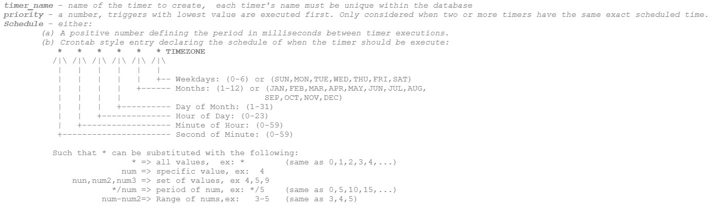

# Timers

Timers allow data to be manipulated at consistent time intervals. These intervals can be at specific times, days, dates, or at regular intervals.

## CREATE TIMER

**Overview**

This command allows you to add script that will be executed on a periodic basis. A special variable `_time` will be available as a local variable to the executing script

```amiscript
CREATE TIMER [IF NOT EXISTS] timer_name OFTYPE AMISCRIPT ON "schedule" [PRIORITY priority] USE
script="AmiScript to run when timer is executed"

[logging="set the logging level when the timer gets called"]
[vars="Variables shared by the timer, a comma delimited list of type varname"]
[onStartupScript="AmiScript to run when the timer is created"]
[timeout="Timeout in milliseconds, default is 100000 (100 seconds)"]
[limit="Row limit for queries, default is 10000"]
```

- `timer_name` - name of the timer to create,  each timer's name must be unique within the database
- `priority` - a number, triggers with lowest value are executed first. Only considered when two or more timers have the same exact scheduled time.
- `schedule` - either:

	- A positive number defining the period in milliseconds between timer executions.
	- Empty string ("") to never run timer, useful for timers that should just run at startup, see onStartupScript.
	- Crontab style entry declaring the schedule of when the timer should be execute:
	
		

Logging options:

1. `off` (default): no logging.
1. `on`: logs the time when the timer is called and when it completes.
1. `verbose`: equivalent of using show_plan=ON in AMIDB. Logs the time that a timer starts and finishes and also each query step.

#### Example

In these examples assume we have the tables A(a boolean) and table B(time utc, cnt int). These timers, when executed, will insert a row into table B with the count of records in A.

```amiscript
//Executes every 500 milliseconds
CREATE TIMER t1 OFTYPE AMISCRIPT ON "500" USE script="int cnt; cnt =select count(*) from A; INSERT INTO b(_time,cnt)"


//Executes every second, on the second
CREATE TIMER t2 OFTYPE AMISCRIPT ON "* * * * * * UTC" USE script="int cnt; cnt=select count(*) from A; INSERT INTO b(_time,cnt)"


//Executes every fifth minute
CREATE TIMER t3 OFTYPE AMISCRIPT ON "0 */5 * * * * UTC" USE script="int cnt; cnt=select count(*) from A; INSERT INTO b(_time,cnt)"


//Executes on the first second of every hour Monday through friday
CREATE TIMER t4 OFTYPE AMISCRIPT ON "0 0 * * * MON-FRI UTC" USE script="int cnt; cnt=select count(*) from A; INSERT INTO b(_time,cnt)"


//Execute every Monday at 9:30 eastern standard time
CREATE TIMER t5 OFTYPE AMISCRIPT ON "0 30 9 * * MON EST5EDT" USE script=" int cnt; cnt=select count(*) from A; INSERT INTO b(_time,cnt)"
```

## DROP TIMER

```amiscript
DROP TIMER [IF EXISTS] timer_name[,timer_name,...]
```

#### Example

This example will drop the timer MyTimer from the database

```amiscript
DROP TIMER MyTimer
```

## Execution Time

The actual timer execution period might differ from the one we specified. Consider the following example. There are two timers that are scheduled to run on 5 second periods but take at least 30 seconds to finish. These two commands query the database from MySQL, and are considered deferred statements, where the timer will wait for the last execution to finish before running the next job.  

``` amiscript
create timer timerms oftype amiscript on "5000" use script="create table x as use ds=world EXECUTE SELECT sleep(30) as x;";
create timer timercron oftype amiscript on "*/5 * * * * * UTC" use script="create table x as use ds=world EXECUTE SELECT sleep(30) as x;";
```

There are several cases:

1. If the timer has a specified timeout, the timer will execute again once the timeout has been reached.  
1. For the timer with the Cron schedule, the timer will wait until the next valid time to execute.  
1. In both cases, the timers will either execute every 30 seconds or wait until the previous request finishes executing or has timedout.  

