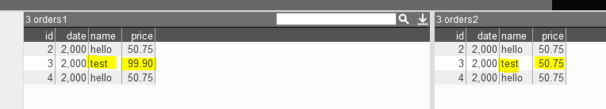

# Triggers

Triggers allow data to be manipulated as it is inserted, updated, or deleted. AMI provides 6 types of trigger for different situations:

1. **AMIScript**, for running custom AMIScript whenever data is inserted, updated, or deleted
1. **Aggregation**, for creating aggregation tables
1. **Projection**, for creating filtered tables
1. **Join**, for creating joined tables
1. **Decorate**, for adding additional data from another table to the trigger table
1. **Relay**, for sending messages through the Relay

## CREATE TRIGGER

### AMIScript

This command allows you to add script that can be executed as data is inserted, updated or deleted from a specified table. There are 5 different events that can cause the trigger to be executed, you must specify at least one of:

-   `onInsertingScript` - This script will be executed **before a row is inserted** into *table_name* table. The values of the row to be inserted will available as local variables to the executing script.
-   `onInsertedScript` - This script will be executed **after a row is inserted** into *table_name*. The values of the row just inserted will available as local variables to the executing script.
-   `onUpdatingScript` - This script will be executed **before an update** on *table_name* table's rows. The values of the row prior to the update will be available as local variable with the form old_varname. The values of the row after the update will be available as local variable with the form new_varname.
-   `onUpdatedScript` - This script will be executed **after an update** on *table_name* table's rows. The values of the row just updated will be available as local variables to the executing script.
-   `onDeletingScript` - This script will be executed **before a row is deleted** from the *table_name* table. The values of the row to be deleted will available as local variables to the executing script.
-   `canMutateRow` - If true, then any values of the row changed inside the onInsertingScript will reflect back on the row to be inserted. For onUpdatingScript, any changes to the new_varname values will reflect on the row to be updated. Note, this only applies to the onInsertingScript and onUpdatingScript options, **has no effect on onInsertedScript, onUpdatedScript, and onDeletingScript**. See [Mutating Trigger Example](#example-2-mutating-trigger) below
-   `rowVar` - a placeholder (can be any custom variable name) that contains the map that reflects the row change in the table (either insert, update or delete). Note that rowVar is a **read-only map** and the available methods include: `#!amiscript boolean containsValue()`, `#!amiscript boolean containsKey()`. For onUpdatingScript, you must add the new\_ or old\_ prefix to the rowVar to use it. See [rowVar Example (using onUpdatingScript)](#example-5-rowvar-example-using-onupdatingscript) for more details.

```amiscript
CREATE TRIGGER trigger_name OFTYPE  AMISCRIPT  ON table_name [PRIORITY priority] USE

[vars=" Variables shared by the trigger, a comma delimited list of type varname"]
[onStartupScript="AmiScript to Run When the trigger is created"]
[onInsertingScript="AmiScript to Run Prior to insert of a row on defined Tables"]
[onInsertedScript="AmiScript to Run After an insert of a row on defined Tables"]
[onUpdatingScript="AmiScript to Run Prior to updating a row on defined Tables"]
[onUpdatedScript="AmiScript to Run After updating a row on defined Tables"]
[onDeletingScript="AmiScript to Run Prior to deleting a row on defined Tables"]
[canMutateRow="true or false"]
[rowVar="_row"]
```

- `trigger_name`: Name of the trigger to create, must be unique within the database

- `table_name`: Name of the table(s) that will cause the trigger to execute

- `priority`: A number, triggers with lowest value are executed first. This also controls the order in which triggers are started up/initialized

#### Example 1: Basic

In this example let us assume we have a table `#!amiscript MyTable(id int,price double)` and a `#!amiscript MyAlertTable(type String,id int,diff double)`. When a row is deleted from the MyTable this trigger will insert an alert into the `#!amiscript MyAlert` Table including the id and price of the record deleted. In the case of an update, a row will be inserted into the `#!amiscript MyAlert` table including the id and change in price due to the update.

```
CREATE TRIGGER MyTrigger OFTYPE AMISCRIPT ON MyTable USE
onDeletingScript="insert into MyAlert(type,id) values(\"RECORD DELETED\",id,0-price)"
onUpdatingScript="insert into MyAlert(type,id,diff) values(\"CHANGE\",id,new_price - old_price)"
```

#### Example 2: Mutating Trigger

```amiscript
CREATE PUBLIC TABLE MutateSample(px double,qty int,val double);
CREATE TRIGGER MutateTrigger OFTYPE AMISCRIPT ON MutateSample USE
canMutateRow="true" onInsertingScript="val=px*qty"
onUpdatingScript="new_val=new_px*new_qty";
INSERT INTO MutateSample(px,qty) VALUES(125.2,100);
SELECT * from MutateSample;
```

| px Double | qty Integer | val Double |
|:---------:|:-----------:|:----------:|
| 125.2     | 100         | 12520.0    |

```amiscript
UPDATE MutateSample set qty=qty+10;
SELECT * from MutateSample;
```

| px Double | qty Integer | val Double |
|:---------:|:-----------:|:----------:|
| 125.2     | 110         | 13772.0    |


#### Example 3: Mutating Trigger with Deferred Statement

In the case of using deferred statements (statements in the format of `#!amiscript use ds=<your_datasource> execute ...` in the mutating trigger, It is strongly recommended that we put all the deferred statements at the end of the script after mutations occur. For example, adding a little tweak to the example before, if we also want to run a deferred statement against another datasource while mutation is happening:

```
CREATE PUBLIC TABLE MutateSample(px double,qty int,val double);

CREATE TRIGGER MutateTriggerWithDeferredStatement OFTYPE AMISCRIPT ON MutateSample USE
canMutateRow="true" onInsertingScript="val=px*qty"
onUpdatingScript="new_val=new_px*new_qty;
use ds=<another_datasource> execute ....;";//must be placed after the mutation

INSERT INTO MutateSample(px,qty) VALUES(125.2,100);
```

#### Example 4: rowVar Example (Basic)

```
CREATE PUBLIC TABLE src(id long, sym string);
CREATE PUBLIC TABLE tgt(rows string, arg1 string, arg2 string);

CREATE TRIGGER t1 OFTYPE AMISCRIPT ON src USE
rowVar="_row"
onInsertingScript="insert into tgt values(_row.toJson(),_row.get(\"id\"),_row.get(\"sym\"))";

INSERT INTO src VALUES(123,"aapl");
SELECT * FROM tgt;
```

|       rows String       | arg1 String | arg2 String |
|:-----------------------:|:-----------:|:-----------:|
| {"id":123,"sym":"aapl"} | 123         | aapl        |

#### Example 5: rowVar Example (using onUpdatingScript)

```amiscript
create public table orders(id string, val int);
create index idx on orders(id HASH) use CONSTRAINT="PRIMARY";
create public table alerts(comments string);

create trigger rowVarTrigger oftype amiscript on orders use rowVar="row"
onUpdatingScript="""
if(new_row.containsKey("val")){
insert into alerts values("newrow: "+new_row+ "oldrow: " + old_row + "containVal?: " + new_row.containsKey("val"));
}""";
```

- Case 1: Upsert (insert causes update due to primary index)  

	```amiscript
	insert into orders values("order1",2),("order1",3);//trigger upsert
	select * from alerts;
	```
	
	|                              comments String                              |
	|:-------------------------------------------------------------------------:|
	| newrow: [id=order1, val=3]; oldrow: [id=order1, val=2]; containsVal?:true |

- Case 2: Direct update, note that only columns that participate in the update clause will appear in the new_rowVar map

	```amiscript
	update orders set val=10;
	select * from alerts;
	```
	
	|                         comments String                        |
	|:--------------------------------------------------------------:|
	| newrow: [val=10]; oldrow: [id=order1, val=3]; containVal?:true |

### Aggregation

```amiscript
CREATE TRIGGER mytrigger OFTYPE AGGREGATE ON sourceTable,targetTable USE ...
```

This command binds an existing source table and an existing target table together such that the target table will be an aggregate representation of the source table.  The following rules apply:

-   As the *source* table has rows inserted, updated or deleted the target table will be automatically updated accordingly
-   The *target* table is no longer modifiable (inserts, updates and deletes to the *target* table will not succeed)
-   Multiple aggregate triggers can share the same source table
-   Multiple aggregate triggers can not share the same target table (a given table can only participate in one aggregate trigger as a *target* table)
-   Streaming triggers can be daisy chained, meaning a given table can be a target for one aggregate trigger and a source for another aggregate trigger
-   The creation of the trigger will clear out and rebuild the *target* table to properly reflect the aggregation of the source table's data

There are three USE options:

1. `#!amiscript groupBys` - A comma delimited list of expressions to group rows by, each expression being of the form:

	```amicript
	targetTableColumn = expression_on_sourceTableColumns [,targetTableColumn = expression_on_sourceTableColumns ...]
	```

1. `#!amiscript selects` - A comma delimited list of expressions on how to populate target columns from source columns.

	```amicript
	targetTableColumn = aggregate_on_sourceTableColumns [,targetTableColumn = aggregate_on_sourceTableColumns ...]
	```

1. `#!amiscript allowExternalUpdates` - Optional. Value is either true or false (false by default). If true, then other processes (i.e triggers, UPDATEs) are allowed to perform UPDATEs on the target table. Please use precaution when using this feature, since updating cells controlled by the aggregate trigger will result into an undesirable state.

The following rules apply for the `#!amiscript groupBys` and `#!amiscript selects` use options:

-   `#!amiscript targetTableColumns` must only reference columns in the target table's schema
-   `#!amiscript sourceTableColumns` must only reference columns in the source table's schema
-   A `#!amiscript targetTableColumn` can only be referenced once
-   For aggregate expressions only `count`, `countUnique`, `first`, `last`, `max`, `min`, `stdev`, `stdevs`, `sum`, and `var` functions are supported

```amiscript
CREATE TRIGGER trigger_name OFTYPE AGGREGATE

ON source_table_name, target_table_name [PRIORITY priority] USE groupBys="list of group by expressions" selects="list of aggregate expressions" [allowExternalUpdates="true or false"]
```

- `trigger_name` - name of the trigger to create, must be unique within the database
- `source_table_name` - name of the table that will cause the trigger to execute
- `target_table_name` - name of the table that will be updates by the trigger
- `priority` - a number, triggers with lowest value are executed first. Only considered when two or more triggers exist on the same table

#### Example

```amiscript
// Lets assume the two tables exist:
CREATE PUBLIC TABLE Accounts(account String,region String,qty int,px double);
CREATE PUBLIC TABLE Summary(act String,region String,cnt int,value double);

// The below trigger will build a realtime aggregation on accounts reflected in the summary table:
// (try inserting into the Accounts table and then take a look at the Summary table)
CREATE TRIGGER MyTrigger OFTYPE AGGREGATE ON Accounts,Summary USE groupBys="act=account,region=region" selects="cnt=count(*),value=sum(qty*px)";
```

### Projection

```amiscript
CREATE TRIGGER mytrigger OFTYPE PROJECTION ON sourceTable(s),targetTable USE ...
```

This command binds one or more existing source tables and an existing target table together such that the target table will be populated using the source table(s).  The following rules then apply:

-   As the source table(s) have rows inserted, updated or deleted the target table will automatically have it's corresponding projected rows inserted, updated, deleted accordingly.
-   When there are multiple source tables, the resulting target is a UNION of the source tables (not a join)
-   The target table's rows that are a result of this projection can not be modified (inserts, updates and deletes to the target table's managed rows will not succeed)
-   Multiple projection triggers can share the same source table
-   Multiple projection triggers cannot share the same target table
-   The creation of the trigger will clear out and rebuild the target table to properly reflect the aggregation of the source table's data.
-   If a source tables' row is updated such that the evaluation of the wheres clause changes, then the row will be inserted/deleted from the target table accordingly.

There are three required USE options:

1. `#!amiscript wheres` - A comma-delimited list of boolean expressions that must all be true on a source table's row in order for it to be projected into the target table:

	```amiscript
	expression_on_sourceTableColumns,[ expression_on_sourceTableColumns ...]
	```

1. `#!amiscript selects` - A comma-delimited list of expressions on how to populate target columns from source columns:

	```amiscript
	targetTableColumn = aggregate on sourceTableColumns, [targetTableColumn = aggregate on sourceTableColumns ...]
	```

1. `#!amiscript allowExternalUpdates` - Optional. Value is either true or false (false by default). If true, then other processes (i.e triggers, `UPDATE`s) are allowed to perform `UPDATE`s on the target table. Please use precaution when using this feature, since updating cells controlled by the aggregate trigger will result into an undesirable state.

There following rules apply for the `#!amiscript selects` use options (important when there are multiple source tables):

-   Using the form `tablename.columnname` will isolate the expression to only apply to the specified table.
-   Using the form `columnname` means that the expression will apply to all tables with the supplied `columnname`.

```amiscript
CREATE TRIGGER trigger_name OFTYPE PROJECTION ON source_table_name[, source_table_name...], target_table_name [PRIORITY priority] USE wheres="list of where expressions" selects="list of assignment expressions"
```

!!! Note
	`wheres` applies **only on same-table comparisons**. You cannot cross-reference different tables in the same `wheres` statement.


- `trigger_name` - name of the trigger to create, must be unique within the database
- `source_table_name` - name of the tables that will cause the trigger to execute
- `target_table_name` - name of the table that will be updated by the trigger
- `priority` - a number, triggers with lowest value are executed first. Only considered when two or more triggers exist on the same table

#### Example

```amiscript
// Lets assume the three tables exist:
CREATE PUBLIC TABLE Accounts1(account String,region String,qty int,px double);
CREATE PUBLIC TABLE Accounts2(account String,region String,qty int,px double);
CREATE PUBLIC TABLE MissingRegion(account String, value double);

// The below trigger will build a realtime view of accounts that have a null region:
// (try inserting into the Accounts1 table and then take a look at the MissingRegions table)
CREATE TRIGGER MyTrigger OFTYPE PROJECTION ON Accounts1,Accounts2,MissingRegion USE wheres="region==null" selects="account=account,value=qty * px";
```

### Join

```amiscript
CREATE TRIGGER mytrigger OFTYPE JOIN ON leftTable,rightTable,targetTable USE ...
```

This command allows for realtime joining across two tables.

-   Changes to the leftTable or/or RightTable automatically update the targetTable, equivalent to using the ... JOIN ... ON ... syntax of the SELECT statement.  See [Join Examples](../reference/ami_sql.md#join-examples) for an illustration of the various types of joins
-   Effectively, the target table can be considered a read only table, and can no longer be modified directly
-   Multiple JOIN triggers can share the same source table
-   Multiple JOIN triggers can not share the same target table.
-   The creation of the trigger will clear out and rebuild the target table to properly reflect the JOIN of the left and right tables.

There are three USE options:

1. `type` - How to join the left and right tables. Supported types include: LEFT, RIGHT, INNER, OUTER, LEFT ONLY, RIGHT ONLY, OUTER ONLY. (See [Join Examples](../reference/ami_sql.md#join-examples) for details on the behavior of the various configurations).

1. `on` - An expression for how to relate the two tables in the form:

	```amiscript
	"leftColumn == rightColumn [ && leftColumn == rightColumn ... ]"
	```

1. `selects` - A comma delimited list of expressions on how to populate target columns from columns of the left and right tables.

	```amiscript
	targetTableColumn = aggregate on sourceTableColumns [,targetTableColumn = aggregate on sourceTableColumns ...]
	```

The following rules apply for the `wheres` and `selects` use options:

-   Using the form `tablename.columnname` will explicitly determine which table (left or right) is to be referenced.
-   Using the form `columnname` means that the column name must be unique to either the left or right table.

```amiscript
CREATE TRIGGER trigger_name OFTYPE JOIN ON left_table_name, right_table_name, target_table_name [PRIORITY priority] USE type="join type" on="cross table comparison expression" selects="list of assignment expressions"
```

- `trigger_name` - name of the trigger to create, must be unique within the database
- `left_table_name` - name of the left table to join against
- `right_table_name` - name of the right table to join against
- `target_table_name` - name of the table that will be updated by the trigger
- `priority` - a number, triggers with lowest value are executed first. Only considered when two or more triggers exist on the same table

#### Example

```amiscript
// Lets assume the three tables exist:
CREATE PUBLIC TABLE Accounts1(account String,region String,qty int,px double);
CREATE PUBLIC TABLE Accounts2(account String,region String,qty int,px double);
CREATE PUBLIC TABLE UnmatchedAccounts(account1 String, account2 String);

// The below trigger will build a realtime view of accounts that only in the Accounts1 table
// or only in the Accounts2 table.(1)
// (try inserting into the Accounts1 table and then take a look at the UnmatchedAccounts table)
CREATE TRIGGER MyTrigger OFTYPE JOIN ON Accounts1,Accounts2, UnmatchedAccounts USE type="OUTER ONLY"
on="Accounts1.account==Accounts2.account" selects="account1=Accounts1.account, account2=Accounts2.account";
```
{ .annotate }

1.  See [Join Examples](../reference/ami_sql.md#join-examples) for more details on `#!amiscript OUTER JOIN`

### Decorate

```amiscript
CREATE TRIGGER mytrigger OFTYPE DECORATE ON sourceTable,targetTable USE...
```

This trigger is used to automatically decorate (update) a target table based on changes from a source table

-   When a row is updated/inserted in the source table all matching rows (based on the ON clause) in the target table are updated (based on the SELECTS clause).
-   Multiple DECORATE triggers can share the same source table.
-   Multiple DECORATE triggers can share the same target table.
-   The creation of the trigger will immediately update the target table based on source table values.
-   When a row is inserted into the target table the last known matching values (if any) from the source table will be used to immediately update the new row.
-   Deletes from the source table will not affect the target table.

There are three USE options:

1. `on` - An expression for how to relate the two tables in the form:

	```amiscript
	"leftColumn == rightColumn [ && leftColumn == rightColumn ... ]"
	```

1. `selects` - A comma delimited list of expressions on how to populate target columns from columns of the left and right tables.

	```amiscript
	targetTableColumn = aggregate on sourceTableColumns [,targetTableColumn = aggregate on sourceTableColumns ...]
	```

1. `keysChange` - Either true or false. Default is false. If it's expected that columns participating in the ON clause can change, then set to true. Note that setting to true adds additional overhead.

```
CREATE TRIGGER trigger_name OFTYPE DECORATE ON source_table_name, target_table_name [PRIORITY priority] USE on="cross table comparison expression" selects="list of assignment expressions"
```

- `trigger_name` - name of the trigger to create, must be unique within the database
- `source_table_name` - name of the table to listen for updates from
- `target_table_name` - name of the table to update on changes
- `priority` - a number, triggers with lowest value are executed first. Only considered when two or more triggers exist on the same table

#### Example

```
// Let's assume the two tables exist:
create public table MktData(sym String,price double);
create public table Orders(id String,sym String,price double); 

// When the MktData is updated, all Orders with the same symbol will now have the price updated
create trigger tt oftype decorate on MktData,Orders use on="Orders.sym==MktData.sym" selects="price=price"
```

### Relay

```amiscript
CREATE TRIGGER relayTrigger OFTYPE RELAY ON sourceTable USE...
```

**Overview**  
This command allows messages to be sent through the relay when (a) specific action(s) (insert, update or delete) occurs from the source table.

Relay connection options:

- `host` - hostname of the relay instance
- `port` - port for the relay instance defined by the property ami.port
- `login` - the unique id to identify the process/application, see the [login command](../reference/ami_realtime_messages.md#login-l) for more details
- `keystoreFile` - optional, location of a keystore file
- `keystorePass` - optional, the keystore password, this will be encrypted using the strEncrypt method first

Other options (all optional):

- `target` - the name of the target table, if not defined assumes the same name as the source
- `derivedValues` - key=expression,...[key=expression] pattern to map source columns to target columns, if the option is omitted, all source columns will map to the target columns of the same given name, if target columns are omitted, it will map the target column to a source column of the same given name
- `inserts` - comma delimited list of target columns to be sent on an onInserted event on the source table, if your target table has a unique constraint, in most cases you will want to add that column(s) to this list
- `updates` - comma delimited list of target columns to be sent on an onUpdated event on the source table, if your target table has a unique constraint, a unique identifier column(s) needs to be in this list
- `deletes` - comma delimited list of target columns to be sent on an onDeleted event on the source table, if your target table has a unique constraint, a unique identifier column(s) needs to be in this list
- `where` - a conditional statement which needs to evaluate to a boolean expression on the source rows, filters what messages should be sent to the target table, false indicates the message will be skipped.

```amiscript
CREATE TRIGGER trigger_name OFTYPE  RELAY  ON source_table_name [PRIORITY priority] USE
[host=" hostname of the relay instance "]
[port="port for the relay instance defined by the property ami.port"]
[login="the unique id to identify the process/application see the login command for more details"]
[target="the name of the target table, if not defined assumes the same name as the source "]
[derivedValues="key=expression,...[key=expression] pattern to map source columns to target columns, if the option is omitted, all source columns will map to the target columns of the same given name, if target columns are omitted, it will map the target column to a source column of the same given name "]
[inserts="comma delimited list of target columns to be sent on an onInserted event on the source table, if your target table has a unique constraint, in most cases you will want to add that column(s) to this list "]
[updates="comma delimited list of target columns to be sent on an onUpdated event on the source table, if your target table has a unique constraint, a unique identifier column(s) needs to be in this list"]
[deletes="comma delimited list of target columns to be sent on an onDeleted event on the source table, if your target table has a unique constraint, a unique identifier column(s) needs to be in this list "]
[where="a conditional statement which needs to evaluate to a boolean expression on the source rows, filters what messages should be sent to the target table, false indicates the message will be skipped"]
```

-   Note inserts,updates and deletes options define what columns will be added to a relay message
-   Note that if the derivedValues,inserts,updates or deletes options are omitted, all values are sent.
-   Note if the inserts,updates or deletes options are set to "" then the event type is skipped.
-   Note the trigger uses AmiClient to connect to the ami.port if it's unable to connect it will drop messages, it is configured to auto reconnect

#### Example

```amiscript
CREATE PUBLIC TABLE orders1(id Integer,date Integer,name String,price Double) USE PersistEngine="FAST";
CREATE INDEX orders1_idx2 ON orders1(date HASH) USE Constraint="NONE";
CREATE INDEX orders1_idx1 ON orders1(id HASH) USE Constraint="PRIMARY";

CREATE PUBLIC TABLE orders2(id Integer,date Integer,name String,price Double) USE PersistEngine="FAST";
CREATE INDEX orders2_idx2 ON orders2(date HASH) USE Constraint="NONE";
CREATE INDEX orders2_idx1 ON orders2(id HASH) USE Constraint="PRIMARY";

create trigger relayTrigger oftype relay on orders1 use host="localhost" port="3289" login="demo" target="orders2" derivedValues="id=id,date=date,name=name,price=price" updates="id,name" where="price>100.0";

insert into orders1 values(2,2000,"hello", 50.75);
insert into orders1 values(3,2000,"hello", 50.75);
insert into orders1 values(4,2000,"hello", 50.75);

update orders1 set name="test",price=99.9 where id == 3;

// Results:
select * from orders1;select * from orders2;
```



## DROP TRIGGER

This command permanently drops one or more triggers.

```amiscript
DROP TRIGGER trigger_name [, trigger_name ...]
```

#### Example

This example will drop the trigger MyTrigger from the database.

```amiscript
DROP TRIGGER MyTrigger
```

## AMIScript Trigger Cases

AMISCRIPT type triggers can have up to 5 different trigger scripts, `onInserting`, `onInserted`, `onUpdating`, `onUpdated`, and `ondDeleting`. When running a SQL command against a table with an AMISCRIPT trigger, some of these will run. Note that they run in the order displayed below from `onInserting` to `onDeleting`. The table below shows which script will run depending on the SQL command, whether the command changes anything, and whether there is a primary index on the table. We will be using the following table:

```amiscript
CREATE PUBLIC TABLE ORDERS(OrderID String, Quantity Integer, Price double);
CREATE INDEX IDX ON ORDERS(OrderID Hash) use Constraint="Primary";
```

| Description & Command | onInserting | onInserted | onUpdating | onUpdated | onDeleting |
| --- | :---: | :---: | :---: | :---: | :---: |
| New Row<br>`#!amiscript insert into ORDERS values ("ord01", 100, 75.0);` | :material-check: | :material-check: | :material-close: | :material-close: | :material-close: |
| Existing Row No Changes<br>`#!amiscript insert into ORDERS values ("ord01", 100, 75.0);` | :material-check: | :material-close: | :material-close: | :material-close: | :material-close: |
| Existing Row With Changes<br>`#!amiscript insert into ORDERS values ("ord01", 100, 92.0);` | :material-check: | :material-close: | :material-check: | :material-check: | :material-close: |
| Update No Changes<br>`#!amiscript update ORDERS set AvgPx=75 where OrderID == "ord01";` | :material-close: | :material-close: | :material-close: | :material-close: | :material-close: |
| Update With Changes<br>`#!amiscript update ORDERS set AvgPx=100 where OrderID == "ord02";` | :material-close: | :material-close: | :material-check: | :material-check: | :material-close: |
| Delete Non-Existing Row<br>`#!amiscript delete from ORDERS where OrderID=="ord05";` | :material-close: | :material-close: | :material-close: | :material-close: | :material-close: |
| Delete Row<br>`#!amiscript delete from ORDERS where OrderID=="ord03";` | :material-close: | :material-close: | :material-close: | :material-close: | :material-check: |
| Sync No Changes<br>`#!amiscript sync into ORDERS(OrderID, LeavesQty, AvgPx) from select "ord01", 100, 75.0;` | :material-close: | :material-close: | :material-close: | :material-close: | :material-check: |
| Sync With Changes<br>`#!amiscript sync into ORDERS from select "ord02", 125, 75.0;` | :material-check: | :material-check: | :material-close: | :material-close: | :material-check: |
| Sync on (ID) No Changes<br>`#!amiscript sync into ORDERS(OrderID, LeavesQty, AvgPx) on (OrderID) from select "ord01", 100, 75.0;` | :material-close: | :material-close: | :material-close: | :material-close: | :material-check: |
| Sync on (ID) With Changes<br>`#!amiscript sync into ORDERS(OrderID, LeavesQty, AvgPx) on (OrderID) from select "ord02", 130, 75.0;` | :material-close: | :material-close: | :material-check: | :material-check: | :material-check: |
| Truncate/Delete from<br>`#!amiscript truncate ORDERS;/Delete from ORDER;` | :material-close: | :material-close: | :material-close: | :material-close: | :material-check: |
| Alter table Add Column(s)<br>`#!amiscript ALTER TABLE ORDERS ADD Sym String;` | :material-close: | :material-close: | :material-close: | :material-close: | :material-close: |
| Alter table With Default Values<br>`#!amiscript ALTER TABLE ORDERS ADD Sym="ABC";` | :material-close: | :material-close: | :material-check: | :material-check: | :material-close: |
| Alter table Drop Column(s)<br>`#!amiscript ALTER TABLE ORDERS DROP AvgPx;` | :material-close: | :material-close: | :material-close: | :material-close: | :material-close: |
| Rename Column<br>`#!amiscript ALTER TABLE ORDERS RENAME LeavesQty To LeavesQuantity;` | :material-close: | :material-close: | :material-close: | :material-close: | :material-close: |
| Modify Column Data Type<br>`#!amiscript ALTER TABLE ORDERS MODIFY AvgPx AS AvgPrice Int;` | :material-close: | :material-close: | :material-close: | :material-close: | :material-close: |
| Drop Table<br>`#!amiscript Drop Table ORDERS;` | :material-close: | :material-close: | :material-close: | :material-close: | :material-close: |

Notes:

1. Mutating the row: when set `canMutateRow="true"`, Mutating the values in onInserted, onUpdated or onDeleting will not change the underlying value or row.  
1. Trigger Event Return False: If you return **false** in the triggerEvents: onInserting, onUpdating and onDeleting, it will prevent the row from being inserted, updated or deleting and will also prevent further trigger events  
1. Return False with a Sync: If you do a sync command where the onDeleting trigger event returns false, onDeleting will fire but no deletes will occur and will be followed by onInserting, onUpdating and onUpdated  
1. Return False Sync without Primary Key:If you didn't have a primary key, that same action previously will insert another row, keeping the original and will also fire the onDeleting (with no deletes), onInserting and onInserted events.  
1. Changed vs Unchanged Row: For the onUpdating and onUpdated trigger events if the row hasn't changed, the trigger wont fire. The same hold true when you mutate the row back to it's original values, the next trigger event wont fire.  

