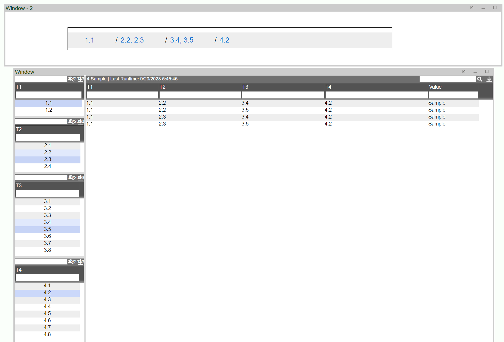

# Breadcrumb Filter

This is a basic example of a breadcrumb filter through the use of HTML and Javascript in a Form Div field.  
  

  
The layout follows the breadcrumb tiers (T1 - T4) as filter levels. Most of the script can be found in the custom methods of the layout, and some in the onAmiJsCallback callback of the breadcrumb panel (for handling clicks to reset filters to indicated level/tier).  
  
Layout:

``` json
{"layouts":[{"data":{"includeFiles":[],"metadata":{"amiScriptMethods":["{\n","  string getBreadCrumbStyle() {\n","    return \"<style>\n","      ul.breadcrumb {padding: 10px 10px;\n","      list-style: none;\n","      background-color: #eee;\n","      }\n","      ul.breadcrumb li {\n","      display: inline;\n","      font-size: 18px;\n","      }\n","      ul.breadcrumb li+li:before {\n","        padding: 8px;\n","        color: black;\n","        content: \\\"/\\\";\n","      }\n","      ul.breadcrumb li a {\n","        color: #0275d8;\n","        text-decoration: none;\n","      }\n","      ul.breadcrumb li a:hover {\n","        color: #01447e;\n","        text-decoration: underline;\n","      }\n","      </style>\";\n","  };\n","  \n","  boolean setFilter(){\n","    //get panels\n","    TablePanel tier1 = layout.getPanel(\"tier1\");\n","    TablePanel tier2 = layout.getPanel(\"tier2\");\n","    TablePanel tier3 = layout.getPanel(\"tier3\");\n","    TablePanel tier4 = layout.getPanel(\"tier4\");\n","    \n","    //build where clause for filtering & values for breadcrumbs\n","    string whereClause = \"\";\n","    string t1Vals = \"\";\n","    string t2Vals = \"\";\n","    string t3Vals = \"\";\n","    string t4Vals = \"\";\n","    if (tier1.getSelectedRows().size()!=0){\n","      row firstRow = tier1.getSelectedRows().get(0);\n","      string firstRowVal = firstRow.getValue(\"T1\");\n","      whereClause += \"T1 IN (\\\"${firstRowVal}\\\"\";\n","      t1Vals += firstRowVal;\n","      for (int i = 1; i < tier1.getSelectedRows().size(); ++i){\n","        row r = tier1.getSelectedRows().get(i);\n","        string rVal = r.getValue(\"T1\");\n","        whereClause += \",\\\"${rVal}\\\"\";\n","        t1Vals += \", ${rVal}\";\n","      }\n","      whereClause += \")\";\n","    }\n","    if (tier2.getSelectedRows().size()!=0){\n","      if (whereClause != \"\")\n","        whereClause += \" && \";\n","      row firstRow = tier2.getSelectedRows().get(0);\n","      string firstRowVal = firstRow.getValue(\"T2\");\n","      whereClause += \"T2 IN (\\\"${firstRowVal}\\\"\";\n","      t2Vals += firstRowVal;\n","      for (int i = 1; i < tier2.getSelectedRows().size(); ++i){\n","        row r = tier2.getSelectedRows().get(i);\n","        string rVal = r.getValue(\"T2\");\n","        whereClause += \",\\\"${rVal}\\\"\";\n","        t2Vals += \", ${rVal}\";\n","      }\n","      whereClause += \")\";\n","    }\n","    if (tier3.getSelectedRows().size()!=0){\n","      if (whereClause != \"\")\n","        whereClause += \" && \";\n","      row firstRow = tier3.getSelectedRows().get(0);\n","      string firstRowVal = firstRow.getValue(\"T3\");\n","      whereClause += \"T3 IN (\\\"${firstRowVal}\\\"\";\n","      t3Vals += firstRowVal;\n","      for (int i = 1; i < tier3.getSelectedRows().size(); ++i){\n","        row r = tier3.getSelectedRows().get(i);\n","        string rVal = r.getValue(\"T3\");\n","        whereClause += \",\\\"${rVal}\\\"\";\n","        t3Vals += \", ${rVal}\";\n","      }\n","      whereClause += \")\";\n","    }\n","    if (tier4.getSelectedRows().size()!=0){\n","      if (whereClause != \"\")\n","        whereClause += \" && \";\n","      row firstRow = tier4.getSelectedRows().get(0);\n","      string firstRowVal = firstRow.getValue(\"T4\");\n","      whereClause += \"T4 IN (\\\"${firstRowVal}\\\"\";\n","      t4Vals += firstRowVal;\n","      for (int i = 1; i < tier4.getSelectedRows().size(); ++i){\n","        row r = tier4.getSelectedRows().get(i);\n","        string rVal = r.getValue(\"T4\");\n","        whereClause += \",\\\"${rVal}\\\"\";\n","        t4Vals += \", ${rVal}\";\n","      }\n","      whereClause += \")\";\n","    }\n","    \n","    //apply where clause\n","    TablePanel mainTable = layout.getPanel(\"mainTable\");\n","    mainTable.setCurrentWhere(whereClause);\n","    \n","    //call breadcrumb builder\n","    t1Vals = t1Vals == \"\" ? \"All\" : t1Vals;\n","    t2Vals = t2Vals == \"\" ? \"All\" : t2Vals;\n","    t3Vals = t3Vals == \"\" ? \"All\" : t3Vals;\n","    t4Vals = t4Vals == \"\" ? \"All\" : t4Vals;\n","    map crumbValues = new map();\n","    crumbValues.put(\"t1\", t1Vals);\n","    crumbValues.put(\"t2\", t2Vals);\n","    crumbValues.put(\"t3\", t3Vals);\n","    crumbValues.put(\"t4\", t4Vals);\n","    buildBreadCrumb(crumbValues);\n","    \n","    return true;\n","  };\n","  \n","  boolean buildBreadCrumb(map crumbValues){\n","    String breadCrumb = getBreadCrumbStyle();\n","    breadCrumb += \"<body>\n","        <ul class=\\\"breadcrumb\\\">\";\n","    for (int i = 1; i < crumbValues.size() + 1; ++i){\n","      string crumbVal = crumbValues.get(\"t${i}\");\n","      if (crumbVal == \"All\"){\n","        boolean allBreak = true;\n","        for (int j = i; j < crumbValues.size() + 1; ++j){\n","          string allCheck = crumbValues.get(\"t${j}\");\n","          if (allCheck != \"All\")\n","            allBreak = false;\n","        }\n","        if (allBreak) \n","          break;\n","      }\n","      breadCrumb += \"<li><a onclick='amiJsCallback(this,${i}, 0);'>${crumbVal}</a></li>\";\n","    }\n","    breadCrumb += \"</ul>\n","                  </body>\";\n","                  \n","    FormPanel breadCrumbPnl = layout.getPanel(\"breadcrumbPnl\");\n","    FormDivField breadcrumbDiv = breadCrumbPnl.getField(\"breadcrumbDiv\");\n","    breadcrumbDiv.setValue(breadCrumb);\n","  };\n","}"],"customPrefsImportMode":"reject","dm":{"dms":[{"callbacks":{"entries":[{"amiscript":["{\n","  CREATE TABLE Sample(T1 String, T2 String, T3 String, T4 String, value string);\n","  \n","  for (int i1=0; i1<2; ++i1){\n","    string t1 = \"1.${i1+1}\";\n","    for (int i2=0; i2<4; ++i2){\n","      string t2 = \"2.${i2+1}\";\n","      for (int i3=0; i3<8; ++i3){\n","        string t3 = \"3.${i3+1}\";\n","        for (int i4=0; i4<8; ++i4){\n","          string t4 = \"4.${i4+1}\";\n","          insert into Sample values (t1, t2, t3, t4, \"Sample\");\n","        }\n","      }\n","    }\n","  }\n","}\n"],"hasDatamodel":true,"linkedVariables":[],"name":"onProcess","schema":{"tbl":[{"cols":[{"nm":"T1","tp":"String"},{"nm":"T2","tp":"String"},{"nm":"T3","tp":"String"},{"nm":"T4","tp":"String"},{"nm":"value","tp":"String"}],"nm":"Sample","oc":"ask"}]}}]},"lbl":"mainTable","lm":0,"lower":[],"queryMode":"startup","test_input_type":"OPEN","test_input_vars":"String WHERE=\"true\";","to":0},{"callbacks":{"entries":[{"amiscript":["{\n","  CREATE TABLE Tier1 AS SELECT T1 FROM Sample WHERE ${WHERE} group by T1;\n","}"],"hasDatamodel":true,"inputDm":["mainTable"],"linkedVariables":[],"name":"onProcess","schema":{"tbl":[{"cols":[{"nm":"T1","tp":"String"},{"nm":"T2","tp":"String"},{"nm":"T3","tp":"String"},{"nm":"T4","tp":"String"},{"nm":"value","tp":"String"}],"nm":"Sample","oc":"ask"},{"cols":[{"nm":"T1","tp":"String"}],"nm":"Tier1","oc":"ask"}]}}]},"lbl":"tier1","lm":0,"lower":["mainTable"],"test_input_type":"OPEN","test_input_vars":"String WHERE=\"true\";","to":0},{"callbacks":{"entries":[{"amiscript":["{\n","  CREATE TABLE Tier2 AS SELECT T2 FROM Sample WHERE ${WHERE} group by T2;\n","}\n"],"hasDatamodel":true,"inputDm":["mainTable"],"linkedVariables":[],"name":"onProcess","schema":{"tbl":[{"cols":[{"nm":"T1","tp":"String"},{"nm":"T2","tp":"String"},{"nm":"T3","tp":"String"},{"nm":"T4","tp":"String"},{"nm":"value","tp":"String"}],"nm":"Sample","oc":"ask"},{"cols":[{"nm":"T2","tp":"String"}],"nm":"Tier2","oc":"ask"}]}}]},"lbl":"tier2","lm":0,"lower":["mainTable"],"test_input_type":"OPEN","test_input_vars":"String WHERE=\"true\";","to":0},{"callbacks":{"entries":[{"amiscript":["{\n","  CREATE TABLE Tier3 AS SELECT T3 FROM Sample WHERE ${WHERE} group by T3;\n","}\n"],"hasDatamodel":true,"inputDm":["mainTable"],"linkedVariables":[],"name":"onProcess","schema":{"tbl":[{"cols":[{"nm":"T1","tp":"String"},{"nm":"T2","tp":"String"},{"nm":"T3","tp":"String"},{"nm":"T4","tp":"String"},{"nm":"value","tp":"String"}],"nm":"Sample","oc":"ask"},{"cols":[{"nm":"T3","tp":"String"}],"nm":"Tier3","oc":"ask"}]}}]},"lbl":"tier3","lm":0,"lower":["mainTable"],"test_input_type":"OPEN","test_input_vars":"String WHERE=\"true\";","to":0},{"callbacks":{"entries":[{"amiscript":["{\n","  CREATE TABLE Tier4 AS SELECT T4 FROM Sample WHERE ${WHERE} group by T4;\n","}\n"],"hasDatamodel":true,"inputDm":["mainTable"],"linkedVariables":[],"name":"onProcess","schema":{"tbl":[{"cols":[{"nm":"T1","tp":"String"},{"nm":"T2","tp":"String"},{"nm":"T3","tp":"String"},{"nm":"T4","tp":"String"},{"nm":"value","tp":"String"}],"nm":"Sample","oc":"ask"},{"cols":[{"nm":"T4","tp":"String"}],"nm":"Tier4","oc":"ask"}]}}]},"lbl":"tier4","lm":0,"lower":["mainTable"],"test_input_type":"OPEN","test_input_vars":"String WHERE=\"true\";","to":0}]},"fileVersion":3,"rt":{"processors":[]},"stm":{"styles":[{"id":"LAYOUT_DEFAULT","lb":"Layout Default","pt":"DEFAULT"}]}},"portletConfigs":[{"portletBuilderId":"amidesktop","portletConfig":{"active":"Div1","amiPanelId":"@DESKTOP","amiStyle":{"pt":"LAYOUT_DEFAULT"},"windows":[{"header":true,"height":697,"hidden":false,"left":582,"portlet":"Div1","pos":0,"state":"flt","title":"Window","top":442,"width":1235,"zindex":2},{"header":true,"height":137,"hidden":false,"left":558,"portlet":"breadcrumbPnl","pos":1,"state":"flt","title":"Window - 2","top":277,"width":1280,"zindex":1}]}},{"portletBuilderId":"div","portletConfig":{"amiPanelId":"Div1","amiStyle":{"pt":"LAYOUT_DEFAULT","vl":{"div":{"divAlign":"start"}}},"child1":"Div2","child2":"mainTable","dir":"v","isMin":false,"offset":0.14736842105263157,"upid":"Div1"}},{"portletBuilderId":"div","portletConfig":{"amiPanelId":"Div2","amiStyle":{"pt":"LAYOUT_DEFAULT"},"child1":"tier1","child2":"Div3","dir":"h","isMin":false,"offset":0.15460992907801419,"upid":"Div2"}},{"portletBuilderId":"div","portletConfig":{"amiPanelId":"Div3","amiStyle":{"pt":"LAYOUT_DEFAULT"},"child1":"tier2","child2":"Div4","dir":"h","isMin":false,"offset":0.24283305227655985,"upid":"Div3"}},{"portletBuilderId":"div","portletConfig":{"amiPanelId":"Div4","amiStyle":{"pt":"LAYOUT_DEFAULT"},"child1":"tier3","child2":"tier4","dir":"h","isMin":false,"offset":0.48654708520179374,"upid":"Div4"}},{"portletBuilderId":"amiform","portletConfig":{"amiPanelId":"breadcrumbPnl","amiStyle":{"pt":"LAYOUT_DEFAULT"},"amiTitle":"","buttons":[],"callbacks":{"entries":[{"amiscript":["int selected = action;\n","int totalTiers = 4;\n","\n","for (int i = selected + 1; i < totalTiers + 1; ++i){\n","  TablePanel tierPanel = layout.getPanel(\"tier${i}\");\n","  tierPanel.selectRows(false);\n","}"],"linkedVariables":[],"name":"onAmiJsCallback"}]},"dm":[],"fields":[{"callbacks":{},"disabled":false,"dme":"","heightPx":59,"help":"","hidden":true,"l":"breadcrumbDiv","labelHidden":true,"leftPosPx":160,"n":"breadcrumbDiv","style":"","t":"divField","template":"","topPosPx":40,"widthPx":840,"zidx":1}],"guides":[],"htmlTemplate2":null,"snap":20,"titlePnl":{"title":""},"upid":"breadcrumbPnl"}},{"portletBuilderId":"amistatictable","portletConfig":{"amiCols":[{"fm":"T1","id":"T1","location":0,"tl":"T1","tp":"text","width":188},{"fm":"T2","id":"T2","location":1,"tl":"T2","tp":"text","width":214},{"fm":"T3","id":"T3","location":2,"tl":"T3","tp":"text","width":215},{"fm":"T4","id":"T4","location":3,"tl":"T4","tp":"text","width":268},{"fm":"value","id":"value","location":4,"tl":"Value","tp":"text","width":130},{"id":"D","width":100}],"amiPanelId":"mainTable","amiStyle":{"pt":"LAYOUT_DEFAULT"},"amiTitle":"Sample","curtimeUpdateFrequency":1000,"dm":[{"dmadn":"mainTable","dmtbid":["Sample"]}],"dynamicColumns":"false","editDblClk":true,"editInplace":false,"editMenuTitle":"Edit Row(s)","editMode":0,"editRerunDM":true,"filters":{},"pinCnt":0,"rollupEnabled":false,"scrollToBottomOnAppend":false,"showCommandMenu":true,"showLastRuntime":true,"titlePnl":{"title":"Sample"},"upid":"mainTable","varTypes":{"T1":"String","T2":"String","T3":"String","T4":"String","value":"String"}}},{"portletBuilderId":"amistatictable","portletConfig":{"amiCols":[{"ei":"","eof":"","fm":"T1","id":"T1","location":0,"sy":"\"center\"","tl":"T1","tp":"text","width":174},{"id":"D","width":100}],"amiPanelId":"tier1","amiStyle":{"pt":"LAYOUT_DEFAULT"},"amiTitle":"Tier1","callbacks":{"entries":[{"amiscript":"setFilter();","linkedVariables":[],"name":"onSelected"}]},"curtimeUpdateFrequency":1000,"dm":[{"dmadn":"tier1","dmtbid":["Tier1"]}],"dynamicColumns":"false","editDblClk":true,"editInplace":false,"editMenuTitle":"Edit Row(s)","editMode":0,"editRerunDM":true,"filters":{},"pinCnt":0,"rollupEnabled":false,"scrollToBottomOnAppend":false,"showCommandMenu":true,"showLastRuntime":true,"titlePnl":{"title":"Tier1"},"upid":"tier1","varTypes":{"T1":"String"}}},{"portletBuilderId":"amistatictable","portletConfig":{"amiCols":[{"ei":"","eof":"","fm":"T2","id":"T2","location":0,"sy":"\"center\"","tl":"T2","tp":"text","width":169},{"id":"D","width":100}],"amiPanelId":"tier2","amiStyle":{"pt":"LAYOUT_DEFAULT"},"amiTitle":"Tier2","callbacks":{"entries":[{"amiscript":"setFilter();","linkedVariables":[],"name":"onSelected"}]},"curtimeUpdateFrequency":1000,"dm":[{"dmadn":"tier2","dmtbid":["Tier2"]}],"dynamicColumns":"false","editDblClk":true,"editInplace":false,"editMenuTitle":"Edit Row(s)","editMode":0,"editRerunDM":true,"filters":{},"pinCnt":0,"rollupEnabled":false,"scrollToBottomOnAppend":false,"showCommandMenu":true,"showLastRuntime":true,"titlePnl":{"title":"Tier2"},"upid":"tier2","varTypes":{"T2":"String"}}},{"portletBuilderId":"amistatictable","portletConfig":{"amiCols":[{"ei":"","eof":"","fm":"T3","id":"T3","location":0,"sy":"\"center\"","tl":"T3","tp":"text","width":168},{"id":"D","width":100}],"amiPanelId":"tier3","amiStyle":{"pt":"LAYOUT_DEFAULT"},"amiTitle":"Tier3","callbacks":{"entries":[{"amiscript":"setFilter();","linkedVariables":[],"name":"onSelected"}]},"curtimeUpdateFrequency":1000,"dm":[{"dmadn":"tier3","dmtbid":["Tier3"]}],"dynamicColumns":"false","editDblClk":true,"editInplace":false,"editMenuTitle":"Edit Row(s)","editMode":0,"editRerunDM":true,"filters":{},"pinCnt":0,"rollupEnabled":false,"scrollToBottomOnAppend":false,"showCommandMenu":true,"showLastRuntime":true,"titlePnl":{"title":"Tier3"},"upid":"tier3","varTypes":{"T3":"String"}}},{"portletBuilderId":"amistatictable","portletConfig":{"amiCols":[{"ei":"","eof":"","fm":"T4","id":"T4","location":0,"sy":"\"center\"","tl":"T4","tp":"text","width":167},{"id":"D","width":100}],"amiPanelId":"tier4","amiStyle":{"pt":"LAYOUT_DEFAULT"},"amiTitle":"Tier4","callbacks":{"entries":[{"amiscript":"setFilter();","linkedVariables":[],"name":"onSelected"}]},"curtimeUpdateFrequency":1000,"dm":[{"dmadn":"tier4","dmtbid":["Tier4"]}],"dynamicColumns":"false","editDblClk":true,"editInplace":false,"editMenuTitle":"Edit Row(s)","editMode":0,"editRerunDM":true,"filters":{},"pinCnt":0,"rollupEnabled":false,"scrollToBottomOnAppend":false,"showCommandMenu":true,"showLastRuntime":true,"titlePnl":{"title":"Tier4"},"upid":"tier4","varTypes":{"T4":"String"}}}]},"location":"breadcrumbs.ami","type":"ABSOLUTE"}],"rootLayout":{"location":"breadcrumbs.ami","type":"ABSOLUTE"}}
```

