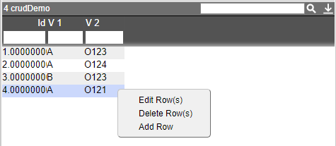
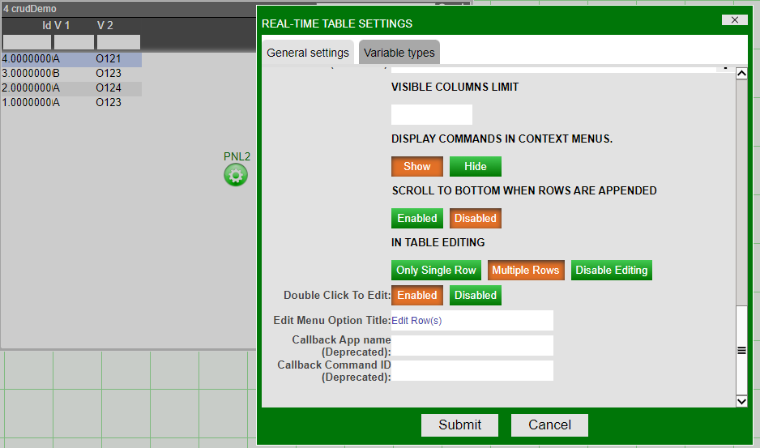
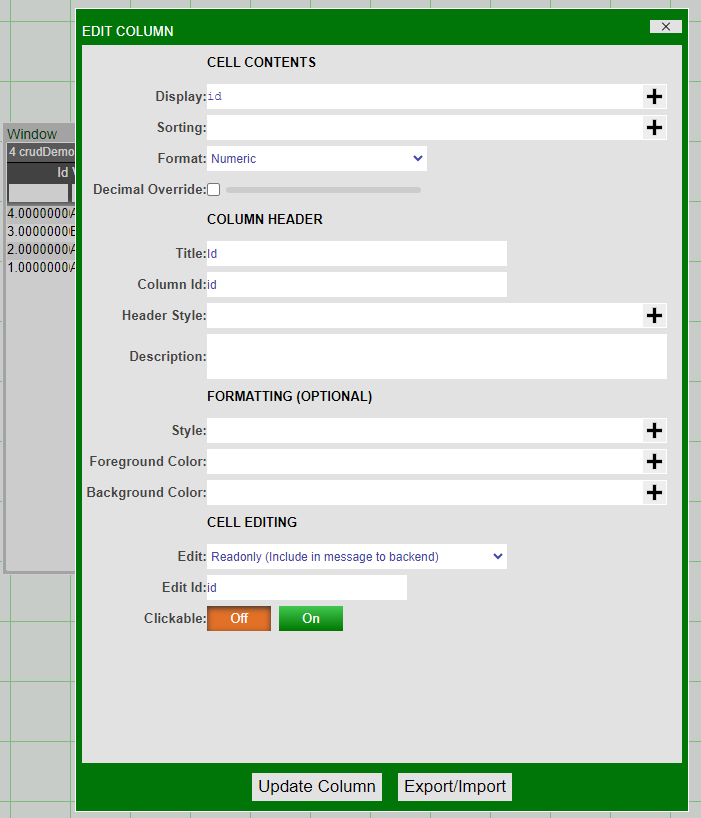

# CRUD Table

CRUD stands for Create, Read, Update, Delete and describes the four key operations for editing the contents of a table. The guide below will show how to create a Realtime Table in AMI with CRUD operations that change the underlying table in the AMIDB.



## Read

First, create a table by running the AmiScript below in **Dashboard \> AMIDB Shell Tool**:

``` amiscript
CREATE PUBLIC TABLE crudDemo(id long, v1 string, v2 string);
INSERT INTO crudDemo VALUES (1,"A","O123"),(2,"A","O124"),(3,"B","O123"),(4,"A","O121");
```

Next, create a new Window/Panel, then **Create Realtime Table / Visualization**. Select the Realtime Feed **crudDemo**, click Next, then Finish. There should now be a Realtime Table with 3 columns and 4 rows.

## Update

Click on the table, then go to **Settings** and change "In Table Editing" to "Single Row" or "Multiple Rows":



Click on the column header of "Id" and select **Edit Column**. Then scroll down and change the **Edit** setting to **Readonly**. Do the same for columns "V 1" and "V 2" setting them to **Text Field**.



Click on the table, then go to **AmiScript Callbacks...** and navigate to the **onEdit(vals, oldVals)** tab and add in the following AmiScript:

``` amiscript
for (row r: vals.getRows()) {
  String updateString = "";
  for (String key: r.getKeys()) {
    updateString += key + "=\"" + r.get(key) + "\", ";
  }
  updateString = updateString.beforeLast(",",true);
  use ds="AMI" execute update crudDemo set ${updateString} where id==${r.get("id")};
}
```

## Create

Click on the table, then go to **Custom Menus \> Add Menu Item**, set Display to "Add Row", then go to the **Callbacks** tab and add in the following AmiScript:

``` amiscript
use ds="AMI" execute insert into crudDemo from select max(id)+1,"","" from t;
```

## Delete

Go to **Custom Menus \> Add Menu Item**, set Display to "Delete Row(s)", then go to the **Callbacks** tab and add in the following AmiScript:

``` amiscript
TablePanel  t = this.getOwner();
for (Row r: t.getSelectedRows()) {
  use ds="AMI" execute delete from crudDemo where id=="${r.get("id")}";
}
```

