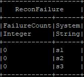
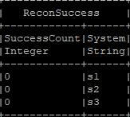
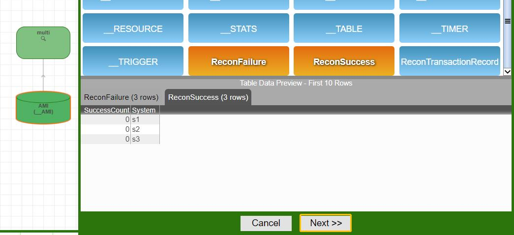
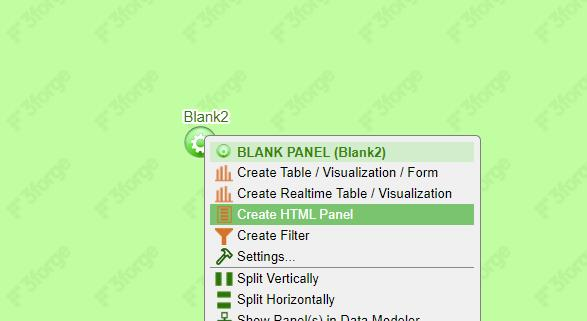
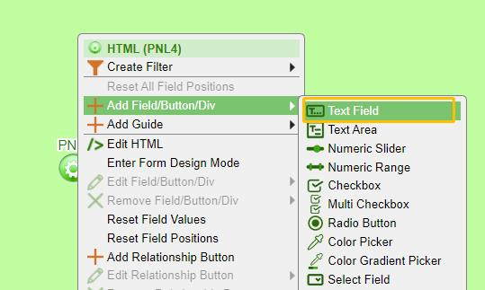
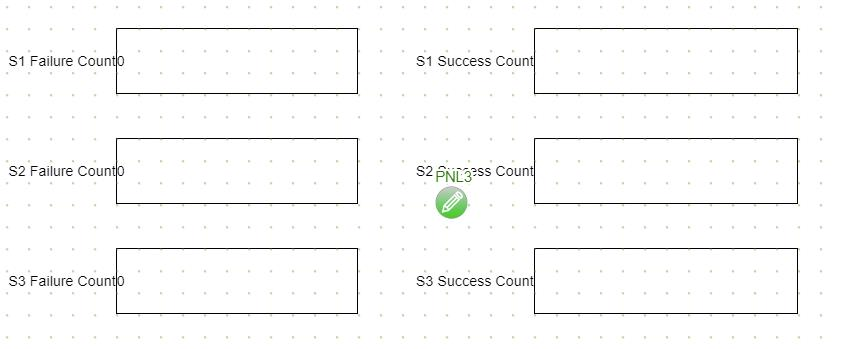
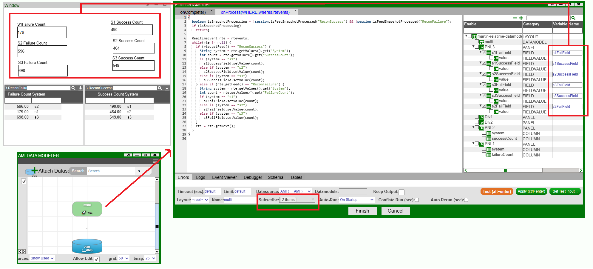
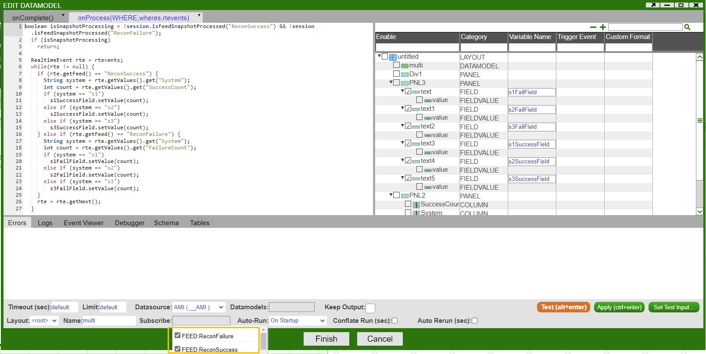
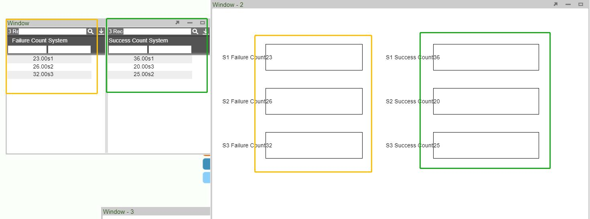

# Data In Forms

Suppose we have two real time tables: **ReconFailure** and **ReconSuccess** that keeps track of successful and failed transactions across different systems in real time, initially set to zero

 

You can use the following code to follow along this tutorial

``` amiscript
drop table if exists ReconFailure;
create public table ReconFailure(FailureCount int, System string);
insert into ReconFailure values(0,"s1"),(0,"s2"),(0,"s3");

drop table if exists ReconSuccess;
create public table ReconSuccess(SuccessCount int, System string);
insert into ReconSuccess values(0,"s1"),(0,"s2"),(0,"s3");
```

1. Build a datamodel against two real time tables **ReconFailure** and **ReconSuccess**  

	  

1. Configure the form fields (using text field in this case)  

	In a new panel, hit the central button, go to **Create HTML Panel**  

	  

	Hit the central button in the middle, go to **Add Field**-\> **Text Field**  
	
	  
	
	Make 6 Text fields as below:  
	
	

1. Edit the datamodel and set up form field variables that match the two real time table schemas  

	  

1. Subscribe to two real time feeds: **ReconFailure** and **ReconSuccess**  

	  

1. Go to **OnProcess** and enter the following code script

	``` amiscript
	boolean isSnapshotProcessing = !session.isFeedSnapshotProcessed("ReconSuccess") && !session.isFeedSnapshotProcessed("ReconFailure");
	  if (isSnapshotProcessing)
	    return;
	  
	  RealtimeEvent rte = rtevents;
	  while(rte != null) {
	    if (rte.getFeed() == "ReconSuccess") {
	      String system = rte.getValues().get("System");
	      int count = rte.getValues().get("SuccessCount");
	      if (system == "s1")
	        s1SuccessField.setValue(count);
	      else if (system == "s2")
	        s2SuccessField.setValue(count);
	      else if (system == "s3")
	        s3SuccessField.setValue(count);
	    } else if (rte.getFeed() == "ReconFailure") {
	      String system = rte.getValues().get("System");
	      int count = rte.getValues().get("FailureCount");
	      if (system == "s1")
	        s1FailField.setValue(count);
	      else if (system == "s2")
	        s2FailField.setValue(count);
	      else if (system == "s3")
	        s3FailField.setValue(count);
	    }
	    rte = rte.getNext();
	  }
	```

1. Set up timers to simulate real time feeds  
For the sake of demonstration, I am using two timers here to update two real time tables **ReconFailure** and **ReconSuccess**. In real life scenarios, you may connect to some external real time feeds.


	``` amiscript title="timer1 to update ReconSuccess"
	create timer SuccessTransaction oftype AMISCRIPT on "500" USE script= "list Systems = new list(\"s1\",\"s2\",\"s3\"); int SysID = rand(3); String sys = Systems.get(SysID); Update ReconSuccess set SuccessCount=SuccessCount+1 where System==sys;"
	```
	
	``` amiscript title="timer2 to update ReconFailure"
	create timer FailureTransaction oftype AMISCRIPT on "500" USE script= "list Systems = new list(\"s1\",\"s2\",\"s3\"); int SysID = rand(3); String sys = Systems.get(SysID); Update ReconFailure set FailureCount=FailureCount+1 where System==sys;"
	```

Once enabling the timer, the figures in the text fields will be in sync with the counts in two real time tables.



