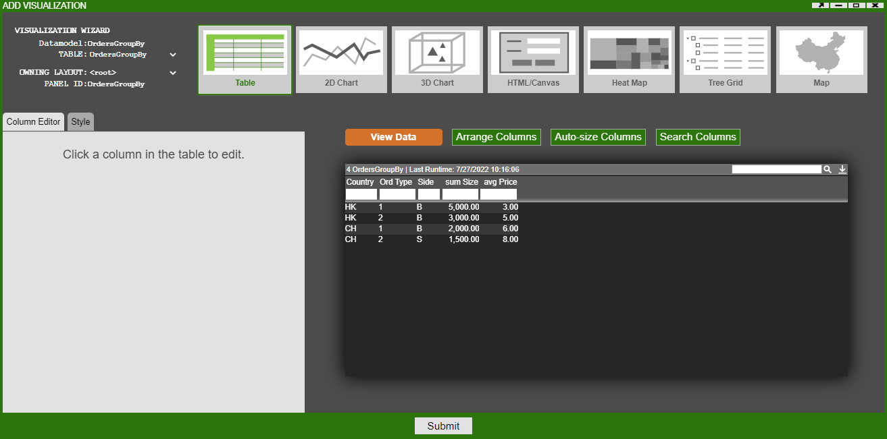
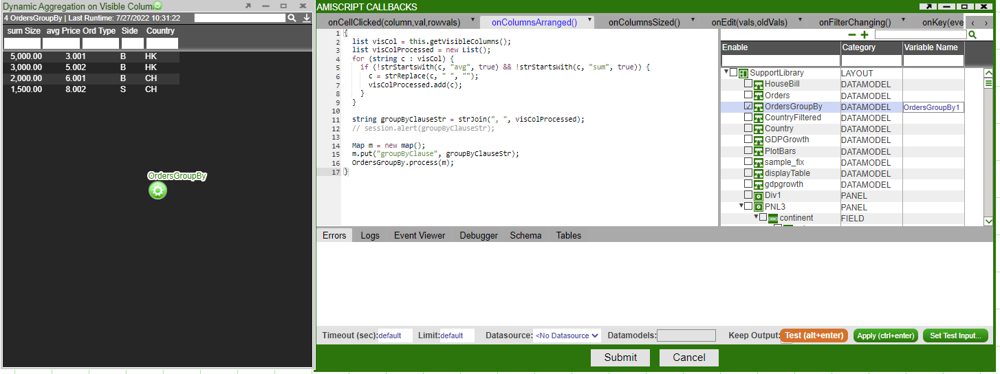

# Dynamic Aggregation Table

In this example we go through the steps showing how a user can use visible columns to drive aggregate columns. This is done by getting the visible columns and using the column names to drive a new query whenever the columns are hidden or shown.

We start by creating a datamodel named **Orders** that produces the **Orders** table with the following data:

``` amiscript
{
  CREATE TABLE Orders(ID int, Country string, Size long, Price double, OrdType string, Side string);
  INSERT INTO Orders Values(1,"HK",5000,3.00,"1","B"), (2,"HK",3000,5.00,"2","B"), (3,"CH",2000,6.00,"1","B"), (4,"CH",1500,8.00,"2","S");
}
```

Next, create a blender named **OrdersGroupBy** on the above datamodel. We need to add and access an argument called *groupByClause* which will be passed into this blender and will store the column names that drive the aggregation. This argument can be accessed from the **wheres** map passed into onProcess(WHERE,wheres,rtevents).

Our argument **groupByClause** can be accessed like so:

``` amiscript
String groupByClause = wheres.get("groupByClause");
```

Use the following code to produce a new table that will have some aggregate columns, in this example we have a column that sums all of the sizes and a column that gives the average price.

We want to add some conditions using an if statement, this is where we make use of the 'groupByClause' we defined previously. Since this argument will contain the column names that drive the aggregation we want to make sure that a table is still created even if the argument is empty. We do this by adding a condition to create a table from our existing columns if no new column is provided.

If we are given a new column name we add this to a select statement. We add the column name both in the select portion and then at the end to group the results of the query.

``` amiscript
{
  CREATE TABLE Orders AS SELECT * FROM Orders WHERE ${WHERE};
  
  String groupByClause = wheres.get("groupByClause");
  
   if (groupByClause == null || groupByClause == "") {
    groupByClause = "Country, OrdType, Side";
    create table OrdersGroupBy as select ${groupByClause}, sum(Size), avg(Price) from Orders group by ${groupByClause};
    // create table OrdersGroupBy as select sum(Size), avg(Price) from Orders;
  }
  else {
    create table OrdersGroupBy as select ${groupByClause}, sum(Size), avg(Price) from Orders group by ${groupByClause}; 
  }
}
```

Next, create a visualization for OrdersGroupBy table.



Now, go to the *AmiScript Callbacks* for the OrdersGroupBy table just created. Within the *onColumnsArranged()* paste the following code. This code first gets a list of all of the visible columns. Then we remove our aggregate columns, in this case we want to remove the sum(Size) and average(Price) columns, these are removed as they are not used in the aggregation but instead just show the results of the aggregation. We add each visible column name to a map m. We process our blender *OrdersGroupBy* and provide our map as the parameter, this map will be parsed as the *wheres* map that we use in the blender.



``` amiscript
{
  list visCol = this.getVisibleColumns();
  list visColProcessed = new List();
  for (string c : visCol) {
    if (!strStartsWith(c, "avg", true) && !strStartsWith(c, "sum", true)) {
      c = strReplace(c, " ", "");
      visColProcessed.add(c);
    }
  }
  
  string groupByClauseStr = strJoin(", ", visColProcessed);
  // session.alert(groupByClauseStr);
  
  Map m = new map();
  m.put("groupByClause", groupByClauseStr); 
  OrdersGroupBy.process(m);
}
```

Before we perform any aggregates, we need to edit the **OrdersGroupBy** blender so that when the *groupByClause* is null or empty we only see the sum(Size) and avg(Price) columns. Our blender should now have the following code snippet:

``` amiscript
{
  CREATE TABLE Orders AS SELECT * FROM Orders WHERE ${WHERE};
  
  String groupByClause = wheres.get("groupByClause");
  
   if (groupByClause == null || groupByClause == "") {
    // groupByClause = "Country, OrdType, Side";
    // create table OrdersGroupBy as select ${groupByClause}, sum(Size), avg(Price) from Orders group by ${groupByClause};
    create table OrdersGroupBy as select sum(Size), avg(Price) from Orders;
  }
  else {
    create table OrdersGroupBy as select ${groupByClause}, sum(Size), avg(Price) from Orders group by ${groupByClause}; 
  }
}
```

We are now ready to hide/show columns and watch the aggregation happen. You can use the *Hide This Column...* option or *Arrange Columns...* option to hide/show columns.

