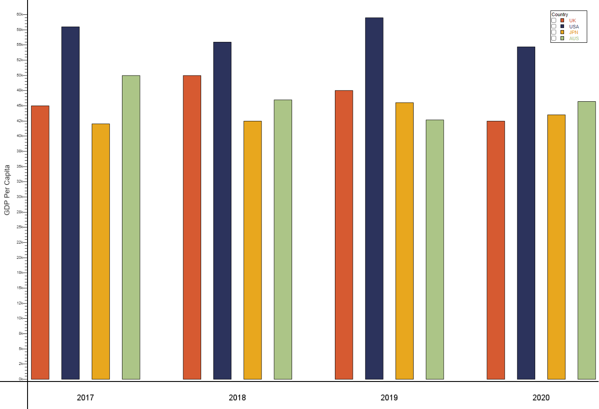
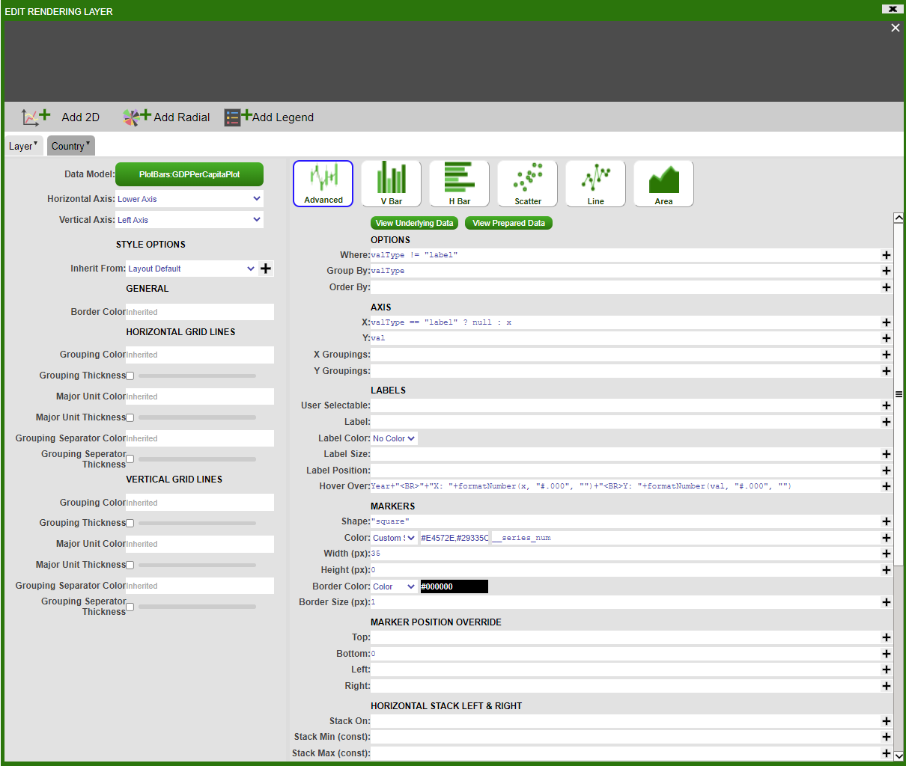
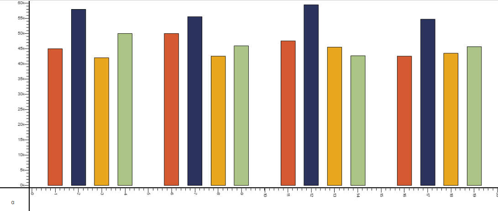
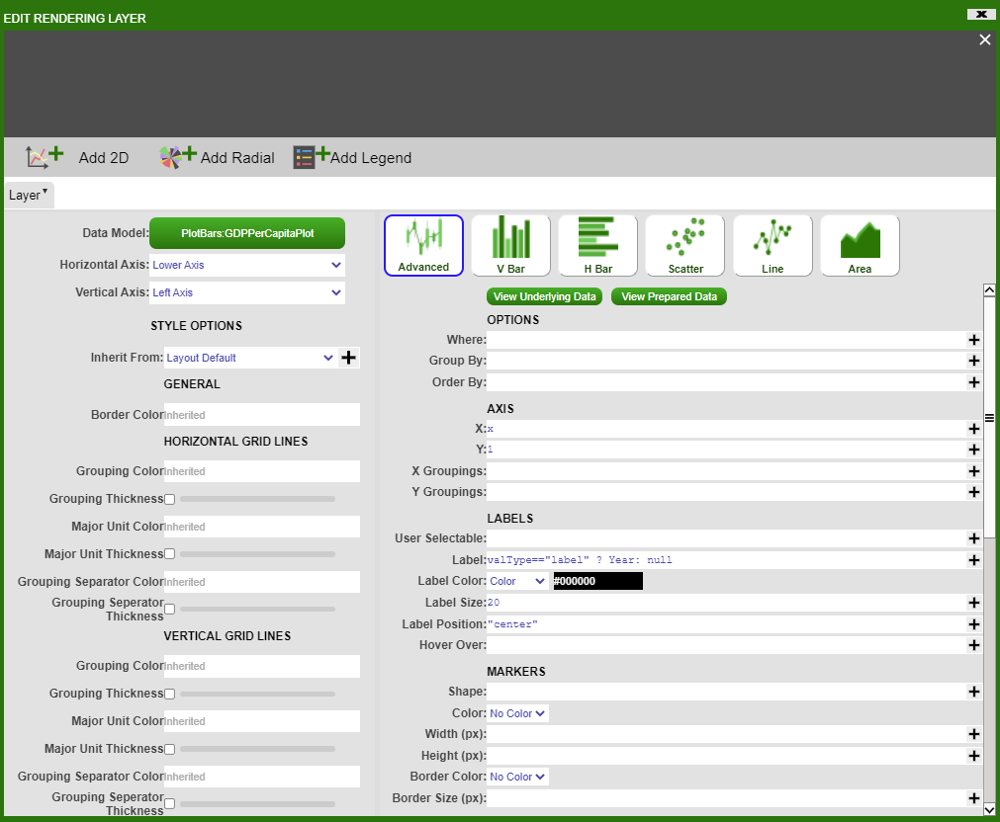

# Grouped Bar Chart

In this example, we will be plotting a grouped bar chart to show the GDP per capita for UK, USA, JPN and AUS between 2017 and 2020. The result looks as such:



To start off with, create a Datamodel with the code snippet below. Once we have a table with our data, in this case `GDPPerCapita` table we need to prepare the dataset to plot the data. The following code snippet prepares the data by creating a table called `GDPPerCapitaPlot`.

``` amiscript
{
 create table GDPPerCapita (Year string, UK double, USA double, JPN double, AUS double);
 insert into GDPPerCapita values ("2017", 45000, 58000, 42000, 50000);
 insert into GDPPerCapita values ("2018", 50000, 55500, 42500, 46000);
 insert into GDPPerCapita values ("2019", 47500, 59500, 45500, 42700);
 insert into GDPPerCapita values ("2020", 42500, 54700, 43500, 45700);
 
 Table t = select * from GDPPerCapita;
 List yearList = select Year from GDPPerCapita;
 List valTypesList = t.getColumnNames();
 valTypesList.remove(t.getColumnLocation("Year"));

 create table GDPPerCapitaPlot (Year string, valType string, x double, val double);
 
 int n = 1;
 for (int i = 0; i < yearList.size(); i++) {
    Row r = t.getRow(i);
    string Year = r.get("Year");
    double ld = 0.0;
    int cnt = 0;
    for (string valType : valTypesList) {
      double val = r.get(valType);
      insert into GDPPerCapitaPlot values (Year, valType, n, val);
      ld += n;
      n += 1;
      cnt += 1;
    }
    ld = ld / cnt;
    insert into GDPPerCapitaPlot values (Year, "label", ld, 1.0);
    n+=1;
  }
}
```

Next, we will add a visualisation to the Datamodel on the `GDPPerCapitaPlot` table. Choose the '2D Chart' - 'Advanced', and fill in the options as below (For 'Color' in 'MARKERS' section choose Custom_Series and add series of colours in hex code for example `#E4572E,#29335C,#F3A712,#A8C686,#669BBC`):



NB. Make sure the options under *Marker Position Override* are filled in as shown.

This will give us the following bar plot:



To add axis and get the final result, add a panel below the bar chart, then add a visualisation based on `GDPPerCapitaPlot` table with the following information:



Editing and styling the axis and the divider gives us the desired chart.

