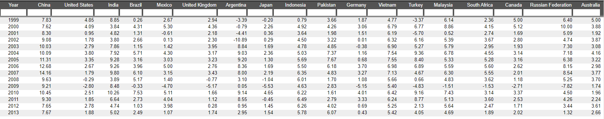
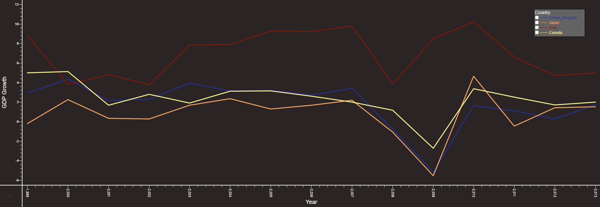
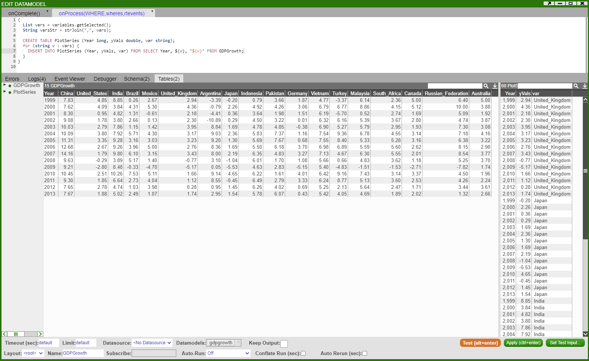
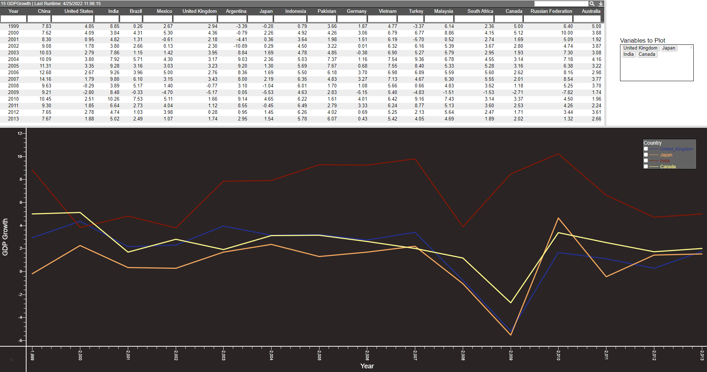

# Multi Line Chart

In this example we will show how to plot multiple line graphs on the same chart panel. We will use a sample dataset that shows the GDP Growth of several countries:



Output will look as such:



The method we will follow is similar to the one before. Firstly, we want to be able to choose the countries we plot, so we will create a HTML panel with a 'Multiple Checkbox' field called 'variables'. Once we have this field set up, insert the following snippet into a Datamodel.

``` amiscript
{ 
  List vars = variables.getSelected();
  String varsStr = strJoin(",", vars);
  
  CREATE TABLE PlotSeries (Year long, yVals double, var string);
  for (string v : vars) {
    INSERT INTO PlotSeries (Year, yVals, var) FROM SELECT Year, ${v}, "${v}" FROM GDPGrowth;
  }
}
```

This creates a table PlotSeries which will be used to plot the graph:



Next create a visualisation on the Datamodel from above using the PlotSeries table and choose '2D Chart' - 'Advanced'. We will add 'Year' on the X-axis and 'yVals' on the Y-axis. We want to group the data by the Countries so add 'vars' in the 'Group By' option. Finally, we want to have the lines for each country represented by a different colour - in the 'Line Colour' option choose 'Series' (to get predetermined colours) or 'Custom Series' (to choose custom colours) and \_\_series_num:



