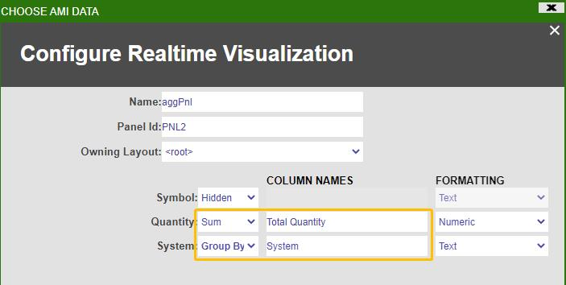

# Pivot Table

There are many ways to create pivot tables, below are some examples:

1. **Summary Of Rows**, this approach is simple to set up and allows users to dynamically look at pivot tables without taking extra screen space

1. **Realtime Aggregate Table**, this approach creates a persistent table

## Summary Of Rows

We may also want to show a summary of the table. The way to do this is to right click the central button on the table you want to show summary of, and go to **settings**. Then scroll all the way down and enable **summary of rows**

 

Once enabled, now we can select the rows we want to show summary of and right click -\> **Summarize selected**

 

## Realtime Aggregate Table

### Aggregation

Once the filters are properly set up, we might also want to do a real-time aggregate table on this. Let's open up a new panel and right click on the central button, select **create realtime table/visualization** and choose **Aggregate Table** widget against **aggPnl** (which is the panel after we apply row & column-wise filters)

 

Next fill in the fields to specify on what columns you want to do aggregation on. Suppose we want to group by only on **System** and return the **sum(Quantity)**, then we can configure the table like this:



The final window that consists both panels may look something like this:


### Dynamically Aligning

Suppose we want to align the following two tables that are situated in two separate panels.


First, we need to make sure that the two tables must have identical column headers. Let's modify the second column header name **Total Quantity** to **Quantity** to match the corresponding column header name in table 1. To do this, let's right click on the second column in table 2 and select **edit column**


Go to the **Column Header**, and modify **Title** field

 

Right click on table1, go to **AmiScript Callbacks** and then go to **OnColumnSized**, enter the following amiscripts and hit **submit**  

``` amiscript
list sourceCols = aggPnl.getVisibleColumns();
for (String col: sourceCols)
{
  summaryPnl.getColumn(col).setWidth(aggPnl.getColumn(col).getWidth());
}
```

 

Now the two tables are fully aligned. You could drag either one of the tables however you want, you will find both tables will always stay aligned and in sync.


