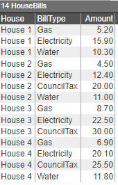
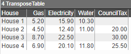
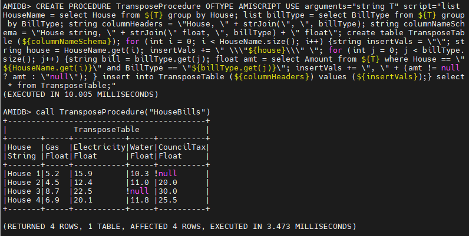
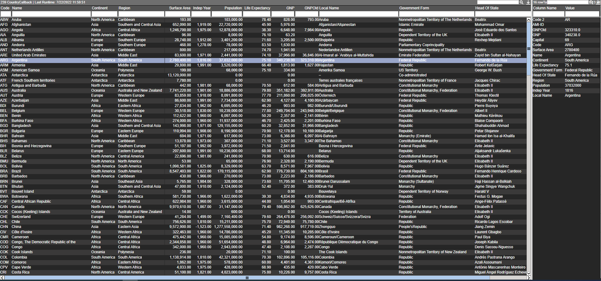
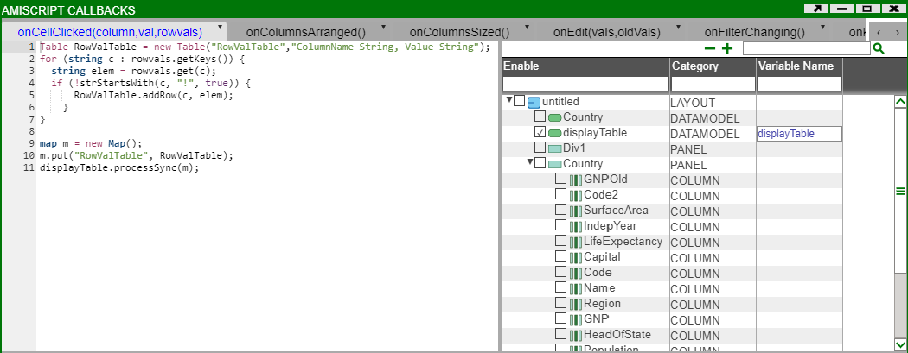

# Transpose Table

In this example we will show how to transpose the data in a table from rows to columns in the frontend and the backend.

## Transpose Entire Table

### Frontend Using Datamodels

First let's create a dummy table from the frontend datamodel:

``` amiscript
{
  USE ds="AMI" EXECUTE CREATE PUBLIC TABLE HouseBills (House string, BillType string, Amount float);
  USE ds="AMI" INSERT INTO HouseBills VALUES ("House 1", "Gas", 5.2), ("House 1", "Electricity", 15.9), ("House 1", "Water", 10.3), 
                                             ("House 2", "Gas", 4.5), ("House 2", "Electricity", 12.4), ("House 2", "CouncilTax", 20), ("House 2", "Water", 11), 
                                             ("House 3", "Gas", 8.7), ("House 3", "Electricity", 22.5), ("House 3", "CouncilTax", 30), 
                                             ("House 4", "Gas", 6.9), ("House 4", "Electricity", 20.1), ("House 4", "CouncilTax", 25.5), ("House 4", "Water", 11.8);
}
```

This gives us the following table:



Now we want to transpose this table so that the column headers are the different bill types and the rows contain the amount for each house. Thus since there are 4 houses, we will get a dataset with 4 rows. By using the following script we can generate our desired output:

``` amiscript
{
  CREATE TABLE HouseBills AS USE  EXECUTE SELECT House, BillType, Amount FROM HouseBills WHERE ${WHERE};
  list HouseName = select House from HouseBills group by House;
  list billType = select BillType from HouseBills group by BillType;
  
  string columnHeaders = "House, " + strJoin(", ", billType);
  string columnNameSchema = "House string, " + strJoin(" float, ", billType) + " float";
  
  create table TransposeTable (${columnNameSchema});
  
  for (int i = 0; i < HouseName.size(); i++) {
    string insertVals = "";
    string house = HouseName.get(i);
    insertVals += "\"${house}\"";
    
    for (int j = 0; j < billType.size(); j++) {
      string bill = billType.get(j);
      float amt = select Amount from HouseBills where House == "${HouseName.get(i)}" and BillType == "${billType.get(j)}";
      insertVals += ", " + (amt != null ? amt : "null");
    }
    
    insert into TransposeTable (${columnHeaders}) values (${insertVals});
  }
}
```

We first create a datamodel on the HouseBills table that is stored in AMI. Next we extract the distinct houses names and bill types, and store it in a list named **HouseName** and **billType** respectively.

We will need to create a schema for the new transposed table - to do this we use unique list containing the bill type and perform a strJoin by adding the data type of those columns (in this case we assign their column type as a float). So the **columnNameSchema** string is:

``` amiscript
House string, Gas float, Electricity float, Water float, CouncilTax float
```

This can now be used to create the **TransposeTable**.

Finally we want to get the amount corresponding to each house and bill type so we perform a for-loop that extracts the required amount and appends it to the string **insertVals**. Note if the amount for a particular bill type doesn't exist then we will assign a null value. Once we have the string of values to insert in the correct format we can insert it into the transpose table. We get the final result as such:



### Backend Using Procedures

We can use the same script as above with a few minor changes to transpose data in the backend. The main difference will come from escaping characters:

```amiscript
CREATE PROCEDURE TransposeProcedure OFTYPE AMISCRIPT USE 
 
  arguments="string T" 
 
  script="list HouseName = select House from ${T} group by House; 
          list billType = select BillType from ${T} group by BillType; 
          
          string columnHeaders = \"House, \" + strJoin(\", \", billType); 
          string columnNameSchema = \"House string, \" + strJoin(\" float, \", billType) + \" float\"; 
          
          create table TransposeTable (${columnNameSchema}); 
          
          for (int i = 0; i < HouseName.size(); i++) {
              string insertVals = \"\"; 
              string house = HouseName.get(i); 
              insertVals += \" \\\"${house}\\\" \"; 
              
              for (int j = 0; j < billType.size(); j++) {
                  string bill = billType.get(j); 
                  float amt = select Amount from ${T} where House == \"${HouseName.get(i)}\" and BillType == \"${billType.get(j)}\"; 
                  insertVals += \", \" + (amt != null ? amt : \"null\"); 
              }
              insert into TransposeTable (${columnHeaders}) values (${insertVals});
          }
          select * from TransposeTable;"
```

NB: for readability purposes the above has new lines and tabs - when writing the procedure ensure that it flows and there are no line breaks:

```amiscript
CREATE PROCEDURE TransposeProcedure OFTYPE AMISCRIPT USE arguments="string T" script="list HouseName = select House from ${T} group by House; list billType = select BillType from ${T} group by BillType; string columnHeaders = \"House, \" + strJoin(\", \", billType); string columnNameSchema = \"House string, \" + strJoin(\" float, \", billType) + \" float\"; create table TransposeTable (${columnNameSchema}); for (int i = 0; i < HouseName.size(); i++) {string insertVals = \"\"; string house = HouseName.get(i); insertVals += \" \\\"${house}\\\" \"; for (int j = 0; j < billType.size(); j++) {string bill = billType.get(j); float amt = select Amount from ${T} where House == \"${HouseName.get(i)}\" and BillType == \"${billType.get(j)}\"; insertVals += \", \" + (amt != null ? amt : \"null\"); } insert into TransposeTable (${columnHeaders}) values (${insertVals});} select * from TransposeTable;"
```



## Transpose Selected Row

In this example we will show how to display the row values from a table in another table. This will be the end result:



Firstly, we will create a table visualisation on the Country table (or table or your choice).

Next create a datamodel with the display table:

``` amiscript
{
  create table RowTable (ColumnName String, Value String);
}
```

Next we want to create a callback such that every time we click on a values in a row it will generate the display table (table in the right panel above). To do this we will use the `#!amiscript onCellClicked(column,val,rowval)` callback under amiscript callbacks for the table panel. The following script will get the row values and the corresponding column names and save it in the table.

``` amiscript
Table RowValTable = new Table("RowValTable","ColumnName String, Value String");
for (string c : rowvals.getKeys()) {  
  string elem = rowvals.get(c);
  if (!strStartsWith(c, "!", true)) {
      RowValTable.addRow(c, elem);
    }
}

map m = new Map();
m.put("RowValTable", RowValTable);
displayTable.processSync(m);
```

Enable the *displayTable* datamodel from the Variable Tree on the right so that the script knows what datamodel to process:



Now we need to make the columns clickable so choose one column (or any number) and under edit column turn on clickable.

Test this and then create a visualisation on the display table in the right panel. Now to have the datamodel containing the display table to update with the row values from the main table, we will update the displayTable code snippet to:

``` amiscript
{
  // create table RowTable (ColumnName String, Value String);
  Table RowValTable = wheres.get("RowValTable");
  create table RowTable as select * from RowValTable;
}
```

NB. when you test this you may get a runtime error of unknown table; you can ignore this error.

Finally, clicking on an clickable cell in the Country table will automatically populate the display table.