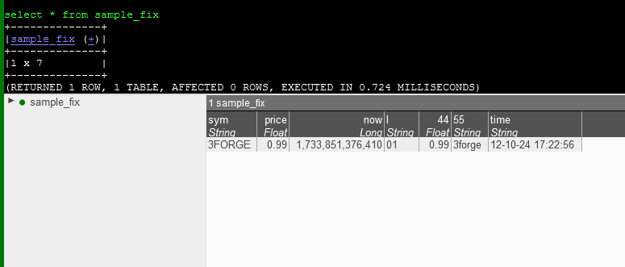

## Relay Properties

Note: To run the ami relay, include `relay` in the list of components found in the the ami.components property, e.g: `ami.components=relay`

### Relay General Properties


```
ami.relay.id
```
: 
    **Default**: Optional 

       - Sets the unique name of the relay. 
       - This is used to distinguish relays on the front end when there are multiple relays connected to a single center.  
       - Each relay should have a unique ID.

```
ami.port
```
: 
   **Default**: `3289` 

      - Sets the port that applications connect to on the relay's host machine.
      - Messages must follow the form specified on [this](../reference/ami_realtime_messages.md) page. 
      - When set to -1, the socket is not started and refuses any connections to the relay.

```
ami.port.bindaddr
```
: 
   **Default**: Optional 

       -  Specifies the network interface that the `ami.port` server port is bound to. 


```
ami.port.keystore.file
```
: 
   **Default**: Optional

      - Path to the keystore file (using Oracle keytool).
   

```
ami.port.keystore.password
```
: 
  **Default**: Optional 

    - Password associated to the keystore file. 


```
ami.port.wait.for.center
```
: 
   **Default**: 

     - The duration to wait for center to start up.
   

```
ami.port.whitelist
```
: 
   **Default**: Optional 

    -   Provide either a list of permitted hostname patterns, or a plugin for blocking/granting access based on foreign network address. 
    -   Syntax: 
        1. file: `file:<file_containing_a_hostname_patterns_per_line\>` 
        2. text: `text:<newline_delimited_list_of_hostname_patterns>` 
        3. plugin: `plugin:<class_name_implementing_com.f1.ami.amicommon.AmiServerSocketEntitlementsPlugin\>` 

```
ami.datasource.plugins
```
: 
    **Default**: List of 3forge-provided datasource adapters (see expandable block)
    ??? info "Datasource adapter list"
        `com.f1.ami.plugins.mysql.AmiMysqlDatasourcePlugin,\
                com.f1.ami.center.ds.AmiKxDatasourcePlugin,\
                com.f1.ami.center.ds.AmiFlatFileDatasourcePlugin,\
                com.f1.ami.center.ds.AmiShellDatasourcePlugin,\
                com.f1.ami.center.ds.AmiAmiDbDatasourcePlugin,\
                com.f1.ami.center.ds.AmiGenericJdbcDatasourcePlugin,\
                com.f1.ami.plugins.postgresql.AmiPostgresqlDatasourcePlugin,\
                com.f1.ami.plugins.oracle.AmiOracleDatasourcePlugin,\
                com.f1.ami.plugins.excel.AmiExcelDatasourcePlugin,\
                com.f1.ami.plugins.db2.AmiDb2DatasourcePlugin,\
                com.f1.ami.plugins.ssh.AmiSshDatasourcePlugin,\
                com.f1.ami.plugins.ssh.AmiSftpDatasourcePlugin,\
                com.f1.ami.center.ds.AmiQuandlDatasourcePlugin,\
                com.f1.ami.center.ds.AmiFredDatasourcePlugin,\
                com.f1.ami.center.ds.AmiOneTickDatasourcePlugin,\
                com.f1.ami.plugins.restapi.AmiRestAPIDatasourcePlugin,\
                com.f1.ami.plugins.sqlite.AmiSqLiteDatasourcePlugin`

    -   Default datasource adapters are provided by AMI and implement the `AmiDatasourcePlugin` interface. 
    -   For custom adapters that we do not provide, see [this](../custom_java_plugins/datasource_adapters.md) documentation to write your own. 

```
ami.center.port
```
: 
   **Default**: `3270`

      - Sets the port of the primary instance of AMI center.
   

```
ami.center.host
```
: 
   **Default**: `localhost`

    - Sets the hostname of the primary instance of AMI center.
   

```
ami.centers
```
: 
  **Default**: Optional 

    - Comma delimted list of centers' `host:port` to connect to.
    - You can optionally prefix a `host:port` with an alias in the form `alias=host:port`, in which case the alias will be used to reference the center within the dashboard. 
    - Note, the first supplied URL is considered the primary center. e.g: 
        1. `ami.centers=myprimary=localhost:3270,other=some.host.com:3270`


```
ami.center.<NAME>.keystore.file
```
: 
  **Default**: Optional 

    -   Supply if center is using an SSL connection. 
    -   Path to the keystore file (using Oracle keytool). 
    -   `NAME` is the center name as it appears in `ami.centers` property.


```
ami.center.<NAME>.keystore.contents.base64
```
: 
  **Default**: Optional 

    -   Alternative to supplying the keystore file if center is using an SSL connection. 
    -   The contents of the keystore as a base64.
    -   `NAME` is the center name as it appears in `ami.centers` property.


```
ami.center.<NAME>.keystore.password
```
: 
  **Default**: 

    -   Supply if center is using an SSL connection.
    -   Password associated with the key store file.
    -   `NAME` is the center name as it appears in `ami.centers` property.

```
ami.relay.persist.dir
```
: 
   **Default**: `./persist` 

    -   Where to store the recovery journal files if `ami.relay.guaranteed.messaging.enabled` is set to `true`.
   

```
ami.relay.guaranteed.messaging.enabled
```
: 
   **Default**: `false` 

    -   If true, the relay will use a store and forward journal to record messages to disk prior to an ACK message being sent to the originating client.  
    -   The journal can also be used to deliver messages to late-subscribing AMI Centers. 

   
```
ami.log.messages
```
: 
   **Default**: `true`

    -   If set to true, all messages sent into and out of AMI relay to/from other applications will be logged to a file.


```
ami.send.cr
```
: 
   **Default**: Optional

    -   If set to true, the relay will send a CR back on each response, in addition to a new line. 

### Email 

You can use AMI to send emails. For an overview of how this works, see the [interoperability](../architecture/advanced_setup.md) section in the advanced AMI set up guide.

To configure email settings, you will need to know the SMTP information of your email provider.

Listed below are the properties required for email setup.

```
email.client.host
``` 
: 
    **Default**: Required 

    -   SMTP server to connect to.

```
email.client.port
```
: 
    **Default**: Required 

    -   The SMTP server port to connect to.

```
email.client.username
```
: 
    **Default**: Required 

    -   Email account username
    
```
email.client.password
```
: 
    **Default**: Required  

    -   Email account password
    
```
email.client.authentication.enabled
```
: 
    **Default**: `true`

    -   Attempts to authenticate user by default. 
    
```
email.client.ssl.protocols
``` 
: 
    **Default**: None 

    - Specify which SSL protocol the email client is using. 
    - Equivalent to the JavaMail property `mail.smtp.ssl.protocols` and has the same valid options. 


```
email.client.ssl.enabled
```
: 
    **Default**: `false` 

    -   Attempts to connect via SSL if enabled.
    
```
email.client.start.tls.enabled
```
: 
    **Default**: `true` 

    -   Attempts to connect via TLS if supported by the server.
    
```
email.client.retries.count
```
: 
    **Default**: `3` 

    -   Number of attempts to reconnect to SMTP server if connection fails.
    
```
email.client.exit.on.error
``` 
: 
    **Default**: `true` 

    - Determines whether to exit AMI if there is an email connection error. 
    - Set to `false` to keep AMI running even if email connection fails.

```
email.client.connection.timeout
``` 
: 
    **Default**: `-1` (None)

    - Upon losing connection with the email client, how long to wait before timing it out. 

```
email.client.timeout
```
: 
    **Default**: `-1` (None)

    - How long to wait before timing out the email client. 

```
email.client.write.timeout
``` 
: 
    **Default**: `-1` (None)

    - How long to wait before timing out a write operation. 
     
```
email.client.debug.enabled
```
: 
    **Default**: `false` 

    -   If set to `true`, allows AMI to add email-related information to the log.
    


## Relay Transformations


### Overview

By default, relays connected to multiple centers will send messages to all centers. 

It is possible to route messages only to specific centers, or implement transformations to map messages to a specific format before reaching a given center to avoid redundant calculations. 

To set up relay transformations, you will need the following files:

- [`relay.transforms`](#relaytransforms-file) 
    - Defines the transformations of some relay message. 

- [`relay.routes`](#relayroutes-file) 
    - Defines which centers the messages are routed to. 

- `<SOME_FILE>.relay.dictionary` 
    - Defines the specific mapping of some relay message.

These files are used to define any transformation logic the relay should perform before sending messages to the center, and which centers they should be sent to. 

The configurable properties for using relay transformations is listed below.

### Properties

```
ami.relay.transforms.file
```
: 
   **Default**: `data/relay.transforms`

    -   File containing relay transformation rules to be applied. 
    -   See the [`relay.transforms`](#relaytransforms-file) file below for details.

```
ami.relay.transforms.debug
```
: 
   **Default**: `false`

    -   Optional logging file.
  
```
ami.relay.dictionary.files
```
: 
   **Default**: `data/*.relay.dictionary`

    -   Files containing dictionaries for relay transform mappings. 
    -   Alternatively can be supplied as a comma-delimited list of different dictionary files.
    -   See the [`relay.transforms`](#relaytransforms-file) and [Dictionary Files](#dictionary-files) sections below for details.
   

```
ami.relay.routes.file
```
: 
   **Default**: `data/relay.routes`

    -   File containing routing tables used for controlling which real-time streaming messages are sent to which center(s).
    -   See the [Relay Routes](#relayroutes-file) file below for details. 
    -   If a file is not found, a placeholder with instructions will be created.
   

```
ami.relay.routes.debug
```
: 
   **Default**: `false`

    -   Optional logging file.
   


### `relay.transforms` File 

Relay transformations are applied to messages that are arriving from some feedhandler before they are routed and then processed by an AMI center. 

This reduces overall computation by the center by doing pre-processing ensuring messages are in the correct format for each center they are intended for. 

Relay transformations are defined in the `relay.transforms` file where each line describes a transformation rule with the format:

```
TRANSFORM_NAME;PRIORITY;OBJECT_TYPES;DICTIONARY;EXPRESSION;OPTIONS;ON_TRUE;ON_FALSE
```

Each parameter is detailed below.


| Parameter | Description |
|-----------|-------------|
| `TRANSFORM_NAME` | Unique name of the transform.
| `PRIORITY` | Highest priority executes first. Lower numbers have higher priority, with 0 being the highest priority. Ties determined using alphabetical route name. |
| `OBJECT_TYPES` | Comma delimited list of types (`T=...`) to evaluate by this transform. Blank - skip rule, * - all types, Use Target=Source to map. |
| `DICTIONARY` | Optional dictionary to apply form transforming fields. If empty, no field transforms are applied. |
| `EXPRESSION` | Expression to evaluate on source values, must return boolean. True return value indicates rule succeeded. |
| `OPTIONS` | Comma delimited list of options: `PASSHTROUGH` - Include unmapped fields in the output. |
| `ON_TRUE` | Action if Table matches: BREAK - stop evaluating rules, blank - continue evaluating next rule. |
| `ON_FALSE` | Action if Table does not match: BREAK - stop evaluating rules, blank - Continue evaluating next rule. |


### Dictionary Files

To specify the actual mapping a transform rule uses requires a dictionary file in the format `<some_dictionary>.relay.dictionary`. 

This should contain the mapping for any transform methods that are called in `relay.transforms` (corresponding to the `DICTIONARY` parameter). For example:

```
RawFix { price = `44`;}
```

This transforms a message with an input parameter of "44" to be processed by the center with the key "price" instead.


Dictionaries can also be used to extend one another. For example:

```
FixDictionary extends RawFix{ String `55`; sym=`55`.toUpper(); now=timestamp(); }
RawFix { price=`44`; }
```

`FixDictionary` extends the `RawFix` dictionary so that it also maps the input key "55" to a column titled "sym" and then capitalizes the input string using the AMI center method `#!amiscript toUpper()`.

Relay transformations can apply AMI center methods, such as `#!amiscript timestamp()`. To see a full list of accepted methods for relay transformations, run the command `#!amiscript SHOW METHODS;` in the AMIDB Shell Tool. 


#### Example

In the `amione/data` directory, create a `sample.relay.dictionary` file with the following dictionaries: 

```
RawFix { price=`44`; }
FixDictionary extends RawFix { String `55`; sym=`55`.toUpper(); }

TimeString {
  time = formatDate(timestamp(),"MM-dd-yy HH:mm:ss", "GMT");
}
```

In `relay.transforms`, add the following lines: 

```
Transform_fix;0;*;FixDictionary;true;PASSTHROUGH;;
Transform_number;0;*;TimeString;true;PASSTHROUGH;;
```

Fix-style messages will be inserted into an AMI table with two transformations applied: 

1. Transforms the headers into "price" and "sym."
2. Takes the time the message was sent and converts it into a readable date format.

Send the following message to the relay via the configured `ami.port` (this is 3289 by default):

```
O|I="01"|T="sample_fix"|44=0.99|55="3forge"

```

This will create a table "sample_fix" in AMI center and insert the following row. 




### `relay.routes` File 

Any number of relays can be connected to any number of centers that have been specified in the properties (`ami.centers`). By default, as messages are sent from an external source into a relay, they are forwarded to all centers. 

To determine if messages should be sent to specific centers, rules can be added to the `relay.routes` file. This allows you to control which centers are receiving messages based on some parameters within a message and/or the structure of the message itself. 

!!! Note
    To support dynamic routing, changes to this file during runtime will take effect immediately.

Each line in the relay routes file is an isolated rule, with the following format:

```
ROUTE_NAME;PRIORITY;MESSAGE_TYPES;OBJECT_TYPES;PARAM_TYPES;EXPRESSION;ROUTE_LIST;SUCCESS_ACTION;FAIL_ACTION;SKIP_ACTION
```

| Parameter     | Description                                                                                                                                                   |
|---------------|---------------------------------------------------------------------------------------------------------------------------------------------------------------|
| `ROUTE_NAME   ` | Unique name of rule                                                                                                                                           |
| `PRIORITY     ` | Higher priority rules execute first. Lower numbers have higher priority, with 0 being the highest priority. Ties are determined using alphabetical route name. |
| `MESSAGE_TYPES` | Comma delimited list of messages types. Only O (object), D (delete), C (Command) and S (Status) are supported, * - all types.                                 |
| `OBJECT_TYPES ` | Comma delimited list of types to evaluate by this rule. Blank - skip rule, * - all. types.                                                                     |
| `PARAM_TYPES  ` | Comma delimited list of param types for the rule in the format: Name Type [nonull]                                                                          |
| `EXPRESSION   ` | Expression to evaluate, must return boolean. True return value indicates rule  succeeded.                                                                        |
| `ROUTE_LIST   ` | Comma delimited list of centers to send message to. Blank - no centers, * - all. servers.                                                                      |
| `ON_TRUE      ` | Action if Expression returns true: BREAK - stop evaluating rules, blank or CONTINUE - continue evaluating next rule.                                           |
| `ON_FALSE     ` | Action if Expression returns false or null: BREAK - stop evaluating rules, blank or CONTINUE - Continue evaluating next rule.                                  |

Starting at the highest priority rule (lowest number), if the `MESSAGE_TYPES` and `OBJECT_TYPES` and `PARAM_TYPES` match the message, then the fields defined in the `PARAM_TYPES` are extracted from the message and passed into the `EXPRESSION`. If the expression returns "true," then the message is sent to all centers in the `ROUTE_LIST`. The `ON_TRUE`, `ON_FALSE` determine what logic should be exectued next dependant on the outcome.

#### Notes

-   Lines starting with a hash (#) are considered comments and skipped
-   A particular message will only be sent to a particular center at most once, regardless of how many rules it matches

#### Example

```
#For NewOrder and Cancel messages with a symbol, route based on symbol. For all other messages router to all centers
RULE0;0;O,D;NewOrder,Cancel;Symbol String nonull;symbol < "F";Center0;BREAK;
RULE1;1;O,D;NewOrder,Cancel;Symbol String nonull;symbol < "Q";Center1;BREAK;
RULE2;2;O,D;NewOrder,Cancel;Symbol String nonull;true;Center2,Center3;BREAK;
RULE3;3;*;*;;true;*;BREAK;
```

Example messages:

```
O|T="NewOrder"|Symbol="AAPL"     <== will be sent Center0
O|T="NewOrder"|Symbol="IBM"      <== will be sent Center1
O|T="NewOrder"|Symbol="ZVZZT"    <== will be sent to both Center2,Center3
```


