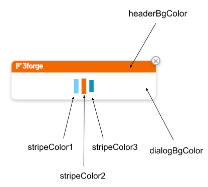

# Web

## Web Properties 

This document contains a list of configurable properties for the AMI web component. To run AMI web, make sure that it is included in your `ami.components` property: 

```
ami.components=web
```

### License

```
ami.license.file
``` 
: 
  **Default**: `/f1license.txt` 

    - The file containing your AMI license.   

```
ami.web.disable.license.wizard
```
: 
  **Default**: `false`

    - Hide the *Help -> Enter/Update License* menu item, even when not in developer mode.

```
ami.web.license.auth.url
``` 
: 
  **Default**: `https://3forge.com`

    - The URL for connecting to 3forge's server and generating license keys via *Help -> Enter/Update License*. 

```
f1.license.warning.days
```

: 
  **Default**: `30` 

    - The number of days prior to a valid license expiring that a warning message will start appearing on the login page.

```
f1.license.file
```
: 
  **Default**: `amione` 

    - The path to your `f1license.txt` file. 


### HTTP/HTTPS Connection

```
http.port
``` 
: 
  **Default**: `33332` 

    - Sets the port that web browsers use to connect to AMI Web. 


```
https.port
```
: 
  **Default**: Optional 

    - Sets the port that web browsers use to connect securely to AMI Web.


```
https.keystore.file
```
: 
  **Default**: Optional 

    -   Path to the keystore file (using Oracle keytool).


```
https.keystore.password
```
: 
  **Default**: Optional 

    -   Password associated to the keystore file. 

```
ami.web.http.connections.max
```
: 
  **Default**: `100` 

    - The maximum number of concurrent http connections (for preventing DOS attacks).


```
ami.web.http.debug
``` 
: 
  **Default**: `off` (Optional) 

    -   Debug options for web:
        1.  `off`
        2.  `on`
        3.  `verbose`

```
ami.web.http.debug.max.bytes
``` 
: 
  **Default**: `10240` (Optional) 

    -   Max number of bytes to store debug data if using `verbose`.


```
ami.web.http.connections.timeout.ms
```
: 
  **Default**: `30000` 

    - The number of milliseconds before an idle http connection is closed. 


```
http.port.bindaddr
```
: 
  **Default**: Optional 

    - Specifies the network interface that the `http.port` server port will be bound to.

```
https.port.bindaddr
```
: 
  **Default**: Optional 

    - Specifies the network interface that the `https.port` server port will be bound to.

```
http.port.whitelist
```
: 
  **Default**: Optional 
  
    -   Provide either a list of permitted hostname patterns, or a plugin for blocking/granting access based on foreign network address. 
    -   Syntax: 
        1. file: `file:<file_containing_a_hostname_patterns_per_line\>` 
        2. text: `text:<newline_delimited_list_of_hostname_patterns>` 
        3. plugin: `plugin:<class_name_implementing_com.f1.ami.amicommon.AmiServerSocketEntitlementsPlugin\>` 

```
https.port.whitelist
```
: 
  **Default**: Optional 
  
    -   Provide either a list of permitted hostname patterns, or a plugin for blocking/granting access based on foreign network address. 
    -   Syntax: 
        1. file: `file:<file_containing_a_hostname_patterns_per_line\>` 
        2. text: `text:<newline_delimited_list_of_hostname_patterns>` 
        3. plugin: `plugin:<class_name_implementing_com.f1.ami.amicommon.AmiServerSocketEntitlementsPlugin\>` 

### Session Options

```
ami.session.cookiename
```
: 
  **Default**: `F1SESSION` 

    - Name of the cookie to store in the web browser for the sessionid. 
    - If multiple AMI instances are sharing a host then each must have a unique cookie name.

```
ami.web.resources.dir
```
: 
  **Default**: `web_resources`

    -   Path to directory for web-server hosted resources.
    -   Accessed via the front end in *Dashboard -> Resource Manager*.

```
ami.web.resource.cache.ttl
``` 
: 
  **Default**: `"60 SECONDS"` (Optional)  

    -   Time in seconds that a resource can be valid in the cache for before expiring.


[//]:#(ami.web.resource.timeout.seconds: technically, this property doesn't exist -- its spun up in the log file, but not called anywhere in the source code) 

```
ami.web.resource.timeout.seconds
``` 
: 
  **Default**: `10` 

    -   Time in seconds before an attempt to access a resource times out.

```
ami.session.check.period.seconds
```
: 
  **Default**: `60` 

    - The number of seconds between which AMI checks and removes expired sessions (disconnects, closed browsers, etc). 

```
ami.session.timeout.seconds
```
: 
  **Default**: `300` 

    - The number of seconds that must pass before a session is considered expired, thus logging the user out. 
    - Starts from when the browser tab or session is no longer visible (i.e, closing the tab, session chooser).


```
ami.allow.site.framed
```
: 
  **Default**: `true` (Optional)

    - Allow the AMI webpage to be framed inside an iframe. 

    - If false, then x-Frame-Options and SameSite options are included in header.

[//]:#(`ami.allow.same.site` not sure what this does -- probably the samesite options from above?)

```
amiscript.variable.<VARNAME>
```
: 
  **Default**: Optional

    -   Declare a readonly variable available in the web. 
    -   The value must be properly formatted to indicate the type. 
    -   You can see variables via Dashboard > Session Variables, e.g: 

        1.   `amiscript.variable.hello="world"  //declare the string hello with value "world"`
        2.   `amiscript.variable.num=123L  //declare a long named "num"`
    
    -   You can access variables with `session.getProperty("yourPropertyName")`  or by referencing the variable directly `yourPropertyName`. Note that the first approach will return `null` if the property isn't set, the second will throw an error.

```   
users.access.file.encrypt.mode
``` 
: 
  **Default**: `off` (Optional) 

    - `off` indicates the access.txt file is plain text.  
    - Can be set to `password` which indicates that the password portion must be encrypted. See strEncrypt(...) function for encrypting passwords. 
    
```    
ami.centers
```
: 
  **Default**: Optional 

    - Comma delimted list of centers' `host:port` to connect to.
    - You can optionally prefix a `host:port` with an alias in the form `alias=host:port`, in which case the alias will be used to reference the center within the dashboard. 
    - Note, the first supplied URL is considered the primary center. e.g: 
        1. `ami.centers=myprimary=localhost:3270,other=some.host.com:3270`

```
ami.center.<NAME>.keystore.contents.base64
``` 
: 
  **Default**: Optional 

    -   Alternative to supplying the keystore file if center is using an SSL connection. 
    -   The contents of the keystore as a base64.
    -   `NAME` is the center name as it appears in `ami.centers` property.


```
ami.center.<NAME>.keystore.file
```
: 
  **Default**: Optional 

    -   Supply if center is using an SSL connection. 
    -   Path to the keystore file (using Oracle keytool). 
    -   `NAME` is the center name as it appears in `ami.centers` property.

```
ami.center.<NAME>.keystore.password
``` 
: 
  **Default**: 

    -   Supply if center is using an SSL connection.
    -   Password associated with the keystore file.
    -   `NAME` is the center name as it appears in `ami.centers` property.

```  
ami.web.http.slow.response.warn.ms
```

: 
  **Default**: `5000` 

    -   Log a warning if a full round trip http request/response is greater than the specified duration in milliseconds.

```  
ami.web.show.wait.icon.after.duration
``` 

: 
  **Default**: `2000` 

    -   Duration in milliseconds before displaying the loading/waiting icon.

```
ami.slow.amiscript.warn.ms
```

: 
  **Default**: `1000` 

    -   Log a warning if an amiscript block can not be executed the specified duration in milliseconds.

```  
ami.web.portal.dialog.header.title
```
: 
  **Default**: Optional 

    -   Title on the portal dialog header (i.e. loading and error dialogs). 


### Developer Options

```
ami.autosave.dir
```
: 
  **Default**: `data/autosave` 

    -   Directory where autosaved versions of the layout are saved.

```
ami.autosave.count
```
: 
  **Default**: `100` (Optional) 

    -   The minimum number of backup revisions of layouts that should be saved per user.

```
ami.autosave.layout.frequency
``` 
: 
  **Default**: `"15 MINUTES"` 

    - How often in minutes layouts should be automatically saved to the backup log file.
            
```
ami.messages.max.info
``` 
: 
  **Default**: `100` 
  
    -   Maximum number of debug/info messages to store for debugging purposes in edit mode.
            

```
ami.messages.max.warn
``` 
: 
  **Default**: `100` 

    -    Maximum number of warming messages to store for debugging purposes in edit mode. 
            

### Login Options


```
ami.login.page.animated
```
: 
  **Default**: `true` 
   
    - Boolean indicating if login page should display animated background. 
    - Recommended to set to false if used on remote desktops.  

```
ami.login.page.terms.and.conditions.file
```
: 
  **Default**: Optional 

    - File to include in the login page, requiring user to acknowledge the terms and conditions before logging in.
   

```
ami.login.default.user
```
: 
  **Default**: `demo` 

    - Default username for logging into AMI.
   

```
ami.login.default.pass
```
: 
  **Default**: `demo123` 

    - Default password for logging into AMI.
   

```
ami.login.page.logo.file
```
: 
  **Default**: Optional 

    - Path to file containing image for login in login screen.
    - Image will be scaled to a pixel width and height of 350x200.
   


```
ami.web.message.license.expires
```
: 
  **Default**: `WARNING: License Expires soon:` 

    - Message shown if no license file is given.


```
ami.web.message.max.sessions
```
: 
  **Default**: `Session limit reached, please choose a current session below` 

    - Message displayed if the maximum number of sessions is exceeded (browsers of AMI open).
   

```
web.title
```
: 
  **Default**: `3forge AMI` 

    - Name of the AMI tab in the browser.

```
ami.login.page.title
```
: 
  **Default**: Optional 
  
    - Suffix added to the login page tab's title as viewed in the browser.
    - Appended to "3forge -".


```
contact.email
``` 
: 
  **Default**: `"support@3forge.com?subject=Ami Account Request"` 

    - The email address for contacting support on a login issue, or to create a new account. 
  
```
web.title
``` 
: 
  **Default**: `3forge AMI` 

    - Name of the web browser tab.

```
web.favicon
``` 
: 
  **Default**: `rsc/favicon.ico` 

    - The icon to put in the tab.
    - The default is the 3forge logo. 


```
ami.web.splashscreen.info.html
``` 
: 
  **Default**: Optional 

    - Information to show on the splashscreen (rendered as html).

```
ami.web.default.MAXSESSIONS
```
: 
  **Default**: `1` 

    - Maximum number of sessions allowed per cookie. 
    - Each AMI instance will have one cookie that is shared across different sessions of AMI in the same browser, unless incognito mode is used or supplied a different cookie file.


### Plugins

```
ami.web.auth.plugin.class
```
: 
  **Default**: Optional 

    - Class name of the custom authenticator plugin. 
    - Must implement the `AmiAuthenticatorPlugin` interface and be deposited in the plugin directory (`amione/lib`). 
    - More information on implementation can be found [here](../custom_java_plugins/entitlements.md)

```
amiscript.custom.classes 
```
: 
  **Default**: Optional 

    - A comma-delimited list of classes to include for access within AmiScript. 
    - See the [custom class](../custom_java_plugins/amiscript_classes.md) documentation for more details on implementation.

```
ami.style.files
```
: 
  **Default**: `data/styles/*.amistyle.json` 

    - Comma-delimited list of files (wildcards supported) which containA AMI styles. 
    - See *Menu -> Dashboard -> Style Manager* within AMI.


```
ami.web.panels
```
: 
  **Default**: `mapbox` 

    - Comma-delimited list of custom panel type configurations. 

```
ami.auth.timeout.ms
```
: 
  **Default**: `5000` 

    - Amount of time in milliseconds before AMI assumes the authentication plugin has timed out. 

```
ami.auth.retry.ms
```
: 
  **Default**: Optional 

    - Amount of time in milliseconds before AMI attempts to send the next authentication request.

```
ami.auth.concurrent.max.wait.ms
```
: 
  **Default**: Optional 

    - The maximimum amount of time in milliseconds AMI will wait before allowing another authentication request to be sent. 

```
ami.web.data.filter.plugin.class
```
: 
  **Default**: Optional 

    - Class name of custom data filter used to restrict data access. 
    - Must implement the `AmiWebDataFilterPlugin` interface and be deposited in the plugin directory (`amione/lib`). 
    - See the [data filter](../custom_java_plugins/data_filter.md) documentation on how to implement. 

```
ami.guiservice.plugins
```
: 
  **Default**: Optional 

    - A comma-delimited list of class names implementing the `AmiWebGuiServicePlugin` interface. 
    - For more information on implementation, see [custom panels and Javascript](../custom_java_plugins/html_and_javascript.md).

```
ami.web.permitted.cors.origins
```
: 
  **Default**: `*` 

    - Control which origins are accepted in AMI Remote Procedure Calling (RPC). 
    - Please refer to the [Mozilla documentation on CORS](https://developer.mozilla.org/en-US/docs/Web/HTTP/CORS)


## Layouts and User Files 

These properties are useful for controlling different levels of user access to layouts. 

They can also to set default user behavior for layout access as well as other user settings. 

To fine-tune specific user settings, please refer to the guide on [this](../web/users_and_sessions.md/#settings) page, or see the user settings properties [below](#user-settings).

```
users.access.file
```
: 
  **Default**: `./data/access.txt`

    - Location of the `access.txt` file. 
    - See User Parameters section below. 

```
users.path
```
: 
  **Default**: `data/users` 

    - Directory containing the `.ami_settings` user files and the user preference files. 

```
ami.shared.layouts.dir
```
: 
  **Default**: `config//../data/shared` 

    - Base directory of where shared layouts are stored (layouts available to end non-dev users). 

```
ami.cloud.dir
```
: 
  **Default**: `data/cloud`

    - Base directory of the AMI One root installation's cloud directory. 
    - Layouts and user settings saved to the cloud will be stored in this directory. 


[//]: #(ami.users.file)
[//]: #(`ami.users.file`: file name of the users configuration file. See "Access Configuration File for Web" section for details.)
[//]: #(N.B I've commented this out since it's commented out throughout the source code)

```
ami.font.files
```
: 
  **Default**: `./data/fonts/*.ttf`

    - A list of true type font files (.ttf) to load which will be available for use in dashboards. 
    - May include wild cards, e.g: `my/fonts/*.ttf`


```
ami.fonts.in.browser
```
: 
  **Default**: `Arial,Courier,Georgia,Impact,Lucida,Times New Roman,Verdana,Segoe UI`

    - A list of font family names that are assumed to be available in the browser. 
    - To supply your own `.ttf` file of one of these fonts, or override it, you need remove to remove the font family from the property. 

    
```
ami.webmanager.host
```
: 
  **Default**: Optional 

    - Optional location for where to access webmanager, used for remotely loading files.  
    - If not specified, the local file system is used. 

```
ami.webmanager.port
```
: 
  **Default**: Optional 

    - Optional location for where to access webmanager. 
    - Used for remotely loading files. 


### Default Layout

The default layout refers to the layout loaded when a given user logs in. 

Each property has a set priority level ranging from 0 (highest priority) and higher (lower priority). 

For example, the property `ami.web.default.DEFAULT_LAYOUT` has a priority of 0, so all other properties will be ignored. 


| Property                                 | Priority Level           |
|------------------------------------------|--------------------------|
| `ami.web.default.DEFAULT_LAYOUT`         | PRIORITY 0               |
| `ami.web.default.layout`                 | PRIORITY 1               |
| `ami_layout_shared` in `access.txt` file | PRIORITY 2               |
| `ami.web.default.layout.shared`          | PRIORITY 3 (deprecated)  |


#### Properties

```
ami.web.default.layout.shared
```
: 
  **Default**: DEPRECATED 
  
    - Use `ami.web.default.DEFAULT_LAYOUT` instead.
    - See the [deprecated layout properties](#deprecated) for more information. 

```
ami.web.default.layout
``` 
: 
  **Default**: DEPRECATED

    - Name of the layout's file name, supplied as `SHARED:default_layout.ami`.
    - Use `ami.web.default.DEFAULT_LAYOUT` instead.
    - See the [deprecated layout properties](#deprecated) for more information. 


```
ami.web.default.LAYOUTS
```
: 
  **Default**: Optional 

    - A comma-delimited list of layout names that are accessible for all users (non-dev and non-admin).
    - Stored in the `data/cloud` directory of the AMI One root installation unless otherwise specified. 
    - If otherwise specified, the file must be supplied as either `ABSOLUTE`, `LOCAL`, `CLOUD`, or `SHARED`: 

        - e.g: `ABSOLUTE:path/to/layout1.ami,ABSOLUTE:...`

```
ami.web.default.DEFAULT_LAYOUT
```
: 
  **Default**: Optional 

    - The default layout loaded on login.
    - Stored in the `data/cloud` directory of the AMI One root installation unless otherwise specified.
    - If otherwise specified, the file must be supplied as either `ABSOLUTE`, `LOCAL`, `CLOUD`, or `SHARED`: 

        - e.g: `ABSOLUTE:path/to/default_layout.ami`


!!!Note 
    Using `ami.web.default.layout.shared` in conjunction with `ami.shared.layouts.dir=path/to/dir` will load a specific layout to **every** user who logs in, regardless of if they are present in `access.txt`, or if using an authenticator plugin.


### User-Specific Default Layout 

The properties above will apply for *all* users in `access.txt`. 

To specify the default layout for specific users via `access.txt`, you can supply the filename of the layout using the `DEFAULT_LAYOUT` flag. This corresponds to the property `ami.web.default.DEFAULT_LAYOUT`. 

For example: 

```
user1|123456|ISADMIN=true|ISDEV=true|DEFAULT_LAYOUT=user1_defaultLayout.ami
user2|123456|ISADMIN=true|ISDEV=true|DEFAULT_LAYOUT=user2_defaultLayout.ami
```

This `access.txt` file determines that `user1`'s default layout is the file `user1_defaultLayout.ami`. The user `user2`'s default layout is `user2_defaultLayout.ami`. 

<br>

You can also supply the default layout using the `ami_layout_shared` property in `access.txt` (priority 2). The format is as follows:

```
user|password|ami_layout_shared=<some_layout.ami>
```

Using the `DEFAULT_LAYOUT` property will however override this in terms of priority. 

### Deprecated

These properties previously determined which layouts were loaded on login. We suggest that you implement a [custom entitlements](../custom_java_plugins/entitlements.md) plugin instead, however the property `ami.web.default.layout` can be used if needed. 

```
ami.web.default.layout
``` 
: 
  **Default**: Optional (not recommended) 

    - Name of the layout's file name, supplied as `SHARED:default_layout.ami`. 
    - If specified, then any users that login will be automatically assigned to the specified layout and developer/admin mode will not be available.  
    - Location for where layouts are stored in the location determined by the property `ami.shared.layouts.dir`.   

!!! Warning
    We generally do **not** recommend this as it is likely to be deprecated in the future. 


```
ami.web.default.layout.shared
```
: 
  **Default**: DEPRECATED 

    - Use `ami.web.default.layout` instead.

```
ami.web.default.to.admin
```
: 
  **Default**: DEPRECATED
  
    - Use `ami.web.default.ISADMIN` instead. 

## End User Behavior

### User Settings

All default user-specific settings can be configured programmatically using `ami.default.user.<User_Setting_Name>` in `local.properties`. 

As an example:  

```
ami.default.user.timeZone=UTC
``` 

This sets the default user settings for timezone to be in UTC. 

There are several properties that can be set which are listed in the table below. 

!!!Note 
    This sets the default behavior for a user in AMI. To set individual preferences, this can be done directly in a user settings file. See [this](../web/users_and_sessions.md/#settings) page for more details. 


| Property Name(key)                       | Property Value(value)                                                                                       | Supported Value                                                                                                           | Example Usage                                     |
|------------------------------------------|-------------------------------------------------------------------------------------------------------------|---------------------------------------------------------------------------------------------------------------------------|---------------------------------------------------|
| `dateFormat`             | <ul><li>String, format of date</li><li>Default is `M/dd/yyyy`</li></ul>                                                             | [`yyyy/MM/dd`, `MM/dd/yy`,...]                                                                                              | `ami.default.user.dateFormat=yyyy/MM/dd`            |
| `timeFormat`              | <ul><li>String, format of time</li><li>Default is `H:mm`</li></ul>                                                                  | \[`hh:mm a`, `h:mm`, `HH:mm`, `h:mm a`\]<br> E.g, if time is 13:30, then:  <ul><li>`H:mm`-\>3:30</li> <li>`h:mm`-\>1:30 PM</li> <li>`HH:mm`-\>13:30</li><li> `hh:mm a`-\>01:30 PM</li> | `ami.default.user.timeFormat=HH:mm`                 |
| `timeZone`              | <ul><li>String, Java-accepted timezone</li><li>Default is `EST5EDT` </li></ul> | [`EST5EDT`, `GMT`, `ACT`, ...] | `ami.default.user.timeZone=EST5EDT`| 
| `numberSeparator`         | <ul><li>String, determines how the number should be separated</li><li>Default is `1,234,567,890.123` | \[`1,234,567,890`; `1,234,567,890.123`; `1'234'567'890`; `1234567890,123`; ...]                                                  | `ami.default.user.numberSeparator=1,234,567,890`    |
| `numberDecimalPrecision`  | <ul><li>Integer, number from 0-10</li><li>Default is 2</li></ul>                                                                  | Integer number from 0-10                                                                                                  | `ami.default.user.numberDecimalPrecision=4`         |
| `sciNotDigitsLeft`        | <ul><li>Integer, number from 1-20</li> <li>Default is 1</li></ul>                                                                  | Integer number from 1-20,                                                                                                 | `ami.default.user.sciNotDigitsLeft=4 `              |
| `sciNotDigitsRight  `      | <ul><li>Integer, number from 1-20 </li><li>Default is 3</li></ul>                                                                  | Integer number from 1-20,                                                                                                 | `ami.default.user.sciNotDigitsRight=5 `             |
| `numberNegativeFormat`    | <ul><li>String, format of negative numbers</li> <li>Default is `sign`, can take either `sign` or `parentheses`</li></ul>                  | \[`sign`,`parentheses`\]                                                                                                      | `ami.default.user.numberNegativeFormat=parentheses` |
| `spreadSheetFormatOption` | <ul><li>String, spread sheet formatting </li><li>Default is `always`, can take either `always` or `never`</li></ul>                       | \[`always`,`never`\]                                                                                                          | `ami.default.user.spreadSheetFormatOption=never`    |
| `autoApplyUserPrefs`      | <ul><li>String, whether or not to automatically apply user preferences</li><li> Default is `ask`, can take `always`, `never` or `ask`</li></ul> | \[`always`, `never`, `ask`\]                                                                                                      | `ami.default.user.autoApplyUserPrefs=always`        |
| `defaultFileBrowserPath` | <ul><li>String, the path to files that are loaded into AMI | `path/to/files` | `ami.default.user.defaultFileBrowserPath=C:/mypc/ami/amione` |

### General End User Behavior

```
ami.show.menu.option.datastatistics
```
: 
  **Default**: `always` 

    - Determines when and which users can view data statistics (under *Menu Bar -> Help -> Data Statistics*).
    - Options are: `always`, `never`, `dev`, `admin` 
    - `dev` means only available in dev mode.
    - `admin` means only available in admin mode.


```
ami.show.menu.option.fullscreen
```
: 
  **Default**: `always` 

    - Determines when and which users can set the fullscreen menu option (under *Menu Bar -> Windows -> Full Screen*). 
    - Options are: `always`, `never`, `dev`, `admin` 
    - `dev` means only available in dev mode.
    - `admin` means only available in admin mode.

```
ami.frames.per.second
```
: 
  **Default**: `15.0` 
  
    - The rate that the web browser is updated with new data. 
    - This is used to tune the performance of AMI and the user experience. 
    - We do not recommend a refresh rate of higher than 20 frames per second. 

```
ami.web.default.cmd.timeout.ms
```
: 
  **Default**: `30000` 

    - The number of milliseconds to wait for a response when sending a command to the backend.


```
ami.request.timeout.seconds
```
: 
  **Default**: `180`

    - The amount of time in seconds before a user is prompted that their request could not be serviced. 


```
ami.web.default.ISADMIN
```
: 
  **Default**: `false` 

    - Assumes that a user is not an admin if not specified in `access.txt`.
    - Set to `true` to give users admin permissions by default.

```
ami.web.default.ISDEV
```
: 
  **Default**: `false` 

    - Assumes that a user is not a dev if not specified in `access.txt`.
    - Set to `true` to give users dev permissions by default.


```
ami.web.url.always.include.layout
```
: 
  **Default**: `false` 

    - Determines whether the current layout appears in the URL parameters. 

```
general.error.message
```
: 
  **Default**: "Frontend encountered unhandled condition" 

    - Generic error message displayed to users when an exception is not caught by AMI. 

```
general.error.emailTo
```
: 
  **Default**: <support@3forge.com> 

    - The email address to send error reports to when a user clicks to report an error.

```
general.error.emailSubject
```
: 
  **Default**: "Support Issue"

    - The default subject of the error report email.

```
general.error.emailBody
```
: 
  **Default**: "Please find details below:" 

    - The introductory sentence for the error report email.  

```
ami.web.filter.dialog.max.options
```
: 
  **Default**: Optional 

    -  Maximum number of options to show in the table filter dialog when right-clicking on a column.


### Web Activity Tracking

This property allows for actions that happen in the web, such as callback execution or interacting with a window (closing it, hiding it, etc) to be logged. 

```
ami.web.activity.logging
```
: 
  **Default**: `off` 

    - Options: `on`, `off`, `verbose`

If switched on or verbose, then activity is logged only when the web session is in user mode, so either: 

  - "Editor/Dev" button in web toggled off
  - `ami.web.default.ISDEV=false`

- `off`: Activity logging is disabled. No actions will be logged:
``` amiscript
INF 20240910-23:07:00.971 EST5EDT [http3] com.f1.ami.web.AmiWebActivityLogger::logPanel: demo|rUmlCRX8GCYdh67viPklDTyjea|PANEL_VISIBLE|PANEL:Html1
INF 20240910-23:06:23.424 EST5EDT [http3] com.f1.ami.web.AmiWebActivityLogger::logScript: demo|rUmlCRX8GCYdh67viPklDTyjea|CALLBACK|PANEL:b1|onScroll
```

- `on`: Logs are generated in the `AmiOne.log` for key actions such as opening or minimizing a window and executing callback scripts.
``` amiscript
  INF 20240910-23:07:00.971 EST5EDT [http3] com.f1.ami.web.AmiWebActivityLogger::logPanel: demo|rUmlCRX8GCYdh67viPklDTyjea|PANEL_VISIBLE|PANEL:Html1
  INF 20240910-23:06:23.424 EST5EDT [http3] com.f1.ami.web.AmiWebActivityLogger::logScript: demo|rUmlCRX8GCYdh67viPklDTyjea|CALLBACK|PANEL:b1|onScroll
```

- `verbose`: More detailed log entries are created for each action, including additional contextual data. Example verbose log entries:
``` amiscript
INF 20240910-23:04:26.558 EST5EDT [http1] com.f1.ami.web.AmiWebActivityLogger::logPanel: demo|9c8qpHqau1rdfCBjiE6c58UZSX|PANEL_VISIBLE|PANEL:Html1
INF 20240910-22:38:25.009 EST5EDT [http0] com.f1.ami.web.AmiWebActivityLogger::logScript: demo|9c8qpHqau1rdfCBjiE6c58UZSX|CALLBACK|PANEL:b1|onScroll|{viewTop=569, contentWidth=944, viewHeight=416, contentHeight=2160}
```

## Performance 

```
ami.web.precached.tables
```
: 
  **Default**: Optional

    - A comma-delimited list of tables (types) to automatically cache real-time inside the webserver. 
    - Any types that a layout references that are not explicitly listed in this property will require a snapshot request from the AMI Center.

```
ami.chart.threading.suggestedPointsPerThread
```
: 
  **Default**: `100000`

    - Determines the number of threads to use for a chart, based on the number of points to render. 

```
ami.chart.threading.maxThreadsPerLayer
```
: 
  **Default**: `10` 

    - Provides a ceiling on total threads that can be used per chart. 

```
ami.chart.threading.threadPoolSize
```
: 
  **Default** `100`

    - The total number of threads (across all users) to allocate for chart image processing. 

```
ami.chart.threading.antialiasCutoff
```
: 
  **Default**: `100000` 

    - The number of points before anti-aliasing should be turned off.
    - For faster rendering of high density charts. 

```
ami.chart.compressionLevel
```
:  
  **Default**: `2` 
  
    - PNG compression level for images that are transferred to the front end. 
    - Ranges from 0-10 where 0 = off and 10 = full compression.

```
ami.frames.per.second
```
: 
  **Default**: `15.0` 

    - The rate that the web browser is updated with new data. 
    - We do not recommend a refresh rate of higher than 20 frames per second. 


## Style

-   `web.loadingbar.styles`: this property takes in a list of key-value pairs. The keys are: **dialogBgColor**, **headerBgColor**, **stripeColor1**, **stripeColor2**, **stripeColor3**.

Example usage:

```
web.loadingbar.styles=dialogBgColor=#234567,headerBgColor=#123456,stripeColor1=#ff0000,stripeColor2=#ff00ff,stripeColor3=#f0f0f0
```



## Default Authentication Access File

When an authentication plugin is not supplied a configurable "access" file is referenced by default. Note, this should only be used for testing and other non-production purposes due the lack of security, etc. This is where usernames, passwords, default layouts, and user parameters are defined. The access configuration files lives in the directory of the Web application and is named *data/access.txt* by default.  Each line should contain a single user's entry which is pipe (\|) delimited. The first entry is the username, 2nd is the password, additional parameters are key=value.

**Username:** First Param, the username defined is what a user needs to login as.

**Password:** Second Param, this is the only place that passwords can be set for users.

**key=value**: Additional parameters. The following keys are supported:

- `ISDEV=true/false` - Determines if the user should have developer rights, aka should they have the green toggle button in the upper right corner
- `ISADMIN=true/false` - If ISDEV is set to false, then this has no effect. If ISDEV is set to true and ISADMIN is set to true, then dev user can shutdown AMI from the GUI via File -> Shutdown.
- `amiscript.variable.<varname>=value`  - Defines a variable in the user session, with the type inferred. For example amiscript.variable.blah=123 creates a variable named blah of type int with the value 123.  Alternatively, amiscript.variable.blah="123" would create the variable as a string instead.
- `amivar.<varname>=value`  - Deprecated - defines a variable of type string in the user session prefixed with user<dot\> For example amivar.blah=123 creates a variable inside user user's session named user.blah with the string value "123"
- `developer_ami_editor_keyboard=vi/default` - For developer mode, should the editor use plain text or vi mode
- `ami_layout_shared=default` layout to load (under the directory configured using the ami.shared.layouts.dir property)
- `ami_layout_current=` Current layout
- `LAYOUTS=` A comma delimited list of regular expressions for layouts that are available to this user. This is only applicable to CLOUD layouts.

**User Parameters:** parameters can be assigned to a user. These parameters can then be used to modify the user's access to data and inputs.  

**Example Configuration File**

```
jdoe|jdoe123|ami_layout_shared=ACME.ami|amivar_group=ops
csmith|password1234
exampleusername|pass24|amivar_region=asia
exampleusername|pass24|LAYOUTS=overview.ami, report.ami, *rfp.ami
```
## JavaScript

In order to allow JavaScript code to be ran from within an HTML panel in a window, this property needs to be set in your local.properties file to allow the code to be recognized: 

- `ami.web.allow.javascript.embedded.in.html`: Boolean indicating if JavaScript is enabled for an HTML panel. False by default for security purposes to prevent Cross-Site Scripting (XSS) attacks, where JavaScript code is inherently removed from all HTML panels. Set to true to enable JavaScript within an HTML panel.
