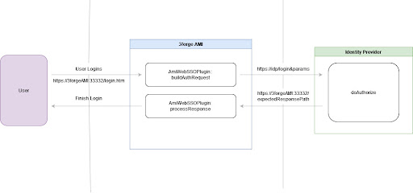

# Custom Authentication

## Overview

It is necessary to authenticate users to ensure that they have valid credentials and have been granted access to your application. 3forge AMI has support for SSO Plugins. SSO Plugins are authentication plugins for 3forge AMI Applications that need to support either Single Sign On or Federated Identity, where SSO provides support for single access to multiple systems in one organization and Federated Identity provides that for multiple organizations.

This document will provide the basic template you will need to set up your own Java 3forge AMI SSO Plugin.

You will need to implement a Java interface and include the properties provided below.

  

## Java interface

``` java
com.f1.ami.web.AmiWebSSOPlugin

package com.f1.ami.web;

import com.f1.ami.amicommon.AmiPlugin;
import com.f1.ami.web.auth.AmiAuthUser;
import com.f1.http.HttpRequestResponse;
import com.f1.suite.web.HttpRequestAction;

/**
 * 1) Set the sso.plugin.class property to point to an implementation of this class <BR>
 * 2) Set the ami.web.index.html.file property the URL that is associated with buildAuthRequest(...) method<BR>
 * 3) getExpectedResponsePath() must return URL associated with processResponse(...) method<BR>
 * 4) When users access the index file (from step 1) buildAuthRequest(..) is called and the user's browser is redirected to the returned URL (usually the IDP)<BR>
 * 5) After the IDP has authenticated, the IDP should then redirect the user's browser to the getExpectedResposnePath() URL (from step 2)<BR>
 * 6) processResponse(...) is called and should return an AmiUathUser that will be passed to the AMI dashboard<BR>
 */
public interface AmiWebSSOPlugin extends AmiPlugin {

	/**
	 * 
	 * Use the ami.web.index.html.file to associate the URL that will cause this method to be invoked. This method should inspect the HTTP request and formulate a fully qualified
	 * URL that will be sent to the IDP.
	 * <P>
	 * Note, this method should return the URL as specified in getExpectedResponsePath() if it's determined,based on the supplied request that the user is already authenticated
	 * 
	 * @param req
	 *            the http request
	 * @return a URL that the user's browser will be redirected to
	 */
	String buildAuthRequest(HttpRequestResponse req) throws Exception;

	/**
	 * @return the URL that the processResponse(...) method is associated with. This method is called once at startup. Hence, return value is really a constant
	 */
	String getExpectedResponsePath();
	/**
	 * @return the path for the logout page
	 */
	String getLogoutRedirectPath();

	/**
	 * 
	 * @param req
	 *            the http request
	 * @return null if not allowed. See com.f1.ami.web.auth.BasicAmiAuthUser for convenience class
	 * @throws Exception
	 *             if there was an error, the user will not be permitted to login
	 */
	AmiAuthUser processResponse(HttpRequestAction req) throws Exception;

	/**
	 * 
	 * @param req
	 *            the http request
	 * @return a Logout URL that the user's browser will be redirected to
	 * @throws Exception
	 */
	String handleLogout(HttpRequestResponse req) throws Exception;

}

```

## Properties

```
sso.plugin.class=fully_qualified_class_name
ami.web.index.html.file=index2.htm
web.logged.out.url=/loggedout.htm
```

## Example

Example Java-Code:

``` java
package com.company.ami;
 
import java.util.HashMap;
import java.util.Map;
 
import com.f1.ami.web.auth.AmiAuthUser;
import com.f1.ami.web.auth.BasicAmiAuthUser;
import com.f1.container.ContainerTools;
import com.f1.http.HttpRequestResponse;
import com.f1.http.HttpSession;
import com.f1.suite.web.HttpRequestAction;
import com.f1.utils.PropertyController;
 
public class MySSOPlugin implements AmiWebSSOPlugin {
 
    @Override
    public void init(ContainerTools tools, PropertyController props) {
        // TODO Auto-generated method stub
        System.out.println("Initializing My SSO Plugin");
    }
 
    @Override
    public String getPluginId() {
        return "SampleSSOPlugin";
    }
 
    @Override
    public String buildAuthRequest(HttpRequestResponse req) throws Exception {
        HttpSession session = req.getSession(true);
        String requestUri = req.getRequestUri(); // This will be your ami.web.index.html.file
        Map<String, String> header = req.getHeader();
        Map<String, String> cookies = req.getCookies();
        Map<String, String> params = req.getParams();
 
        // 1) Here you build your Authorization Request for your Identity Provider
        // ... Code here
 
        // This is how you can add a cookie to the response
        String optionalDomain = null;
        long optionalExpires = 0;
        req.putCookie("myCookie", "secretCode", optionalDomain, optionalExpires, null);
 
        // This is how you add a header to the response
        req.putResponseHeader("myHeader", "value");
 
        String redirectUrlForLogin = "https://identityProvider/login?{login parameters}&expectedResponsePath=" + this.getExpectedResponsePath();
        //// End code
        return redirectUrlForLogin;
    }
 
    @Override
    public AmiAuthUser processResponse(HttpRequestAction req) throws Exception {
        HttpRequestResponse request = req.getRequest();
        Map<String, String> header = request.getHeader();
        Map<String, String> cookies = request.getCookies();
        Map<String, String> params = request.getParams();
 
        // 2) Ensure Identity Provider Authorized the User
        // ... Code here
        ////
 
        // If the user is valid:
        // 3) Add user attributes to authAttributes;
        Map<String, Object> authAttributes = new HashMap<String, Object>();
        // ... Code here
        ////
        return new BasicAmiAuthUser("username", authAttributes);
    }
 
    @Override
    public String getExpectedResponsePath() {
        return "login_redirect_url";
    }
    
    @Override
    String getLogoutRedirectPath() {
    	return "logout_redirect_url";
    }
    @Override
    String handleLogout(HttpRequestResponse req) throws Exception {
    	return "Log out";
    }
}
```

Example Configuration:

```
sso.plugin.class=com.company.ami.MySSOPlugin
ami.web.index.html.file=index.htm
web.logged.out.url=/loggedout.htm
```

## Reserved Paths

**NOTE**: Below is a list of url paths reserved for use by 3forge. Avoid using any of them as your expected response path to avoid unexpected behavior.

- `3forge_hello` (e.g. `hostname:33332/3forge_hello`)
- `3forge_goodbye`
- `3forge_sessions`
- `own_headless`
- `logout`
- `login`
- `resources`
- `run`
- `modcount`
- `get_custom_login_image`

