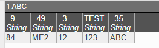

# Custom Relay Plugin 

The relay is used for sending messages to and from AMI. Any external application interfacing with AMI does so via the relay. More detail on the content and format of relay messages can be found [here](../reference/ami_realtime_messages.md). 

You can modify messages being sent to and from AMI via the custom relay plugin. Additionally, this document contains instructions for the FIX relay plugin.

## Overview

The AMI Relay Plugin allows for custom processing of the [Realtime Messaging API](../reference/ami_realtime_messages.md). 

When a message has been processed by the relay, depending on the logic the user has supplied, AMI will perform different actions. A list of the return message values to use and their corresponding behavior is below.

| Return Value | AMI Behavior |
|--------------|--------------|
| ERROR | The errorSink message gets printed, and the incoming message is not processed |
| NA    | The mutableRawData value is ignored and the original message is processed by AMI |
| SKIP  | The incoming message is not processed |
| OKAY  | The mutableRawData value is processed by AMI | 

You can use these flags to set the behavior and functionality of your custom relay messages.

## Requirements

Like any other custom plugin, the relay plugin must implement the appropriate Java factory. To set up a custom relay, you will first need to follow the general instructions for setting up a [custom plugin](./index.md/#custom-plugin). 

### Java Interface 

```java
com.f1.ami.relay.AmiRelayPlugin
```

### Properties 

Unlike most other plugins, to use custom relay messaging, you do *not* specify the plugin via `local.properties`. 

Instead, upon establishing an initial connection to the real-time relay port (3289 by default), pass this login message to AMI:

```
L|I="demo"|P="fully.qualified.relay.plugin.name"
```

replacing `"demo"` with your AMI login details.

## Example

This is a demonstrative sample of how you can use the relay plugin factory.

``` java
package com.f1;

import java.util.Map;
import java.util.Map.Entry;

import com.f1.ami.relay.AmiRelayPlugin;
import com.f1.ami.relay.fh.AmiFH;
import com.f1.utils.AH;
import com.f1.utils.ByteArray;
import com.f1.utils.FastByteArrayDataOutputStream;
import com.f1.utils.PropertyController;
import com.f1.utils.SH;

public class SampleRelayPlugin implements AmiRelayPlugin {
	private static final String AMI_SAMPLEPLUGIN_PROP = "ami.sampleplugin.prop";
	private byte[] prefix = "SAMPLE|".getBytes();
	private final FastByteArrayDataOutputStream buf = new FastByteArrayDataOutputStream();
	private String prop;

	@Override
	public boolean init(PropertyController properties, AmiFH fh, String switches, StringBuilder errorSink) {
		prop = properties.getOptional(AMI_SAMPLEPLUGIN_PROP, "|");
		if (SH.is(switches)) {
			Map<String, String> switchMap = SH.splitToMap(',', '=', '\\', switches);
			for (Entry<String, String> e : switchMap.entrySet()) {
				final String key = e.getKey();
				final String value = e.getValue();
				if (AMI_SAMPLEPLUGIN_PROP.equals(key))
					prop = (String) value;
				else {
					errorSink.append("unknown switch: ").append(key);
					return false;
				}
			}
		}
		return true;
	}
	
	@Override
	public int processData(ByteArray mutableRawData, StringBuilder errorSink) {
		byte[] data = mutableRawData.getData();
		if (!AH.startsWith(data, prefix, mutableRawData.getStart())) 
			return NA;
		//Process input data
		int pos = mutableRawData.getStart() + prefix.length - 1;
		int length = mutableRawData.getEnd();
		if (pos >= length) {
			errorSink.append("No data to parse");
			return ERROR;
		}
		//Handle complex parsing here...
		buf.reset(2048);
		buf.writeBytes("O|T=\"Table\"|val=100");
		mutableRawData.reset(buf.getBuffer(), 0, buf.getCount());
		return OKAY;
	}
}
```

This simple plugin has the following behavior:

-   Checks that the message has the prefix "SAMPLE". If it does not, the message is ignored (`NA`). 
-   Checks that the message is not empty. If it is, it throws an error (`ERROR`). 
-   If the message passes both checks, it creates a row in a table named "Table" with a value of 100 (`OKAY`, `"O|T=\"Table\"|val=100"`). 

## Blank `AmiRelayPlugin` Java File 

```java  

package com.f1.ami.relay;

import com.f1.ami.relay.fh.AmiFH;
import com.f1.utils.ByteArray;
import com.f1.utils.PropertyController;

public interface AmiRelayPlugin { 

int ERROR = 1;
int NA = 2;
int OKAY = 3;
int SKIP = 4;

int processData(ByteArray mutableRawData, StringBuilder errorSink);
boolean init(PropertyController properties, AmiFH fh, String switches, StringBuilder errorSink);
}
``` 

## FIX Message Parser

### Overview 

The AMI FIX parser utilizes the custom relay functionality explained above to receive messages in FIX format and add them to a table within AMI. 

### Properties

The FIX parser is available within AMI with the following configurable properties, which can be added to your `local.properties` file: 

```
ami.fixplugin.prefix
``` 
: 
    **Default**: `FIX|` 

    - Expected prefix for the messages coming in. 

```
ami.fixplugin.equal.ascii
``` 
: 
    **Default**: `=` 

    - Expected equals symbol. 


```
ami.fixplugin.delim.ascii
``` 
: 
    **Default**: `|` 

    - Expected delimiter symbol. 


```
ami.fixplugin.ignore.keys
``` 
: 
    **Default**: None 

    - Keys to ignore. 

```
ami.fixplugin.type.tag 
``` 
: 
    **Default**: `35` 
    
    - Used to specify the output table in AMI 

```
ami.fixplugin.tag.<tag_number>
``` 
: 
    **Default**: None 

    - Allows you to specify definitions for the tag within AMI.  

### Connect

To use the parser, you will need the port corresponding to the property `ami.port`. By default this is 3289. 

When logging in, send the following message: 

```
L|I="demo"|P="com.f1.ami.relay.plugins.FixAmiPlugin"
``` 

ensuring to replace your login information with the correct input. 

### Example

Here is an example FIX formatted message that can be sent to AMI: 

```
FIX|9=84|49=ME2|3=12|99=123|35=ABC
```

Setting the property `ami.fixplugin.tag.99=string TEST` results in the following output in AMI:



the "99" tag has now been renamed within AMI to "TEST".


!!! Note 

    There are additional helper methods for parsing FIX methods which may be useful when writing [custom classes](./amiscript_classes.md), but require the `out.jar` file to be in your Java project build path. If you need any help with this, please contact us at <support@3forge.com>.