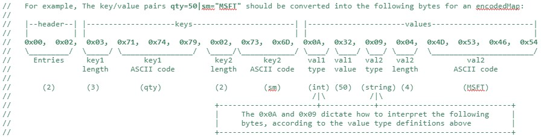

# Custom Feed Handler

## Custom Relay Feed Handler

### Overview

The Feed Handler Plugin allows for the very efficient processing of incoming streams of data to be transmitted into the AMI Center using AMI's proprietary protocol.  Generally one feed handler will be written per type of messaging bus.

### Properties

Setting up properties in the relay to instantiate a feed handler. In this example, the feed handler will have the name my_feedhandler_name:

```
ami.relay.fh.active=$${ami.relay.fh.active},my_feedhandler_name
ami.relay.fh.my_feedhandler_name.start=true
ami.relay.fh.my_feedhandler_name.class=class.that.extends.com.f1.ami.relay.AmiFHBase
ami.relay.fh.my_feedhandler_name.props.my_custom_property=my_cutom_value
```

### Java interface

You will implement this interface, only this interface in most cases.  Please note that an AmiRelayIn will be passed to the init function, and this is used to send messages into AMI.

``` java
package com.f1.ami.relay.fh;

import com.f1.ami.relay.AmiRelayIn;
import com.f1.ami.relay.AmiRelayOut;
import com.f1.utils.PropertyController;

//Represents a single instance of an AMI Relay Feed Handler
public interface AmiFH extends AmiRelayOut {

       public static int STATUS_STARTED = 1;
       public static int STATUS_STOPPED = 2;
       public static int STATUS_FAILED = 3;
       public static int STATUS_STARTING = 4;
       public static int STATUS_STOPPING = 5;
       public static int STATUS_START_FAILED = 6;
       public static int STATUS_STOP_FAILED = 7;

       public static final String PCE_STATUS_CHANGED = "STATUS_CHANGED";

       //called during AMI startup
       //  id - unique id per relay/runtime
       //  name - name of the relay, ex: my_feedhandler_name
       //  sysProps - all properties inside ami relay
       //  props - properties specified to this feed handler
       //  endpoint - the endpoint for sending messages into AMI. You should hold onto this and call methods on it as messages stream in, etc.
       public void init(int id, String name, PropertyController sysProps, PropertyController props, AmiRelayIn endpoint);

       //called when this feedhandler is started/stopped. Typically, start is called immediately after all successful init has been called
       public void start();
       public void stop();

       //Return the status of this feedhandler (see constants) the string version is for the convenience of users to see why the current status is what it is.
       public int getStatus();
       public String getStatusReason();

       //the AppId (aka loginId) associated with this connection.(1)
       public String getAppId();

       //time and place and description of the connection, not required but convenient for end users diagnosing connections
       public long getConnectionTime();
       public int getRemotePort(); //ex: 1234
       public String getRemoteIp(); //ex:  myhost
       public String getDescription();//ex: someprotocol://myhost:1234

       //when durability is enabled this will be called back when the message has been successfully persisted(2)
       public void onAck(long seqnum);

       //E (execute command)(3). Note that implementation is optional. If there was an unexpected error, write the details to errorSink. The server is for advanced internal use
       public void call(AmiRelayServer server, AmiRelayRunAmiCommandRequest action, StringBuilder errorSink);
}
```
{ .annotate }

1.	See [Reserved Columns, column P](../center/realtime_tables.md#reserved-columns-on-public-tables) for details

2.	See `ami.relay.guaranteed.messaging.enabled` in the [Configuration Guide](../configuration_guide/relay.md) for more details

3. See [AMI Realtime Messages](../reference/ami_realtime_messages.md#execute-command-e) for more details

### AmiRelayIn Interface

This is implemented by AMI and is how a feed handler (AmiFH) instance actually communicates with AMI. For example, if a feed handler wants to insert a new row into AMI, it could call the `#!java onObject(...)` method. Each AmiRelay will be assigned its own personal AmiRelayIn

``` java
package com.f1.ami.relay;

import java.util.Set;
import java.util.concurrent.ThreadFactory;

import com.f1.ami.relay.fh.AmiFH;
import com.f1.ami.relay.plugins.AmiRelayInvokablePlugin;
import com.f1.container.ContainerTools;

//Please note, it's assumed the user is very familiar with the AMI Real-time Messaging API
//
//For the encodedMap(s) parameters:
//
//  (A) you can use the com.f1.ami.relay.AmiRelayMapToBytesConverter::toBytes(...) method to conveniently convert a map of params to the expected byte protocol.
//  (B) you can implement the following protocol directly, see protocol at bottom of interface definition

public interface AmiRelayIn {

       public static int RESPONSE_STATUS_OK = 0;
       public static int RESPONSE_STATUS_NOT_FOUND = 1;
       public static int RESPONSE_STATUS_ERROR = 2;

       //S (status) message
       public void onStatus(byte[] encodedMap);

       //R (response to execute command) message.
       public void onResponse(String I_uniqueId, int S_status, String M_message, String X_executeAmiScript, byte[][] encodedMaps);

       //X (exit) message.  Clean=true means it was an expected exit, false is unexpected, ex line dropped
       public void onLogout(byte[] encodedMap, boolean clean);

       //L (login) message
       public void onLogin(String O_options, String PL_plugin, byte[] encodedMap);

       //C (command definition) message
       public void onCommandDef(String I_id, String N_name, int L_level, String W_whereRowLevel, String T_wherePanelLevel, String H_help, String A_formDefinition,
                     String X_executeAmiScript, int P_priority, String E_enabled, String S_style, String M_multipleSelectMode, String F_fields, byte[] encodedMap, int callbacksMask);

       //O (object) message for batching. Set seqNum=-1 for no seqNum. All arrays should have same number of arguments.
       public void onObjects(long seqNum, String[] I_ids, String[] T_types, long E_expiresOn, byte[][] encodedMaps);

       //O (object) message. Set seqNum=-1 for no seqNum
       public void onObject(long seqNum, String I_id, String T_type, long E_expiresOn, byte[] encodedMap);

       //D (delete) message. All arrays should have same number of arguments.
       public void onObjectDelete(long origSeqnum, String[] I_ids, String T_type, byte[][] encodedMaps);

       //when the connection is established, this should be supplied.  The optional encoded map will show as parameters on this connection
       public void onConnection(byte[] encodedMap);

       //when the connection has an unexpected error, this should be supplied.  The optional encoded map will show as parameters on this connection.  error is user-readable a message
       public void onError(byte[] encodedMap, CharSequence error);

       //Tools for this AMI instance, internal use
       public ContainerTools getTools();

       //For creating additional thread
       public ThreadFactory getThreadFactory();

       //Advanced feature: To start another (typically sub) feed handler.
       public void initAndStartFH(AmiFH fh2, String string);

       //Advanced feature: get invokable plugins (see ami.relay.invokables property)
       public AmiRelayInvokablePlugin getInvokable(String typ);
       public Set<String> getInvokableTypes();
}
```

```
EncodedMap Protocol:

TotalMessage:  <-- this is what should be passed in as encodedMaps
    KeyValuePairCount (signed short) <--number of entries in this map
    Key[]  <- back to back entry of all key names.  (see below)
    Value[] <- back to back entry of all values, note there is a different protocol depending on type

Key:
         StringLengthOfKey (signed byte)
   Ascii Representation of key's chars (byte array)

Value for Int between 0x80 ... 0x7f:
   0x0A value (byte)

Value for Int between  0x8000 ... 0x7fff:
   0x0B value (2 bytes)

Value for Int between  0x800000 ... 0x7fffff:
   0x0C value (3 bytes)

Value for Int between  0x80000000 ... 0x7fffffff:
   0x0D value (4 bytes)

Value for Long between 0x80 ... 0x7f:
   0x0E value (byte)

Value for Long between  0x8000 ... 0x7fff:
   0x0F value (2 bytes)

Value for Long between  0x800000 ... 0x7fffff:
   0x10 value (3 bytes)

Value for Long between  0x80000000 ... 0x7fffffff:
   0x11value (4 bytes)
 
Value for Long between  0x8000000000 ... 0x7fffffffff:
   0x12 value (5 bytes)
 
Value for Long between  0x800000000000 ... 0x7fffffffffff:
   0x13 value (6 bytes)
 
Value for Long between  0x80000000000000 ... 0x7fffffffffffff:
   0x14 value (7 bytes)
 
Value for Long between  0x8000000000000000 ... 0x7fffffffffffffff:
   0x15 value (8 bytes)
 
Value for Double:
   0x06 value (8 bytes) (see Double.doubleToLongBits)
 
Value for Float:
   0x05 value (4 bytes) (see Float.floatToIntBits)
 
Value for Character:
   0x1A value (2 bytes)
 
Value for Boolean True:
   0x02 0x01
Value for Boolean False:
   0x02 0x00
 
Value for string <=127 chars in length and simple ASCII (all chars between 0 ... 127)
   0x09
   number_of_chars (byte)
   bytes of string (1 byte per char)

Value for string >127 chars in length and simple ASCII (all chars between 0 ... 127)
   0x08
   number_of_chars (int)
   bytes of string (1 byte per char)
 
Value for string with extended ASCII (at least one char not between 0 ... 127)
   0x07
   number_of_chars (int)
   chars of string (2 bytes per char)
 
Value for UTC
   0x1E
   milliseconds since epoch (6 bytes)
 
Value for NANO timestamp
   0x1F
   nanoseconds since epoch (8 bytes)
 
Value for binary data (aka byte array)
   0x28
   number_of_bytes (4 bytes)
   bytes (1 byte per byte of raw data)
```

For example:



