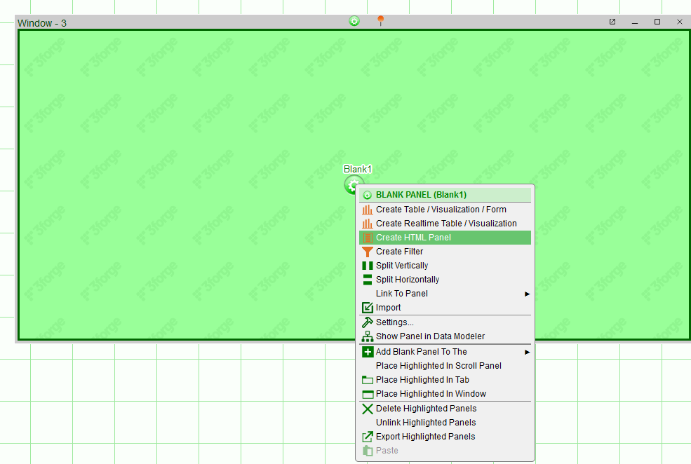
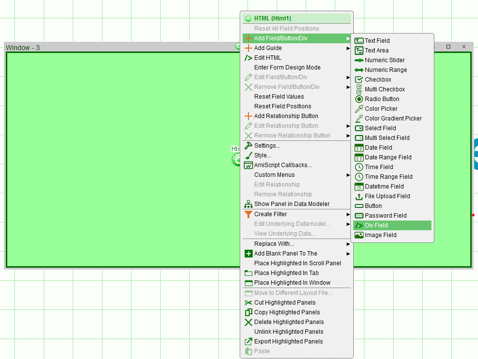
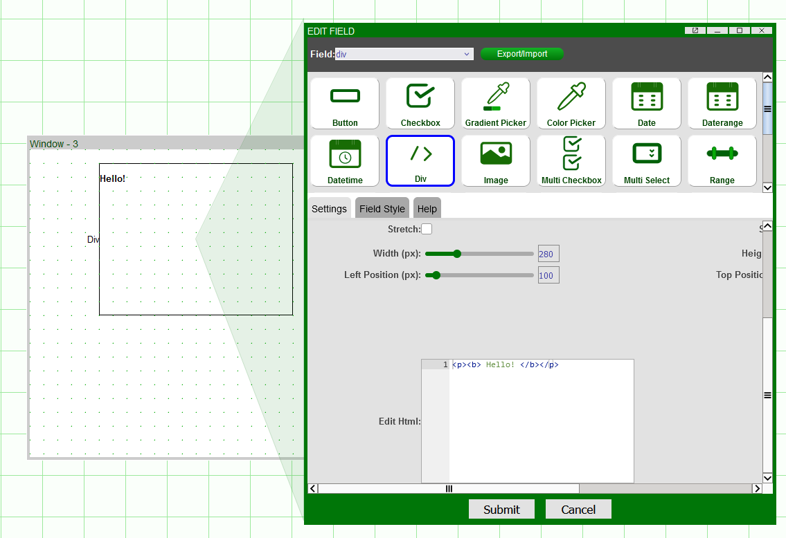
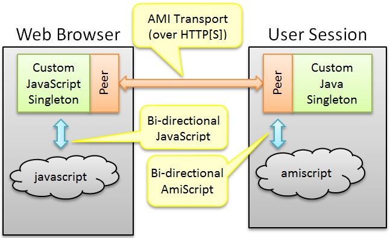
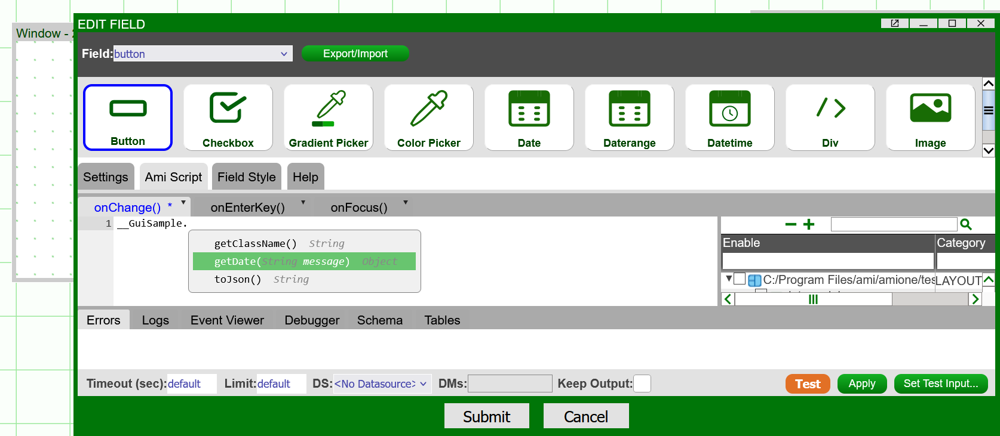
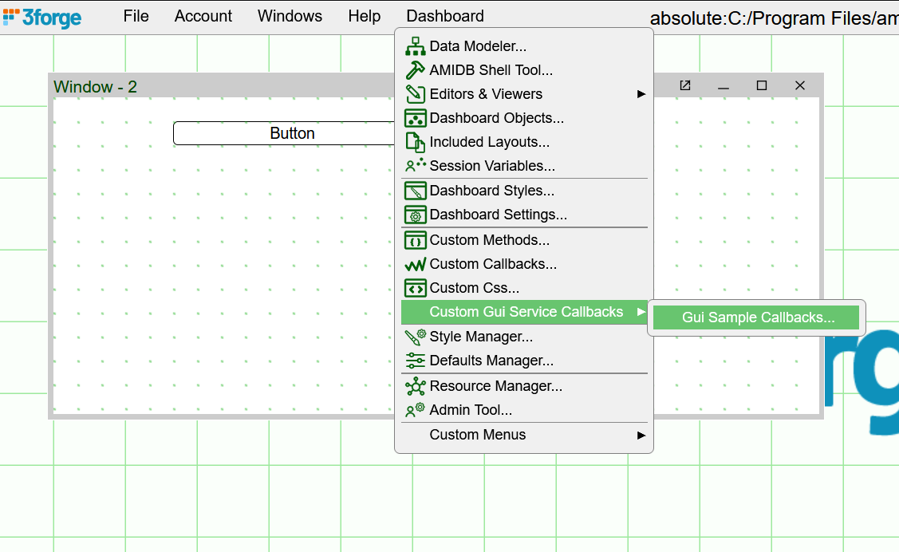
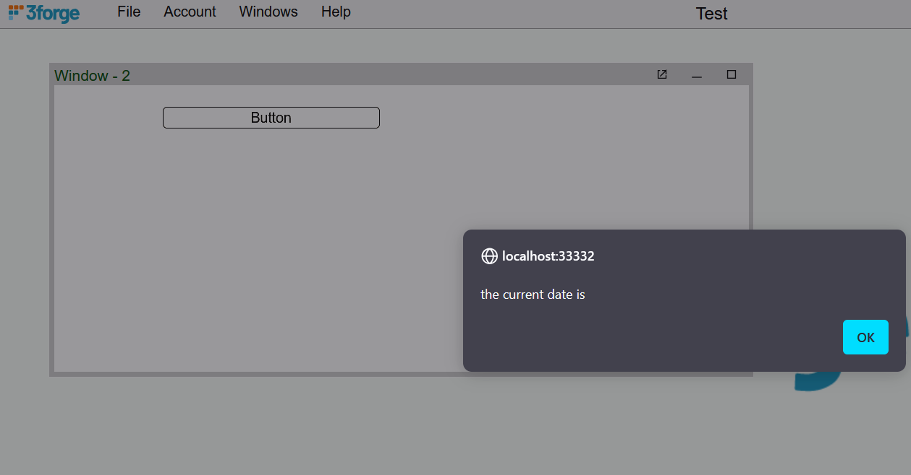
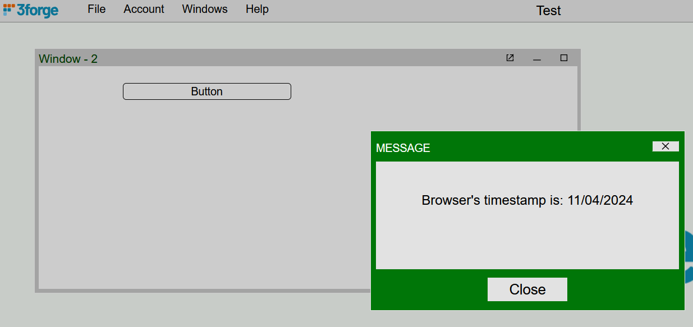

# Custom HTML & JavaScript 

AMI web is a highly customizable visual dashboard with its visual elements driven largely by HTML. 3forge supports multiple methods for implementing your own custom HTML for custom panel types, or JavaScript callbacks to invoke custom JavaScript libraries within AMI. 

## Within AMI
 
There are several areas within AMI that allow for the use of JavaScript and CSS out-of-the-box without the additional need for custom plugins. Where possible, we generally recommend avoiding custom HTML and opting to use inbuilt AMI functionality, however the following fields will accept frontend inputs. 

1. Formulas 

    -  [Formatting](../panels/table_panels.md/#format) and [styling](../styling/columns.md) of individual cells, columns, tooltips, etc can be done using HTML where needed. 
    -  Wrap any HTML statements in string quotations "".

1. HTML Panels

    -  Create highly customizable form panels with various HTML fields within AMI when creating new windows: 
     

    -  There are a large number of HTML objects in AMI, the most flexible being the "Div Field".
     

    -  Input any custom HTML in the "Div Field" creation wizard under the settings.
    


1. Custom CSS 

    -  For most use cases, using the [style manager](../styling/managing_styles.md) provides sufficient flexibility for visual customization. 
   
    -  To use custom styling for additional visual flare that AMI does not natively support, you can use the "Custom Css" field (*Dashboard -> Custom Css*) to write independent CSS. 
    
    -  We generally recommend using AMI inbuilt styles first.


## Custom Panels

### Overview

AMI's frontend is broken up into "panels," the primary visualizers in AMI. Each panel has a particular type, e.g: table, chart, heatmap, etc. In the rare instance you wish to implement your own custom panel type, you will need to use the Web Panel Plugin interface.

The Web Panel Plugin is a Java factory that generates an `AmiWebPluginPortlet` which represents a panel instance. You will need to follow the general steps for setting up a [custom Java plugin](./index.md/#custom-plugin) to get started.

### Java interface

```java
com.f1.ami.web.AmiWebPanelPlugin
```

### Properties

```
ami.web.panels=comma_delimited_list_of_fully_qualified_java_class_names
```

## Custom JavaScript

### Overview 

JavaScript is not natively supported in AMI, however using the `AmiGuiService` plugin, it is possible to have JavaScript code/methods to be accessible within AMI web in AmiScript. This is achieved using the bidirectional AmiScript API:

-   Calls to JavaScript from within the browser can, in turn, invoke AmiScript callbacks
-   Calls to AmiScript from within the dashboard can, in turn, call JavaScript within the browser.

In order to interact with AmiScript in the webserver and with JavaScript in the web browser, two blocks of adapter code must be written. Each of these two blocks of code are started as singletons which communicate over the AMI HTTP(S) transport (transparent to you when building these adapters). 

The webserver's singleton is one per user session and the JavaScript singleton object is started when the browser loads. These two objects are responsible for communication between their respective environments and each other:



### In-Depth

#### Initialization

1.  First, a Java plugin implementing the `#!java com.f1.ami.web.guiplugin.AmiWebGuiServicePlugin` is initiated when the Ami Web Server starts up. The class name must be specified in the `ami.guiservice.plugins` property. Note, that only one instance is started up per JVM.
1.  Each time a user logs in, the `#!java AmiWebGuiServicePlugin::createGuiIntegrationAdapter` is called which returns a custom class implementing the AmiWebGuiServiceAdapter interface.
1.  Each time the page is refreshed, including on initial login, the following methods are called on the `#!java AmiWebGuiServiceAdapter` (These methods initialize the browser's JavaScript environment):

| Methods                         | Description                                                                                                                                                                                                                                                                                     |
|---------------------------------|-------------------------------------------------------------------------------------------------------------------------------------------------------------------------------------------------------------------------------------------------------------------------------------------------|
| `getJavascriptLibraries()`      | Your adapter returns a list of libraries to load. This tells the browser which libraries to load, if any, for this custom adapter.                                                                                                                                                              |
| `getJavascriptInitialization`() | Your adapter should return JavaScript to be executed in the browser at pageLoad and allows for any custom initialization.                                                                                                                                                                       |
| `getJavascriptNewInstance`()    | Your adapter must return the JavaScript necessary for generating a JavaScript singleton that will receive/send messages. This JavaScript must implement a function called `registerAmiGuiServicePeer(peer)` which, typically, just stores the peer argument in a member variable for later use. |

#### Registering AmiScript API

- **Declaring methods that can be called from AmiScript** 
: 
    Within the AmiScript environment, a single object will be available that represents the singleton. Similar to the *session* object which implements the *Session* AmiScript class, this object will have a predetermined name, class name, and available methods. 

| Methods                                             | Description                                                                                                                                                                                            |
|-----------------------------------------------------|--------------------------------------------------------------------------------------------------------------------------------------------------------------------------------------------------------|
| `#!java AmiWebGuiServiceAdapter::getAmiscriptClassname()` | Your adapter should return the name of the class that is represented by the singleton (analagous to `Session`).  The singleton object will have the same name but prefixed with two underbars (\_\_). |
| `#!java AmiWebGuiServiceAdapter::getAmiScriptMethods()`    | Your adapter should return a list of methods that can be called on the custom singleton.                                                                                                               |

-   **Declaring AmiScript callbacks** 
: 
    The callbacks allow for dashboard developers to declare their own AmiScript that gets executed when the callback is invoked. The dashboard developers can edit the callbacks under *Dashboard -> Custom Gui Service Callbacks -> `<Your custom service>`*

| Method                                                | Description                                                              |
|-------------------------------------------------------|--------------------------------------------------------------------------|
| `#!java AmiWebGuiServiceAdapter::getAmiScriptCallbacks()` | Your adapter should return a list of callbacks available for overriding. |


#### In Practice

**AmiScript to Javascript** 
: 

1. A user invokes an AmiScript method on your custom singleton.
1. When a dashboard developer calls the custom AmiScript API, then `#!java AmiWebGuiServiceAdapter::onAmiScriptMethod` is called. Any data validation, data massaging, etc should be specified here.
1. Call `executeJavascriptCallback` on the supplied peer. 

Here is an example (with no additional validation): 

```java
public Object onAmiScriptMethod(String name, Object[] args, AmiWebGuiServiceAdapterPeer peer) {
        peer.executeJavascriptCallback(name, args);
        return null;
}
```

**JavaScript to AmiScript** 
: 

1. A JavaScript function is called on the singleton. 
1. The JavaScript singleton's method should then call:

    ```js
    peer.sendToServer(methodName,arg1,arg2,...);
    ```

    !!! Note 
        The peer is supplied on startup in the registerAmiGuiServicePeer function 

3.  The backend Java adapter's `#!java AmiWebGuiServiceAdapter:: onCallFromJavascript(...)` is called. At this point, your adapter can do validation, data massaging, etc. before passing off to AmiScript.  
1.  Call `#!java executeAmiScriptCallback` on the supplied peer. Here is an example of steps 3 and 4, skipping validation, data massaging, etc:

    ```java
    public void onCallFromJavascript(String name, Object args[], AmiWebGuiServiceAdapterPeer peer) { peer.executeAmiScriptCallback(name, args);}
    ``` 

1.  AmiScript call back is executed

## Full JavaScript Example

This simple example shows a step-by-step breakdown of defining a method in JavaScript, calling that method in AmiScript, and then invoking a callback from the external JavaScript library. 

We declare an AmiScript custom object called `#!amiscript __GuiSample` of type `#!amiscript GuiSample` with a single method `#!amiscript getDate(String)` and a single callback called `#!amiscript onDateDetermined(...)`. 

When the `#!amiscript getDate(...)` AmiScript is executed, the user is presented with a native JavaScript alert and then the current date from the browser is sent back to the AmiScript via the `#!amiscript onDateDetermined(..)` callback.

The steps involved are as follows:

1. Create a Java package for [your plugin](./index.md/#custom-plugin). 
1. Create a `#!java AmiWebGuiServicePlugin` and add that to your `local.properties`: 
    ```
    ami.guiservice.plugins=fully_qualified_plugin_class_name
    ``` 

2. Write your external JavaScript file and function containing the `#!javascript getDate` prototype. 
3. Create a `#!java AmiWebGuiServiceAdapter` and define functionality to be called in AmiScript: 
    1. Add `getDate` to `#!java getAmiScriptMethods()` 
    2. Add the `#!java "onDateDetermined"` callback to `#!java getAmiScriptCallbacks()` 
    3. Add the external JavaScript library to `#!java getJavascriptLibraries()`


### `AmiWebGuiServicePlugin_Sample.java` 

For the plugin, ensure that you have your `login.properties` configuration set to match your package and class, in this case:

```
ami.guiservice.plugins=guisample.AmiWebGuiServicePlugin_Sample
```

For the adapter:

``` java
package guisample;

import com.f1.ami.web.AmiWebGuiServiceAdapter;
import com.f1.ami.web.AmiWebGuiServicePlugin;
import com.f1.ami.web.AmiWebService;
import com.f1.container.ContainerTools;
import com.f1.utils.PropertyController;

public class AmiWebGuiServicePlugin_Sample implements AmiWebGuiServicePlugin {

        @Override
        public void init(ContainerTools tools, PropertyController props) {
        }

        @Override
        public String getPluginId() {
                return "GUISAMPLE";
        }

        @Override
        public AmiWebGuiServiceAdapter createGuiIntegrationAdapter(AmiWebService service) {
                return new AmiWebGuiServiceAdapter_Sample();
        }
}
```

### `GuiSampleJavascript.js`

We write an external JavaScript library with the sample JavaScript function that will be called in our adapter. The function `GuiSampleJavascript()` contains any methods that we want to call in AMI web, in this case `getDate()`, and uts corresponding callback `onDateDetermined(value)`.

```javascript
// GuiSampleJavascript.js
function GuiSampleJavascript() {}

GuiSampleJavascript.prototype.registerAmiGuiServicePeer = function(peer) {
    this.peer = peer;
};

GuiSampleJavascript.prototype.getDate = function(message) {
    alert(message);
    this.peer.sendToServer('onDateDetermined', Date.now());
};
``` 

### `AmiWebGuiServiceAdapter_Sample.java` 

We specify in the adapter the how the JavaScript is passed and called to AMI. For a blank version of the `AmiWebGuiServiceAdapter` class, see the [end](#blank-amiwebguiserviceadapter-java-file) of this document. 


``` java
package samples;

import java.util.Collections;
import java.util.List;

import com.f1.ami.web.AmiWebGuiServiceAdapter;
import com.f1.ami.web.AmiWebGuiServiceAdapterPeer;
import com.f1.utils.CH;
import com.f1.utils.structs.table.derived.ParamsDefinition;

public class AmiWebGuiServiceAdapter_Sample implements AmiWebGuiServiceAdapter {

        private AmiWebGuiServiceAdapterPeer peer;

        @Override
        public void init(AmiWebGuiServiceAdapterPeer peer) {
                this.peer = peer;
        }

        @Override
        public String getGuiServiceId() {
                return "GUISAMPLE";
        }

        @Override
        public String getDescription() {
                return "Gui Sample";
        }

        @Override
        public String getAmiscriptClassname() {
                return "GuiSample";
        }

        @Override
        public List<ParamsDefinition> getAmiscriptMethods() {
                return CH.l(new ParamsDefinition("getDate", Object.class, "String message"));
        }

        @Override
        public Object onAmiScriptMethod(String name, Object[] args) {
                this.peer.executeJavascriptCallback(name, args);
                return null;
        }

        @Override
        public List<ParamsDefinition> getAmiScriptCallbacks() {
                return CH.l(new ParamsDefinition("onDateDetermined", Object.class, "String value"));
        }

        @Override
        public void onCallFromJavascript(String name, Object args[]) {
                this.peer.executeAmiScriptCallback(name, args);

                if (onInit.equals(name)) {
			this.isInitialized = true;
                }
        }

        @Override
        public List<String> getJavascriptLibraries() {
        	return Collections.singletonList("http://localhost:33332/resources/GuiSampleJavascript.js");       
        }

        @Override
        public String getJavascriptInitialization() {
                return "";
        }

        @Override
        public String getJavascriptNewInstance() {
                return "new GuiSampleJavascript()";
        }

        @Override
        public void onLayoutStartup() {
                // TODO Auto-generated method stub
                // Use this method if you want to create and execute a callback on startup -- avoid using the onStartup() and onStartupComplete() custom callbacks within AMI
                // remember to specify any variables like peer etc...

        }

        @Override
        public void onPageLoading() {
                // TODO Auto-generated method stub
        }

        @Override
        public String getJavascriptCloseInstance() {
                return "";
        }
                
}
```

#### Notes

1. `getJavascriptInitialization` is run before the external library is loaded. Return an empty string here, unless you need to initialize something outside your javascript library. 
2. `getJavascriptLibraries` expects a HTTP(S) connection. Either store your `.js` file in your `/amione/resources` folder, or host the library elsewhere. 
3. If you want to perform some custom behavior or callback on startup, we recommend implementing it with the custom GUI callbacks (see method `#!java onLayoutStartup()`) rather than as a custom callback within AMI.

### In AMI Web

To test the functions, ensure you have exported your plugin and adapter, then launch AMI. Inside the dashboard, create a new HTML panel and add a button. Then, using the new custom object `GuiSample`, set the AmiScript window to:

```amiscript
__GuiSample.getDate("the current date is ");
```

Notice how when initializing a `GuiSample` object, the method will appear in the AmiScript wizard.



To set the callback, navigate to *Dashboard -> Custom Gui Service Callbacks -> Gui Sample Callbacks*



This will pull up the Custom Gui Service Callbacks which should contain a tab `onDateDetermined(value)`. When invoked, this callback will return the function executed by the JavaScript singleton. 

Input into the field: 

```amiscript
session.alert("Browser's timestamp is: "+ formatDate((Long) value));
```

!!! Note
    The default value returned will be a Unix timestamp. Here, we have parsed the date to be more legible. To further customize the format of the date to your preferences, please see the documentation on the [`formatDate()`](https://doc.3forge.com/javadoc/methods/formatDate(unixEpoch%2Cpattern%2Ctimezone)/) method.

Exit editor mode (Ctrl+d), and click the button. You will get two pop-ups:

1. A JavaScript alert with "the current date is" 
    

2. An AmiScript alert with "Browser's timestamp is:" and the corresponding date 
    


## Blank AmiWebGuiServiceAdapter Java File 

```java
package com.f1.ami.web;

import java.util.List;

import com.f1.utils.structs.table.derived.ParamsDefinition;

/**
 * Responsible for:<BR>
 * 1. Initiating a singleton javascript object, see {@link #getJavascriptInitialization()}<BR>
 * 2. Processing incoming calls from javascript (see {@link #onCallFromJavascript(String, Object, AmiWebGuiServiceAdapterPeer)}) and passing the call onto amiscript(see
 * {@link AmiWebGuiServiceAdapterPeer#executeAmiScriptCallback(String, Object[])}<BR>
 * 3. Processing incoming calls from amiscript (see {@link #onAmiScriptMethod(String, Object[], AmiWebGuiServiceAdapterPeer)} and passing the call onto javascript(see
 * {@link AmiWebGuiServiceAdapterPeer#executeJavascriptCallback(String, Object)}<BR>
 * 
 */

public interface AmiWebGuiServiceAdapter {

	/**
	 * gets called directly after constructions, users should hold onto the peer for callbacks, etc.
	 * 
	 * @param peer
	 */
	public void init(AmiWebGuiServiceAdapterPeer peer);
	/**
	 * 
	 * @return a unique id for identifying this GuiService, this is the Id that is transmitted from web to server. Ex: <i>MYJSADAPTER</i>
	 */
	public String getGuiServiceId();

	/**
	 * 
	 * @return a user understandable name for this GuiService. Ex: <i>My Javascript Adapter</i>
	 */
	public String getDescription();

	/**
	 * @return the name of the class that represents this adapter within the amiscript language. Ex: <i>JsAdapter</i>
	 */
	public String getAmiscriptClassname();

	/**
	 * @return a list of methods that can be called on this call (see {@link #getAmiscriptClassname()}) via amiscript.
	 */
	public List<ParamsDefinition> getAmiscriptMethods();

	/**
	 * Receives the method name and arguments from an amiscript call and then generally, in turn, calls a method on javascript via
	 * {@link AmiWebGuiServiceAdapterPeer#executeJavascriptCallback(String, Object)}
	 * 
	 * @param name
	 *            the name of the method executed via amiscript
	 * @param arg
	 *            arguments passed into the method
	 * @param peer
	 *            an interface for executing amiscript or javascript
	 * @return the value to be returned to the executing amiscript.
	 */
	public Object onAmiScriptMethod(String name, Object[] arg);

	/**
	 * @return a list of amiscript callbacks that designers of the dashboard can register for. These callbacks then be called using
	 *         {@link AmiWebGuiServiceAdapterPeer#executeAmiScriptCallback(String, Object[])}
	 */
	public List<ParamsDefinition> getAmiScriptCallbacks();

	/**
	 * Receives the method name and arguments from a javascript call and then generally, in turn, calls a method on amiscript via
	 * {@link AmiWebGuiServiceAdapterPeer#executeAmiScriptCallback(String, Object[])}
	 * 
	 * @param name
	 *            the name of the method executed via amiscript
	 * @param arg
	 *            arguments passed into the method
	 * @param peer
	 *            an interface for executing amiscript or javascript
	 */
	public void onCallFromJavascript(String name, Object[] args);

	/**
	 * @return a list of javascript libraries to load, if the string starts with http:// or https:// then it's considered a fully qualified url
	 */
	public List<String> getJavascriptLibraries();

	/**
	 * @return javascript that should be executed when the page loads.
	 */
	public String getJavascriptInitialization();

	/**
	 * @return the full javascript for creating the singleton that lives in the web browser. Ex: <i>new MyClass();</i>
	 */
	public String getJavascriptNewInstance();

	/**
	 * called when web page is reloaded, for example, when a user logs in or when a use presses F5
	 */
	public void onPageLoading();

	/**
	 * called when a new layout is loaded, remember a layout can be loaded without a page refresh
	 */
	public void onLayoutStartup();

	/**
	 * @return the full javascript to close the plugin. Called when loading a new layout or when rebuilding current layout
	 */
	public String getJavascriptCloseInstance();
}
```