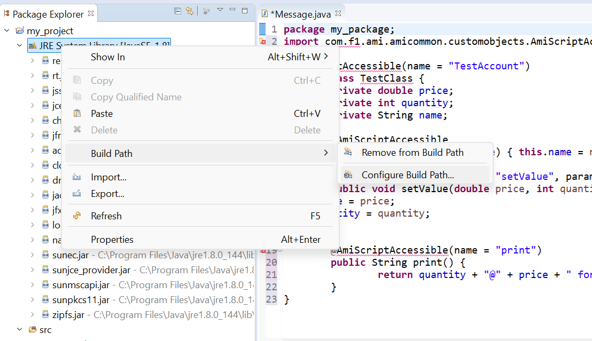

# Custom Java Plugins 

AMI supports functionality for writing different Java plugins for alternative datasources, authentication, custom objects, and more. There are a few guidelines to follow for extending the platform to suit your needs. 

## Overview

If you require specific plugins from 3forge, we will asign them to you as zips or `.jar` files that you can download from the client portal. Otherwise, you are welcome to write your own custom Java plugins. 

To see a full list of the types of plugins that AMI supports and more in-depth guides on how to configure them accordingly, see the [end](#plugin-list) of this document. 

## General Setup 

Plugins that we provide and any that you write should be written in Java and then exported as `.jar` files. Some setup is required, otherwise the AMI client will not launch correctly. In both cases, you should be aware of the following requirements:

### Requirements 

-	Plugins should follow the correct plugin interface from our [list](#plugin-list).
-	Plugins should be packaged and then exported as `.jar` files. We recommend using an IDE like eclipse.
-	Plugins must be correctly included in the `local.properties` configuration file. This will vary depending on your specific case.
-	Plugins should have a universally unique ID. 
-	Plugins will need to implement and extend classes and methods in AMI's `autocode.jar` and `out.jar` files.

### Creating and Importing Plugins

=== "3forge Plugin" 

	1. Navigate to your client portal and download the assigned plugin `.jar` files. 
	2. In the root directory of your AMI installation, go to `ami/amione/lib` and paste the `.jar` files into there. 
	3. In your `local.properties` file (located in `ami/amione/config`), add the appropriate configuration line which will be given to you.

=== "Custom Plugin" 

	1. Identify which plugin interface you wish to use, e.g a custom object.
	2. In your chosen Java IDE, e.g eclipse, create a new package and your Java files. 
	3. Each plugin interface will require you to import different methods from AMI. You will need to include these in your build path using the `autocode.jar` and `out.jar` files, which are located in `ami/amione/lib`. 

		 
		 

	4. Add the compiled classes to the classpath. You can do this by saving and exporting your package as a `.jar` file into the `ami/amione/lib` directory. 
	5. Update your `local.properties` file with the appropriate properties. For example, for the custom object `TestClass`: 
		```
		ami.web.amiscript.custom.classes=my_package.TestClass
		ami.center.amiscript.custom.classes=my_package.TestClass
		``` 
	You can then use this plugin the next time you run AMI.

!!!Note
	Plugins are instantiated and initialized during startup. Failure of a plugin to start will cause AMI to hard fail on startup. The exact reason for failure can be found in the log files.

More detail on each plugin type and their corresponding properties is in the plugin list below.

## Plugin List

- [AMIScript Class](./amiscript_classes.md)
- [Feed Handler](./feed_handlers.md)
- [Datasource Adapter](./datasource_adapters.md)
- [Authentication](./authentication.md)
- [Entitlements](./entitlements.md)
- [Data Filter](./data_filter.md)
- [Center Objects](./center_objects.md)
- [DNS](./dns.md)
- [Encryption](./encryption.md)
- [Custom HTML & Javascript](./html_and_javascript.md)