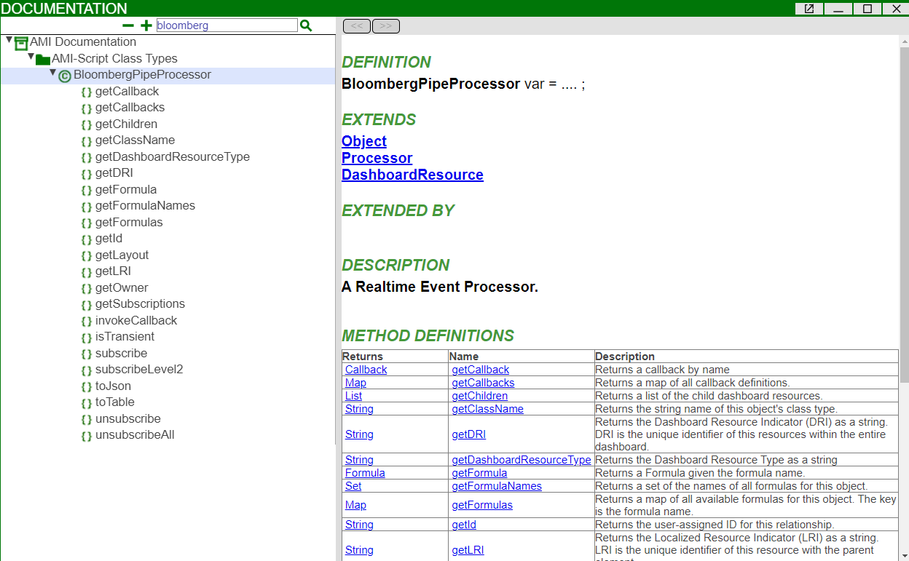

# B-PIPE Plugin 

For Bloomberg terminal account holders, 3forge offers direct integration of Bloomberg's Market Data Feed (B-PIPE) into AMI via the B-PIPE plugin. 

Please ensure that you are familiar with Bloomberg Professional Services' (BPS) terms and conditions of use. Use of any BPS data and services within AMI is still subject to Bloomberg policy. Any liability falls on the user of the services.

## Overview 

B-PIPE feeds are accessed in AMI as realtime processors which can be created in the data modeler. These are more dynamic than using custom feedhandlers, so we recommend using the B-PIPE processors if you are using Bloomberg realtime data in your applications.

Currently only streaming of market data is supported. If you require additional functionality, please contact <support@3forge.com> to find a tailored solution for your needs.

## Setup 

### Requirements

- A BPS account
- AMI application and trusted usernames configured in BPS EMRS 

!!! Note
    AMI integration assumes appropriate user permissions have already been established by the developer. For multi-user authentication, responsibility falls on the developer to ensure only entitled users have access to data. 

### Configuration

Add the following to your `local.properties`:

```
bpipe_plugin_enabled=true
bpipe_plugin_hostPrimary=YOUR.HOST.ADDRESS
bpipe_plugin_hostSecondary=YOUR.HOST.ADDRESS
bpipe_plugin_portPrimary=YOUR_PORT_NUMBER
bpipe_plugin_portSecondary=YOUR_PORT_NUMBER
bpipe_plugin_reconnect=30 
bpipe_plugin_appName=3FORGE:BPIPE
bpipe_plugin_authenticationMode=userAndApp
```

If you have a secondary B-PIPE server, use that address for `bpipe_plugin_hostSecondary` and `bpipe_plugin_portSecondary` for backup use, otherwise use the same address as your primary.

### Authentication 

Use your BPS account to determine or configure the login and application name you plan to use for AMI. To change your AMI layout details to match, you will need to update your `access.txt` file, the instructions for which you can find [here](../cheatsheets/security.md). You will not be able to use the plugin otherwise. 

When set up, log into the AMI with the corresponding BPS details. 

For single users, AMI will use the IP address to match the user to the corresponding terminal address (recommended). 
For multiple users, AMI will use the application information to authenticate the connection. Responsibility falls on the developer to ensure that only entitled users receive data. 


## Creating a B-PIPE Processor

In the AMI Data Modeler, go to Realtime Processors and right-click to add a new B-PIPE processor and fill in the creation fields. It is possible to create and have multiple B-PIPE processors in one AMI instance which can be used to manage multiple subscriptions for different tickers. 


Once created, you can then use a B-PIPE processor to build datamodels from. B-PIPE processors are stored as `BloombergPipeProcessor` objects within AMI and have unique methods associated to them including subscribing. See the documentation in AMI for a full list of the operations you can perform. 



## Subscribing to Data

To subscribe to a specific ticker, in any field that takes AMIScript such as a datamodel or callback, input the following in the `onProcess()` field:
Note that our example uses a form panel, adjust your script accordingly.

```amiscript

BloombergPipeProcessor bp = layout.getProcessor("YOUR_BPIPE_PROCESSOR_NAME");
FormPanel fp = layout.getPanel("Html1");
String ticker = fp.getField("tickerSelect").getValue();
String fields = fp.getField("multicheckbox").getValue();
fields = fields.replaceAll("\"","");
fields= fields.substring(1,fields.length() - 1);
bp.subscribe(ticker,fields);
```

## Unsubscribing from Data

Unsubscribing is similar to subscribing except it uses the `unsubscribe()` or `unsubscribeAll()` AmiScript method. Once you call these methods, you no longer receive real time updates for the specified tickers. 

```amiscript

BloombergPipeProcessor bp = layout.getProcessor("BPIPE");
FormPanel fp = layout.getPanel("Html1");
String ticker = fp.getField("tickerSelect").getValue();
String l = fp.getField("multicheckbox").getValue();
bp.unsubscribe(ticker);
```

Alternatively, you can call these methods in any window that takes AMIScript for example callbacks. 

## Using Multiple Tickers 

To subscribe to multiple tickers, each individual ticker must be passed as a string directly into AMIScript's `bp.subscribe()` method. For example, in any field that takes AMIScript:


```amiscript 

List tickers = new List("tickerA","tickerB","tickerC");

for (String ticker : tickers) {
    bp.subscribe(ticker,"LAST_PRICE");
}
```

Each subscription is then internally added to a Bloomberg susbscription list. To unsubscribe, you can either call `unsubscribeAll()`, or again iterate through a list of strings to unsubscribe from specific tickers. 

## Creating Tables

To visualize data from a BPIPE feed, you can right-click the processor and choose 'Add Realtime Table/Visualization'. You can also right-click on a processor and click 'Add datamodel' and manipulate the data under the `onProcess()` tab:

```amiscript
Processor p = layout.getProcessor("BPIPE");
Table t = p.toTable();
CREATE TABLE bpipe AS SELECT * FROM t;
```

To ensure that your datamodel is up to date in realtime, make sure under the 'Subscribe' field you are subscribed to the B-PIPE processor. You can configure this further using AMI `rtevents` to udpate the model efficiently.


For access to historical data, please see our documentation [here](../datasource_adapters/historical_bpipe.md)