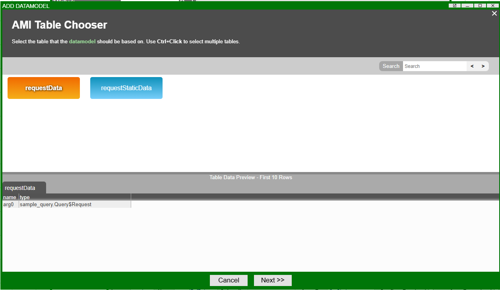
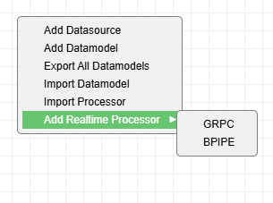

# gRPC

AMI offers multiple options for streaming/querying information from a gRPC server. Please note that these libraries are packaged separately from the base installation of AMI and can be assigned to your account by contacting <support@3forge.com>. 

## Overview 

There are three main methods for working with gRPC:

- **Feed Handler**: Real-time message subscriptions via the relay
- **Datasource Adapter**: Query-based retrieval, accessible from the center and the web
- **Realtime Processor**: Web-based subscriptions which can be configured during runtime

For real-time messages, the feed handler option is recommended over the web processor unless there is a requirement to modify subscriptions during runtime.

## Setup 

### Requirements

- The gRPC adapter files (`ami_adapter_grpc.xxxx.tar.gz`) - these will be assigned to you by 3forge.
- A valid jar file containing the Java stub generated from the `.proto` file

!!! Note
    This document aims to cover AMI specific information, for gRPC related knowledge, please see: https://grpc.io/docs/languages/java/quickstart/

### Configuration

Depending on which configuration of gRPC is used, you will need the following properties in your `local.properties`:

#### Feed Handler
```
# Required - use this to configure one or more FHs
ami.relay.fh.active=grpc
# Required - used to start the FH
#ami.relay.fh.grpc.start=true
# Required - must match exactly
ami.relay.fh.grpc.class=com.f1.ami.relay.fh.grpc.AmiGRPCFH
# Required - name of AMI table for data to be streamed into
ami.relay.fh.grpc.props.tableName=tableName
# Required - Url of the gRPC server
ami.relay.fh.grpc.props.serverUrl=address:portNumber
# Required - subscribe command (see below for query syntax)
ami.relay.fh.grpc.props.command=methodName(params...)
# Required - fully qualified name of the Stub Class
#ami.relay.fh.grpc.props.stubClass=com.package.StubGrpc
# Optional - Comma delimited metadata field for passing items like tokens for auth
ami.relay.fh.grpc.props.metadata=key1:val,key2:val2
# Optional - Primary key to be used (see below for primary key syntax)
ami.relay.fh.grpc.props.primaryKey=a.b
```

#### Datasource Adapter
```
ami.datasource.plugins=$${ami.datasource.plugins},\
    com.f1.ami.plugins.grpc.AmiGRPCDatasourcePlugin
```

#### Realtime Processor
```
ami.web.amiscript.custom.classes=com.f1.ami.web.amiscript.AmiWebScriptMemberMethods_GRPCProcessor
ami.realtime.processor.plugins=com.f1.ami.web.rt.AmiWebRealtimeProcessorPlugin_GRPC
```

!!! Note
    All three components can be used together in a single installation and will require all of the above properties.W

### Authentication 

Only token based authentication is supported for the gRPC connections (passed via the metadata field). Please contact <support@3forge.com> if additional functionality is required.

## gRPC Syntax Guide

We have two unique syntaxes for either performing a subscription/query, and for defining a primary key.

### Query / Subscribe Syntax

In order to perform a query or a subscription, a method from the Stub class has to be invoked. The syntax is similar to AMISQL and has the following form:

```amiscript
method_name(param1, param2, ...);
```

Primitive types can be used as you would in AMISQL:
```amiscript
method_name(false, 1, 2L, 3.0f, 4.0, "5");
```

For any enums, you can use either its numerical representation or full string name. 

Given the following enum:
```
enum MyEnum {
  FIRST = 0;
  SECOND = 1;
  THIRD = 2;
}
```
Any of these would be valid params:
```amisql
"FIRST", "SECOND", "THIRD", 0, 1, 2
```

For lists, or methods with the repeating type:
```amisql
new List(param1, param2, ...);
```

For classes, you will need to use the `new fully.qualified.class.name(param1, param2, ...);` syntax. You can also nest class constructions as you would in AMISQL: 

```amisql
new fully.qualified.class.name(new fully.qualified.class.name2(innerparam1, innerparam2, ...), param2, ...);
```

Arguments must be filled out in sequential order according to its definition and you can also choose to omit optional params.

For example, given the following class:
```
enum PeriodicitySelection {
  DAILY = 0;
  WEEKLY = 1;
}

message DataRequest {
  repeated string securities = 1;
  PeriodicityAdjustment adjustment = 2;
  optional int32 max_results = 3;
  optional bool return_ids = 4;
}
```

Any of these syntaxes would be valid:

```amisql
new sample_query.Query$DataRequest("abc", 1);
new sample_query.Query$DataRequest("abc", "DAILY", 2);
new sample_query.Query$DataRequest("abc", "WEEKLY", 2, false);
```

#### Example

Given the following proto file:

```
syntax = "proto3";

package sample_query;

service Query {
  rpc RequestData (Request) returns (Response);
  rpc RequestStaticData (Request) returns (Response);
}

message Request {
  repeated string securities = 1;
  repeated string fields = 2;
}

message Response {
  repeated RequestResponse response = 1;
}

message RequestResponse {
  string security = 1;
  map<string, string> field_values = 2;
}

```

In order to invoke the `RequestData` method, you can use the AMI Table Chooser by Adding a Datamodel to the gRPC adapter to automatically generate the skeleton syntax:

```amiscript
CREATE TABLE requestData AS EXECUTE requestData(new sample_query.Query$Request(LIST<STRING> securities, LIST<STRING> fields));
```

The results returned would be a table with two columns, `security` and `field_values` as a JSON string.

#### Previewing Syntax

As demonstrated above, the datasource adapter returns a preview of all available methods registered on the stub.



The preview shows the number of arguments required for each method, and also creates a skeleton syntax for reference when you click next.

### Primary Key Syntax

In order to define a primary key for messages, we use a simple `col1.inner_col2.index.col3` syntax where index is a numerical index (starting from 1 for the first index) for any given repeated types.

Given a sample proto class where we are defining a primary key for `Data`:
```
message FieldData {
  string id = 1;
  map<string, string> data = 2;
}

message Data {
  string security = 1;
  repeated FieldData field_data = 2;
}
```

If we wanted to use security as the primary key it would simply be: `primaryKey=security`

Because `field_data` is a repeating type, if we wanted to get the <i>2nd</i> `FieldData` object's id as the primary key, it would be: `primaryKey=field_data.2.id`

Similarly, if we wanted to use a specific field `dataKey` inside the `data` map in the <i>1st</i> `FieldData`, it would be: `primaryKey=field_data.1.dataKey`

## Querying Data via the Datasource Adapter

To setup the gRPC Datasource Adapter, use the Attach Datasource button and select <b>gRPC Datasource Adapter</b>.

These are the available datasource adapter configurations:
- <b>Configuration / Name</b>: Unique Datasource Name
- <b>Configuration / URL</b>: gRPC Server URL
- <b>Advanced / class Prefix</b>: <i>(Optional)</i> Used to specify the package name, to shorten class construction
- <b>Advanced / Metadata</b>: <i>(Optional)</i> Same as the Feed Handler, pass in a comma delimited string to forward connection metadata. (Example: `key1:val1,key2:val2`)
- <b>Advanced / stub Class</b>: Fully qualified path of the gRPC Stub to be used

## Creating a Subscription via the Realtime Processor

In the AMI Data Modeler, go to Realtime Processors and right-click Add Realtime Processor > GRPC to add a new gRPC processor. It is possible to create and have multiple gRPC processors in one AMI instance which can be used to manage multiple subscriptions for different tickers. 



These are the available processor configurations:
- <b>Processor Id</b>: Unique Processor ID
- <b>Primary Key</b>: <i>(Optional)</i> Defines a primary key to be used for the processor's subscription. See primary key syntax section for examples.
- <b>Keep Output</b>: Holds onto all retrieved information. Objects received are sent to downstream sources and dropped otherwise.
- <b>Server URL</b>: The gRPC server's URL
- <b>Stub Class</b>: Fully qualified path of the gRPC Stub to be used
- <b>Metadata</b>: <i>(Optional)</i> Same as the Feed Handler, pass in a comma delimited string to forward connection metadata. (Example: `key1:val1,key2:val2`)
- <b>Stub Class</b>: Fully qualified path of the gRPC Stub to be used
- <b>Class Prefix</b>: <i>(Optional)</i> Used to specify the package name, to shorten class construction
- <b>Rerun On Failure</b>: Automatically restarts the connection if any exceptions are encountered
- <b>Rerun On Complete</b>: Automatically re-initiates a connection if the connection is marked as complete

!!! Note
    If the processor is intended to be run indefinitely, a <b>Primary Key</b> should be specified to avoid a memory build-up overtime and the <b>Keep Output</b> option should not be used.

Once created, you can then use the processor by first getting a reference to the processor, and calling `run` with a subscription query or `stop`:

```amisql
GRPCProcessor p = new GRPCProcessor(layout.getProcessor("GRPC_ID"));
p.run("your_query_here");
//On stop condition
p.stop();
```
