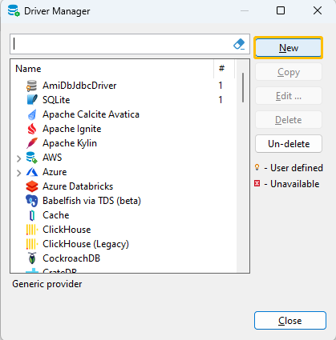

# JDBC

## Overview

Data can be sent from/to AMI using a JDBC connection. This connection is controlled by the configuration file (see the [Configuration Guide](../configuration_guide/center.md) for more details).

```
The port for connecting to AMI via the AMI JDBC driver. Default is 3280
ami.db.jdbc.port=3280

Optional. Specifies the network interface that the ami.db.jdbc.port server port will be bound to
ami.db.jdbc.port.bindaddr=

# provide either a list of permitted hostname patterns or plugin for blocking/granting access based on foreign network address. Syntax is either file:<file_containing_a_hostname_patterns_per_line> or text:<comma_delimited_list_of_hostname_patterns> or plugin:<class_name_implementing_com.f1.ami.amicommon.AmiServerSocketEntitlementsPlugin>
ami.db.jdbc.port.whitelist=

# By default pointing to ${ami.db.auth.plugin.class}, which sets target database's JDBC endpoints
ami.jdbc.auth.plugin.class:=${ami.db.auth.plugin.class}
```

## Example: Java

``` amiscript
import java.sql.*;
public class AmiJdbcSample {
//IMPORTANT NOTE: be sure to include out.jar in your java classpath. The out.jar file is located in the lib folder of your ami installation
    public static final String NEW_LINE = System.getProperty("line.separator");
    public static void main(String a[]) throws SQLException, ClassNotFoundException {
        Class.forName("com.f1.ami.amidb.jdbc.AmiDbJdbcDriver");
        final String url = "jdbc:amisql:localhost:3280?username=demo&password=demo123";
        final Connection conn = DriverManager.getConnection(url);
        try {
            final ResultSet rs = conn.createStatement().executeQuery("select * from __TABLE");
            System.out.println(resultSetToString(rs));
        } finally {
            conn.close();
        }
    }
    public static String resultSetToString(ResultSet rs) throws SQLException {
        final StringBuilder r = new StringBuilder();
        final ResultSetMetaData metaData = rs.getMetaData();
        final int columnCount = metaData.getColumnCount();
        for (int i = 1; i <= columnCount; i++)
            r.append(metaData.getColumnName(i)).append(i == columnCount ? NEW_LINE : "\t");
        while (rs.next())
            for (int i = 1; i <= columnCount; i++)
                r.append(rs.getObject(i)).append(i == columnCount ? NEW_LINE : "\t");
        return r.toString();
    }
}
```

## Example: Python

**Prerequisites**: A jre (Java runtime environment, for JDBC) needs to be installed.

1. Install the JayDeBeApi module.

	JayDeBeApi is an adapter of JDBC for python. You can install it using pip:
	
	``` sh
	pip install JayDeBeApi
	```
	
	Alternative ways to install JayDeBeApi: <https://pypi.org/project/JayDeBeApi/>

1. Start AMI One

1. Connect to amisql from python:

	1. You'll need the path to the out.jar file. This can be found in the ami/amione/lib folder.
	
	1. Find the server hostname and ami.db.jdbc.port (default is 3280).
	
	1. Copy this script, replacing the <placeholders\> with appropriate values:

	``` python
	import jaydebeapi
	
	conn = jaydebeapi.connect("com.f1.ami.amidb.jdbc.AmiDbJdbcDriver",
		"jdbc:amisql:<hostname>:<port>",
		{"user": "<username>", "password": "<password>"},
		"<path/to/out.jar>")
	```

1. To run queries, create a cursor:

	``` python
	curs = conn.cursor()
	```

1. Queries can then be executed using the execute method:

	``` python
	curs.execute("show tables")
	```

1. Results are fetched using the fetchall method, which returns a list:

	``` python
	print(curs.fetchall())
	```

1. Close the cursor once finished:

	``` python
	curs.close()
	```

You can also execute queries within a `with` block for the cursor so you don't have to worry about closing it:

``` python
with conn.cursor() as curs:
	curs.execute("show tables")
	result = curs.fetchall()
```


## Example: DBeaver

1. Add driver configuration in DBeaver

	1. Go to **Database** -\> **Driver Manager**, Open driver manager dialogue and click **New**
	
	 

	1. Configure the AMIDbJdbcDriver

	
	
	|Parameter |Description |Example |
	| ----------- | ----------- | ----------- |
	|Driver Name |Name of your driver. It can be any name you like |AmiDbJdbcDriver |
	|Driver Type |Driver Provider |Generic |
	|Class Name |JDBC driver class name |com.f1.ami.amidb.jdbc.AmiDbJdbcDriver |
	|URL Template |Template of driver URL, should follow the format like: **jdbc:amisql:<host\>:<jdbc port\><login details\>** |jdbc:amisql:localhost:3280?username=demo&password=demo123 |
	|Default Port |Default AMI JDBC port is 3280 |3280 |
	|Default Database |Default database is AMI |AMI |
	|Default User |Default user name is demo |demo |
	|Description |Description of the driver |driver for connection to AMIDB|

	1. Go to **Libraries** tab and add the **out.jar** file(/amione/lib/out.jar) into it and hit ok
	
	

1. Establish Database Connection With the AMIDbJdbc Driver

	1. Go to **Database** -\> **New Database Connection** and select the **AMIDbJdbc** driver we just configured  
	
	
	
	1. Enter the URL and your login information. Your AMI Database is ready to go.
	
	