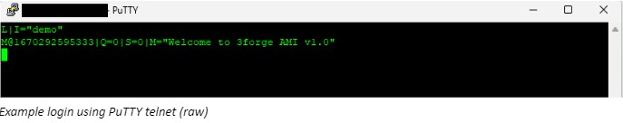

# LoadFile

External files can be loaded into AMI via AMI Relay LoadFile plugin

## Step-by-step Guide

1. Telnet into the platform's real-time streaming port, this is set by the property `ami.port` and is 3289 by default

2. Login with a string identifying your process (in this case, `demo`)

	```
	L|I="demo"
	```

	

3. Run your LoadFile command e.g.

	```
	V|T="LoadFile"|LOGIN="demo"|FILE="file/AAPL.csv"|COLUMNS="Date,Open,High,Low"|CLASSES="String,Double,Double,Double"
	```

## LoadFile Command

The LoadFile command has several options, below is a breakdown of each one for this example:

```
V|T="LoadFile"|LOGIN="demo"|FILE="file/AAPL.csv"|COLUMNS="Date,Open,High,Low"|CLASSES="String,Double,Double,Double"|MPS="10"|LIMIT=10|DELIM=","|TYPE="AAPL"|SKIP=1|QUOTES="#"|

```

`T="LoadFile"`
:	Indicates a LoadFile command

`LOGIN="xxx"`
:	Required login instruction for replay file

`FILE="/path/xxx.log"`
:	COMPULSORY, Name and path to the file to load, this can be absolute or relative to path from the AMI application installation directory `amione/`

`COLUMNS="COL1,COL2,COL3..."`
:	COMPULSORY, a comma delimited list of column names

`CLASSES="CLASS1,CLASS2,CLASS3..."`
:	COMPULSORY, a comma delimited list of column classes corresponding to the ``COLUMNS``

`MPS=xxx (long)`
:	OPTIONAL, stands for "Max Per Second", which is the maximum number of lines read from the file per second. This is referred to as MAX_PER_SECOND as it does not guarantee exactness

`NULL="xxx"`
:	OPTIONAL, by default is ``null``, the value that should be treated as null

`QUOTES="x"`
:	OPTIONAL, by default is ``null``, the char value that should be treated as quotes. For example, if the raw value is ``#123#``, by specifying ``QUOTES="#"``, the value that comes out will be ``123``.

`LIMIT=xx (long)`
:	OPTIONAL, by default is ``java.Long.MAXVALUE``, the maximum number of lines to be read from the file

`SKIP=xx (long)`
:	OPTIONAL, by default is ``0``, the number of lines to skip. For example,  by specifying ``SKIP=1``, the parser would skip the first line and start reading from the second line.

`DELIM="x"`
:	OPTIONAL, by default is ``","``, the delimeter of the row contents

`TYPE="xxx"`
:	OPTIONAL, by default is ``"FILE: Your_File_Directory"``, the table name in AMI Center

