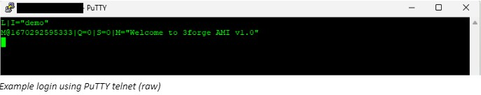

# Replay

Past realtime messages sent to the Relay (usually from Feed Handlers and Clients) can be replayed from a AMI messages log file (e.g. `AmiMessages.log`). This is useful for retrieving and rendering data from otherwise hard-to-read data from AMI real-time message log files

## Step-by-step Guide

1. Telnet into the platform's real-time streaming port, this is set by the property `ami.port` and is 3289 by default

2. Login with a string identifying your process (in this case, `demo`)

	```
	L|I="demo"
	```

	

3. Run your replay command e.g.

	```
	V|T="Replay"|LOGIN="demo"|FILE="replay/AmiMessages_Replay.log"|MAXDELAY=0
	```

## Replay Command

The replay command has several options, below is a breakdown of each one for this example:

```
V|T="Replay"|LOGIN="demo"|FILE="replay/AmiMessages_Replay.log"|MAXDELAY=0
```

`T="Replay"`
:	Indicates a replay command

`LOGIN="xxx"`
:	Required login instruction for replay file

`FILE="/path/xxx.log"`
:	Name and path to AMI messages log file to replay, this can be absolute or relative to path from the AMI application installation directory `amione/`

`MAXDELAY=xxx (long)`
:	OPTIONAL, delay between each line read from log file. This is referred to as MAXDELAY as it does not guarantee exactness

`MAX_PER_SECOND=xxx (long)`
:	OPTIONAL, maximum number of lines read from the log file per second. This is referred to as MAX_PER_SECOND as it does not guarantee exactness


!!! note

	Multiple files can be replayed within the same command, with the file names and paths delimited with a comma. For example:
	
	```
	V|T="Replay"|LOGIN="demo"|FILE="replay/First_AmiMessages.log,replay/Second_AmiMessages.log"
	```
