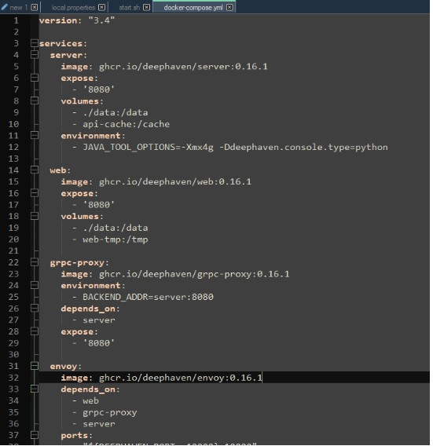

# Deephaven

Requirements:

- Docker
- JDK 17

## Setting up Deephaven

1. Install sample python-example containers from Deephaven from [Quick start Install Deephaven](https://deephaven.io/core/docs/tutorials/quickstart/)

	```sh
	curl https://raw.githubusercontent.com/deephaven/deephaven-core/main/containers/python-examples/base/docker-compose.yml -O
	docker-compose* pull
	docker-compose* up
	```

1. If you run into errors with the gRPC container, downgrade the containers in the `docker-compose.yml` file to 0.16.1

	

1. Go to [http://localhost:10000/ide/](http://localhost:10000/ide/) on the browser

1. Execute the following commands in the Deephaven IDE

	```python
	from deephaven import read_csv
	
	seattle_weather = read_csv("https://media.githubusercontent.com/media/deephaven/examples/main/GSOD/csv/seattle.csv")
	
	from deephaven import agg
	
	hi_lo_by_year = seattle_weather.view(formulas=["Year = yearNy(ObservationDate)", "TemperatureF"])\
	    .where(filters=["Year >= 2000"])\
	    .agg_by([\
	        agg.avg(cols=["Avg_Temp = TemperatureF"]),\
	        agg.min_(cols=["Lo_Temp = TemperatureF"]),\
	        agg.max_(cols=["Hi_Temp = TemperatureF"])
	        ],\
	     by=["Year"])
	```

## Setting up the Adapter

1. Place `DeephavenFH.jar` and all other jar files in the `dependencies` directory under `/amione/lib/`

1. Copy the properties from the `local.properties` file to your own `local.properties`

1. For JDK17 compatibility, use the attached start.sh file or add the following parameters to the java launch command

	```sh
	--add-opens java.base/java.lang=ALL-UNNAMED --add-opens java.base/java.util=ALL-UNNAMED --add-opens java.base/java.text=ALL-UNNAMED --add-opens java.base/sun.net=ALL-UNNAMED --add-opens java.management/sun.management=ALL-UNNAMED --add-opens java.base/sun.security.action=ALL-UNNAMED 
	```

1. Add the following to the java launch parameters to the `start.sh` file as well

	```sh
	-DConfiguration.rootFile=dh-defaults.prop 
	```

1. Launch AMI from `start.sh`

## Querying Deephaven

Queries in the datamodel (after the `#!amiscript EXECUTE` keyword) will be sent to the deephaven application as a console command. Any table stated/created in the deephaven query will be returned as an AMI table. For example the code below creates a table `sample` in Deephaven and populates the `testDHTable` in AMI using the `sample` table.

```amiscript
create table testDHTable as execute sample = hi_lo_by_year.where(filters=["Year = 2000"]);
```

If the table already exists in Deephaven then we can just retrieve the table as show below:

```amiscript
create table testDHTable as execute hi_lo_by_year;
```
