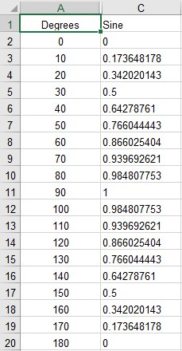
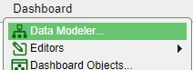
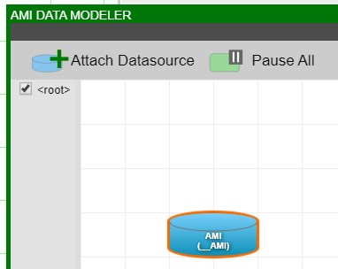
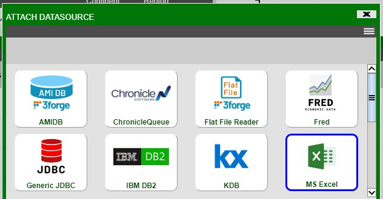
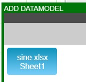
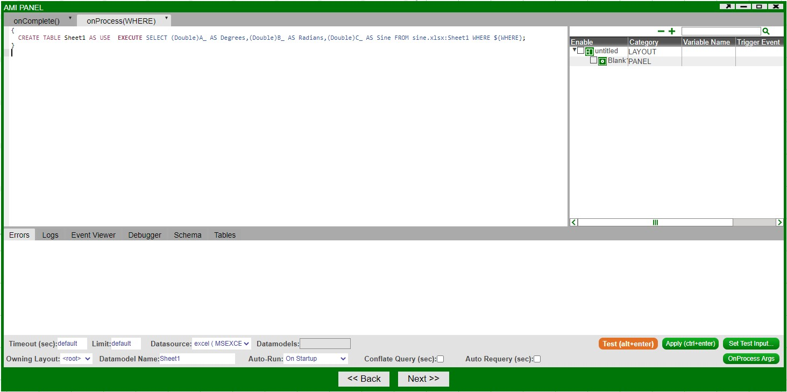

# Excel

This guide will show how to import excel data into AMI and create a visualization. In this example we have an Excel spreadsheet `sine.xlsx` with two columns: **Degrees** and **Sine**.

1. The first step is to add a new Excel Datasource. In developer mode, click on Dashboard from the menu and open the Data Modeler.

	
	
	

1. Inside the Data Modeler, click on **Attach Datasource**. This will bring up the Attach Datasource Window. Select the **MS Excel** icon from the list of available datasource types.

	

1. In the provided fields, fill out the **Name** and **URL** fields. In the Name field, put in the desired name of the new datasource. And in the **URL** field, provide the full file name (including the path) of the Excel file.

	!!! warning
		
		The excel file must be closed before being added as a datasource
	
	

1. The following prompt should appear and the datasource should now be visible in the datamodeler.

	

	

1. Double click on the datasource (or right-click and select **Add Datamodel to excel**) to see the sheets in the excel file. Select one or more sheets and follow the wizard in order to create a datamodel

	

	

	!!! note
		
		The columns have to be cast to their desired type for AMI to correctly interperet them.