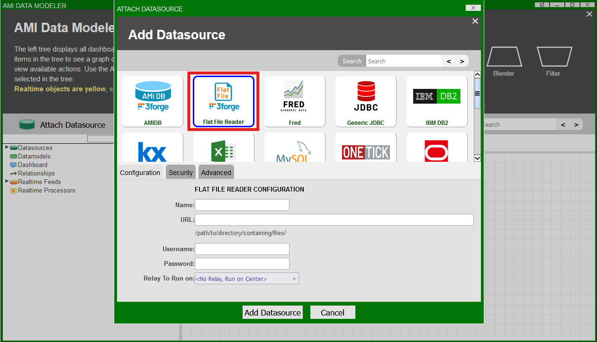
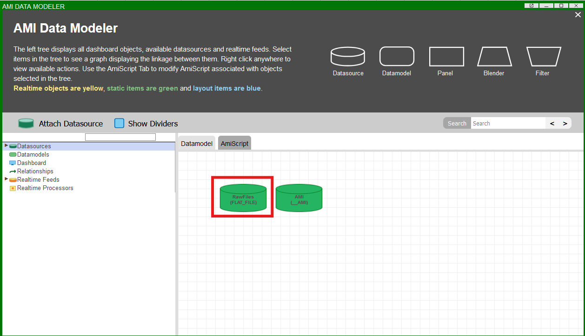

# Flat File

AMI provides a large number of [datasource adapters](./index.md/#supported-adapters) for different supported software. Alternatively, users may choose to attach flat files directly using this highly performant adapter.

## Overview

The AMI Flat File Reader datasource adapter is a highly configurable adapter for processing extremely large files efficiently.

When creating datamodels using the flat files, AMI determines how to parse and store the data using a number of general directives.

Generally, the adapter can handle files containing data that have the following format: 

1. Delimited lists or ordered fields 

	```
	ticker,amount,purchase cost
	GOOGL,100,158
	AAPL,30,216
	MSFT,20,430.1
	```

2. Key-value pairs 

	```
	ticker=GOOGL|amount=100|purchase cost=158
	ticker=AAPL|amount=30|purchase cost=216
	ticker=MSFT|amount=20|purchase cost=430.1
	```

3. Pattern matching 

	```
	Account 11232 has 1000 shares at $123.20 px
	Account 12412 has 8900 shares at $430.90 px
	```

Alternatively you can display the entire raw contents of a file in a single-column AMI table with the heading 'line.' 

When creating a datamodel, AMI will default to auto-generating a raw table if it cannot automatically detect any mappings, or the user does not supply them.

## Using the Adapter 

Navigate to the AMI Data Modeler (*Dashboard -> Data Modeler*) and select "Attach Datasource." 



Under the "Configuration" menu, fill in the following details:

1. Name 

	- Supply a user-defined name, e.g "RawFiles."

1. URL 

	- The full path to the directory containing your files.

Then click the "Add Datasource" button. The flat file datasource will now be available and visible in the Data Modeler: 

 

!!! Note
	Files can also be accessed remotely via [AMI Relay](../configuration_guide/relay.md) on machines where a relay has been installed. 
	
	When configuring the flat file reader, click the "Relay To Run on" dropdown menu and select the corresponding relay.


## General Directives 

These are the main directives that are used to parse raw files when creating a datamodel from the adapter:

- [`_file`](#_file)
- [`_fields`](#_fields)
- [`_delim`](#_delim) 
- [`_conflateDelim`](#_conflatedelim) (optional)
- [`_quote`](#_quote) (optional)
- [`_equals`](#_equals) (optional, key-value pairs)
- [`_escape`](#_escape) (optional) 
- [`_mappings`](#_mappings) (optional, key-value pairs)
- [`_binary`](#_binary) (optional)
- [`_pattern`](#_pattern) (pattern-matching only)

See the section below for syntax to configure each directive. 

By default, AMI will attempt to create a single-column table with the raw data if it cannot automatically parse the data. 

In the datamodel creation wizard, it looks like this:

```amiscript
{
  CREATE TABLE test_txt AS USE _file="/file.txt" 
  _delim="\n" 
  _quote="\"" 
  _escape="\\" 
  _skipLines="0" 
  _fields="String line" 
  _binary=false  
  EXECUTE SELECT * FROM file WHERE ${WHERE};
}

```

### `_file` 
: 
	**Example**: `#!amiscript _file="path/to/file.type"`

	- The file to read including file type.


### `_fields`
: 
	**Syntax**: `#!amiscript _fields="col1_type col1, col2_type col2, ..."`

	- Type and name of the columns to be stored as a table in AMI. Allowed types are: 
		- `String` 
		- `Long` 
		- `Integer` 
		- `Double` 
		- `Float` 
		- `Boolean`
		- `UTC`

	- If column type is not supplied, defaults to `String`. 

!!! Note

	Line numbers are added automatically by AMI via the [`_linenum`](#_linenum) directive. If the line number column is not supplied, it will default to type integer and be added to the end of the table schema. 
	
	Columns defined in the [`_pattern`](#_pattern) but not defined in `_fields` will be added to the end of the table schema.

### `_delim` 

: 
	**Syntax**: `#!amiscript _delim="delimiter"` 

	- String used by AMI to separate each field. 
	- Special characters like tabs and line breaks can be supplied as the following: 
		- `#!amiscript "\t"` 
		- `#!amiscript "\n"` 

### `_conflateDelim` 
: 
	**Syntax**: `#!amiscript _conflateDelim=true_or_false`

	- If true, then one or more consecutive delimiters is treated as a single delimiter.

### `_quote` 
: 
	**Syntax**: `#!amiscript _quote="quote_character"` 

	- Optional character denoting a quote in the supplied file.  
	- If AMI encounters fields enclosed in the quotes, they will be parsed without in the final table. 


### `_equals` 
: 
	**Syntax**: `#!amiscript _equals="equals_char"` 

	- Supplied equality symbol for key-value pair mapping. 


### `_escape` 
: 
	**Syntax**: `#!amiscript _escape="escape_char"` 

	- Supplied escape character. 

### `_mappings` 
: 
	**Syntax**: `#!amiscript _mappings=from1=to1,from2=to2,...` 

	- Optional mappings directive for key-value pair files.
	- Used for key names that are not valid field names. 
	- Used if multiple key names should be attributed to the same column heading. 
	- For multiple column-to-pattern mappings, use \\n (new line) to separate each one.

### `_binary` 
: 
	**Syntax** `_binary=true/false` 

	- Indicates whether the file contains binary data.


### `_pattern` 
: 
	**Syntax**: `#!amiscript _pattern=col1_type col1_name, ...=regex_describing_columns` , `#!amiscript _pattern=col1_name, ...=regex_describing_columns` (if column typing is specified in `_fields`)

	- Used for files with data that aren't stored in a conventional format.  
	- Uses regex for pattern matching.

## Optional Line Directives 

- [_skipLines](#_skiplines)
- [_linenum](#_linenum)
- [_filterOut](#_filterout)
- [_filterIn](#_filterin)

### `_skipLines` 
: 
	**Syntax**: `#!amiscript _skipLines=number_of_lines` 

	- Number of lines to skip from the top of the file, for example if there is a header. 
	- Default is 0.


### `_linenum` 

: 
	**Syntax**: `#!amiscript _linenum=column_name` 

	- Name of the column that will contain the line number starting from 1. 
	- If not supplied, default name is "linenum." 
	- Starting number is inclusive of `_skipLines`, i.e starts from `_skipLines`+1

### `_filterOut`
: 
	**Syntax**: `_filterOut=regex` 
	
	- Any line that matches the supplied regular expression will be ignored. 
	- Applied before parsing, so more performant than using the `WHERE` clause. 

	#### Examples: 

	- `_filterOut="Test"`: ignore any lines containing the text "Test."
	- `_filterOut="^Comment"`: ignore any lines starting with "Comment."
	- `_filterOut="This|That"`: ignore any lines containing the text "This" or "That."

### `_filterIn`
: 

	**Syntax**: `_filterIn=regex` 

	- Only lines that match the supplied regular expression will be considered. 
	- Applied before parsing, so more performant than using the `WHERE` clause.  

	#### Examples:

	- `_filterIn="3forge"`: ignore any lines that don't contain the word "3forge." 
	- `_filterIn="^Outgoing"`: ignore any lines that don't start with "Outgoing."
	- `_filterIn="Data(.*)"`: ignore any lines that don't start with "Data", and only process the text after.


## Examples 

### Delimited List 

Sample data: 

```
11232-33|Smith|20
'1332|ABC'||30
Account\|112|Jones|18
```

Directives:

```amiscript
_delim="|"
_fields="code,lname,int age"
_quote="\'"
_escape="\\"
```

AMI Table: 

|linenum (int)| code (string)    | lname (string) | age (int) |
|-------------|------------------|----------------|-----------|
|1			  | 11232-33         | Smith 		  | 20        |
|2			  | 1332\|ABC        | 				  |	30  	  |
|3			  | Account\|112  	 | Jones 		  |	18  	  |

### Key-Value Pair 

For key-value pairs, the equals character needs to be specified. Mappings can optionally be supplied which will allow for AMI to populate columns according to user-defined mappings.

Sample data: 

```
code=11232-33|lname=Smith|age=20
code='1332|ABC'|age=30
20=Act\|112|21=J|22=18 
```

Directives: 

```amiscript
_delim="|"
_equals="="
_fields="code,lname,int age"
_mappings="20=code,21=lname,22=age"
_quote="\'"
_escape="\\"
```

AMI Table: 


|linenum (int)| code (string)    | lname (string) | age (int) |
|-------------|------------------|----------------|-----------|
|1			  | 11232-33         | Smith 		  | 20        |
|2			  | 1332\|ABC        | 				  |	30  	  |
|3			  | Act\|112  	     | J 		      |	18  	  |

### Pattern Matching

With pattern matching, fields are not strictly required however how you specify column names and typing depends on the regex pattern you choose. 

To define the types of your columns, it is preferred to do this via the `_pattern` definition than in the `_fields` directive otherwise you may encounter type mis-matching. For example:

```amiscript
_fields="name,long id, int age"
_pattern="name,long id,int age=some_regex
```

is equivalent to omitting the `_fields` directive entirely as the column types are specified in the pattern.


**Example 1** 

Sample data: 

```
GOOGL selling 1000 shares at px 158
AAPL selling 30 shares at px 216
MSFT selling 20 shares at px 430.1
```

```amiscript
_pattern="string ticker,long amount,double price=(.*) selling (.*) shares at px (.*)"
```

Generates the AMI Table:

|linenum (int)| ticker (string)| amount (long)  | price (double)|
|-------------|----------------|----------------|---------------|
|1			  | GOOGL  		   | 1000   		| 158.0  		|
|2            | AAPL 		   | 30  			| 216.0  		|
|3			  | MSFT		   | 20             | 430.1			|

**Example 2**

```
_pattern="fname,lname,int age=User (.*) (.*) is (.*) years old\n lname,fname,int weight=User (.*),(.*) weighs (.*) pounds"
```

This defines two patterns such that:

```
User John Smith is 20 years old
User Boy,Bobby weighs 130 pounds
```

Maps to:

|linenum (int)| fname (string)| lname (string)  | age (int)     | weight(int) |
|-------------|----------------|----------------|---------------|-------------|
|1			  | John		   | Smith   		| 20  			|			  |
|2            | Bobby 		   | Boy  			| 				| 130		  |
