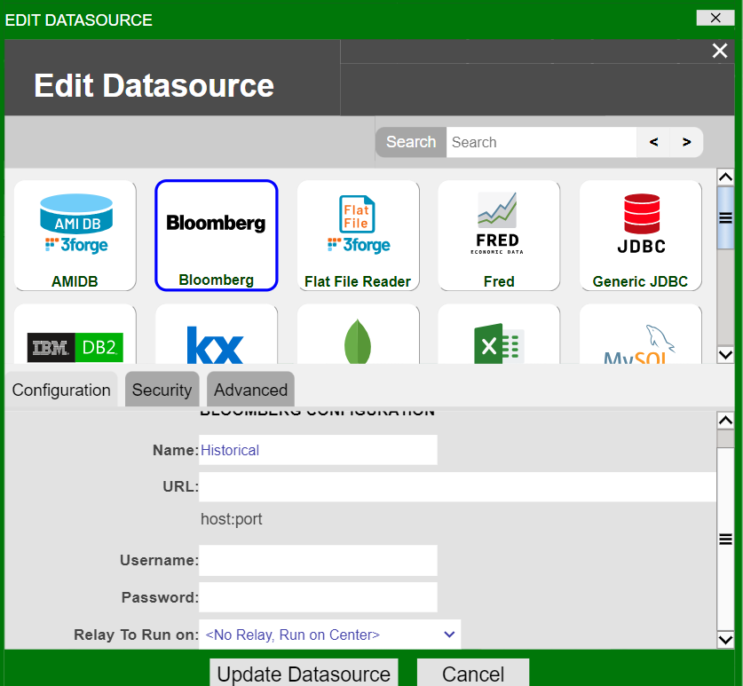
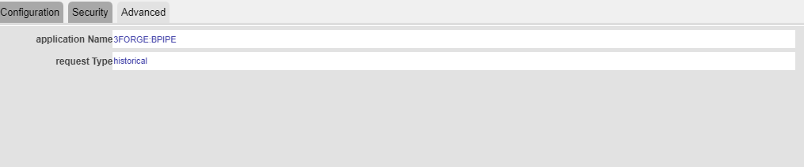
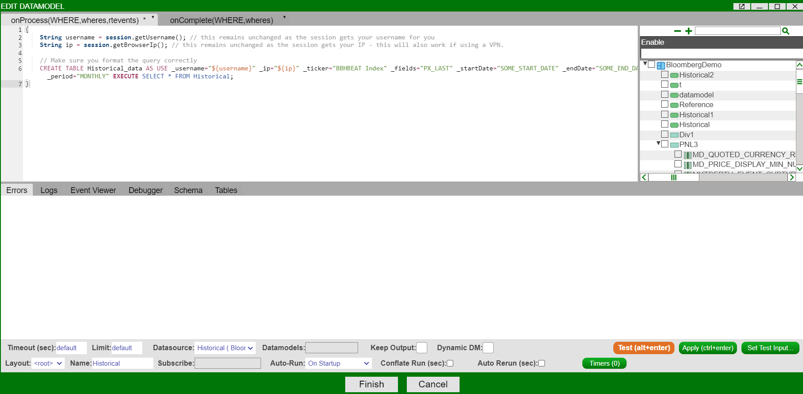

# Historical and Reference Bloomberg Data 

AMI supports direct importing of Bloomberg historical and reference data for BPS users. 3forge provides this functionality on request only and any data used is subject to Bloomberg's terms and conditions. This feature is only available to BPS users.

## Overview

Bloomberg historical and reference data can be used within AMI via the Bloomberg datasource adapter with minimal configuration. AMI creates one Bloomberg session per user, not per request to minimize user cost. Both historical and reference tables can then be used in AMI like any other datamodel. 

## Setup

### Requirements

- A BPS account
- AMI application and usernames configured in BPS EMRS
- 3forge Bloomberg adapter jar file (provided upon request)

### Configuration

In your `local.properties` file, add the following line to enable the Bloomberg datasource adapter:

```
ami.datasource.plugins=...,com.f1.ami.plugins.bloomberg.AmiBloombergDatasourcePlugin
```

You should now see Bloomberg in the list of available datasources the next time AMI is launched. 



## Adding a Bloomberg Datasource

In the AMI Data Modeler, add a new datasource and select 'Bloomberg.' Name the datasource accordingly, for example 'Historical' for a historical datasource.

In the 'Advanced' tab, configure the datasource for your request type which can be either 'historical' or 'reference.' The request type you choose determines the type of datamodel you can build from a datasource.



## Creating a Datamodel

There are two types of datamodel that can be made in AMI from Bloomberg datasources: historical and reference. The datamodel type must correspond to the corect datasource adapter. In the 'Advanced' tab of your datasource, ensure that it is configured to the correct request type for the datamodel you wish to create.

### Historical Data

To create a historical datamodel, first configure your Bloomberg datasource adapter to be of request type 'historical.' Then, input the following in the datamodel creation wizard and update the relevant fields:




```amiscript
{
    String username = session.getUsername(); // this remains unchanged as the session gets your username for you
    String ip = session.getBrowserIp(); // this remains unchanged as the session gets your IP - this will also work if using a VPN.

    // Make sure you format the query correctly
    CREATE TABLE Historical_data AS USE _username="${username}" _ip="${ip}" _ticker="BBHBEAT Index" _fields="PX_LAST" _startDate="SOME_START_DATE" _endDate="SOME_END_DATE" _period="MONTHLY" EXECUTE SELECT * FROM Historical;
}

```

You must specify the tickers, fields, start date and end date in the query in order to be passed successfully. The username and IP is parsed automatically from the session by AMI so must match your Bloomberg credentials. This will create a `HistoricalDataRequest` which the AMI uses to populate the schema for any tables you then use.

### Reference Data

Ensure your Bloomberg datasource is configured for 'reference' request types. Then input the following into the datamodel creation wizard and update the relevant fields:

```amiscript
{
    String username = session.getUsername(); // this remains unchanged as the session gets your username for you
    String ip = session.getBrowserIp(); // this remains unchanged as the session gets your IP - this will also work if using a VPN.

    CREATE TABLE Reference_table AS USE _username="${username}" _ip="${ip}" _ticker="BBHBEAT Index" _fields="PX_Last,TIME" EXECUTE SELECT * FROM Reference WHERE ${WHERE};
}
```

The reference request is very similar to the historical, but does not require a date range. As with the historical data, your username and IP are interpreted by the AMI automatically so must match your Bloomberg credentials. If successful, it will generate a `ReferenceDataRequest` and populate the schema with the resulting response from Bloomberg.


### Using Multiple Tickers 

To use multiple tickers for either historical or reference data, we recommend passing them as a list of comma-separated strings like so: 


```amiscript 

_ticker="tickerA", "tickerB", "tickerC",...
```
