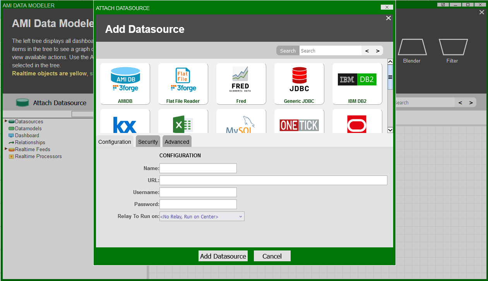
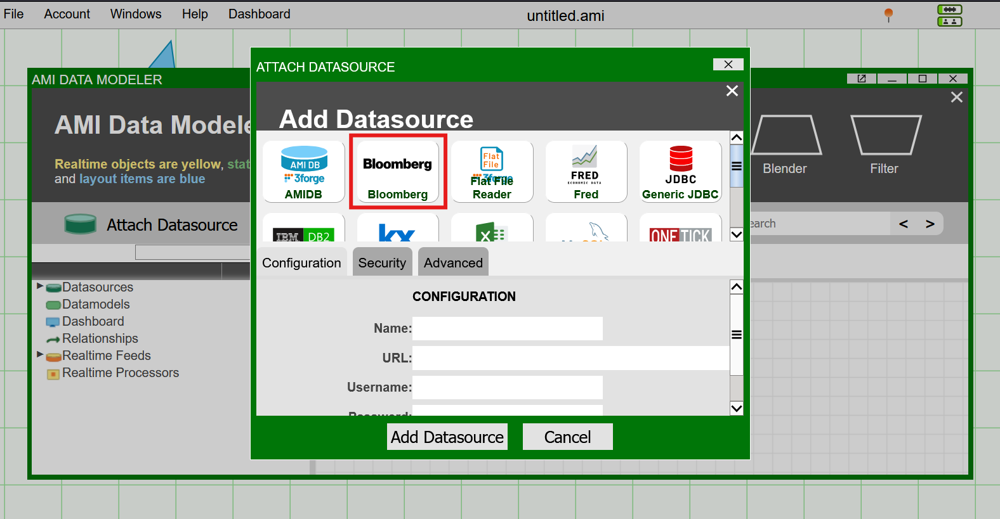

# Setting Up Datasource Adapters

AMI ships with several inbuilt datasource adapters for common data types, such as MS Excel, MySQL, etc. For a full list of supported softwares that AMI supports natively, see [here](../supported_software.md).

!!!Note
    Not all the supported software is available by default in AMI. If you require a specific datasource adapter that we support, please contact us at <support@3forge.com> to receive the `.jar` files. Otherwise, follow the [guide](../custom_java_plugins/datasource_adapters.md) on creating a custom datasource adapter.

## Overview 

AMI datasource adapters provide a GUI interface in the web for attaching external databases to your layouts. Datasources can be added and accessed via the Data Modeler in the AMI dashboard.



For datasource adapters that aren't shipped by default with AMI, you will need to get them assigned to you via the [3forge client portal](https://3forge.com/login.html). These will be in the "files" section of the portal as `.jar` files. 

To add a new datsource adapter, you will need to follow a few simple steps which are outlined below.

## Setup 

The general setup for adding new datasource adapters to your AMI is as follows: 

1. Download the zip of the adapter.
2. Extract from the zip any `.jar` files you need for the adapter.
2. Add those files to your AMI library.
3. Configure your AMI properties to include the adapter. 

### Adding a Plugin

From the client portal, download either the zip folder or direct `.jar` folders for the datasource adapter you need. If given a zip, extract all the `.jar` files provided for your adapter.

Navigate to the root directory of your AMI installation and paste the `.jar` files in the `ami/amione/lib` directory. This will enable the plugin's methods in AMI. 

You will then need to configure your AMI properties to be able to access the plugin within AMI. 

### Properties

In `local.properties`, add the following line referencing the datsource adapter (this will be different for each adapter):

```
ami.datasource.plugins=$${ami.datasource.plugins},com.f1.ami.plugins.<ami.plugin.name>
```

For a custom datasource adapter, you will need to add instead the fully qualified class names of each Java class.

!!! Note

    `$${ami.datasource.plugins}` references the existing plugin list. Do not remove it, and ensure that any additional plugins are added after commas with no spaces.

Upon restarting AMI, you will now see the new datsource option in the GUI. 



## Supported Adapters

Some popular common adapters that we provide include: 

1. [Deephaven](./deephaven.md)
2. [Excel](./excel.md)
3. [Flat File](./flat_file.md)
4. [MongoDB](./mongodb.md)
5. [Redis](./redis.md)
6. [REST](./rest.md)
7. [Shell & SSH](./shell_and_ssh.md)
8. [Snowflake](./snowflake.md)
8. [Bloomberg data](./historical_bpipe.md)

If you require documentation for specific datasource adapter plugins not on this list, please reach out to us.
