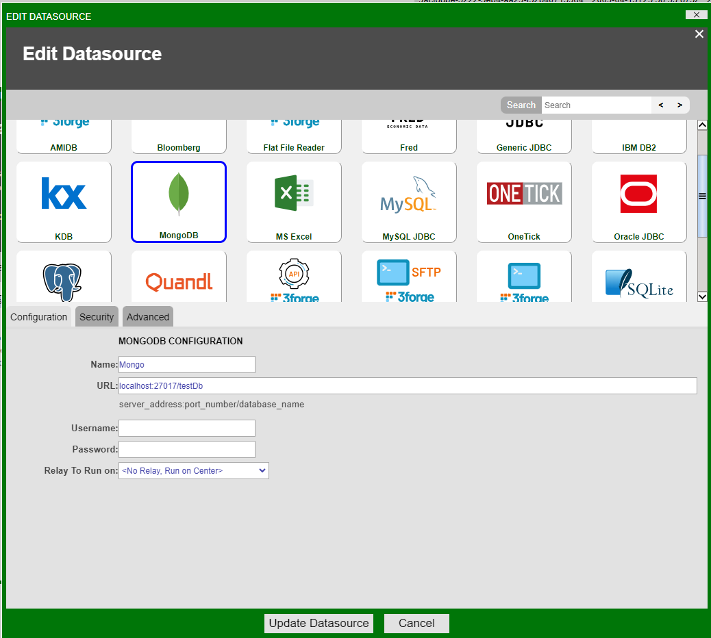
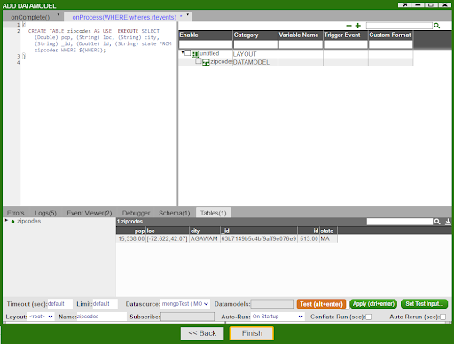
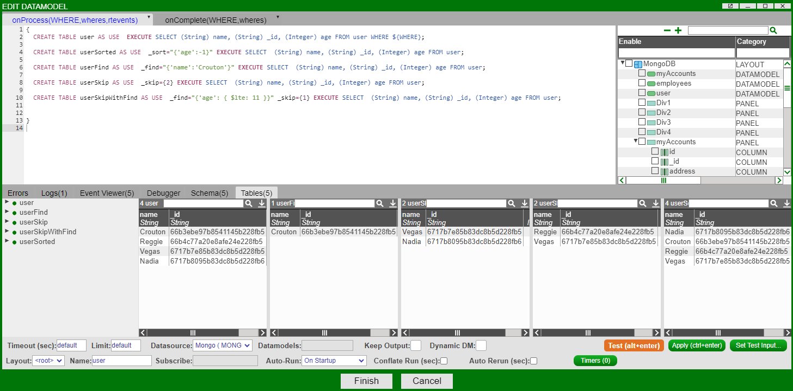

# MongoDB 

AMI supports MongoDB datasources, although this is not offered as a default option. If you require the MongoDB datasource adapter, please contact us at <support@3forge.com>.

## Setting up the Adapter

1. Unzip the MongoDB files assigned to you from the client portal and add them to your AMI library. 
2. Add the following property to your datasource plugin adapter list in `local.properties`: 

	```
	ami.datasource.plugins=$${ami.datasource.plugins},com.f1.ami.plugins.mongo.AmiMongoDatasourcePlugin
	```

1. Restart AMI. MongoDB should now be available under *Dashboard -> Data Modeler -> Attach Datasource*

1. Give your MongoDB Datasource a name and configure the URL. The URL should take the following format:  

	```
	URL: server_address:port_number/Your_Database_Name 
	```



## Querying MongoDB  

The AMI MongoDB adapter can query a MongoDB datasource and output SQL tables. The general syntax for querying MongoDB is: 

``` amiscript
 CREATE TABLE <your_table_name> AS USE EXECUTE <mongo_query>
```

This can be done in any field that takes AmiScript.

### Collections 

Assuming you have collections established in MongoDB, you can query these tables in AMI. 

For a trivial example, consider a collection, `zipcodes`, with the following properties in MongoDB: 

```mongodb
db.createCollection("zipcodes");
db.zipcodes.insert({id:01001,city:'AGAWAM', loc:[-72.622,42.070],pop:15338, state:'MA'});
```

Then query this table in AMI:

``` amiscript
CREATE TABLE zips AS USE EXECUTE SELECT (String)_id,(String)city,(String)loc,(Integer)pop,(String)state FROM zipcodes WHERE ${WHERE};
```




### Collections with Nested Fields

AMI supports querying of MongoDB collections with nested fields. Consider the collection `myAccounts` with nested fields in the `address` field:  

```
db.createCollection("myAccounts");
db.myAccounts.insert({id:1,name:'John Doe', address:{city:'New York City', state:'New York'}});
```

To query this table in AMI, call the nested field from its parent field using dotconcatentation:

``` amiscript
 CREATE TABLE account AS USE EXECUTE SELECT (String)_id,(String)name,(String)address.city, (String)address.state FROM myAccounts WHERE ${WHERE};
```

### Using `EVAL` Methods (Deprecated)

Previously, AMI MongoDB methods were supported using `FROM EVAL` functionality. This has since been deprecated. Instead, AMI supports the following directives directly:

1.	[Sort](./mongodb.md/#sort)
2.	[Find](./mongodb.md/#find)
3.	[Skip](./mongodb.md/#skip)

The general format for using MongoDB commands involves encapsulating your MongoDB sort command in a string followed by the AMIScript `EXECUTE` statement: 

``` amiscript
 CREATE TABLE <your_table_name> AS USE _<mongo_directive>="{<mongo_params>}" EXECUTE <ami_sql_commands> 
```
### MongoDB Directives Examples

The result of running the different supported MongoDB directives in AMI on a toy datamodel results in the following output: 



#### Sort

```amiscript
CREATE TABLE userSorted AS USE  _sort="{'name':1}" EXECUTE SELECT  (String) name, (String) _id, (Integer) age FROM user;
CREATE TABLE accountsSorted AS USE  _sort="{'name':1,'address.city':-1}" EXECUTE SELECT (String) address.state,(String) address.city, (String) name, (String) _id, (Integer) id FROM myAccounts;
```

This creates two tables, `userSorted` and `accountsSorted` with users sorted in alphabetical order, followed by city name in descending order. 

#### Find

To find a given field, create a table in AMI then use the `_find` directive: 

```amiscript
CREATE TABLE userFind AS USE  _find="{'name':'Crouton'}" EXECUTE SELECT  (String) name, (String) _id, (Integer) age FROM user;
```

This query will return a table with entries from a collection for a user named "Crouton."

#### Skip

To skip documents, create an AMI table with a MongoDB skip condition:

```amiscript
CREATE TABLE userLimit AS USE  _skip={2} EXECUTE SELECT  (String) name, (String) _id, (Integer) age FROM user; //Skips first two rows/documents 

CREATE TABLE userSkipWithFind AS USE  _find="{'age': { $lte: 11 }}" _skip={1} EXECUTE SELECT  (String) name, (String) _id, (Integer) age FROM user; 
```

Where in the last example, the first row where age is less than or equal to 11 is skipped. 

