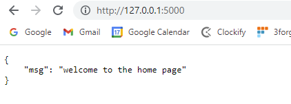
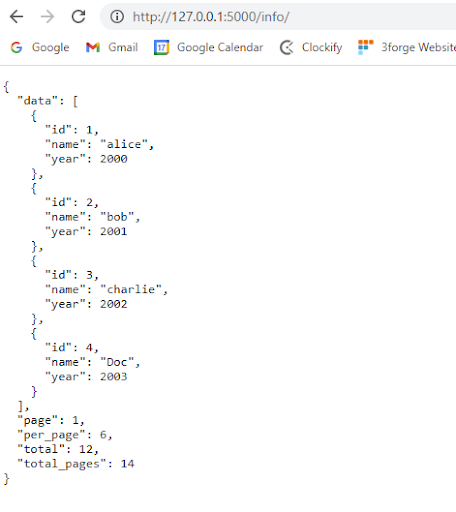

# REST 

The AMI REST adapter connects AMI to some external RESTful API endpoint for easy access within AMI.

!!! Note
	This is **not** the same as the [AMI REST server API](../data/rest.md) which is AMI's inbuilt REST server for querying AMI performance. 

## Setting up your first Rest API Datasource

1. Go to **Dashboard** -\> **Datamodeler**

	

1. Click **Attach Datasource**

	

1. Select the **RestAPI** Datasource Adapter

	

1. Fill in the fields:

	- **Name**: The name of the Datasource
	- **URL**: The base url of the target api. (Alternatively you can use the direct url to the rest api, see the [_urlExtensions directive](#directives) for more information)
	- **Username**: (Username for basic authentication)
	- **Password**: (Password for basic authentication)

## Directives

The available directives you can use are:

-   `_method` = `GET`, `POST`, `PUT`, `DELETE`
-   `_validateCerts` = (true or false) indicates whether or not to validate the certificate by default this is set to validate.
-   `_path` = The path to the object that you want to treat as table (by default, the value is empty-string which correlates to the response json)
-   `_delim` = This is the delimiter used to grab nested values
-   `_urlExtensions` = Any string that you want to add to the end of the Datasource URL
-   `_fields` = Type name comma delimited list of fields that you desire. If none is provided, AMI guesses the types and fields
-   `_headers` or `_header_xxxx`: any headers you would like to send in the REST request, (If you use both, you will have the headers from both types of directives)
-   `_headers` expects a valid json string
-   `_header_xxxx` is used to do key-value pairs
-   `_params or _param_xxxx` is used to provide params to the REST request. (If you provide both, they will be joined)
-   `_params` will send the values as is
-   `_param_xxxx` is a way to provide key-value params that are joined with the delimiter & and the associator
-   `_returnHeaders` = (true or false) this enables AMI to return the response headers in a table, set to true this will return two tables, the result and the response headers. See [Using `ReturnHeaders`](#using-_returnheaders) for more details and examples.
-   `_redirectFollowHttpMethod` = (true or false) overrides the default behavior where any redirect methods become GETs. When set to true, this will make any redirects follow the original method (POST, PUT etc)
-   `_redirectFollowAuthHeader` = (true or false) when true, this option will persist the `authorization` header
-   `_redirectPersistCookies` = (true or false) an extension of the `redirectFollowAuthHeader` directive. When true, any stored cookies will be persisted through redirects
-   `_dataType` = Specifies the type of data the adapter should expect and return.

	**Options:** `json` *(default)* / `text` / `raw`  

## Creating the Sample API

The following example demonstrates how to use the directives mentioned above. We will start with the four fundamental methods: `GET`, `POST`, `PUT`, `DELETE`. The example below is using a dummy RESTful API constructed from flask. The base url is [http://127.0.0.1:5000/](http://127.0.0.1:5000/), running on the port 5000 on the localhost.



To start with, we would need to install and import flask on our environment. If you don’t have these packages in place, you need to do `pip install flask` and `pip install flask_restful`

``` python
from flask import Flask,jsonify,request,Response
from flask_restful import Resource,Api,reqparse

parser = reqparse.RequestParser()
parser.add_argument('title',required=True)
app = Flask(__name__)
api = Api(app)
```

We then create the class Home and set up home page:

``` python
class Home(Resource):
	def __init__(self):
		pass
	def get(self):
		return {
			"msg": "welcome to the home page"
		}
api.add_resource(Home, '/')
```

The `#!python add_resource()` function will add Home class to the root directory of the url and display the message "Welcome to the home page".

We then need to add endpoints onto the root url. The following snippet code will display all the information from variable "all" in JSON format once we hit the url: 127.0.0.1:5000/info/

``` python
#show general info
#url:http://127.0.0.1:5000/info/
all = {     
 "page": 1, 
 "per_page": 6, 
 "total": 12, 
 "total_pages":14, 
 "data": [
     {
      "id": 1,
      "name": "alice",
      "year": 2000,
     },
     {
      "id": 2,
      "name": "bob", 
      "year": 2001, 
     },
     {
      "id": 3, 
      "name": "charlie", 
      "year": 2002, 
     }, 
     {
      "id": 4, 
      "name": "Doc",
      "year": 2003,
     }
      ]
} 
```

We then define GET,POST,PUT and DELETE methods for http requests

-   GET method

	``` python
	@app.route('/info/', methods=['GET'])
	def show_info():
	    return jsonify(all)
	```

-   POST method

	``` python
	@app.route('/info/', methods=['POST'])
	def add_datainfo():
	    newdata = {'id':request.json['id'],'name':request.json['name'],'year':request.json['year']}
	    all['data'].append(newdata)
	    return jsonify(all)
	```

-   DELETE method

	``` python
	@app.route('/info/', methods=['DELETE'])
	def del_datainfo():
	    delId = request.json['id']
	    for i,q in enumerate(all["data"]):
	        if delId  in q.values():
	            popidx = i 
	            all['data'].pop(popidx)
	            return jsonify(all)
	```

-   PUT method

	``` python
	@app.route('/info/', methods=['PUT'])
	def put_datainfo():
	    updateData = {'id':request.json['id'],'name':request.json['name'],'year':request.json['year']}
	    for i,q in enumerate(all["data"]):
	        if request.json['id']  in q.values():
	            all['data'][i] = updateData
	            return jsonify(all)
	    return jsonify({"msg":"No such id!!"})
	```

Finally, we add one more endpoint employees using query parameters.

-   Define employees information to be displayed

	``` python
	#info for each particular user
	employees_info = {
	    "John":{
	        "salary":"10k",
	        "deptid": 1
	    },
	    "Kelley":{
	
	        "salary":"20k",
	        "deptid": 2
	           }
	                 }
	```

-   Create employee class and add onto the root url. We will query the data using query requests with the key being "ename" and value being the name you want to fetch.

	``` python
	class Employee(Resource):
	    def get(self):
	        if request.args:
	            if "ename" not in request.args.keys():
	                message = {"msg":"only use ename as query parameter"}
	                return jsonify(message)
	            emp_name = request.args.get("ename")
	            if emp_name in employees_info.keys():
	                return jsonify(employees_info[emp_name])
	            return jsonify({"msg":"no employee with this name found"})
	        return jsonify(employees_info)
	
	api.add_resource(Employee, "/info/employees")
	
	if __name__ == '__main__':
		app.run(debug=True)
	```

## GET method

### Example 1: Simple GET method

``` amiscript
CREATE TABLE getDemo AS USE _method="GET" _validateCerts="true" _delim="#" _urlExtension="info/" _path="data" _fields="Integer id,String name, Integer year" EXECUTE SELECT * FROM getDemo;
```

One can use `_urlExtension=` directive to specify any endpoint information added onto the root url. In this example, you can use `_urlExtension="info/"` to navigate you to the following url address, which, corresponds to this url address: [http://127.0.0.1:5000/info/](http://127.0.0.1:5000/info/)



The result table "getDemo" being returned:


### Example 2: GET method with query parameters

Now let’s attach a new endpoint "/employees" onto the previous url. The new url now is: [http://127.0.0.1:5000/info/employees](http://127.0.0.1:5000/info/employees)


Suppose we want to get the employee information for the employer named "John". We can use query parameters to achieve this. On the AMI, we can configure our data modeler like this:

``` amiscript
{
  String params = "ename=Kelley";
 
  CREATE TABLE queryParamsDemo AS USE 
              _method="GET" _validateCerts="true"
              _delim="#" _urlExtension="info/employees" 
              _params="${params}" _path="" _fields="Integer deptid,String salary"
              EXECUTE SELECT * FROM queryParamsDemo;
}
```

Note that this is the same as to create a string for appending to the end of the url as you would in a GET request (`?param1=val1&param2=value2`) and assign the string to `_params`.

The result table "queryParamsDemo" being returned:


The result corresponds to the url: [http://127.0.0.1:5000/info/employees?ename=Kelley](http://127.0.0.1:5000/info/employees?ename=Kelley)


## POST method

One can also use the POST method to add new information to the existing data.

-   We would use `_path` to specify what you want your table to be based on. For the above example where the data is nested, if you want your table to be based on `data`, then you would set `_path="data"` .

	

-   We use the `_fields` to specify the schema of your table. For this example, you would set `_fields="Integer id,String name, Integer year"` to grab all the attributes from the data path.
-   We use the `_params="${params}"` to specify the new row information you want to insert into the existing table in the format of JSON.

The example shows how you can insert a new row record `Map("id",5,"name","frank","year",2014)` into the existing table.  
Here is how you can configure the example in the AMI:

``` amiscript
{
  Map paramsMap = new Map("id",5,"name","frank","year",2014);
  String params = toJson(paramsMap,true);

  CREATE TABLE PostDemo AS USE _method="POST" _validateCerts="true" _delim="#" _urlExtension="info/"  _params="${params}" _path="data" _fields="Integer id,String name, Integer year" EXECUTE SELECT * FROM PostDemo;
}
```

Note: For POST method: params (from `_params`) will be passed in as a JSON format in the request body.

The table "PostDemo" being returned


The new record is shown on the browser after POST method.


## DELETE method

One can use `DELETE` method to remove specific data record given, say the id of the particular data. If we want to remove the data record with the id of 4 in the `"data"` path, here is how you can configure your data modeler.

``` amiscript
{
  Map paramsDelId = new Map("id",4);
  String params = toJson(paramsDelId,true);
 
  USE ds=dummy_api _method="DELETE" _validateCerts="true" 
     _delim="#" _urlExtension="info/"  _params="${params}"
      _path="data" _fields="Integer id,String name, Integer year" 
      _returnHeaders="true" execute select * from _1;
    
  CREATE TABLE _1 AS USE 
        _method="GET" _validateCerts="true" 
        _delim="#" _urlExtension="info/" 
        _path="data" _fields="Integer id,String name, Integer year"
        EXECUTE SELECT * FROM _1;
}
```

The returned tables "DeleteDemo" before and after "DELETE" method:


The results on the web browser before and after DELETE method:


## PUT method

One can use `PUT` method to update the existing data record (usually by data id). The example below demonstrates how you can update the data record where `id=4` to `Map("id",4,"name","NewDoc","year",2022);`

Here is how you can configure PUT method in AMI:  

``` amiscript
{
  Map paramsMap = new Map("id",4,"name","NewDoc","year",2022);
  String params = toJson(paramsMap,true);


 USE ds=dummy_api _method="PUT" _validateCerts="true" 
    _delim="#" _urlExtension="info/"  _params="${params}"
    _path="data" _fields="Integer id,String name, Integer year" 
    _returnHeaders="true" execute select * from _1;
 
 CREATE TABLE _1 AS USE _method="GET" _validateCerts="true"
                        _delim="#" _urlExtension="info/" _path="data"
                        _fields="Integer id,String name, Integer year" 
                        EXECUTE SELECT * FROM _1;
}
```

The table "PutDemo" being returned before and after PUT method:


The result on your API browser gets updated:


## Using `_headers`

One can use `_headers` to customize the information in the header as required. By default, if the `_headers()` is not specified, it will return the header like this:


If you were to customize your own header, you can configure your ami script like this:  

``` amiscript
{ 
  String headers = "{\"Your_customized_key\": \"Your_customized_value\", 
                     \"Content-Type\": \"application/json\"}}";
  CREATE TABLE getDemo AS USE 
              _method="GET" _validateCerts="true" 
              _delim="#" _urlExtension="info/" _path="data" 
              _fields="Integer id,String name, Integer year"
              _headers = "${headers}"
              EXECUTE SELECT * FROM getDemo;}
```

Note: you need to include the second dictionary `\"Content-Type\": \"application/json\"` in your header, otherwise your customized `\"Your_customized_key\": \"Your_customized_value\"` will overwrite the default `\"Content-Type\": \"application/json\"` in the header.

Undesired output with missing column-type:


Desired output:


## Using `_returnHeaders`

When `_returnHeaders` is set to true, the query will return two tables, one the results of your query and the other the responseHeaders. When it is enabled, the rest adapter will handle any IOExceptions. If your result table has one column which is named Error, there was an error with the Rest Service that you are querying.

### Example 1: Using `_returnHeaders`

``` amiscript

{
  CREATE TABLE Result,ResponseHeaders AS USE _method="GET" _returnHeaders="true" _validateCerts="true" _delim="_" _urlExtension="users" _path="" _fields="" EXECUTE SELECT * FROM _1;
}
```

The response headers being returned:


The result being returned:


### Example 2: Getting the HTTP response code

This section will show you how to extract the Http Response Message from the Response Headers and how to get the response code from that message. 

``` amiscript
{
  CREATE TABLE Result,ResponseHeaders AS USE _method="GET" _returnHeaders="true" _validateCerts="true" _delim="_" _urlExtension="users" _path="" _fields="" EXECUTE SELECT * FROM _1;
  
  String httpResponseMsg = select Value from ResponseHeaders where Key==null;
  session.log(httpResponseMsg);
}
```

Note that we have a limit 1, if the query returns more than one row, and we only select one column, it will return a List.

For additional information, if you select one row with multiple columns the query will return a Map, for all other queries it will return a Table.  

The result of that query:


### Example 3: Handling Errors

When you have _returnHeaders set to true, RestApi errors will now be caught and will be up to the developer to handle. The below is an example of a 404 error. When there is an error, the error will be returned in the result table with a single column named *Error*.

**The datamodel in this example:**

``` amiscript
{
  CREATE TABLE Result,ResponseHeaders AS USE _method="GET" _returnHeaders="true" _validateCerts="true" _delim="_" _urlExtension="users3" _path="" _fields="" EXECUTE SELECT * FROM _1;
 
  create table ResponseHeaders2 as select Value from ResponseHeaders where Key==null && Value ~~ "404" limit 1;
  String httpResponseMsg = select Value from ResponseHeaders2 limit 1;
  session.log(httpResponseMsg);
  // Handle Error Here
}
```

The datamodel in this example contains `~~` syntax, this is 3forge's [Simplified Text Matching](../reference/ami_script.md#simplified-text-matching), see for more information:

The Response Headers and the Http Response Message


The Result Table now returns the error message


