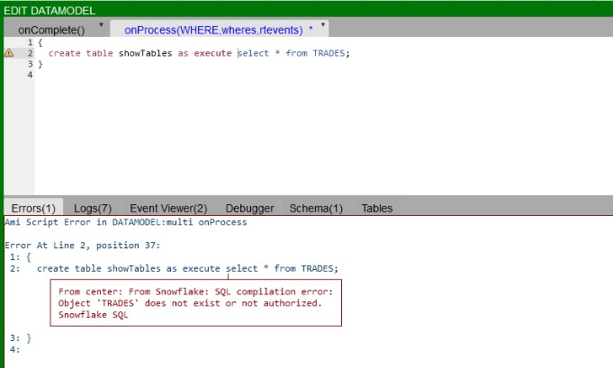

# Snowflake

## Setup

### Initial Setup

1. Login to [3forge.com](https://3forge.com/), navigate to Files and download `ami_adapter_snowflake.<version>.obv.tar.gz` (contact [support@3forge.com](mailto:support@3forge.com) if you do not have the zip file)

1. Unzip the file and move all `.jar` files to the `ami/amione/lib` directory

1. Go to `ami/amione/config/local.properties` and add the following property:

	```
	ami.datasource.plugins=$${ami.datasource.plugins},com.f1.ami.plugins.snowflake.AmiSnowflakeDatasourcePlugin
	```

1. Restart AMI

1. Go to the Datamodeler and add a new Snowflake datasource


### Settings

When adding the datasource, the URL should be in the following format:

```
[account_identifier].snowflakecomputing.com/?[connection_params]
```

Note that the username/password connection parameters are set automatically from their fields in the Datasource Adapter Editor. Other commonly used parameters can be set by navigating to the Advanced tab, see below for a description of each one:

| Setting | Description |
|---|---|
| Allow Underscores In Host | Specifies whether to allow underscores in account names, options: true,false, default false |
| Authenticator | Specifies the authenticator |
| Passcode | Specifies the passcode for mfa |
| Passcode In Password | Specifies the passcode for mfa is appended to password, options: on,off, default off |
| Private Key | Use private key as configured by properties: snowflake.privatekey.file and snowflake.privatekey.passphrase, options:true/false, default false |
| Private Key File | Specifies the path to the private key file (can also be set in `local.properties`) |
| Private Key File Password | Specifies the password to the private key file (can also be set in `local.properties`) |
| Token | Specifies the OAuth token |
| DB | Specifies the database, ex: SNOWFLAKE_SAMPLE_DATA |
| Role | Specifies the default access role, ex SYSADMIN |
| Schema | Specifies the default schema, ex: TPCH_SF1 |
| Warehouse | Specifies the default warehouse, ex: COMPUTE_WH |
| JDBC Options | Additional JDBC properties: key=value,key2=value2... |

### Properties

#### Required

```
ami.datasource.plugins=$${ami.datasource.plugins},com.f1.ami.plugins.snowflake.AmiSnowflakeDatasourcePlugin
```

#### Optional

```
snowflake.privatekey.file= # path/to/privatekey/file
snowflake.privatekey.passphrase= # passphrase for the private key file
```

## First Query - Show Tables

Let’s write our first query to get a list of tables that we have permission to view.

1. Double click the datasource "Snowflake" that we just set up

	

1. Click Next & then OK

	

1. Show Tables Query

	In the Datamodel, let's type a quick query to show the tables available to us.
	
	
	
	Here's the script for the datamodel:
	
	```amiscript
	{
	  create table showTables as execute show tables;
	}
	```
	
	Hit the orange test button. And you will see something like this:
	
	
	
	This created an AMI table called "showTables", which returns the results of the query "show tables" from the Snowflake Database.
	
	Here in the query, the "USE" keyword is indicating that we are directing the query to an external datasource, which in this case is Snowflake.
	
	"EXECUTE" keyword indicates that whatever query we are making after EXECUTE should follow the query syntax from Snowflake.

## Querying Tables

Just like you would in SnowSql you can query a table using it's fully-qualified schema object name or the table name that is available in your current database schema e.g.

```amiscript
{
  create table mytable as execute select * from "DATABASE".SCHEMA.TABLENAME WHERE ${WHERE};
}
```

Or

```amiscript
{
  create table mytable as execute select * from TABLENAME WHERE ${WHERE};
}
```

Here's an example


## Snowflake Error Messages

SQL Compilation error: Object does not exist or not authorized

If you get the following error:

```
From center: From Snowflake: SQL compilation error:
Object 'objectname' does not exist or not authorized.
Snowflake SQL
```

It could be one of two things, the table or object you are trying to access does not exist in your database or schema that you have selected.

The other possibility is that your user or role does not have the permissions required to access that table or object.



