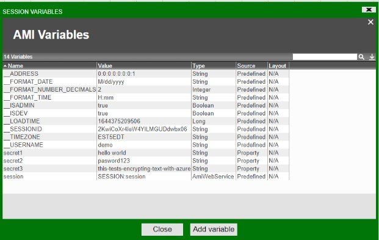

# External Vaults

## Azure Vault

**Required version:** \> 14952.dev

**Following credentials are to be generated**

[Quickstart: Create a new tenant in Azure Active Directory](https://learn.microsoft.com/en-us/azure/active-directory/fundamentals/active-directory-access-create-new-tenant) - Refer to this guide to generate the following credentials

### VM Options

Required VM Option:

```
Dproperty.f1.properties.decrypters=AZURE=com.f1.utils.encrypt.azurevault.AzureVaultRestDecrypter
```

VM Option for enabling debugging:

```
DAzureDebug=true
```

VM Options for Authentication (Use one of the following)

```
DAzureAuth=[Token, ClientSecret, or Identity]
```

VM Options for Token

```
DAzureAuth=Token
DAzureBearerToken=[your generated token]
```

VM Options for Client Secret

```
DAzureAuth=ClientSecret
DAzureTenant=[Tenant, e.g. 218f57a4-c14b-4be5-a57... ]
DAzureClientId=[AppId, e.g. 14752cd8-e62d-484d-b11a... ]
DAzureClientSecret=[Password, e.g. wLr6evrQBmgPkb6d9... ]
DAzureScope=https://vault.azure.net/.default
```

VM Options for Managed Identity

```
DAzureAuth=Identity
DAzureIdentityApiVersion=[ 2018-02-01 ]
DAzureIdentityResource=[ https://management.azure.com/ ]
DAzureIdentityObjectId=[ optional ]
DAzureIdentityClientId=[ optional ]
DAzureIdentityMiResId=[ optional ]
```

VM Options for Decryption

```
DAzureUrlBase=[Vault base url, e.g. https://example.vault.azure.net/]
DAzureDecrypterKeyName=[Key name]
DAzureDecrypterKeyVersion=[Key Version]
DAzureDecrypterApiVersion=[Azure API version, default 7.2]
DAzureDecrypterAlg=[Encryption algorithm, e.g. RSA1_5]
DAzureDecrypterCharset=[Charset, e.g. UTF-8 (default)]
```

### local.properties

Add the encrypted text in local.properties file

```
amiscript.variable.secret=\${CIPHER:AZURE:\[EncryptedText\]}
```

Example:

```
amiscript.variable.secret1=${CIPHER:AZURE:QNEdUh7jWNW_LJZTFN6gocxyxDmuZSMhikSATAmzEqpH1X3nrNVAIA5PJONottcr6O7L3XlO1T1_0OWeaT5xP2i3lOFHg4fl39YzgNb4w_T1dupL22RC9185xADDSeY6dHcfFIVcJuGE78PlN1EA1shi6vQv4JtAcjFjSaFfv40X5LOWNZFEah6z3MhkPuTP7XrfauNheKQunRt_-bTKV9CNHSEReWAvaTv8sEt67EDHasKSM1Uz3FK9nwoUmS2_wksjMPGCSrkF67DD66pZU03BRGLAuLF51qp8-GWfY9lxKaLJdatD2LdEm3K17cx1v526XZoYX88uOBlwdA4-mQ==}

amiscript.variable.secret2=${CIPHER:AZURE:JUjao9oG8DyiTyfsaoA8dMrGC4AeR7eECT_FLzLC6BYFulOz4WqGo8pdTmmACvUtCo_WRQN_EzlIFDJip4zaUt56MIbwuo5x1ngrX0IJ1QvGrZdBQajvBPOD3cQb6sX8DcCYmaW1NiTuwH4dpHw8n92wYwHipTI4hbtcKDp4XqZMAV2I9Aq9EXMUovm8kQOzzgS7AoV5k8mxrmvOX9GmoYs-kA2P3XMFQSO72ty-zLaRk4olNaPDAsju0-yt4hkrGqCkgispUIThrEj-TtbDU6BWJNCGqmVr086TBmZ4h5ZSg9D5DhLyP6bbqms8RKc0Rxf5heUi9GQT2XfG-69Hyg==}

amiscript.variable.secret3=${CIPHER:AZURE:hWHhogjKt3KPwfBHDntgyhyP8zBiiKVVgYf0P73W1FwkjW_cRX3fUHNzq-gtoLZhvDTk2_yFPjHJBDdvQN5rP5WssUiciyZnyxzuZUEgMjgXt0GFKTyrIvIydaTbGjPA_lKK0FYsf1ImfnR1HcKZc7WGC58h29KVwmcYmx14WujLSBBrf9rvTVGN520uStqVS_0zoxEyYnnIPQx40EUDoawYwOjV7fRwzeJwJihmZHkeIqPnJyBxk_H_Gfuqi32WZ-v0zN3fQlVR19KxS0-qoghwuvbp3tYkByYirO5KDghRJG4VtZTrbODltJP1TBOAy6WBaBRaNOSlOdMp2mI9Hw==}
```

## AWS KMS Vault

**Required version:** \> 14952.dev

**Following credentials are to be generated**

[Getting Started with AWS Key Management Service](https://aws.amazon.com/kms/getting-started/) - Refer to this guide to generate the following credentials.

Once set up, the decrypted values will be shown in AMI session variables



### VM Options

Required VM Option:

```
Dproperty.f1.properties.decrypters=AWSKMS=com.f1.utils.encrypt.awskms.AwsKmsRestDecrypter
```

VM Option for enabling debugging:

```
DAwsKmsDebug=true
```

VM Options for Client Secret

```
DAwsKmsAccessKey=[Access key Id, e.g. AKIAZV...]
DAwsKmsSecret=[Secret access key, e.g. FDNa3B61gyKOK...]
```

VM Options for Decryption

```
DAwsKmsEndpoint=[Aws Endpoint]
DAwsKmsKeyId=[Key id, e.g. arn:aws:kms:us-east-1:6646...]
DAwsKmsRegion=[Region]
DAwsKmsHost=[Hostname]
DAwsKmsDecrypterCharset=[Charset, e.g. UTF-8 (default)]
```

### local.properties

Add the encrypted text in local.properties file

```
amiscript.variable.secret=${CIPHER:AWSKMS:[EncryptedText]}
```

**Example**

```
amiscript.variable.secret1=${CIPHER:AZURE:AQICAHi7Za0I+383Smwa+mSrtevEempSHyYcNJPdGhqP8wG5+QEv8OUTaFzz2muBu+PGrU2WAAAAfTB7BgkqhkiG9w0BBwagbjBsAgEAMGcGCSqGSIb3DQEHATAeBglghkgBZQMEAS4wEQQM6ITa0o4Naj0UvhA+AgEQgDpkJ9kt2cJHsOQ327mUl7bmIUJLJDb/GKye1mmfpx1v5HGUQjcssaFEOZJPsCpUMRTp0lvc0CHjRnLH}
```

