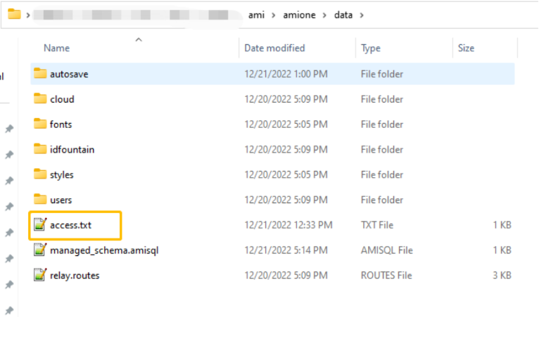
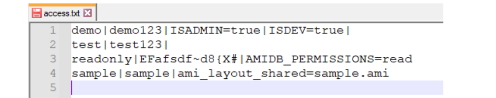
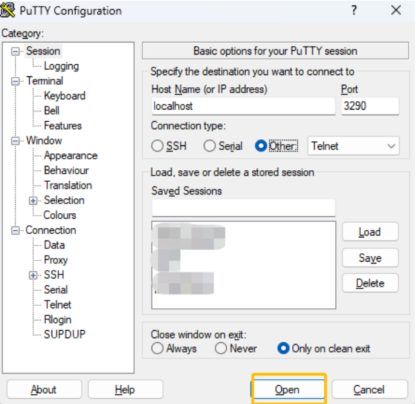
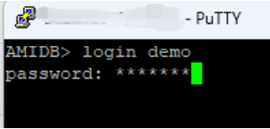
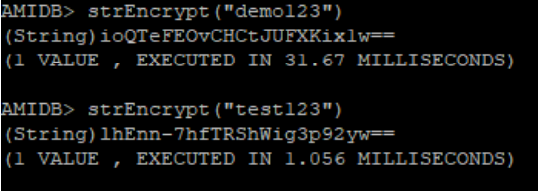
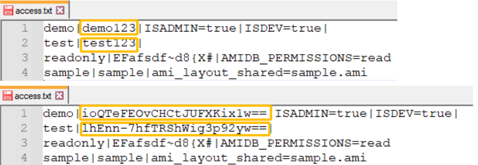
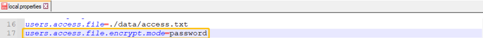

# User Passwords

3forge recommends using the access.txt Authentication (AmiAuthenticatorFileBacked Authentication Plugin) only for demo purposes, for production environments we recommend implementing a AmiAuthenticator Plugin. By default, AMI does not encrypt passwords in the access.txt. This document details the steps for encrypting passwords in your access.txt.

1. Ensure your 3forge AMI Application is running. Your access.txt by default would be located in your data directory.

	

1. This document will contain a list of all users and their passwords as well as their permissions.

	

1. To start encrypting the passwords you will need to generate the encrypted string for each password. To do so you will need to telnet to your ami.db.console.port whose default value is 3290 and login to a user with DB permissions.

	

	

1. To encrypt each password, run the AMIScript method on the console strEncrypt("your-password"). This command will return your encrypted password.

	

1. For each password in the access.txt update the password with the encrypted value.

	

1. Add a new property in a local.properties or create one in your config directory. In the file add the following property: users.access.file.encrypt.mode=password

	

1. The final step is to restart your 3forge AMI Application

1st Note: Store the amikey.aes securely so that you have a recovery mechanism setup for this in case of data loss. This key by default is set by the property and configured with: ami.aes.key.file=persist/amikey.aes. If lost, users will not be able to login to their accounts.

2nd Note: To change the the access.txt file set the property: users.access.file=pathToYourAccess.txt

