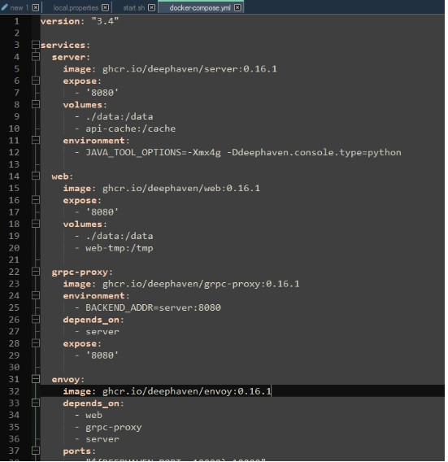

# Deephaven

**Requirements**

1. Docker

1. JDK 17

## Getting Started with Deephaven

1. Install sample python-example containers from Deephaven from [Quick start Install Deephaven](https://deephaven.io/core/docs/tutorials/quickstart/)

	```sh
	curl https://raw.githubusercontent.com/deephaven/deephaven-core/main/containers/python-examples/base/docker-compose.yml -O
	docker-compose* pull
	docker-compose* up
	```

1. If you run into errors with the grpc container, downgrade the containers in the "docker-compose.yml" file to 0.16.1

	

1. Go to [http://localhost:10000/ide/](http://localhost:10000/ide/) on the browser

1. Execute the following commands in the deephaven ide

	```python
	from deephaven import time_table
	sample = time_table('00:00:02')
	```

This will create a ticking table that will insert a new timestamp record every 2 seconds.

## Installing the feedhandler plugin to AMI

1. Place `DeephavenFH.jar` and all other jar files in the `dependencies` directory under `/amione/lib/`

1. Copy the properties from the `local.properties` file to your own `local.properties`

1. For JDK17 compatibility, use the attached start.sh file or add the following parameters to the java launch command

	```
	--add-opens java.base/java.lang=ALL-UNNAMED --add-opens java.base/java.util=ALL-UNNAMED --add-opens java.base/java.text=ALL-UNNAMED --add-opens java.base/sun.net=ALL-UNNAMED --add-opens java.management/sun.management=ALL-UNNAMED --add-opens java.base/sun.security.action=ALL-UNNAMED 
	```

1. Add the following to the java launch parameters to the start.sh file as well

	```
	-DConfiguration.rootFile=dh-defaults.prop 
	```

1. Launch AMI

## Configuring the feedhandler

There are 3 properties that can be configured from the local.properties file:

1. `ami.relay.fh.deephaven.props.url` - subscription source url

1. `ami.relay.fh.deephaven.props.topics` - tables to be subscribed to (delimited by commas)

1. `ami.relay.fh.deephaven.props.messagesize` - (optional) maximum size of messages from the source. Default is 1000000.

For example, to subscribe to a localhost deephaven server with tables Sample1 & Sample2 with a maximum message size of 2000000:

```
ami.relay.fh.deephaven.props.url=localhost
ami.relay.fh.deephaven.props.topics=Sample1,Sample2
ami.relay.fh.deephaven.props.messagesize=2000000
```

