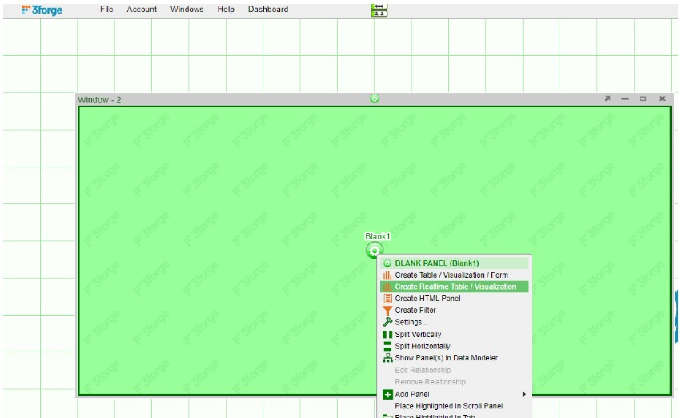

# Kafka

AMI currently supports JSON, Avro, and Protobuf message serialization.

## Overview

1. Configure AMI properties to the Kafka server.

1. Restart AMI and start streaming data using Kafka.

## Properties

### Required

```
# Must be exact
ami.relay.fh.active=ssocket,kafka
ami.relay.fh.kafka.class=com.f1.ami.relay.fh.kafka.AmiKafkaFH
ami.relay.fh.kafka.props.key.deserializer=org.apache.kafka.common.serialization.StringDeserializer

# insert the hostname of your kafka server here
ami.relay.fh.kafka.props.bootstrap.servers=<HOSTNAME>:9092

# insert the comma delimited topic names being used for kafka e.g. topic-1,topic-2,topic-3
ami.relay.fh.kafka.props.topics=<TOPIC_NAME(S)>

# insert a consumer group id string (in case other processes are consuming from the same topics additionally, use that group id).E.g. test-group
ami.relay.fh.kafka.props.group.id=<GROUP ID>

# Select one of the deserializers below depending on your message format
ami.relay.fh.kafka.props.value.deserializer=io.confluent.kafka.serializers.KafkaJsonDeserializer
ami.relay.fh.kafka.props.value.deserializer=io.confluent.kafka.serializers.KafkaAvroDeserializer
ami.relay.fh.kafka.props.value.deserializer=io.confluent.kafka.serializers.protobuf.KafkaProtobufDeserializer

# Alternatively, use a custom deserializer class and helper factory
ami.relay.fh.kafka.props.value.deserializer=<fully_qualified_class_name>
ami.relay.fh.kafka.props.helper.factory.class=<fully_qualified_class_name>
```

### Optional

```
# auto commit
ami.relay.fh.kafka.props.enable.auto.commit=true

# insert the hostname of your kafka server running schema registry here
ami.relay.fh.kafka.props.schema.registry=http://<HOSTNAME>:8081

# kafka id to identify your consumer
ami.relay.fh.kafka.props.client.id=<CLIENTID>

# What to do when there is no initial offset in Kafka or if the current offset does not exist any more on the server. Options include earliest, latest, none. Where earliest consumes from beginning of the topic partition while latest consumes from end of topic partition which is default.
ami.relay.fh.kafka.props.auto.offset.reset=<OPTION>

# SASL mechanism used for client connections - defaults to GSSAPI
ami.relay.fh.kafka.props.sasl.mechanism=<SASL_MECHANISM>

# Protocol used to communicate with brokers. Valid values are: PLAINTEXT, SSL, SASL_PLAINTEXT, SASL_SSL - defaults to PLAINTEXT
ami.relay.fh.kafka.props.security.protocol=<PROTOCOL>

# JAAS login context parameters for SASL connections in the format used by JAAS configuration files - defaults to null
ami.relay.fh.kafka.props.sasl.jaas.config=<SASL_JAAS_CONFIG>

# Fully-qualified class name for custom sasl login callback handler
ami.relay.fh.kafka.props.sasl.login.callback.handler.class=<CLASSNAME>

# AMI uses kafka record keys as AMI message keys by default (same key Kafka records get upserted). Set to false to ignore Kafka record keys and send to AMI without key - default true
ami.relay.fh.kafka.props.use.record.key=<true/false>

# Enable debug logging for consumer polls - defaults to false
ami.relay.fh.kafka.props.enable.debug.log=<true/false>

# Custom properties can also be passed to the Kafka Consumer Client that you want to connect to using the following format: (Refer to Kafka Consumer Configuration documentation on available properties)
ami.relay.fh.kafka.props.<CUSTOM_PROPERTY>=<CUSTOM_VALUE>

# Max number of records per poll - defaults to 500
ami.relay.fh.kafka.props.max.poll.records=5000

# Decide whether the feed handler should stop when it receives an invalid record - defaults to true
ami.relay.fh.kafka.props.stop.consumption.on.invalid.record=false
```

## Using in AMI

When AMI starts up, it will automatically connect to the kafka server.

To see the data being streamed, a Realtime Table/Visualization needs to be created:

=== "JSON"

	1. Create a new window: Windows -\> New Window
	
		
	
	1. Create a new Realtime Table: Click on the green button on the panel just created and select Create Realtime Table/Visualization.
	
		
	
	1. Create a Table: Under AMIDB Tables, select the desired table(s) (with the same topic name as defined in the properties file. Each topic has its separate table) and click Next \>\>.
	
		
	
	1. Select the desired columns you want to display in the table and select Finish
	
		
	
	1. The created Realtime Table:
	
		
	
=== "Avro"

	1. Create a new window: Windows -\> New Window

		
	
	1. Create a new Realtime Table: Click on the green button on the panel just created and select Create Realtime Table/Visualization.
	
		
	
	1. Create a Table: Under AMIDB Tables, select the desired table(s) (with the same topic name as defined in the properties file. Each topic has its separate table) and click Next \>\>.
	
		
	
	1. Select the desired columns you want to display in the table and select Finish
	
		
	
	1. The created Realtime Table:
	
		

=== "Protobuf"

	1. Create a new window: Windows -\> New Window
	
		
	
	1. Create a new Realtime Table: Click on the green button on the panel just created and select Create Realtime Table/Visualization.
	
		
	
	1. Create a Table: Under AMIDB Tables, select the desired table(s) (with the same topic name as defined in the properties file. Each topic has its separate table) and click Next \>\>.
	
		
	
	1. Select the desired columns you want to display in the table and select Finish
	
		
	
	1. The created Realtime Table:
	
		

The Data Modeler can also be used to create data models for the realtime feeds for more customizability.

## Custom Deserializer 

To use different message types, AMI supports integration of custom Kafka deserializers. 

You will need to create a Java project using steps similar to our [custom Java plugins](../custom_java_plugins/index.md/#custom-plugin). 
The key steps are: 

1. Defining the message format
1. Creating the custom deserializer
1. Create a custom helper class to pass the deserialized messages to AMI

Shown below is a basic example of how to implement this in a Maven project using eclipse. You will need to include the AMI Kafka jar into the project build path which contains necessary methods and classes. Contact us at <support@3forge.com> to request this. 

### Setup

In an eclipse workspace, create a new Maven project using the Maven creation wizard. 

 

Input the following details for the group Id and Artifact Id: 


This will generate a pre-populated Maven project including a `pom.xml` file with some basic dependencies. 

Add the following dependencies:

```xml
<project xmlns="http://maven.apache.org/POM/4.0.0" xmlns:xsi="http://www.w3.org/2001/XMLSchema-instance"
  xsi:schemaLocation="http://maven.apache.org/POM/4.0.0 http://maven.apache.org/xsd/maven-4.0.0.xsd">
  <modelVersion>4.0.0</modelVersion>

  <groupId>ami</groupId>
  <artifactId>CustomDeSer</artifactId>
  <version>0.0.1-SNAPSHOT</version>
  <packaging>jar</packaging>

  <name>CustomDeSer</name>
  <url>http://maven.apache.org</url>

  <properties>
    <project.build.sourceEncoding>UTF-8</project.build.sourceEncoding>
  </properties>

      <dependencies>
      <dependency>
        <groupId>com.ami</groupId>
        <artifactId>amirelay</artifactId>
        <version>1.00-SNAPSHOT</version>
      </dependency>
      <dependency>
        <groupId>org.apache.kafka</groupId>
        <artifactId>kafka-clients</artifactId>
        <version>3.5.1</version>
      </dependency>
      <dependency>
       <groupId>com.fasterxml.jackson.core</groupId>
       <artifactId>jackson-core</artifactId>
       <version>2.6.0</version>
      </dependency>
      <dependency>
        <groupId>com.fasterxml.jackson.core</groupId>
        <artifactId>jackson-annotations</artifactId>
        <version>2.6.0</version>
      </dependency>
      <dependency>
        <groupId>com.fasterxml.jackson.core</groupId>
        <artifactId>jackson-databind</artifactId>
        <version>2.6.0</version>
      </dependency>
    </dependencies>
</project>

```

### Message Class

Create a class that defines the structure of the message that will be added to a Kafka feed. 

In this example, the message is a Java object called `User` with some associated attributes like name, age, etc. 

#### `User.java` Class File

```java
package ami.CustomDeSer;

//Sample Message format.
public class User {
	private Long id;
	private String userName;
	private String firstName;
	private String lastName;
	private int age;

	public User() {

	}

	public User(Long id, String userName, String firstName, String lastName, int age) {
		super();
		this.id = id;
		this.userName = userName;
		this.firstName = firstName;
		this.lastName = lastName;
		this.age = age;
	}

	/*
	 * (non-Javadoc)
	 * 
	 * @see java.lang.Object#toString()
	 */
	@Override
	public String toString() {
		return "User [id=" + id + ", userName=" + userName + ", firstName=" + firstName + ", lastName=" + lastName + ", age=" + age + "]";
	}

	/**
	 * @return the id
	 */
	public Long getId() {
		return id;
	}

	/**
	 * @param id
	 * the id to set
	 */
	public void setId(Long id) {
		this.id = id;
	}

	/**
	 * @return the userName
	 */
	public String getUserName() {
		return userName;
	}

	/**
	 * @param userName
	 * the userName to set
	 */
	public void setUserName(String userName) {
		this.userName = userName;
	}

	/**
	 * @return the firstName
	 */
	public String getFirstName() {
		return firstName;
	}

	/**
	 * @param firstName
	 * the firstName to set
	 */
	public void setFirstName(String firstName) {
		this.firstName = firstName;
	}

	/**
	 * @return the lastName
	 */
	public String getLastName() {
		return lastName;
	}

	/**
	 * @param lastName
	 * the lastName to set
	 */
	public void setLastName(String lastName) {
		this.lastName = lastName;
	}

	/**
	 * @return the age
	 */
	public int getAge() {
		return age;
	}

	/**
	 * @param age
	 * the age to set
	 */
	public void setAge(int age) {
		this.age = age;
	}
}
```

### Serializer 

The message class then needs to be parsed by a serializer for Kafka.

This is just a basic serializer implementing Kafka's own Serializer factory to convert `User` into a byte array.

```java
package ami.CustomDeSer;

import java.util.Map;

import org.apache.kafka.common.serialization.Serializer;

import com.fasterxml.jackson.databind.ObjectMapper;

public class UserSerializer implements Serializer<User> {

	public void close() {

	}

	public void configure(Map<String, ?> configs, boolean isKey) {

	}

	public byte[] serialize(String topic, User data) {
		byte[] retVal = null;
		ObjectMapper objectMapper = new ObjectMapper();
		try {
			retVal = objectMapper.writeValueAsString(data).getBytes();
		} catch (Exception e) {
			e.printStackTrace();
		}
		return retVal;
	}
}
```

### Deserializer 

To write the deserializer requires both Kafka's Deserializer package and AMI's AmiKafkaHelper, which is provided internally as part of the AMI Kafka adapter. 
The AMI helper is needed to convert the messages into an AMI-readable format.

The general form for a basic deserializer can be copied from below and is sufficient for this example.

```java
package ami.CustomDeSer;

import java.util.Map;

import org.apache.kafka.common.serialization.Deserializer;

import com.f1.ami.relay.fh.kafka.AmiKafkaHelper;
import com.fasterxml.jackson.databind.ObjectMapper;

public class UserDeserializer extends AmiKafkaHelper implements Deserializer<User> {

	public void close() {
	}

	public void configure(Map<String, ?> configs, boolean isKey) {
	}

	public User deserialize(String topic, byte[] data) {
		ObjectMapper mapper = new ObjectMapper();
		User user = null;
		try {
			//Deserializer logic goes here including any additional checks/logic you need
			user = mapper.readValue(data, User.class);
		} catch (Exception e) {

			e.printStackTrace();
		}
		return user;
	}
}
```

### Custom Helper

In order to pass the deserialized message into AMI, a helper class needs to be implemented alongside the deserializer. 

Using the `AmiKafkaHelper` package, the `User` object must be parsed for AMI. To do so, you will need to override the AMI `parseMessage()` method.

```java
package ami.CustomDeSer;

import java.util.Map;
import java.util.Map.Entry;

import com.f1.ami.relay.fh.kafka.AmiKafkaHelper;
import com.fasterxml.jackson.core.type.TypeReference;
import com.fasterxml.jackson.databind.ObjectMapper;

public class AmiKafkaHelperCustom extends AmiKafkaHelper {

	@Override
	public Object toReadable(Object v) {
		// TODO Auto-generated method stub
		return super.toReadable(v);
	}

	@Override
	// parse message is responsible for sending messages to AMI to populate the table
	public boolean parseMessage(Object value, Map<String, Object> parts, StringBuilder errorSink) {
		// casting the polled data to a JSON map
		ObjectMapper mapper = new ObjectMapper();
		Map<String, Object> deserializedJson = mapper.convertValue(value, new TypeReference<Map<String, Object>>() {
		});
		try {
			for (Entry<String, Object> field : deserializedJson.entrySet()) {
				Object fieldValue = field.getValue();
				// making each field 'readable'
				parts.put(field.getKey(), toReadable(fieldValue));
			}
		} catch (Exception e) {
			errorSink.append(e.getMessage());
			return false;
		}
		return true;
	}
}
```

This example uses the `ObjectMapper()` function from `JacksonXML` to parse the object into a map, which AMI can then read. This information is then used to populate tables with the correct data types. 

### Custom Helper Factory

The AMI Kafka helper is loaded based on the [deserializer class property](#required) set in the `local.properties` file. Using the custom helper factory allows you to have multiple AMI custom helpers. 

In the example provided, there is only one deserializer, which is added to the factory. 

```java
package ami.CustomDeSer;

import com.f1.ami.relay.fh.kafka.AmiKafkaHelper;
import com.f1.ami.relay.fh.kafka.AmiKafkaHelperFactory;

public class AmiKafkaHelperFactoryCustom extends AmiKafkaHelperFactory {

	public AmiKafkaHelper getKafkaHelper(String className) {
		switch (className) {
			//Must be exact qualified path name to custom deserializer
			case "ami.CustomDeSer.UserDeserializer":
				return new AmiKafkaHelperCustom();
			default:
				return null;
		}
	}

}

```
Ensure that that the path name is the *exact* qualified path name to the custom deserializer.


