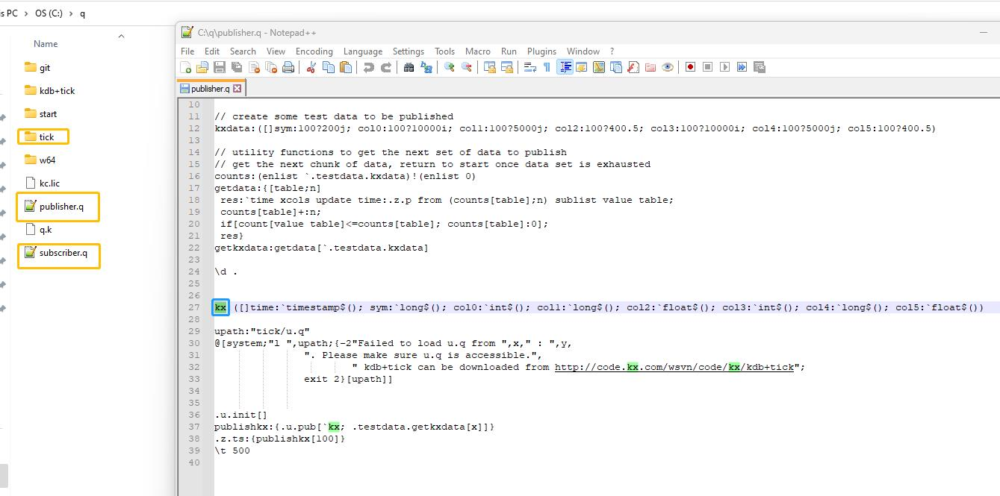
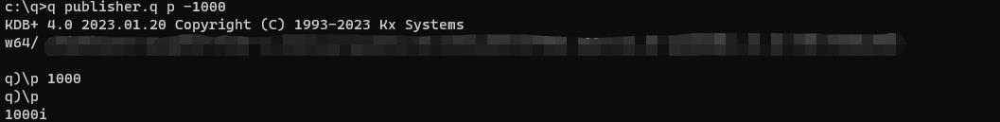
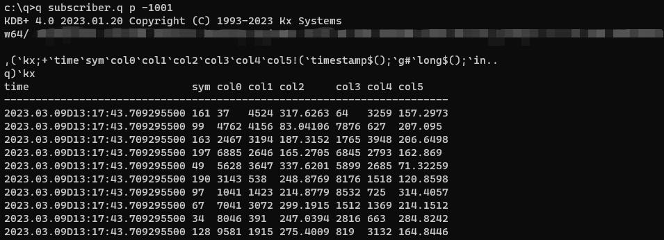
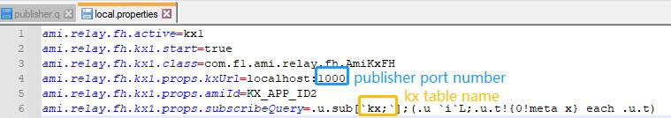
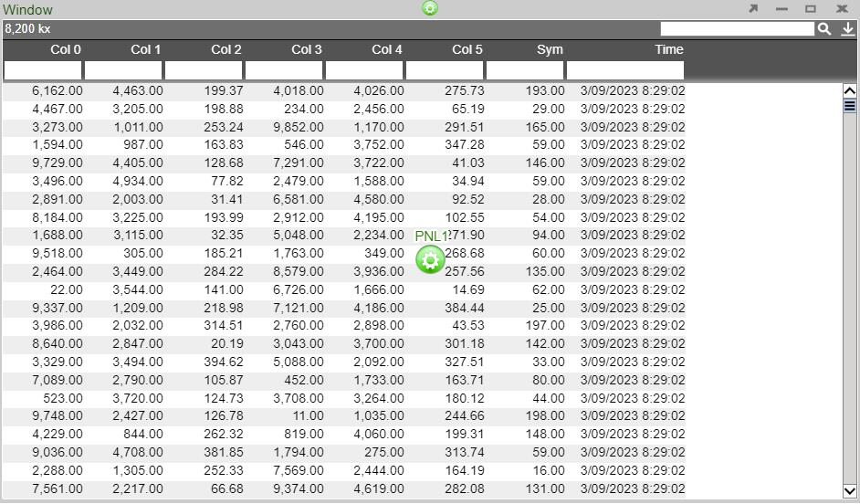

# KDB

## Prerequisites

Be sure that KDB is running before adding as a data source. Fully tested versions include 3.x

## Configuring KX live streaming inside AMI Relays

KX live streaming integrates with kdb+tick via the AMI Feed handler mechanism. AMI can be configured to connect and subscribe to KX ticker plants. This enables AMI to receive all real-time updates from the ticker plant. Optionally, AMI can also be configured to recover from ticker plant log files before consuming real time updates.

### Ami Relay Property Settings for KX feed handler

The following properties should be set in ami relays' **config/local.properties**

As with all feed handlers, add one uniquely named entry for each KX feed handler to the **ami.relay.fh.active** property. Be sure to include the default ssocket,cfg and cmd feed handlers. For example if you have only one kx feed handler:

```
ami.relay.fh.active,=cfg,cmd,kx1
```

Then, for each KX feed handler, include the following properties. NOTE: Be sure to include the proper feed handler name in the property name:

```python
# required, otherwise it will be disabled
ami.relay.fh.kx1.start=true
ami.relay.fh.kx1.class=com.f1.ami.relay.fh.AmiKxFH

# location of the ticker plant and login details (login details optional)
ami.relay.fh.kx1.props.kxUrl=hostname:port
ami.relay.fh.kx1.props.kxUsername=username
ami.relay.fh.kx1.props.kxPassword=password

# indicates what the application id(1) of messages coming from this ticker plant will be mapped to
ami.relay.fh.kx1.props.amiId=KX_APP_ID

# optional, only if recovery is required. See KDB Ticker plant Recovery steps below on how to configure and start kdb replay process
ami.relay.fh.kx1.props.replayUrl=hostname:port

# No need to declare AMITable upfront, this directive will create it for you and populate the data. If not specified, AMI table will have the same name as kx table
ami.relay.fh.kx1.props.tableKeyMap=kxTableName=AMITableName

# The format of the date Column
ami.relay.fh.kx1.props.date.format=yyyy-MM-dd'T'HH:mm:ss

# The time zone that you want your time to appear as
ami.relay.fh.kx1.props.date.timezone=<Your_Time_Zone>

# optional, default is: .u.sub[`;`]; (.u `i`L;.u.t!{0!meta x} each .u.t)
ami.relay.fh.kx1.props.subscribeQuery=subscription_kx_query

# optional, sends timestamp in nanoseconds instead of milliseconds
ami.relay.fh.kx1.props.timestamp.usenanos=true

```

1.	See the [__CONNECTION table docs](../center/realtime_tables.md#__connection) for explanation on application ids

## Example Config

```
ami.relay.fh.active=ssocket,kx1
ami.relay.fh.kx1.start=true
ami.relay.fh.kx1.class=com.f1.ami.relay.fh.AmiKxFH
ami.relay.fh.kx1.props.kxUrl=localhost:1235
ami.relay.fh.kx1.props.kxUsername=demo
ami.relay.fh.kx1.props.kxPassword=demo123
ami.relay.fh.kx1.props.amiId=KX_APP_ID
ami.relay.fh.kx1.props.replayUrl=localhost:1234
ami.relay.fh.kx1.props.amiTableMap=kxTableName=AMITableName
```

## Example Setup

1. Suppose on the kx side, we have a publisher and a subscriber, where inside the publisher we have a kx table called **kx**

	
	
	Refer to [the kx docs](https://code.kx.com/q/kb/publish-subscribe/) for detailed instructions on how to set up a publisher and a subscriber in kx.

1. Launch **publisher.q** on port **1000** and **subscriber.q** on port **1001**

	
	
	

1. on the Ami side, in the **amione/config/local.properties**

	```
	ami.relay.fh.active=kx1
	ami.relay.fh.kx1.start=true
	ami.relay.fh.kx1.class=com.f1.ami.relay.fh.AmiKxFH
	ami.relay.fh.kx1.props.kxUrl=localhost:1000
	ami.relay.fh.kx1.props.amiId=KX_APP_ID2
	ami.relay.fh.kx1.props.subscribeQuery=.u.sub[`kx;`];(.u `i`L;.u.t!{0!meta x} each .u.t)
	```
	
	

Note here that the kxUrl is the publisher port number and the argument inside **u.sub** is the kx table name.

Also note that we don't need to create the table in AMI upfront because the feedhandler will create it for you.



## KDB Ticker Plant Recovery Steps

In order to support replay you must startup a KDB replay process that will be used by the AMI Relay feed handler to recover data from the ticker plant log file before resuming processing of real time events from the ticker plant.

IMPORTANT: This KDB process must have read access to the ticker plant log file.

Setup process: Create a script called replay.q with the following contents:

```q
upd:{[t;x] (neg first .z.w)(`upd;t;x)}
replay:{if[null first x;:0];-11!x}
```

Startup Process: (where server_port matches port in `ami.relay.fh.kx1.props.replayUrl`):

```sh
q replay.q -p server_port
```

