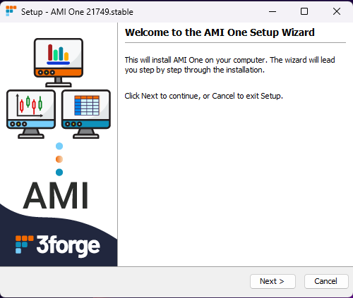
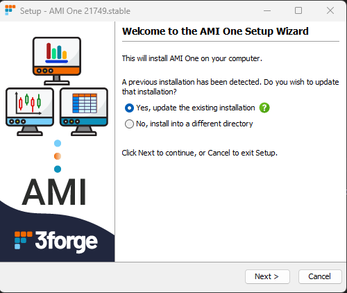
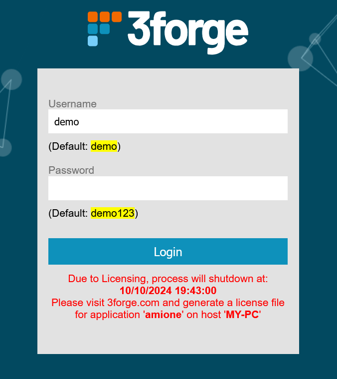
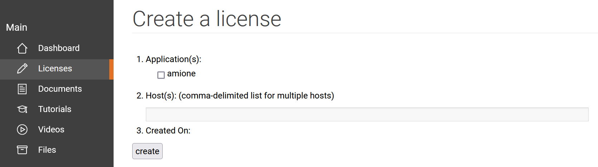
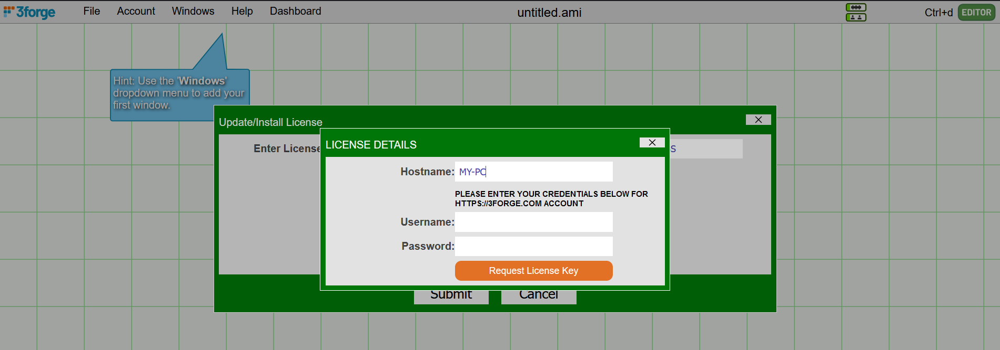

# First Time Setup

## Creating an Account

1. Visit [3forge.com/signup](https://3forge.com/signup.html) to create an account if you do not already have one. Please use the email associated with your organization and not your personal email.

1. After you submit, 3forge will send you an email to activate your account.

1. Once you have activated your account, a 3forge employee will contact you via email to assign you a version and license.

## Installing and Starting AMI

1.	Go to [3forge.com/login](https://3forge.com/login.html) and log in to your account. 
2.	Click on "Files" in the left-hand navigation and download the installation files for your operating system: 

	-   For Unix: `ami_unix_<SOME_VERSION>.sh` or `ami_unix_<SOME_VERSION>_stable.tar.gz` 
	-   For Windows: `ami_windows-x64_<SOME_VERSION>.exe` 
	[//]:#(-   For Mac: `ami_macos_<SOME_VERSION>.dmg`)


Installation steps vary slightly depending on your OS. 

=== "Linux"

    1.	AMI requires Java to run. Please ensure that you have Java 8 or higher installed onto your machine. 

	2.	Download and extract the .tar.gz file to the target directory for the AMI installation. Run the following command in terminal: 
		```sh
		tar -xf ami_unix_<YOUR_UPGRADE_VERSION>.tar.gz -C <YOUR_TARGET_DIRECTORY>
		```

	3.	To launch AMI, navigate to the AMI installation directory and run the `start.sh` script in `ami/amione/scripts` from terminal:
		```sh
		./start.sh
		```
	Then, in your preferred browser, go to the specified 3forge address. By default, this is `http://localhost:33332/`. 

	4.	Log in to your 3forge dashboard with your application login details. By default this is `demo|demo123`.
	

=== "Windows"

    1.	Run the .exe file to start the installation wizard and follow the steps to install.

		 

	2.	If you have an existing installation, your wizard will look slightly different. You can choose to install another AMI instance elsewhere on your machine, or update your existing installation. 

		
	3.	From your Start Menu, search for "AMI One" to launch, or launch the "AMI_One" Application directly from the AMI directory in `ami/amione`. 
	
		This will launch your default browser with the AMI login page. By default, this is hosted on `http://localhost:33332/` 

	4.	Log in to your 3forge dashboard with your application login details. By default this is `demo|demo123`.
	

	!!!Note
		You may encounter a Windows Defender SmartScreen warning. If this happens, click on the "More info" pop-up, and select "Run anyway." For older versions of Windows (10 or earlier), right-click on the executable file and go to *Properties->General* and under the Security section, check "Unblock." 
		

!!! Note

	If AMI fails to start, please see the [Startup Failure](../troubleshooting/startup.md) troubleshooting page.

## Creating a license

When starting AMI for the first time, you will be prompted with the login page and a licensing warning. If no license is given, AMI will automatically log you out and shut down after the specified time. 

Take note of the application and host names in the warning (e.g, `amione` and `MY-PC` in the image below) as you will need them to generate licenses.



You can either generate licenses from the 3forge website (recommended), or within AMI.

=== "Website"

	1.	From your 3forge Portal, navigate to "Licenses" on the left hand side, or click [this](https://3forge.com/secure_licenses.htm) link. Scroll down to "Create a license": 
		

	2.	Under "Application(s):", select the `amione` checkbox. 

	3.	Enter the hostname of the machine you are using in the "Host(s):" field -- this should match the host in the warning.
	
	4.	Click create. You will now see your license(s) at the top of the page. View and copy the contents into your clipboard. 

	5.	Now, navigate to the installation directory of AMI, `ami/amione`, and create a new file `f1license.txt`. 

	6.	In a text editor of your choice, open this file and paste the license into this file. Save and exit.

	7.	Restart AMI. You may need to shut down the process in your task manager. 


=== "AMI"

	1.	Once logged into AMI, set it the "Editor" mode (`Ctrl+d`).

	2.	In the top navigation bar, go to *Help -> Enter/Update License*.

	3.	You can either paste the license generated from the website, or you can click "Generate License Key."

	4.	If you clicked "Generate License Key," fill in the user details you use to log into your 3forge account.
		 
	
	5.	Click "Request License Key", then copy and paste the license into the previous window. 

	6.	Click on the submit button to finish the license creation process and restart AMI. 

## Next Steps

After successfully setting up AMI, we strongly suggest that you familiarize yourself with some of AMI's functions. Please see the [introductory tutorials](https://3forge.com/tutorials.htm) on the 3forge Portal. These should take approximately 15 - 25 minutes each and will introduce you to key AMI concepts like creating your first layout. 

We are frequently adding to and updating our Tutorials page, so please check back for more in-depth written and video tutorials in the future. 

Alternatively, we welcome you to reach out to us at <support@3forge>.com for additional help and tutorial requests. 

## Minimum Environment

#### Minimum Operating Environment

| Component            | Minimum Requirement                                                                                          |
|----------------------|--------------------------------------------------------------------------------------------------------------|
| **OPERATING SYSTEM** | Ubuntu, Fedora/Red Hat, CentOS, Mac OS X, Windows Certified (Full support for Java 1.8 or later)             |
| **RAM**              | 4GB                                                                                                          |
| **DISK**             | 20GB                                                                                                         |
| **PROCESSOR**        | 2GHZ CPU (Intel & AMD Certified)                                                                             |
| **CLIENT BROWSER**   | Up-to-date version of: Microsoft Edge, Chrome, Firefox or Safari                                             |
| **ACCESS**           | Must have permissions to install software                                                                    |
| **NETWORK**          | Server must have access to data sources. Firewalls should also be enabled to allow connections to port 33332 |

#### Suggested Operating Environment

| Component            | Suggested Requirement                                                                                        |
|----------------------|--------------------------------------------------------------------------------------------------------------|
| **OPERATING SYSTEM** | Unix environment with Java 1.8 or later                                                                      |
| **RAM**              | 32GB or more                                                                                                 |
| **DISK**             | 100GB or more                                                                                                |
| **PROCESSOR**        | 3GHZ CPU, 8 cores or more                                                                                    |
| **CLIENT BROWSER**   | Up-to-date version of: Microsoft Edge, Chrome, Firefox or Safari                                             |
| **ACCESS**           | Must have permissions to install software (often requiring Admin rights on Windows)                          |
| **NETWORK**          | Server must have access to data sources. Firewalls should also be enabled to allow connections to port 33332 |


