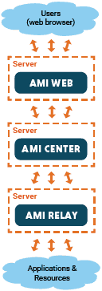

# What is AMI?

## Overview

The AMI platform is a full stack software platform that drastically reduces development time, minimizes maintenance costs and provides unfailing uptime, scalability and performance.

## How is AMI Structured?

AMI consists of 3 core components:

{ align=right }

1. **Web**, the server for transforming data into visualizations, it can manipulate data from the Center or any other database to display in high speed & high volume tables, trees, charts, and heatmaps. The Web also allows for custom workflows, from custom forms to building & emailing PDFs
1. **Center**, the database and event processing system, it can store large amounts of data with fast entry and retrieval for both in-memory and on-disk. The Center also has a complex event processor which allows users to create triggers, timers, stored procedures, and methods to manipulate their data as needed. The Center comes with many reliability features such as replication, failover, and map reduce
1. **Relay**, sends & receives messages to/from external sources, it has 100+ adapters to send queries to databases and receive data from live feeds. The Relay is fully featured with dynamic routing rules, guaranteed messaging, store & forward, late subscription all configurable

There are 2 additional components (the [WebBalancer / WebManager](../architecture/webbalancer_webmanager.md)) used for scaling deployments to many users.

## What are AMI's advantages?

- **Rapid Development**, AMI is built to reduce development time from years to weeks with quick integration with external systems, easy GUI building, and simple data manipulation
- **Scalable**, AMI scales whether keeping tens of millions of records in the Center or displaying visualizations for hundreds of users or showing millions of rows in a table
- **Reliable**, AMI is built to handle mission critical use cases where faults cannot become failures, with systems like replication, failover, and message logging all providing reliability
- **Modular**, AMI can interact with external systems from authentication platforms to databases to email systems allowing AMI to be used in a modular way

## How is AMI being used?

From a technical perspective (see [3forge.com](https://3forge.com/) for a business perspective) AMI is being used to solve a wide variety of challenges including:

- A realtime database that scales to handle the biggest data problems in the world
- A frontend system for complex interactions involving many users with different permissions
- An automated reporting system which builds & emails PDFs daily
- A reliable, scalable, excel spreadsheet replacement